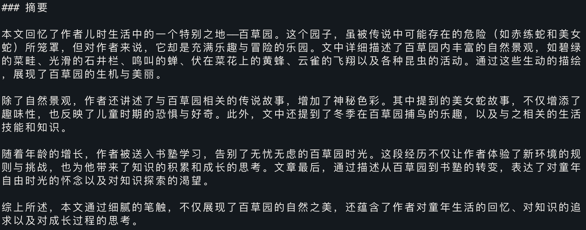
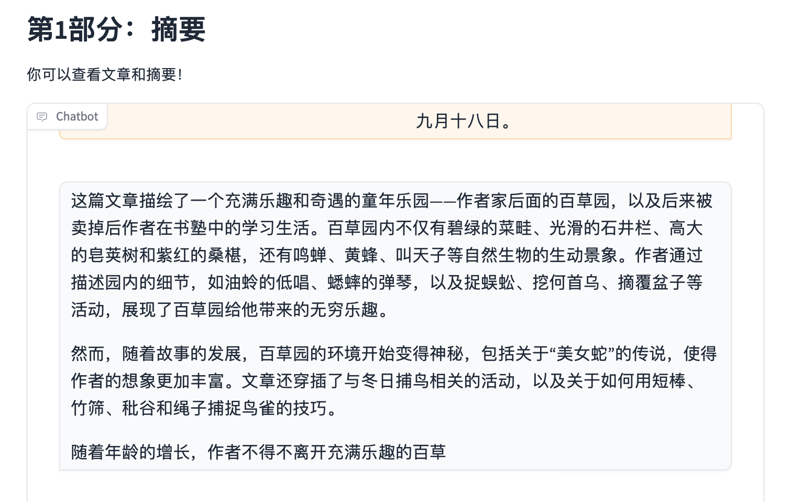
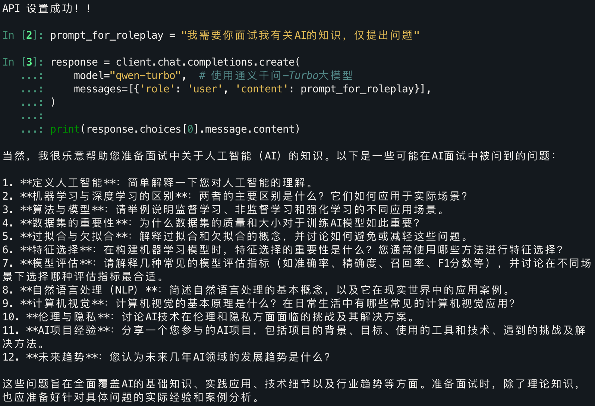
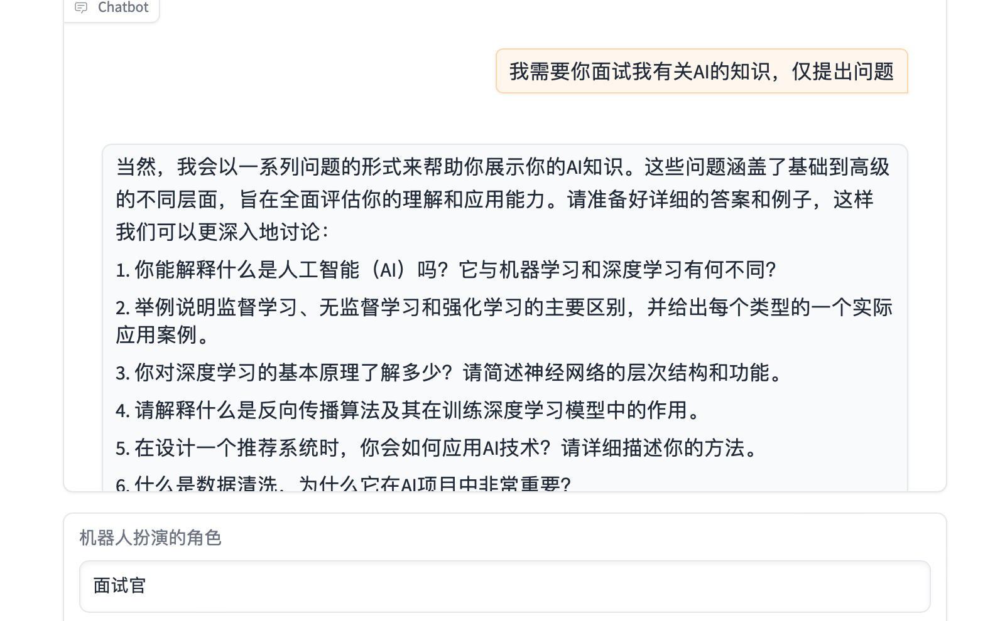
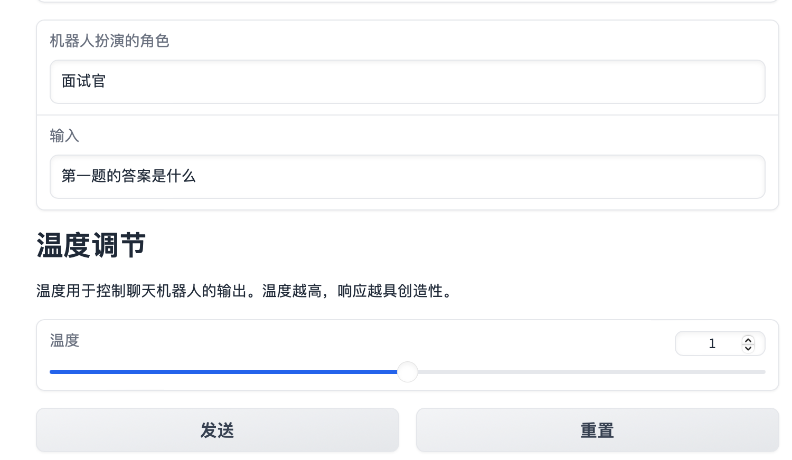
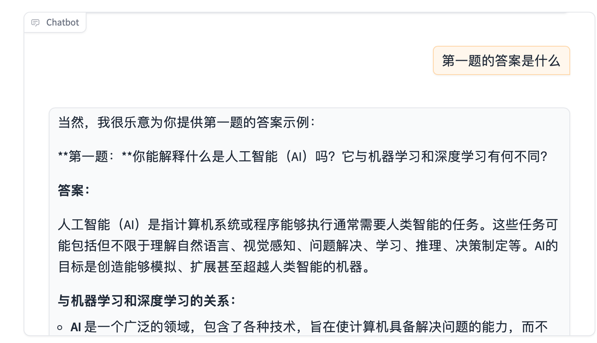
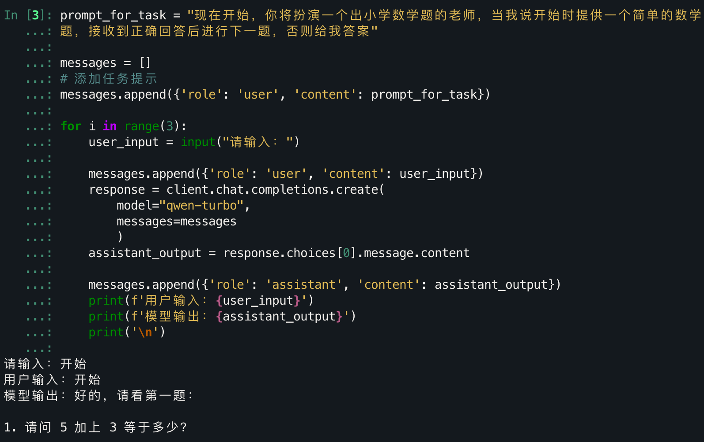
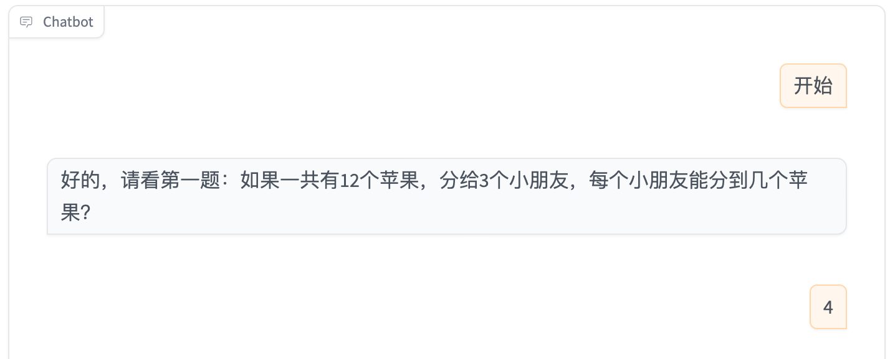
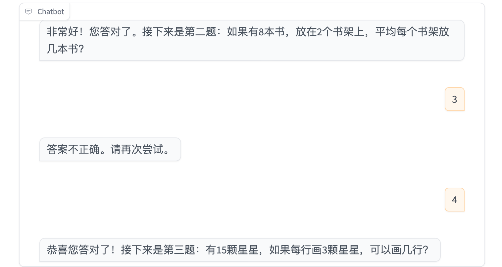

> 通过之前的两篇文章，你应该拥有了一个自己的 API，并对如何使用有了初步的理解。
> 接下来，你将通过调用 API 并输入提示词，学习如何构建你自己的语言模型应用。
>
> 如果想进一步深入这个领域，非常建议观看李宏毅老师2024年的教学视频。
>
> - [生成式人工智能导论-视频](https://www.bilibili.com/video/BV1BJ4m1e7g8)
> - [课程主页](https://speech.ee.ntu.edu.tw/~hylee/genai/2024-spring.php)
>
> 得益于阿里对openai的适配，当前展示的代码可以完全对标于李宏毅老师的视频课程作业，目前对应于**作业3**，方便大家可以在更普遍的环境下学到这个作业所想表达的内容。
>
> [代码文件下载](https://github.com/Hoper-J/LLM-Guide-and-Demos/blob/master/Demos/2.%20使用API快速搭建你的第一个AI应用.ipynb)，特别地，其中使用了gradio库去做了可视化，下面有关gradio可视化的效果会使用引言格式进行标注。

# 安装，导入与设置

```bash
!pip3 install openai
```

```python
import os
import json
from typing import List, Dict, Tuple

import openai
import gradio as gr

# TODO: 设置你的API，需要支持openai库，这里以阿里云DashScope API密钥为例
OPENAI_API_KEY = ""
client = openai.OpenAI(
    api_key=OPENAI_API_KEY,
    base_url="https://dashscope.aliyuncs.com/compatible-mode/v1",  # 使用阿里云大模型API
)

# 检查是否正确设置了 API
# 如果一切正常，你将看到 "API 设置成功！！"
try:
    response = client.chat.completions.create(
            model="qwen-turbo",  # 使用阿里云 DashScope 的模型
            messages=[{'role': 'user', 'content': "测试"}],  # 设置一个简单的测试消息
            max_tokens=1,
    )
    print("API 设置成功！！")  # 输出成功信息
except Exception as e:
    print(f"API 可能有问题，请检查：{e}")  # 输出详细的错误信息
```

# 第一部分：文章摘要（单轮对话应用）

这个的实现方式非常简单，假想一下，我们手头有个文章的摘要任务需要交给别人做：“请你帮我写一下文章的摘要【文章.txt】”。其实就这么简单，在对方本身就是一个有求必应的大模型的情况下，就更简单了，我们只需要将“请你帮我写一下文章的摘要”和文章进行拼接后传给大模型，就可以得到结果。

```python
prompt = "请你帮我写一下文章的摘要"
article = "填充"
# 拼接成一个prompt
input_text = f"{prompt}\n{article}"

response = client.chat.completions.create(
    model="qwen-turbo",  # 使用通义千问-Turbo大模型
    messages=[{'role': 'user', 'content': input_text}], # 把拼接后的prompt传递给大模型
)

print(response.choices[0].message.content)
```

我们这里以《从百草园到三味书屋》为例。



## 从 API 调用到可视化：引入 Gradio

```python
!pip3 install gradio
```

通过 Gradio，你可以将复杂的 API 调用封装在一个简单的交互界面中，用户可以通过文本框、按钮、滑块等 UI 元素与大模型进行交互。

下面是摘要器的完整示例：

```python
# TODO: 在此处输入用于摘要的提示词
prompt_for_summarization = "请将以下文章概括成几句话。"

# 重置对话的函数
def reset() -> List:
    return []

# 调用模型生成摘要的函数
def interact_summarization(prompt: str, article: str, temp=1.0) -> List[Tuple[str, str]]:
    '''
    * 参数:
      - prompt: 我们在此部分中使用的提示词
      - article: 需要摘要的文章
      - temp: 模型的温度参数。温度用于控制聊天机器人的输出。温度越高，响应越具创造性。
    '''
    input = f"{prompt}\n{article}"
    response = client.chat.completions.create(
        model="qwen-turbo",  # 使用阿里云 DashScope 的模型
        messages=[{'role': 'user', 'content': input}],
        temperature=temp,
        # max_tokens=200,  # 你需要注意到这里可以设置文本的长度上限，以节省token（测试时）
    )

    return [(input, response.choices[0].message.content)]

# 导出整个对话内容的函数
def export_summarization(chatbot: List[Tuple[str, str]], article: str) -> None:
    '''
    * 参数:
      - chatbot: 模型的对话记录，存储在元组列表中
      - article: 需要摘要的文章
    '''
    target = {"chatbot": chatbot, "article": article}
    with open("files/part1.json", "w") as file:
        json.dump(target, file)

# 生成 Gradio 的UI界面
with gr.Blocks() as demo:
    gr.Markdown("# 第1部分：摘要\n填写任何你喜欢的文章，让聊天机器人为你总结！")
    chatbot = gr.Chatbot()
    prompt_textbox = gr.Textbox(label="提示词", value=prompt_for_summarization, visible=False)
    article_textbox = gr.Textbox(label="文章", interactive=True, value="填充")
    
    with gr.Column():
        gr.Markdown("# 温度调节\n温度用于控制聊天机器人的输出。温度越高，响应越具创造性。")
        temperature_slider = gr.Slider(0.0, 2.0, 1.0, step=0.1, label="温度")
    
    with gr.Row():
        sent_button = gr.Button(value="发送")
        reset_button = gr.Button(value="重置")

    with gr.Column():
        gr.Markdown("# 保存结果\n当你对结果满意后，点击导出按钮保存结果。")
        export_button = gr.Button(value="导出")
    
    # 连接按钮与函数
    sent_button.click(interact_summarization, inputs=[prompt_textbox, article_textbox, temperature_slider], outputs=[chatbot])
    reset_button.click(reset, outputs=[chatbot])
    export_button.click(export_summarization, inputs=[chatbot, article_textbox])

# 启动 Gradio 界面
demo.launch(debug=True)
```

**最终效果：**


# 第二部分：角色扮演（多轮对话应用）

多轮对话应用的区别就是拥有上下文，也就是历史记录。要实现它其实就是简单的使用一个列表保存每一次的prompt和模型返回的输出，对于用户和AI返回的输出，分别使用`user`和`assistant`进行标识。

实际上，整个流程拆解后只有2步。

## 1. 预设prompt，定义模型的角色

编写好一个prompt用于指导模型，可以是面试官，可以是某个领域的专家，好吧，也可以是猫娘（还记得ChatGPT刚发布的时候，甚至有个仓库专门写了角色prompt）。

```python
prompt_for_roleplay = "我需要你面试我有关AI的知识，仅提出问题"
```

在编写好之后，使用类似于第一部分的操作，然后先进行一次提交。

```python
response = client.chat.completions.create(
    model="qwen-turbo",  # 使用通义千问-Turbo大模型
    messages=[{'role': 'user', 'content': prompt_for_roleplay}],
)

print(response.choices[0].message.content)
```



## 2. 记录对话，开始交流

这是一个持续的重复操作，这里我们使用上一节的简单代码来演示：

```python
response_text = response.choices[0].message.content

# 将第一次的预设和回复进行保存
messages = []
messages.append({'role': 'user', 'content': prompt_for_roleplay})
messages.append({'role': 'assistant', 'content': response_text})

# 开始对话
for i in range(3):
    user_input = input("请输入：")
    
    messages.append({'role': 'user', 'content': user_input})
    response = client.chat.completions.create(
        model="qwen-turbo",
        messages=messages
        )
    assistant_output = response.choices[0].message.content
    
    messages.append({'role': 'assistant', 'content': assistant_output})
    print(f'用户输入：{user_input}')
    print(f'模型输出：{assistant_output}')
    print('\n')
    
```


## Gradio可视化

```python
# TODO: 填写以下两行：character_for_chatbot 和 prompt_for_roleplay
# 第一个是你希望聊天机器人扮演的角色（注意，真正起作用的实际是prompt）
# 第二个是使聊天机器人扮演某个角色的提示词
character_for_chatbot = "面试官"
prompt_for_roleplay = "我需要你面试我有关AI的知识，仅提出问题"

# 清除对话的函数
def reset() -> List:
    return []

# 调用模型生成对话的函数
def interact_roleplay(chatbot: List[Tuple[str, str]], user_input: str, temp=1.0) -> List[Tuple[str, str]]:
    '''
    * 参数:
      - user_input: 每轮对话中的用户输入
      - temp: 模型的温度参数。温度用于控制聊天机器人的输出。温度越高，响应越具创造性。
    '''
    try:
        messages = []
        for input_text, response_text in chatbot:
            messages.append({'role': 'user', 'content': input_text})
            messages.append({'role': 'assistant', 'content': response_text})

        messages.append({'role': 'user', 'content': user_input})

        response = client.chat.completions.create(
            model="qwen-turbo",  # 使用阿里云 DashScope 的模型
            messages=messages,  # 包含用户的输入和对话历史
            temperature=temp,  # 使用温度参数控制创造性
        )
        chatbot.append((user_input, response.choices[0].message.content))

    except Exception as e:
        print(f"发生错误：{e}")
        chatbot.append((user_input, f"抱歉，发生了错误：{e}"))
    return chatbot

# 导出整个对话记录的函数
def export_roleplay(chatbot: List[Tuple[str, str]], description: str) -> None:
    '''
    * 参数:
      - chatbot: 模型的对话记录，存储在元组列表中
      - description: 此任务的描述
    '''
    target = {"chatbot": chatbot, "description": description}
    with open("files/part2.json", "w") as file:
        json.dump(target, file)

# 进行第一次对话
first_dialogue = interact_roleplay([], prompt_for_roleplay)

# 生成 Gradio 的UI界面
with gr.Blocks() as demo:
    gr.Markdown(f"# 第2部分：角色扮演\n聊天机器人想和你玩一个角色扮演游戏，试着与它互动吧！")
    chatbot = gr.Chatbot(value=first_dialogue)
    description_textbox = gr.Textbox(label="机器人扮演的角色", interactive=False, value=f"{character_for_chatbot}")
    input_textbox = gr.Textbox(label="输入", value="")
    
    with gr.Column():
        gr.Markdown("# 温度调节\n温度用于控制聊天机器人的输出。温度越高，响应越具创造性。")
        temperature_slider = gr.Slider(0.0, 2.0, 1.0, step=0.1, label="温度")
    
    with gr.Row():
        sent_button = gr.Button(value="发送")
        reset_button = gr.Button(value="重置")
    
    with gr.Column():
        gr.Markdown("# 保存结果\n当你对结果满意后，点击导出按钮保存结果。")
        export_button = gr.Button(value="导出")

    # 连接按钮与函数
    sent_button.click(interact_roleplay, inputs=[chatbot, input_textbox, temperature_slider], outputs=[chatbot])
    reset_button.click(reset, outputs=[chatbot])
    export_button.click(export_roleplay, inputs=[chatbot, description_textbox])

# 启动 Gradio 界面
demo.launch(debug=True)
```

1. **预设prompt，定义模型的角色**
   
2. **记录对话，开始交流**
   
   

# 第3部分：定制化任务（多轮对话应用）

经过前两个任务的学习，你应该也有了很多自己的想法，不同的prompt造成的效果会有很大的区别，而这些prompt，实际上都是在让模型去做一个隐性的角色扮演，无论是作为某个领域的专家还是一个文字游戏，如果你的需求复杂，一个方向上的引导对于大模型来说是非常必要的。

这一部分将角色扮演需求包含在第一次的输入中，整合了角色扮演阶段的代码：

```python
prompt_for_task = "现在开始，你将扮演一个出小学数学题的老师，当我说开始时提供一个简单的数学题，接收到正确回答后进行下一题，否则给我答案"

messages = []
# 添加任务提示
messages.append({'role': 'user', 'content': prompt_for_task})

for i in range(3):
    user_input = input("请输入：")
    
    messages.append({'role': 'user', 'content': user_input})
    response = client.chat.completions.create(
        model="qwen-turbo",
        messages=messages
        )
    assistant_output = response.choices[0].message.content
    
    messages.append({'role': 'assistant', 'content': assistant_output})
    print(f'用户输入：{user_input}')
    print(f'模型输出：{assistant_output}')
    print('\n')

```



## Gradio 可视化

```python
# TODO: 填写以下两行：chatbot_task 和 prompt_for_task，这里以翻译任务为例
# 第一个是用于告诉用户聊天机器人可以执行的任务（注意，真正起作用的实际是prompt）
# 第二个是使聊天机器人能够执行该任务的提示词
chatbot_task = "小学数学老师（输入“开始”）"
prompt_for_task = "现在开始，你将扮演一个出小学数学题的老师，当我说开始时提供一个简单的数学题，接收到正确回答后进行下一题，否则给我答案"

# 清除对话的函数
def reset() -> List:
    return []

# 调用模型生成对话的函数
def interact_customize(chatbot: List[Tuple[str, str]], prompt: str, user_input: str, temp=1.0) -> List[Tuple[str, str]]:
    '''
    * 参数:

      - chatbot: 模型本身，存储在元组列表中的对话记录

      - prompt: 用于指定任务的提示词

      - user_input: 每轮对话中的用户输入

      - temp: 模型的温度参数。温度用于控制聊天机器人的输出。温度越高，响应越具创造性。

    '''
    try:
        messages = []
        # 添加任务提示
        messages.append({'role': 'user', 'content': prompt})
        
        # 构建历史对话记录
        for input_text, response_text in chatbot:
            messages.append({'role': 'user', 'content': input_text})
            messages.append({'role': 'assistant', 'content': response_text})

        # 添加当前用户输入
        # 如果在这之前再次append prompt，就等价于在每次输入前都固定它的行为，这适用于比较呆的模型和prompt，比如【翻译成中文：】
        messages.append({'role': 'user', 'content': user_input})

        # 发送请求到对应的 API
        response = client.chat.completions.create(
            model="qwen-turbo",  # 使用阿里云 DashScope 的模型
            messages=messages,  # 传递消息记录
            temperature=temp,
            max_tokens=200,
        )

        # 将响应添加到对话记录中
        chatbot.append((user_input, response.choices[0].message.content))

    except Exception as e:
        print(f"发生错误：{e}")
        chatbot.append((user_input, f"抱歉，发生了错误：{e}"))
    
    return chatbot

# 导出对话记录的函数
def export_customized(chatbot: List[Tuple[str, str]], description: str) -> None:
    '''
    * 参数:

      - chatbot: 模型的对话记录，存储在元组列表中

      - description: 此任务的描述

    '''
    target = {"chatbot": chatbot, "description": description}
    with open("files/part3.json", "w") as file:
        json.dump(target, file)

# 生成 Gradio 的UI界面
with gr.Blocks() as demo:
    gr.Markdown("# 第3部分：定制化任务\n聊天机器人可以执行某项任务，试着与它互动吧！")
    chatbot = gr.Chatbot()
    desc_textbox = gr.Textbox(label="任务描述", value=chatbot_task, interactive=False)
    prompt_textbox = gr.Textbox(label="提示词", value=prompt_for_task, visible=False)
    input_textbox = gr.Textbox(label="输入", value="")
    
    with gr.Column():
        gr.Markdown("# 温度调节\n温度用于控制聊天机器人的输出。温度越高，响应越具创造性。")
        temperature_slider = gr.Slider(0.0, 2.0, 1.0, step=0.1, label="温度")
    
    with gr.Row():
        sent_button = gr.Button(value="发送")
        reset_button = gr.Button(value="重置")
    
    with gr.Column():
        gr.Markdown("# 保存结果\n当你对结果满意后，点击导出按钮保存结果。")
        export_button = gr.Button(value="导出")
    
    # 连接按钮与函数
    sent_button.click(interact_customize, inputs=[chatbot, prompt_textbox, input_textbox, temperature_slider], outputs=[chatbot])
    reset_button.click(reset, outputs=[chatbot])
    export_button.click(export_customized, inputs=[chatbot, desc_textbox])

# 启动 Gradio 界面
demo.launch(debug=True)
```

**最终效果：**





**注意，大模型并不等于正确，特别是数学推理逻辑一般的模型。无论是什么大模型，都一定要对它的输出保持怀疑，除非他能从数学逻辑上说服你，并且在你严谨的逻辑推理中自洽。**

# 参考链接

[其中作业3相关的PDF文件和Colab](https://speech.ee.ntu.edu.tw/~hylee/genai/2024-spring.php)
