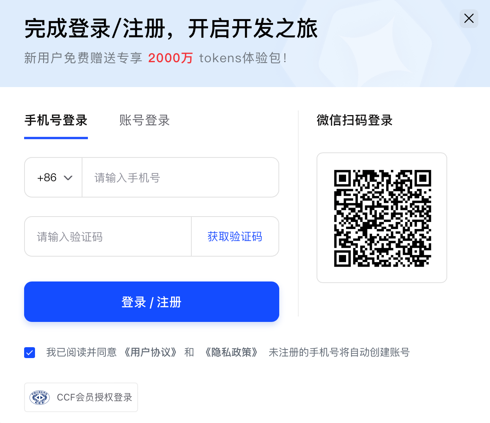
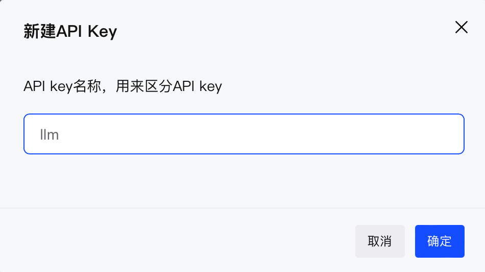
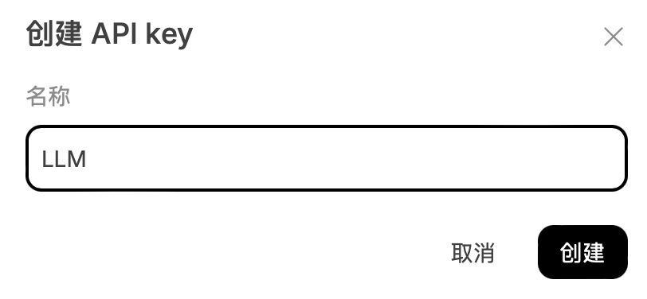

# 大模型 API 获取步骤

> 随着时间的推移，操作步骤可能会因为界面更新存在差异，但具体流程不会有大的变化。

## 目录

- [阿里 API](#阿里-api)
- [智谱 API](#智谱-api)
- [DeepSeek API](#deepseek-api)

## 阿里 API

通过阿里云百炼平台获取大模型的 API，实际上，支持 openai 库的 API 都可以作为学习的开始。

如果在进行之前想了解 AI 能做什么，你可以访问[通义千问](https://tongyi.aliyun.com/qianwen/)，在“玩”够了之后，点击右上角的 API 服务。

点击 `立即开通`：

> 入口界面常发生变动，可以直接访问[阿里云百炼控制台](https://bailian.console.aliyun.com)，登录后跳转到 `模型广场` 部分进行阅读。
>
> 第一次注册使用阿里的模型服务可能需要进行一次身份验证（人脸识别）。

然后过一些简单的服务协议，点击 `同意`：

点开左侧的 `模型广场`，点击 `开通模型服务`：

打勾，并点击 `确认开通`：

在[控制台](https://bailian.console.aliyun.com/)点击右上角的 `用户图标` - `API-KEY`：

点击`创建`

选择 `默认业务空间`，点击 `确定` 创建 `API-KEY`：

点击 `查看` 并复制 `API KEY`：

可以看到业务空间的开头是 llm，全称：Large Language Model，大型语言模型。

## 智谱 API

新用户总是会有着优惠，所以当阿里 API 的额度过期或者用完之后，可以选择“折腾”一下更换平台（不过日常学习使用的话，其实开销并不大，这里“折腾”只是为了引出后续通用的代码修改）。

访问 [https://bigmodel.cn/login](https://bigmodel.cn/login) 进行注册并登录：

对于新用户：

访问 `项目管理` 中的 [API keys](https://www.bigmodel.cn/usercenter/proj-mgmt/apikeys)，点击右上角 `添加新的 API Key`。

命名，然后点击 `确定`：

点击以复制属于你的 `API key`：

> [!note]
>
> 后续用到 API 的代码大多以阿里 API 为例，如果想修改为智谱 API，可以参考文章《[01. 初识 LLM API：环境配置与多轮对话演示](./01.%20初识%20LLM%20API：环境配置与多轮对话演示.md#智谱-api)》中的修改：
>
> 1. api_key。
> 2. base_url：智谱当前的 `base_url` 为 `https://open.bigmodel.cn/api/paas/v4`。
> 3. model：以 `glm-4-plus` 为例。

## DeepSeek API

> 真是非常简洁的控制台界面，一目了然。

访问 [https://platform.deepseek.com/sign_in](https://platform.deepseek.com/sign_in) 进行注册并登录：

新用户注册后将赠送 10 块钱余额，有效期为一个月：

点击左侧的 `API keys`（或者访问 [https://platform.deepseek.com/api_keys](https://platform.deepseek.com/api_keys)），然后点击 `创建 API key:`

命名，然后点击 `创建`：

与其他平台不同的是，DeepSeek 的 API 仅在创建时显示，你可能需要记录它，点击 `复制`：

> [!note]
>
> **后续代码修改**
>
> 参考文章《[01. 初识 LLM API：环境配置与多轮对话演示](./01.%20初识%20LLM%20API：环境配置与多轮对话演示.md#deepseek-api)》。
>
> 1. api_key。
>
> 2. base_url：`https://api.deepseek.com`。
>
> 3. model：`deepseek-chat` 或 `deepseek-reasoner`。
>
>    DeepSeek 并没有提供“繁杂”的版本给用户选择，比如 v2 / v3，这一点非常值得称赞，代码不再需要因为版本更迭而修改。

---

万事开头难，恭喜你！完成了最难的一步，接下来进入下一节：[01. 初识 LLM API：环境配置与多轮对话演示](.01.%20初识%20LLM%20API：环境配置与多轮对话演示.md)，步入代码部分。
