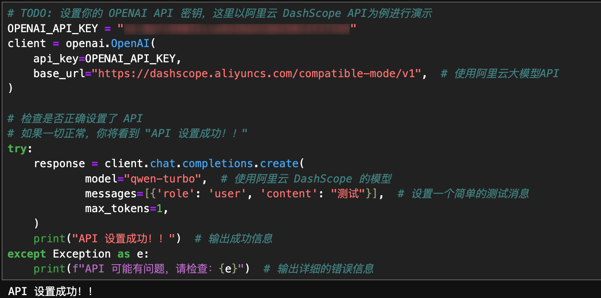
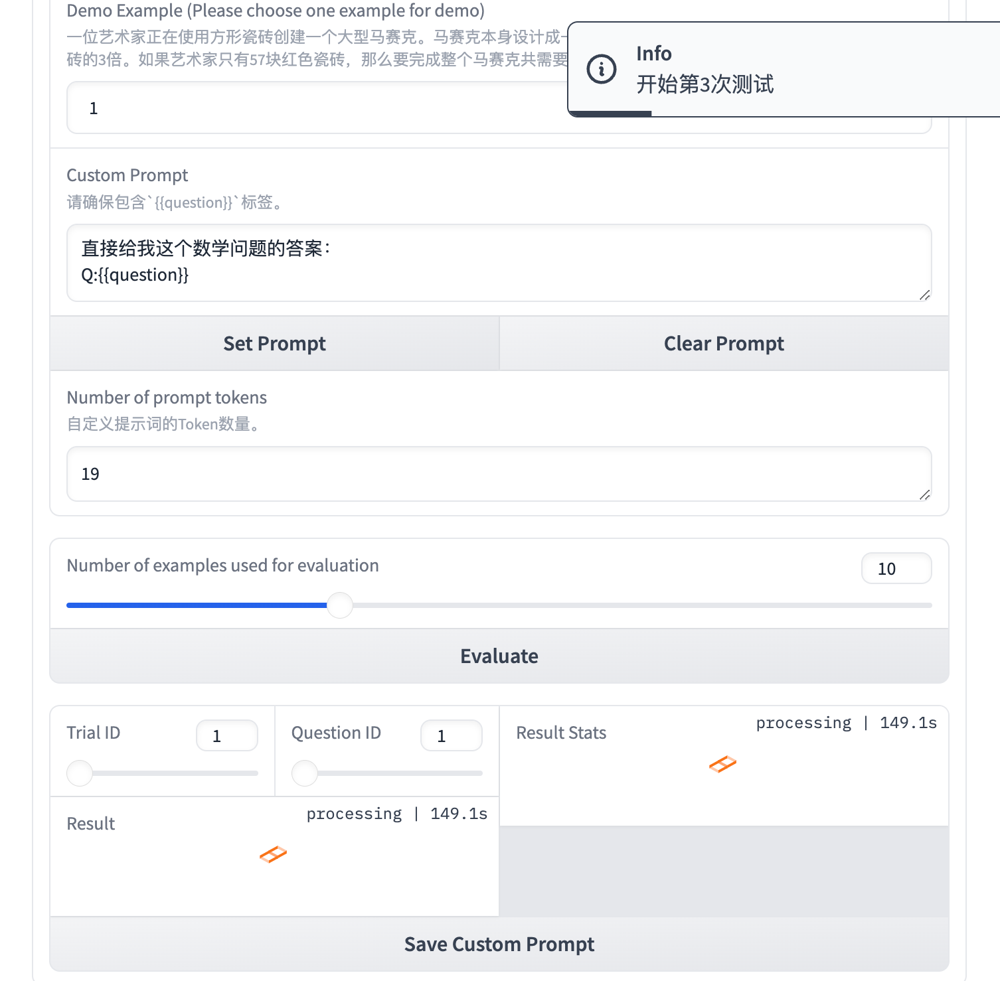
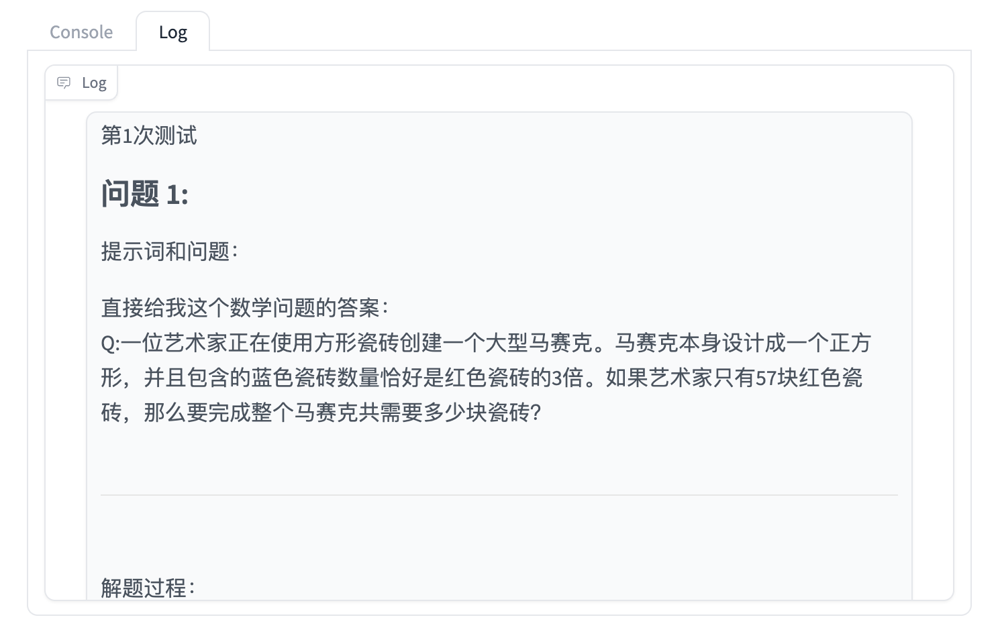
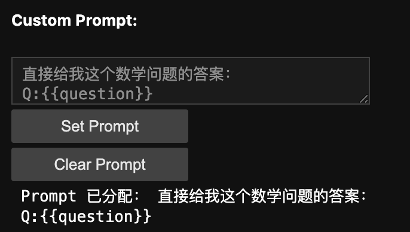
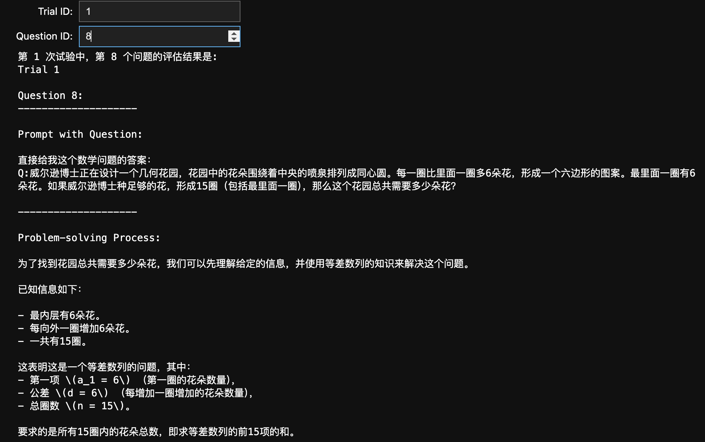

# 进阶指南：自定义 Prompt 提升大模型解题能力

> 怎么判断 Prompt 的好坏？什么问题存在标准答案？
>
> 答：让大模型求解数学问题。
>
> 李宏毅老师的 [HW4](https://www.bilibili.com/video/BV1BJ4m1e7g8?p=15&vd_source=436107f586d66ab4fcf756c76eb96c35) 正好提到了有关数学问题的 Prompt，所以我决定中间插一篇这样的文章。通过本文你将：
>
> 1. 了解各种 Prompt 如何影响大型语言模型的性能。
> 2. 设计 Prompt 提高大模型解决数学问题的正确性。
> 3. 了解占位符的使用 
> 4. 了解如何使用 ipywidgets 创建交互模块。
>
> 如果你可以访问 Gemini，可以在 [Google AI Studio](https://aistudio.google.com/app/apikey?hl=zh-cn) 中非常快速的获取 Gemini API，从而在 Colab 上进行学习：[HW4 - Colab](https://colab.research.google.com/drive/16JzVN_Mu4mJfyHQpQEuDx1q6jI-cAnEl?hl=zh-tw#scrollTo=ZvU3-01m3wmy&uniqifier=1)。因为国家政策原因，这里不会提供🪜的教程，但本文会根据 HW4 的完整内容进行组织，并将 Colab 中的 @param 使用 ipywidgets 进行替代，提供一个大陆版本的中文作业镜像。
>
> 注意，尽管文章提到了**作业**，但并不意味着需要视频基础，可以直接进行学习，这没有门槛。
>
> 推荐观看视频：[训练不了人工智能？你可以训练你自己](https://www.bilibili.com/video/BV1BJ4m1e7g8?p=6)
>
> 
> [代码文件下载](../Demos/03.%20自定义%20Prompt%20提升大模型解题能力——Gradio%20与%20ipywidgets%20版.ipynb)
>
> 在线链接：[Kaggle](https://www.kaggle.com/code/aidemos/03-prompt-ipywidgets) | [Colab](https://colab.research.google.com/drive/1c5WH62n8P1fKWaVrqXRV5pfRWKqV_3Zs?usp=sharing)

## 目录

- [下载，导入和配置](#下载导入和配置)
  
  - [初始化 OpenAI 模型](#初始化-openai-模型)
  - [用于评估 Prompt 的数学问题](#用于评估-prompt-的数学问题)
- [🧙 创建你的自定义 Prompt（Gradio 版本）](#-创建你的自定义-promptgradio-版本)

  -  [交互界面](#交互界面)

  - [设计 Prompt 解决数学问题](#设计-prompt-解决数学问题)

- [🧙 创建你的自定义 Prompt（非 Gradio 版本）](#-创建你的自定义-prompt非-gradio-版本)

  - [导入](#导入)
  - [自定义 Prompt](#自定义-prompt)
    - [创建下拉选项选择问题](#创建下拉选项选择问题)
  - [评估](#评估)
    - [创建滑块选择评估的数量](#创建滑块选择评估的数量)
  - [打印指定的评估结果](#打印指定的评估结果)
  - [保存你的 Propmt](#保存你的-propmt)

- [参考链接](#参考链接)

---

## 下载，导入和配置

```bash
pip install tqdm
pip install jinja2
pip install gradio
pip install tiktoken
pip install openai
```

```python
import os
import time
import re
import pickle
import json
import traceback

import openai
import tiktoken  # 用于 prompt_token_num()
import jinja2
from tqdm import tqdm
```

填充你的`API`并运行代码：

```python
# TODO: 设置你的 OPENAI API 密钥，这里以阿里云 DashScope API 为例进行演示
OPENAI_API_KEY = ""
# 不设置则默认使用环境变量
if not OPENAI_API_KEY:
    OPENAI_API_KEY = os.getenv('OPENAI_API_KEY')
    
client = openai.OpenAI(
    api_key=OPENAI_API_KEY,
    base_url="https://dashscope.aliyuncs.com/compatible-mode/v1",  # 使用阿里云大模型API
)

# 检查是否正确设置了 API
# 如果一切正常，你将看到 "API 设置成功！！"
try:
    response = client.chat.completions.create(
        model="qwen-turbo",  # 使用阿里云 DashScope 的模型
        messages=[{'role': 'user', 'content': "测试"}],  # 设置一个简单的测试消息
        max_tokens=1,
    )
    print("API 设置成功！！")  # 输出成功信息
except Exception as e:
    print(f"API 可能有问题，请检查：{e}")  # 输出详细的错误信息
```

**结果**：



### 初始化 OpenAI 模型

实际上如果专注于 Prompt，可以暂时跳过这部分。

```python
class OpenAIModel():
    def __init__(self, cache_file="openai_cache"):
        # 初始化 OpenAI 模型对象，并设置缓存文件
        self.cache_file = cache_file
        self.cache_dict = self.load_cache()  # 加载缓存

    def save_cache(self):
        # 将当前缓存保存到文件
        with open(self.cache_file, "wb") as f:
            pickle.dump(self.cache_dict, f)

    def load_cache(self, allow_retry=True):
        # 从文件加载缓存，带有重试机制
        if os.path.exists(self.cache_file):
            while True:
                try:
                    with open(self.cache_file, "rb") as f:
                        cache = pickle.load(f)
                    break
                except Exception:
                    if not allow_retry:
                        assert False
                    print("Pickle Error: 5秒后重试...")
                    time.sleep(5)
        else:
            # 如果文件不存在则初始化缓存
            cache = {}
        return cache

    def set_cache_file(self, file_name):
        # 设置缓存文件名并加载缓存
        self.cache_file = file_name
        self.cache_dict = self.load_cache()

    def get_completion(self, content):
        # 获取模型完成的文本，先检查缓存，若无则请求生成
        # 如果选择检查缓存，则会导致同问题不同trial的结果相同，这与实际想表达的内容不符，故注释
        # if content in self.cache_dict:
        #     return self.cache_dict[content]
        for _ in range(3):
            try:
                # 调用模型生成内容
                response = client.chat.completions.create(
                    model="qwen-turbo",
                    messages=[{'role': 'user', 'content': content}],
                    temperature=1.0,
                )
                completion = response.choices[0].message.content
                self.cache_dict[content] = completion
                return completion
            except Exception as e:
                print(e, "\n")
                time.sleep(1)
        return None

    def is_valid_key(self):
        # 检查 API 密钥是否有效
        for _ in range(4):
            try:
                response = client.chat.completions.create(
                    model="qwen-turbo",
                    messages=[{'role': 'user', 'content': "hi there"}],
                    temperature=1.0,
                    max_tokens=1
                )
                return True
            except Exception as e:
                traceback.print_exc()
                time.sleep(1)
        return False

    def prompt_token_num(self, prompt):
        # 使用 tiktoken 来计算 token 数量
        try:
            # 使用 gpt-3.5-turbo 的编码器，因为 tiktoken 库不支持自动识别 qwen-turbo 模型
            encoding = tiktoken.get_encoding("cl100k_base")  # 这是 GPT-3.5-turbo 所使用的编码器
            # 将 prompt 编码成 token，并返回 token 数量
            tokens = encoding.encode(prompt)
            return len(tokens)
        except Exception as e:
            print(f"计算 token 数量时出错: {e}")
            return 0

    def two_stage_completion(self, question, content):
        # 两阶段完成：首先获取推理，再获取最终答案
        rationale = self.get_completion(content)
        if not rationale:
            return {
                'prompt': content,
                'rationale': None,
                'answer': None
            }

        ans = self.get_completion(content=f"Q:{question}\nA:{rationale}\nThe answer to the original question is (a number only): ")
        return {
            'prompt': content,
            'rationale': rationale,
            'answer': ans
        }

# 初始化模型
my_model = OpenAIModel()
```

### 用于评估 Prompt 的数学问题

```python
questions = ['一位艺术家正在使用方形瓷砖创建一个大型马赛克。马赛克本身设计成一个正方形，并且包含的蓝色瓷砖数量恰好是红色瓷砖的3倍。如果艺术家只有57块红色瓷砖，那么要完成整个马赛克共需要多少块瓷砖？',
 '一位农民正在为当地市场装苹果。他有120个苹果，并希望将它们均匀分配到篮子中。如果他决定留15个苹果给家人，每个篮子最多能装7个苹果，那么他最少需要多少个篮子才能将苹果带到市场？',
 '一个花园有矩形的地块，这些地块排列成一条直线，每块地与正好两块其他的地共用边界。共有5块地。中间的每块地面积为24平方米，地块的宽度为4米，所有地块的宽度保持不变。第一块地的长度是中间地块的两倍，最后一块地的长度是中间地块的一半。那么所有地块的总面积是多少平方米？',
 '一个农贸市场出售两种类型的苹果混合袋：A型袋子包含4个红苹果和6个绿苹果，B型袋子包含8个红苹果和4个绿苹果。一位顾客购买了一袋A型和一袋B型的苹果。如果从这两袋苹果中随机挑选一个苹果，选到绿苹果的概率是多少？请将答案保留到小数点后两位。',
 '一位园丁按照两朵红色花跟着一朵黄色花的模式种花。如果园丁想保持这种模式，并且有35个连续的空位来种花，那么园丁会种多少朵红色花？',
 '杰森正在为马拉松训练，他每天跑固定的距离。星期一，他跑了5英里。之后的每一天，他将跑步距离增加10%。如果杰森按照这个模式继续跑步，那么他在星期五将跑多少英里？',
 '在一个三角形的花坛边上，每条边上有16棵植物。每棵植物都需要一个半径为0.5米的圆形空间才能正常生长。假设植物紧挨着排列，并且沿着三角形花坛的边排成一条直线，那么每条边上种植物的线性距离是多少米？',
 '威尔逊博士正在设计一个几何花园，花园中的花朵围绕着中央的喷泉排列成同心圆。每一圈比里面一圈多6朵花，形成一个六边形的图案。最里面一圈有6朵花。如果威尔逊博士种足够的花，形成15圈（包括最里面一圈），那么这个花园总共需要多少朵花？',
 '一个小图书馆正在重新整理书籍收藏。他们总共有120本书，计划平均分配到5个书架上。最上面的书架只能承受相当于最下面书架一半重量的书。如果最上面的书架承载15磅的书，而其他书架每个能承载两倍的重量，那么最下面的书架能承载多少磅的书？',
 '一份饼干的配方需要3杯面粉、2杯糖和1杯巧克力片。如果马克想要做三倍量的饼干，但只有4杯糖，那么他还需要多少杯糖？',
 '一家宠物店的店主正在制作定制鸟舍。每个鸟舍外部需要0.75升木材清漆。如果店主有一罐10升的木材清漆，那么他在需要更多清漆之前最多可以制作多少个鸟舍？',
 '一个农场有鸡和牛。总共有30个头，88条腿。农场上有多少头牛？',
 '一个地方图书馆正在组织一场旧书义卖会，以筹集资金购买新书。他们以每本2美元的价格卖出120本儿童书，以每本3美元的价格卖出75本小说，并以每本1.50美元的价格卖出了小说两倍数量的杂志。他们还以每本0.50美元的价格卖出与书籍和杂志总数相等的书签。那么图书馆总共筹集了多少钱？',
 '一个当地的农民正在为市场准备混合水果篮，每个篮子包含3个苹果、5个橙子和2个香蕉。苹果的价格是每个0.50美元，橙子每个0.30美元，香蕉每个0.25美元。如果农民为当地市场准备了120个篮子，并以每个5.00美元的价格出售每个篮子，那么卖完所有篮子后，农民将获得多少利润？',
 '玛丽亚有24个苹果，想将它们均匀分给她的6个朋友。如果每个朋友还要再给老师2个苹果，那么每个朋友剩下多少苹果？',
 '莉拉正在计划一个花园，想要种三种花：雏菊、郁金香和玫瑰。她想要的雏菊数量是郁金香的两倍，郁金香的数量是玫瑰的三倍。如果她总共要种60朵花，那么她计划种多少朵玫瑰？',
 '一个花园有三种开花植物。第一种每株有12朵花，第二种每株有8朵花，第三种每株有15朵花。如果第一种植物的数量是第二种植物的两倍，第三种植物的数量是第一种植物的一半，并且花园中有16株第二种植物，那么花园里一共有多少朵花？',
 '在一个棋盘游戏中，从一个方格转移到另一个方格的费用是你要落在的方格号码的硬币数。第一个方格是1号，第二个方格是2号，以此类推。如果一个玩家从5号方格移动到9号方格，再到14号方格，最后到20号方格，他总共花费了多少枚硬币？',
 '一个景观公司在两个公园种植树木。在A公园，他们种了5排，每排6棵树。在B公园，他们种了3排，每排7棵树。然而，B公园的4棵树没有成活，必须移除。移除之后，总共剩下多少棵树？',
 '欧拉博士正在计划一场数学比赛，他决定将参与者分成几组。为了保证公平，每组必须有相同数量的参与者。如果欧拉博士可以选择将参与者分成4人、5人或6人的组，并且参与者总数少于100人，那么他最多可以有多少参与者，确保无论怎么分组都不会有剩余？',
 '一个农民为万圣节种植南瓜。他种了8排，每排15棵南瓜植株。每棵植株平均产出3个南瓜。收获后，农民将20%的南瓜卖给当地市场，剩下的在他的农场摊位上出售。如果每个南瓜卖4美元，农民通过销售南瓜总共赚了多少钱？',
 '一个三角形公园ABC的边缘上种植了树木。边AB上的树木数量等于边BC的长度，边BC上的树木数量等于边CA的长度，边CA上的树木数量等于边AB的长度。如果边AB、BC和CA（以米为单位）的长度构成一个公比为2的几何级数，并且总共种植了77棵树，求边AB的长度。',
 '一群朋友正在收集可回收的罐子。玛雅收集的罐子是利亚姆的两倍。利亚姆收集了15个罐子。如果佐伊比玛雅多收集了5个罐子，并且这群朋友想把罐子平分给4家慈善机构，每家会收到多少个罐子？',
 '在一场科学比赛中，每个团队需要制作一个模型火箭。有6个团队，每个团队需要一套材料。材料包括火箭的主体管、引擎和降落伞。主体管每个12.50美元，引擎每个18.75美元，降落伞每个6.25美元。购买所有团队的材料后，总费用为225美元。制作一支火箭的材料费用是多少？',
 '艾米丽有一个小菜园，种植了番茄、胡萝卜和黄瓜。她的番茄植株数量是黄瓜植株的两倍，而胡萝卜植株比番茄少5棵。如果艾米丽有4棵黄瓜植株，那么她总共有多少棵菜园植物？',
 '在一个小村庄，当地裁缝制作外套和裤子。制作一件外套需要3码布料，而制作一条裤子需要2码布料。他接到了一份剧院制作的订单，要求的裤子数量是外套的两倍，而剧院要求了4件外套。如果布料的价格是每码15美元，那么剧院在这个订单上需要花费多少布料费用？',
 '一个小镇的人口以恒定的速率增长。如果2010年小镇的人口是5000人，2020年是8000人，那么如果这种增长趋势继续，到2025年小镇的人口会是多少？',
 '一位数学老师正在组织一场测验比赛，并决定用铅笔作为奖品。每位参与者将获得2支铅笔，而得分超过80%的学生将额外获得3支铅笔。如果班上有30名学生，其中1/5的学生得分超过80%，那么老师需要准备多少支铅笔？',
 '一个长方形的花园被120米的围栏包围。如果花园的长度是其宽度的三倍，那么花园的面积是多少平方米？',
 '一个长10米、宽15米的花园将用方形瓷砖铺设。每块瓷砖的边长为25厘米。如果每块瓷砖的价格是3美元，而铺设瓷砖的人工费用是每平方米8美元，那么铺设整个花园的总费用是多少？']
answers = [228,15,132,0.45,24,7.3205,16,720,30,2,13,14,862.5,180,2,6,752,43,47,60,1440,11,20,37.5,15,420,9500,78,675,8400]
```

## 🧙 创建你的自定义 Prompt（Gradio 版本）

### 交互界面

复制代码运行（忽略代码细节）：

```python
# 使用gradio进行自定义prompt操作
import gradio as gr

# Reset按钮点击事件
def reset(chatbot):
    '''
    `Reset` 按钮点击处理：重置prompt
    '''
    gr.Info("已清除提示词")
    chatbot.extend([["清除提示词", "提示词已成功重置"]])
    return chatbot, "", 0

# Assign按钮点击事件
def assign(chatbot, prompt, template, Example_Number):
    '''
    `Assign` 按钮点击处理：分配有效prompt并设置`template`
    '''
    gr.Info("正在分配提示词")
    Example_Number = int(Example_Number)
    token_num = my_model.prompt_token_num(prompt)
    if token_num > 1024:
        template = None
        gr.Warning("无效的提示词（太长，超过1024个token）")
        chatbot.append([None, "提示词太长（超过1024个token）。较短的提示词可以更快且更稳定地评估！"])
    elif Example_Number < 1 or Example_Number > len(questions):
        template = None
        prompt_ex = f"错误：请选择一个1到{len(questions)}之间的数字"
        gr.Warning(prompt_ex)
        chatbot.extend([[None, prompt_ex]])
    elif "{{question}}" not in prompt:
        template = None
        prompt_ex = "你需要在提示词中包含占位符{{question}}。"
        gr.Warning(prompt_ex)
        chatbot.extend([[None, prompt_ex]])
    else:
        environment = jinja2.Environment()
        template = environment.from_string(prompt)
        prompt_ex = f"""{template.render(question=questions[Example_Number - 1])}"""
        chatbot.extend([["分配提示词", "提示词已成功分配\n\n自定义提示词示例："], [None, prompt_ex]])
    return chatbot, prompt, template, Example_Number, token_num

# 处理数字中的逗号（千位分隔符）
def clean_commas(text):
    def process_match(match):
        number = match.group(0)
        if '.' in number:
            return number
        else:
            number_list = number.split(",")
            new_string = number_list[0]
            for i in range(1, len(number_list)):
                if len(number_list[i]) == 3:
                    new_string += number_list[i]
                else:
                    new_string += f",{number_list[i]}"
            return new_string
    pattern = r'\d+(?:,\d+)*(?:\.\d+)?'
    return re.sub(pattern, process_match, text)

# 检查输入中的数字是否与预期匹配
def find_and_match_floats(input_string, ground_truth):
    pattern = re.compile(r"[-+]?\d*\.\d+|[-+]?\d+")
    found_numbers = pattern.findall(input_string)
    found_floats = [float(num) for num in found_numbers]
    return ground_truth in found_floats

# 评估按钮点击事件
def assess(chatbot, template, test_num):
    '''
    `Test` 按钮点击处理：评估自定义prompt
    '''
    if template is None:
        chatbot.extend([[None, "评估失败，因为提示词模板为空（即无效的提示词）"]])
        gr.Warning("提示词未设置")
        return chatbot, [], "提示词未设置", gr.Slider(label="Result Number", value=0, minimum=0, maximum=0, step=1), gr.Textbox(label="Result", value="", interactive=False)

    gr.Info("正在评估提示词")
    ans_template = "提示词和问题：\n\n{{question}}\n\n--------------------\n\n解题过程：\n\n{{rationale}}\n\n--------------------\n\n最终答案\n\n{{answer}}"
    res_list = []
    total_count = test_num
    environment = jinja2.Environment()
    ans_template = environment.from_string(ans_template)
    trial_num = 3
    trials = [[] for _ in range(trial_num)]
    res_stats_str = ""

    for i in range(trial_num):
        gr.Info(f"开始第{i+1}次测试")
        accurate_count = 0
        for idx, example in enumerate(questions[:test_num]):
            test_res = ""
            result = my_model.two_stage_completion(example, template.render(question=example))

            if not result["answer"]:
                trials[i].append(0)
                test_res += f"第{i+1}次测试\n\n跳过问题 {idx + 1}。"
                test_res += "\n" + "<"*6 + "="*30 + ">"*6 + "\n\n"
                res_list.append(f"第{i+1}次测试\n\n跳过问题 {idx + 1}。")
                continue

            cleaned_result = clean_commas(result["answer"])
            if find_and_match_floats(cleaned_result, answers[idx]):
                accurate_count += 1
                trials[i].append(1)
            else:
                trials[i].append(0)

            my_model.save_cache()
            test_res += f"第{i + 1}次测试\n\n"
            test_res += f"问题 {idx + 1}:\n" + '-'*20
            test_res += f'''\n\n{ans_template.render(question=result['prompt'], rationale=result['rationale'], answer=result['answer'])}\n'''
            test_res += "\n" + "<"*6 + "="*30 + ">"*6 + "\n\n"
            res_list.append(test_res)

        res_stats_str += f"第{i + 1}次测试，正确数：{accurate_count}，总数：{total_count}，准确率：{accurate_count / total_count * 100}%\n"
        my_model.save_cache()

    voting_acc = 0
    for i in range(total_count):
        count = 0
        for j in range(trial_num):
            if trials[j][i] == 1:
                count += 1
        if count >= 2:
            voting_acc += 1

    res_stats_str += f"最终准确率：{voting_acc / total_count * 100}%"
    chatbot.extend([["测试", "测试完成。结果可以在“结果”和“结果统计”中找到。"]])
    chatbot.extend([[None, "测试结果"], [None, ''.join(res_list)], [None, "结果统计"], [None, res_stats_str]])
    return chatbot, res_list, res_stats_str, gr.Slider(label="Result Number", value=1, minimum=1, maximum=len(res_list), step=1, visible=False), gr.Textbox(label="Result", value=res_list[0], interactive=False)

# 保存prompt
def save_prompt(chatbot, prompt):
    '''
    `Save` 按钮点击处理：保存提示词
    '''
    gr.Info("正在保存提示词")
    prompt_dict = {
        'prompt': prompt
    }
    with open('prompt.json', 'w') as f:
        json.dump(prompt_dict, f)
    chatbot.extend([["保存提示词", f"提示词已保存为prompt.json"]])
    return chatbot

# Gradio界面
with gr.Blocks() as demo:
    my_magic_prompt = "任务：\n解决以下数学问题。\n\n问题：{{question}}\n\n答案："
    my_magic_prompt = my_magic_prompt.strip('\n')
    template = gr.State(None)
    res_list = gr.State(list())

    # 组件
    with gr.Tab(label="Console"):
        with gr.Group():
            example_num_box = gr.Dropdown(label="Demo Example (Please choose one example for demo)", value=1, info=questions[0], choices=[i+1 for i in range(len(questions))], filterable=False)
            prompt_textbox = gr.Textbox(label="Custom Prompt", placeholder=f"在这里输入你的自定义提示词。例如：\n\n{my_magic_prompt}", value="", info="请确保包含`{{question}}`标签。")
            with gr.Row():
                set_button = gr.Button(value="Set Prompt")
                reset_button = gr.Button(value="Clear Prompt")
            prompt_token_num = gr.Textbox(label="Number of prompt tokens", value=0, interactive=False, info="自定义提示词的Token数量。")
        with gr.Group():
            test_num = gr.Slider(label="Number of examples used for evaluation", minimum=1, maximum=len(questions), step=1, value=1)
            assess_button = gr.Button(value="Evaluate")
        with gr.Group():
            with gr.Row():
                with gr.Column():
                    with gr.Row():
                        trial_no = gr.Slider(label="Trial ID", value=1, minimum=1, maximum=3, step=1)
                        ques_no = gr.Slider(label="Question ID", value=1, minimum=1, maximum=1, step=1)
                    res_num = gr.Slider(label="Result Number", value=0, minimum=0, maximum=0, step=1, visible=False)
                    res = gr.Textbox(label="Result", value="", placeholder="暂无结果", interactive=False)
                with gr.Column():
                    res_stats = gr.Textbox(label="Result Stats", interactive=False)
            save_button = gr.Button(value="Save Custom Prompt")
    with gr.Tab(label="Log"):
        chatbot = gr.Chatbot(label="Log")

    # 事件处理
    example_num_box.input(lambda Example_Number: gr.Dropdown(label="Example (Please choose one example for demo)", value=Example_Number, info=questions[Example_Number - 1], choices=[i+1 for i in range(len(questions))]),
                inputs=[example_num_box],
                outputs=[example_num_box])
    res_num.change(lambda results, result_num, test_num: (gr.Textbox(label="Result", value=results[result_num-1], interactive=False) if len(results) != 0 else gr.Textbox(label="Result", value="", placeholder="暂无结果", interactive=False),
                                    (int)((result_num-1)/test_num)+1,
                                    gr.Slider(label="Question Number", minimum=1, maximum=test_num, value=(result_num-1)%test_num+1, step=1)),
            inputs=[res_list, res_num, test_num],
            outputs=[res, trial_no, ques_no])
    trial_ques_no_input = lambda t_val, q_val, test_num: (t_val - 1) * test_num + q_val
    trial_no.input(trial_ques_no_input, inputs=[trial_no, ques_no, test_num], outputs=[res_num])
    ques_no.input(trial_ques_no_input, inputs=[trial_no, ques_no, test_num], outputs=[res_num])
    set_button.click(assign, inputs=[chatbot, prompt_textbox, template, example_num_box], outputs=[chatbot, prompt_textbox, template, example_num_box, prompt_token_num])
    reset_button.click(reset, inputs=[chatbot], outputs=[chatbot, prompt_textbox, prompt_token_num])
    assess_button.click(assess, inputs=[chatbot, template, test_num], outputs=[chatbot, res_list, res_stats, res_num, res])
    save_button.click(save_prompt, inputs=[chatbot, prompt_textbox], outputs=[chatbot])

demo.queue().launch(debug=True)
```

**交互界面**：


> 如果你下载了代码文件或者使用在线平台运行代码，同样需要暂时忽略代码细节，专注于 Prompt 设计。一直运行提供的代码：
>
> 
>
> 直到看到交互界面。
>

### 设计 Prompt 解决数学问题

现在需要设计你自己的  Prompt，填写在 `Custom Prompt` 中，注意，你的 Prompt 中需要包含 `{{question}}`，这将作为一个占位符，后续被 `Demo Example` 显示的问题替换。


使用 `Shift+Enter` 可以在文本框中换行。在设计完成之后，点击 `Set Prompt`设置当前 Prompt。


设置的结果可以点击 `Log` 查看：


回到 `Console` 界面，如果想重新设置 Prompt，点击 `Clear Prompt` 清除已输入的任何自定义提示词：


在点击 `Evalute` 进行评估之前，你需要了解对应的概念：

- `Number of prompt tokens`
  显示当前 Prompt 的 Token 数量，作业会限制最大长度为 1024。

- `Number of examples used for evaluation` 
  意味着我们将去评估多少个问题的答案。

- `Trail ID`
  对指定评估的问题，将进行三次测试。

- `Question ID`

  受 `Number of examples used for evaluation `限制，为问题数量。

假设我们仅评估前10个问题，设置`Number of examples used for evaluation` 为10，点击 `Evaluate`。



你可以改变`Trail ID`和`Question ID`来查看某次测试下对应问题的结果，并可以得到 3 次测试下 Prompt 的准确率。


你还可以点击 `Log` 进一步查看细节：



## 🧙 创建你的自定义 Prompt（非 Gradio 版本）

这个版本将不涉及 Gradio，使用 ipywidgets 来创建交互界面。

实际上这里只是一个拓展，如果只是想练习 Prompt 的使用，查看 Gradio 版本即可。

### 导入

```python
import ipywidgets as widgets
from IPython.display import display
```

### 自定义 Prompt

```python
import ipywidgets as widgets
from IPython.display import display

# 创建文本区域、按钮和输出区域
prompt_area = widgets.Textarea(placeholder="在此输入你的自定义提示词")
prompt_area_desc = widgets.HTML(value="<p><b>Custom Prompt:</b></p>")
setprompt_btn = widgets.Button(description="Set Prompt")
resetprompt_btn = widgets.Button(description="Clear Prompt")
display_output = widgets.Output()

# 初始化自定义提示词变量
custom_prompt = ""

# 定义“Assign Prompt”按钮点击事件
def set_prompt_clk(b):
    global custom_prompt
    custom_prompt = prompt_area.value  # 获取输入框中的提示词
    prompt_area.disabled = True  # 禁用输入框
    with display_output:
        display_output.clear_output()  # 清除之前的输出
        print("Prompt 已分配：", custom_prompt)  # 打印已分配的提示词

# 定义“Clear Prompt”按钮点击事件
def reset_prompt_clk(b):
    prompt_area.disabled = False  # 重新启用输入框
    prompt_area.value = ""  # 清空输入框
    with display_output:
        display_output.clear_output()  # 清除之前的输出
        print("提示词已重置")  # 提示已重置

# 绑定按钮点击事件
setprompt_btn.on_click(set_prompt_clk)
resetprompt_btn.on_click(reset_prompt_clk)

# 显示组件
display(prompt_area_desc, prompt_area, setprompt_btn, resetprompt_btn, display_output)
```

在文本框中填写你的 Prompt：



#### 创建下拉选项选择问题

这部分实现 Colab 中的 `Demo_Example = "7" # @param [1,2,3,4,5,6,7,8,9,10,11,12,13,14,15,16,17,18,19,20,21,22,23,24,25,26,27,28,29,30] {type:"string"}`

```python
# 创建下拉菜单，允许用户选择 1 到 30 之间的数字
demo_example_dropdown = widgets.Dropdown(
    options=[str(i) for i in range(1, 31)],  # 选项为字符串
    value="7",  # 默认值
    description='示例编号:',
)

# 创建输出区域
output_demo_example = widgets.Output()

# 定义一个回调函数，当用户选择新值时触发
def on_dropdown_change(change):
    global Demo_Example  # 使用全局变量
    Demo_Example = change['new']  # 获取下拉菜单的新值
    with output_demo_example:
        output_demo_example.clear_output()  # 清除之前的输出
        print(f"已选择的示例编号是: {Demo_Example}")

# 监听下拉菜单的变化
demo_example_dropdown.observe(on_dropdown_change, names='value')

# 显示下拉菜单和输出区域
display(demo_example_dropdown, output_demo_example)
```

默认选择示例7:


查看占位符的作用：

```python
# 从文本框获取用户输入的自定义提示词
custom_prompt = prompt_area.value
assert "{{question}}" in custom_prompt, "提示词中必须包含 '{{question}}' 占位符！"

# 通过上面的下拉选项选择一个示例，你可以选择1到30之间的编号 
demo_index = eval(Demo_Example)  # 将字符串形式的数字转为整数

# 初始化 jinja2 环境并渲染模板
environment = jinja2.Environment()
template = environment.from_string(custom_prompt)

# 输出生成的自定义提示词示例
print(f"自定义提示词示例：\n\n{template.render(question=questions[demo_index-1])}")
```

可以看到原来占位符的位置被替换为了第7个问题。


### 评估

#### 创建滑块选择评估的数量

这部分用于实现 Colab 中的 `eval_num = 5 # @param {type:"slider", min:1, max:30, step:1}`

```python
# 创建滑块，范围为 1 到 30，步长为 1，默认值为 5
eval_slider = widgets.IntSlider(
    value=5,
    min=1,
    max=30,
    step=1,
    description='选择评估数:', 
    continuous_update=False  # 滑块放开后才更新
)

# 创建输出区域
output = widgets.Output()

# 初始化为滑块的默认值
eval_num = eval_slider.value  

# 定义一个回调函数，滑块变化时会触发
def on_slider_change(change):
    global eval_num
    eval_num = change['new']  # 获取滑块的新值
    with output:
        output.clear_output()  # 清除之前的输出
        print(f"已选择的评估数是: {eval_num}")

# 监听滑块的变化
eval_slider.observe(on_slider_change, names='value')

# 显示滑块和输出区域
display(eval_slider, output)
```

这里的演示选择10。


开始评估前10个问题下 Prompt 的正确率：

```python
assert 1 <= eval_num <= 30

# 定义显示结果的模板
ans_template = """Prompt with Question:\n\n{{question}}\n\n--------------------\n\nProblem-solving Process:\n\n{{rationale}}\n\n--------------------\n\nFinal Answer\n\n{{answer}}"""

res_list = []
test_num = eval_num  # 要评估的问题数量
total_count = test_num

# 将 ans_template 字符串转换为 jinja2 模板对象
environment = jinja2.Environment()
ans_template = environment.from_string(ans_template)

# 初始化计数器以跟踪准确回答的次数
trial_num = 3  # 进行三次试验
trials = [[] for _ in range(trial_num)]
res_stats_str = ""


def clean_commas(text):
    # 该函数用于清理数字中的逗号，并保留浮点数中的逗号
    def process_match(match):
        number = match.group(0)
        if '.' in number:
            return number  # 保留浮点数
        else:
            # 去掉数字中的逗号
            number_list = number.split(",")
            new_string = number_list[0]
            for i in range(1, len(number_list)):
                if len(number_list[i]) == 3:  # 这是千位分隔符
                    new_string += number_list[i]
                else:
                    new_string += f",{number_list[i]}"
            return new_string

    pattern = r'\d+(?:,\d+)*(?:\.\d+)?'
    return re.sub(pattern, process_match, text)


def find_and_match_floats(input_string, ground_truth):
    # 匹配输入字符串中的所有浮点数和整数
    pattern = re.compile(r"[-+]?\d*\.\d+|[-+]?\d+")
    found_numbers = pattern.findall(input_string)
    found_floats = [float(num) for num in found_numbers]
    return ground_truth in found_floats


for i in range(trial_num):

    print(f"Start trial {i+1}")
    my_model.set_cache_file(f"gemini_cache_trial_{i+1}")
    accurate_count = 0

    # 遍历每个要评估的示例
    for idx, example in enumerate(questions[:test_num]):
        test_res = ""

        result = my_model.two_stage_completion(example, template.render(question=example))

        # 检查模型是否返回了有效答案
        if not result["answer"]:
            trials[i].append(0)
            test_res += f"Trial {i+1}\n\n Skip question {idx + 1}."
            test_res += "\n" + "<"*6 + "="*30 + ">"*6 + "\n\n"
            res_list.append(f"Trial {i+1}\n\n Skip question {idx + 1}.")
            continue

        # 清理答案中的逗号并与地面真值进行比较
        cleaned_result = clean_commas(result["answer"])
        if find_and_match_floats(cleaned_result, answers[idx]) or idx in [0, 26]:
            accurate_count += 1
            trials[i].append(1)
        else:
            trials[i].append(0)

        # 保存模型的缓存
        my_model.save_cache()

        test_res += f"Trial {i + 1}\n\n"
        test_res += f"Question {idx + 1}:\n" + '-'*20
        test_res += f'''\n\n{ans_template.render(question=result['prompt'], rationale=result['rationale'], answer=result['answer'])}\n'''
        test_res += "\n" + "<"*6 + "="*30 + ">"*6 + "\n\n"
        res_list.append(test_res)

        time.sleep(1)

    # 打印准确率统计
    res_stats_str += f"Trial {i + 1}, accurate_count: {accurate_count}, total_count: {total_count}, accuracy: {accurate_count / total_count * 100}%\n"
    my_model.save_cache()

## 多数投票计算最终准确率
voting_acc = 0
for i in range(total_count):
    count = 0
    for j in range(trial_num):
        if trials[j][i] == 1:
            count += 1
    if count >= 2:
        voting_acc += 1

res_stats_str += f"Final Accuracy: {voting_acc / total_count * 100}%"

print(f"Final accuracy: {res_stats_str}")
```

用多数投票来计算最终准确率：


### 打印指定的评估结果

```python
# 定义 trial_id 和 question_id 的输入框
trial_id_input = widgets.IntText(
    value=3,  # 默认值
    description='Trial ID:',
)

question_id_input = widgets.IntText(
    value=1,  # 默认值
    description='Question ID:',
)

# 如果你想定义 trial_id 和 question_id 的滑块的话使用下面的代码
"""
trial_id_input = widgets.IntSlider(
    value=3,  # 默认值
    min=1,    # 最小值
    max=3,    # 最大值
    step=1,   # 步长
    description='Trial ID:',
    continuous_update=False  # 滑块放开后才更新
)

question_id_input = widgets.IntSlider(
    value=1,  # 默认值
    min=1,    # 最小值
    max=eval_num,   # 最大值（根据实际 eval_num 的范围调整）
    step=1,   # 步长
    description='Question ID:',
    continuous_update=False  # 滑块放开后才更新
)
"""

# 显示输出
output_result = widgets.Output()

# 定义回调函数，用于评估用户选择的值
def on_evaluate(change):
    with output_result:
        output_result.clear_output()  # 清除之前的输出
        trial_id = trial_id_input.value
        question_id = question_id_input.value
        
        if trial_id not in [1, 2, 3]:
            print("trial_id 只能是 1, 2 或 3。")
        elif question_id not in [i for i in range(1, eval_num + 1)]:
            print(f"question_id 只能在 1 到 {eval_num} 之间。")
        else:
            result_index = (trial_id - 1) * eval_num + question_id - 1
            print(f"第 {trial_id} 次试验中，第 {question_id} 个问题的评估结果是:\n{res_list[result_index]}")

# 监听值变化并执行评估逻辑
trial_id_input.observe(on_evaluate, names='value')
question_id_input.observe(on_evaluate, names='value')

# 显示滑块和输出
display(trial_id_input, question_id_input, output_result)
```

可以看到实际上 ipywidget 也可以提供一个非常直观的界面（虽然不够美观）：



### 保存你的 Propmt

如果你需要的话。

```python
prompt_dict = {
    'prompt': custom_prompt
}

with open('prompt.json', 'w') as f:
    json.dump(prompt_dict, f)

print("Prompt 已保存为 prompt.json 文件")
```


## 参考链接

[HW4 视频](https://www.bilibili.com/video/BV1BJ4m1e7g8?p=15&vd_source=436107f586d66ab4fcf756c76eb96c35) 

[HW4 - Colab](https://colab.research.google.com/drive/16JzVN_Mu4mJfyHQpQEuDx1q6jI-cAnEl?hl=zh-tw#scrollTo=ZvU3-01m3wmy&uniqifier=1)

