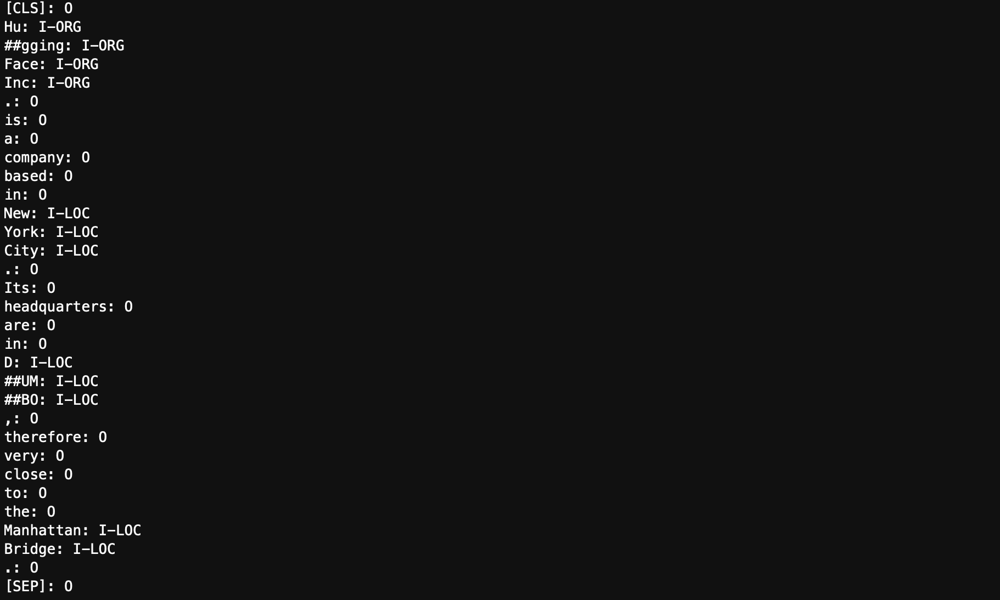

# 理解 Hugging Face 的 `AutoModel` 系列：不同任务的自动模型加载类

> 在正式进入大模型的部署之前，我们需要补充一些必需的知识，减少之后可能遇到的磕绊。
>
> 有过一些基础的同学可能对曾经代码中的 **AutoModel 和 AutoModelForXXX** 产生过疑惑。
> 如果你做过图像分类任务的话，你应该注意到分类模型实际上由 **backbone** 和 **classifier** 组成，前者用于特征提取，后者用于分类。`AutoModel` 和 `AutoModelForXXX` 之间也存在类似的关系，可以理解为 `AutoModel` 对应于 backbone，而 `AutoModelForXXX` 则是 backbone + classifier，也就是完整的模型。
>
> 选择合适的模型类对于正确部署大型语言模型非常重要。`AutoModel` 系列提供了多种自动化工具，使得加载预训练模型变得非常简单。本文将详细介绍 `AutoModel` 及其衍生类（如 `AutoModelForCausalLM`、`AutoModelForMaskedLM`、`AutoModelForSeq2SeqLM` 等）的区别。
>
> 实际上，你只需要理解其中一个类的用途，就足以举一反三。
>
> 推荐访问：[AutoModel 类](https://huggingface.co/docs/transformers/main/en/model_doc/auto#transformers.AutoModel) ｜ [Hugging Face 模型库](https://huggingface.co/models)
>
> [代码文件下载](../Demos/04.%20Hugging%20Face%20AutoModel%20示例合集.ipynb)
>
> 在线链接：[Kaggle](https://www.kaggle.com/code/aidemos/04-hugging-face-automodel) | [Colab](https://colab.research.google.com/drive/1gLTXcvG-tEDOqnR7qM-3-S812qnBUGlh?usp=sharing)

## 目录

- [主要的 AutoModel 类及其用途](#主要的-automodel-类及其用途)
   - [详细说明](#详细说明)
- [选择合适的 AutoModel 类](#选择合适的-automodel-类)
- [实际代码示例](#实际代码示例)
   - [示例 1：文本生成 (AutoModelForCausalLM)](#示例-1文本生成-automodelforcausallm)
   - [示例 2：填空任务 (AutoModelForMaskedLM)](#示例-2填空任务-automodelformaskedlm)
   - [示例 3：序列到序列任务 (AutoModelForSeq2SeqLM)](#示例-3序列到序列任务-automodelforseq2seqlm)
   - [示例 4：问答系统 (AutoModelForQuestionAnswering)](#示例-4问答系统-automodelforquestionanswering)
   - [示例 5：命名实体识别 (AutoModelForTokenClassification)](#示例-5命名实体识别-automodelfortokenclassification)
   - [示例 6：文本分类 (AutoModelForSequenceClassification)](#示例-6文本分类-automodelforsequenceclassification)
   - [示例 7：特征提取 (AutoModel)](#示例-7特征提取-automodel)
- [参考资料](#参考资料)

---

## `AutoModel` 系列概述

[Hugging Face](https://huggingface.co) 为开发者提供了丰富的预训练模型，覆盖各种自然语言处理任务，是一个非常棒的开源社区。为了简化模型的加载和使用，Hugging Face 中的 Transformers 库提供了一系列 `AutoModel` 类，这些类能够根据模型名称自动选择适当的模型架构和预训练权重。

`AutoModel` 系列包括多个自动化加载类，每个类对应不同的任务和模型类型。

## 主要的 `AutoModel` 类及其用途

以下是常见的 `AutoModel` 类及其主要用途，更多的内容可以参考官方文档 [AutoModel 类](https://huggingface.co/docs/transformers/main/en/model_doc/auto#transformers.AutoModel)的右边栏：

| **类名**                             | **描述**                                                     | **适用任务**                     |
| ------------------------------------ | ------------------------------------------------------------ | -------------------------------- |
| `AutoModel`                          | 加载预训练的基础模型，不包含任何任务特定的头部。             | 特征提取、嵌入生成、自定义任务等 |
| `AutoModelForCausalLM`               | 加载带有因果语言建模头部的模型，适用于生成任务。             | 文本生成、对话系统、自动补全等   |
| `AutoModelForMaskedLM`               | 加载带有掩码语言建模头部的模型，适用于填空任务。             | 填空任务、句子补全、文本理解等   |
| `AutoModelForSeq2SeqLM`              | 加载适用于序列到序列任务的模型，带有编码器-解码器架构。      | 机器翻译、文本摘要、问答系统等   |
| `AutoModelForQuestionAnswering`      | 加载适用于问答任务的模型，带有专门的头部用于预测答案的起始和结束位置。 | 问答系统、信息检索等             |
| `AutoModelForTokenClassification`    | 加载用于标注任务（如命名实体识别）的模型。                   | 命名实体识别、词性标注等         |
| `AutoModelForSequenceClassification` | 加载用于序列分类任务的模型，带有分类头部。                   | 文本分类、情感分析等             |

### 详细说明

1. **`AutoModel`**
   - **描述**：通用的模型加载类，不附带任何特定任务的输出头。它仅加载模型的**主体部分**，适用于需要自定义任务头的情况。
   - **适用场景**：
     - **特征提取**：从文本中提取嵌入或特征，用于下游任务。
     - **自定义任务**：为特定任务设计专属的输出层，如自定义的分类器或回归器。
     - **研究与实验**：在模型架构上进行深入研究和实验，不受限于预定义的任务头。

2. **`AutoModelForCausalLM`**
   - **描述**：专为因果语言建模（Causal Language Modeling）设计，包含适用于生成任务的输出头。
   - **适用场景**：
     - **文本生成**：如对话系统、内容创作、自动补全等。
     - **因果语言建模**：根据上下文生成后续文本的任务。
     - **快速部署**：无需额外添加任务头，适合快速搭建生成式应用。

3. **`AutoModelForMaskedLM`**
   - **描述**：专为掩码语言建模（Masked Language Modeling）设计，包含适用于填空任务的输出头。
   - **适用场景**：
     - **填空任务**：如句子补全、文本理解等。
     - **预训练模型微调**：进一步训练模型以增强其理解能力。

4. **`AutoModelForSeq2SeqLM`**
   - **描述**：适用于序列到序列（Sequence-to-Sequence）任务，包含编码器-解码器架构的输出头。
   - **适用场景**：
     - **机器翻译**：将一种语言翻译成另一种语言。
     - **文本摘要**：生成文本的简短摘要。

5. **`AutoModelForQuestionAnswering`**
   - **描述**：专为问答任务设计，包含用于预测答案起始和结束位置的输出头。
   - **适用场景**：
     - **问答系统**：从文本中提取并生成问题的答案。
     - **信息检索**：在大量文档中找到相关信息并生成回答。

6. **`AutoModelForTokenClassification`**
   - **描述**：用于标注任务，如命名实体识别，包含专门的输出头。
   - **适用场景**：
     - **命名实体识别（NER）**：识别文本中的实体，如人名、地名等。
     - **词性标注**：为每个词分配词性标签。

7. **`AutoModelForSequenceClassification`**
   - **描述**：用于序列分类任务，包含分类头部。
   - **适用场景**：
     - **文本分类**：如情感分析、主题分类等。
     - **语音识别后处理**：对转录的文本进行分类。

## 选择合适的 `AutoModel` 类

以下是一个简单的指导原则：

- **文本生成**：使用 `AutoModelForCausalLM`。
- **填空任务**：使用 `AutoModelForMaskedLM`。
- **机器翻译、文本摘要**：使用 `AutoModelForSeq2SeqLM`。
- **问答系统**：使用 `AutoModelForQuestionAnswering`。
- **命名实体识别**：使用 `AutoModelForTokenClassification`。
- **文本分类**：使用 `AutoModelForSequenceClassification`。
- **特征提取或自定义任务**：使用 `AutoModel`。

实际上，Hugging Face 中本就有一个快捷的方式查看这个模型的作用：

点击对应模型右边的`Use this model`，对于语言模型，通常你会看到`Transformers`，点击它：


例如 GPT-2 所对应的是`AutoModelForCausalLM`：


这意味着官方建议使用 `AutoModelForCausalLM` 来加载 GPT-2 模型，用于文本生成任务。

## 实际代码示例

下面是使用不同 `AutoModel` 类的实际代码示例，展示它们在不同任务中的应用。其中的 Prompt 将使用英文，因为这些模型基本是训练在英文数据集上的。

### 示例 1：文本生成 (`AutoModelForCausalLM`)

```python
from transformers import AutoTokenizer, AutoModelForCausalLM

# 指定模型名称
model_name = "gpt2"

# 加载 Tokenizer
tokenizer = AutoTokenizer.from_pretrained(model_name)

# 加载预训练模型
model = AutoModelForCausalLM.from_pretrained(model_name)

# 输入文本
input_text = "Once upon a time"

# 编码输入
inputs = tokenizer(input_text, return_tensors="pt")

# 生成文本
outputs = model.generate(**inputs, max_length=50, do_sample=True, top_p=0.95, temperature=0.7)

# 解码生成的文本
generated_text = tokenizer.decode(outputs[0], skip_special_tokens=True)
print(generated_text)
```


### 示例 2：填空任务 (`AutoModelForMaskedLM`)

```python
import torch
from transformers import AutoTokenizer, AutoModelForMaskedLM

# 指定模型名称
model_name = "bert-base-uncased"

# 加载 Tokenizer
tokenizer = AutoTokenizer.from_pretrained(model_name)

# 加载预训练模型
model = AutoModelForMaskedLM.from_pretrained(model_name)

# 输入文本，包含 [MASK] 标记
input_text = "The capital of France is [MASK]."

# 编码输入
inputs = tokenizer(input_text, return_tensors="pt")

# 获取预测
with torch.no_grad():
    outputs = model(**inputs)
    predictions = outputs.logits

# 获取最高得分的预测词
masked_index = (inputs.input_ids == tokenizer.mask_token_id)[0].nonzero(as_tuple=True)[0]
predicted_token_id = predictions[0, masked_index].argmax(dim=-1).item()
predicted_token = tokenizer.decode([predicted_token_id])

print(f"预测结果: {predicted_token}")
```


### 示例 3：序列到序列任务 (`AutoModelForSeq2SeqLM`)

```python
from transformers import AutoTokenizer, AutoModelForSeq2SeqLM

# 指定模型名称
model_name = "Helsinki-NLP/opus-mt-en-de"

# 加载 Tokenizer
tokenizer = AutoTokenizer.from_pretrained(model_name)

# 加载预训练模型
model = AutoModelForSeq2SeqLM.from_pretrained(model_name)

# 输入文本
input_text = "Hello, how are you?"

# 编码输入
inputs = tokenizer(input_text, return_tensors="pt")

# 生成翻译
outputs = model.generate(**inputs, max_length=40, num_beams=4, early_stopping=True)

# 解码生成的文本
translated_text = tokenizer.decode(outputs[0], skip_special_tokens=True)
print(f"翻译结果: {translated_text}")
```


### 示例 4：问答系统 (`AutoModelForQuestionAnswering`)

```python
from transformers import AutoTokenizer, AutoModelForQuestionAnswering
import torch

# 指定模型名称
model_name = "distilbert-base-uncased-distilled-squad"

# 加载 Tokenizer
tokenizer = AutoTokenizer.from_pretrained(model_name)

# 加载预训练模型
model = AutoModelForQuestionAnswering.from_pretrained(model_name)

# 输入上下文和问题
context = "Hugging Face is creating a tool that democratizes AI."
question = "What is Hugging Face creating?"

# 编码输入
inputs = tokenizer.encode_plus(question, context, return_tensors="pt")

# 获取预测
with torch.no_grad():
    outputs = model(**inputs)

# 获取答案的起始和结束位置
answer_start = torch.argmax(outputs.start_logits)
answer_end = torch.argmax(outputs.end_logits) + 1

# 解码答案
answer = tokenizer.convert_tokens_to_string(tokenizer.convert_ids_to_tokens(inputs["input_ids"][0][answer_start:answer_end]))
print(f"答案: {answer}")
```


### 示例 5：命名实体识别 (`AutoModelForTokenClassification`)

```python
from transformers import AutoTokenizer, AutoModelForTokenClassification
import torch
import numpy as np

# 指定模型名称
model_name = "dbmdz/bert-large-cased-finetuned-conll03-english"

# 加载 Tokenizer
tokenizer = AutoTokenizer.from_pretrained(model_name)

# 加载预训练模型
model = AutoModelForTokenClassification.from_pretrained(model_name)

# 标签列表
label_list = model.config.id2label

# 输入文本
input_text = "Hugging Face Inc. is a company based in New York City. Its headquarters are in DUMBO, therefore very close to the Manhattan Bridge."

# 编码输入
inputs = tokenizer(input_text, return_tensors="pt")

# 获取模型输出
with torch.no_grad():
    outputs = model(**inputs)

# 获取预测分数
logits = outputs.logits
predictions = torch.argmax(logits, dim=2)

# 将预测结果映射到标签
tokens = tokenizer.convert_ids_to_tokens(inputs["input_ids"][0])
pred_labels = [label_list[prediction.item()] for prediction in predictions[0]]

# 打印结果
for token, label in zip(tokens, pred_labels):
    print(f"{token}: {label}")
```



### 示例 6：文本分类 (`AutoModelForSequenceClassification`)

```python
from transformers import AutoTokenizer, AutoModelForSequenceClassification
import torch
import torch.nn.functional as F

# 指定模型名称
model_name = "distilbert-base-uncased-finetuned-sst-2-english"

# 加载 Tokenizer
tokenizer = AutoTokenizer.from_pretrained(model_name)

# 加载预训练模型
model = AutoModelForSequenceClassification.from_pretrained(model_name)

# 输入文本
input_text = "I love using transformers library!"

# 编码输入
inputs = tokenizer(input_text, return_tensors="pt")

# 获取模型输出
with torch.no_grad():
    outputs = model(**inputs)

# 获取预测分数
logits = outputs.logits
probabilities = F.softmax(logits, dim=1)

# 获取标签
labels = ['Negative', 'Positive']
prediction = torch.argmax(probabilities, dim=1)
predicted_label = labels[prediction]

# 打印结果
print(f"文本: {input_text}")
print(f"情感预测: {predicted_label}")
```


### 示例 7：特征提取 (`AutoModel`)

```python
from transformers import AutoTokenizer, AutoModel
import torch

# 指定模型名称
model_name = "bert-base-uncased"

# 加载 Tokenizer 和模型
tokenizer = AutoTokenizer.from_pretrained(model_name)
model = AutoModel.from_pretrained(model_name)

# 输入文本
input_text = "This is a sample sentence."

# 编码输入
inputs = tokenizer(input_text, return_tensors="pt")

# 获取模型输出
with torch.no_grad():
    outputs = model(**inputs)

# 获取最后一层隐藏状态
last_hidden_states = outputs.last_hidden_state

# 输出维度
print(f"Last hidden state shape: {last_hidden_states.shape}")
```

在这个示例中，我们使用 `AutoModel` 提取输入文本的特征表示（即最后一层的隐藏状态），这些特征可以用于计算文本之间的相似度、输入到自定义的分类器等。


AutoModel 实际上并不直观，如果你完全不知道输出这个的含义，没有关系，去多学习一些深度学习的知识，很快就会有自己的想法。

磨刀不误砍柴工，与君共勉。

## 参考资料

- [AutoModel 类](https://huggingface.co/docs/transformers/main/en/model_doc/auto#transformers.AutoModel)
- [Hugging Face 模型库](https://huggingface.co/models)
- [what is the difference between AutoModelForCausalLM and AutoModel?](https://www.reddit.com/r/huggingface/comments/1bv1kfk/comment/l1dzdz1/?utm_source=share&utm_medium=web3x&utm_name=web3xcss&utm_term=1&utm_content=share_button)