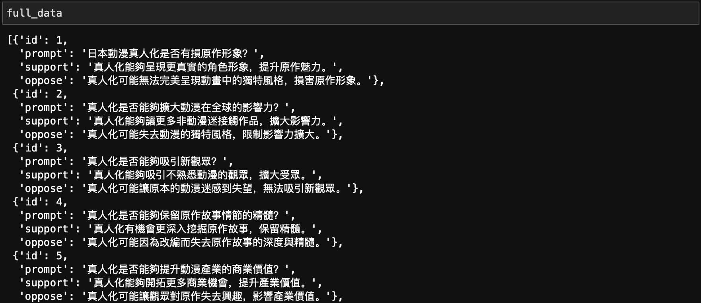
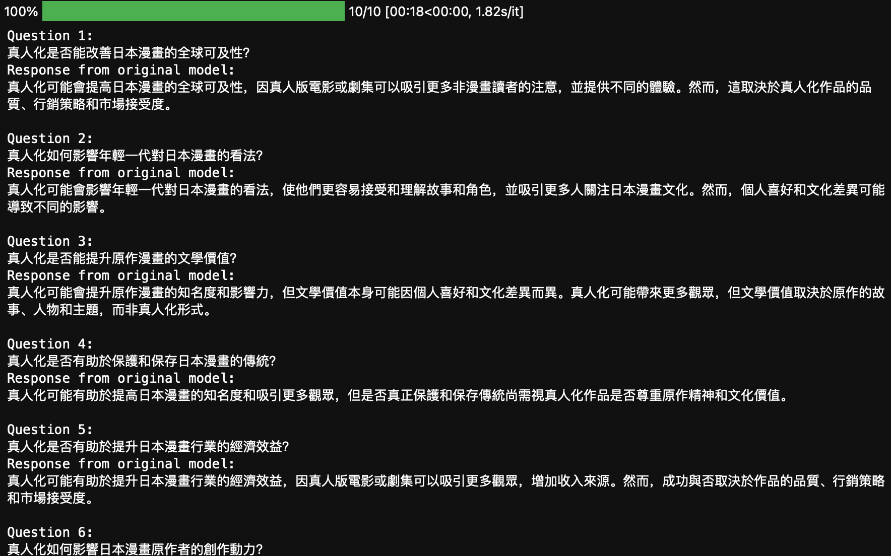
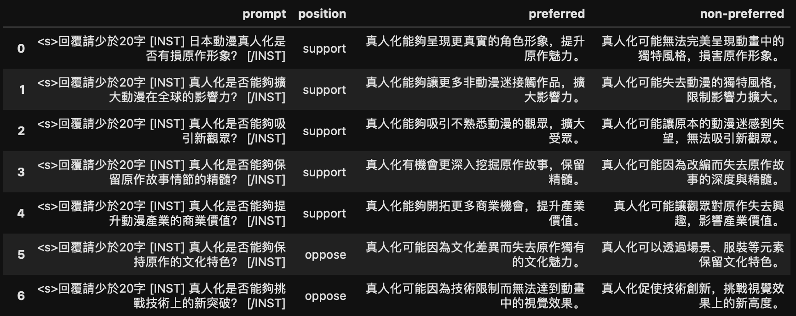
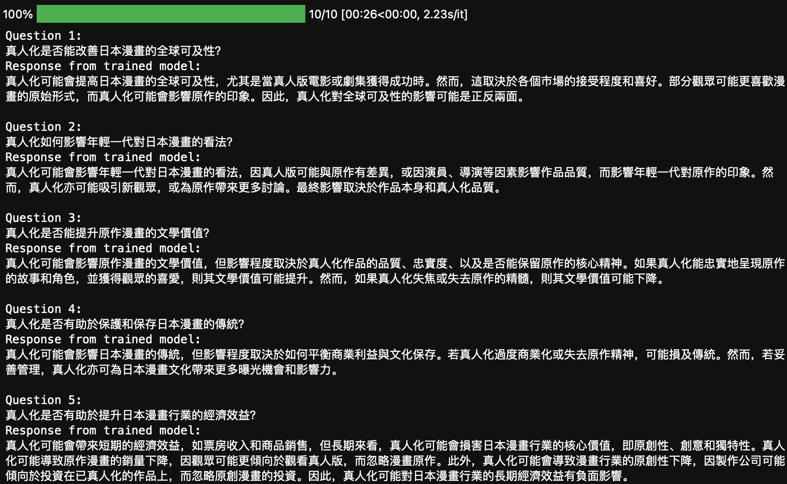
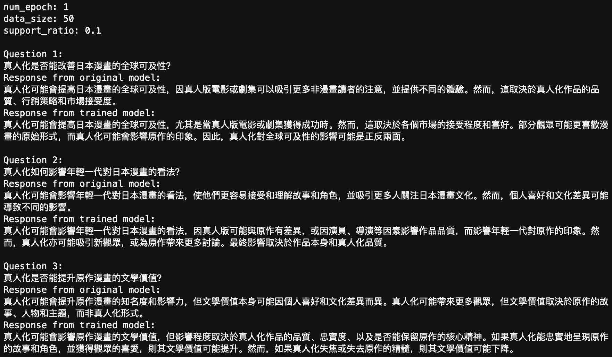

# DPO 微调示例：根据人类偏好优化LLM大语言模型

> 在部署大模型之后，我们必然要和微调打交道。现在大模型的微调有非常多的方法，过去的文章中提到的微调方法通常依赖于问题和答案对，标注成本较高。
>
> 2023 年所提出的 [Direct Preference Optimization](https://arxiv.org/abs/2305.18290)（DPO）为我们提供了一种无需标准标注答案的高效微调方法。DPO 依赖于人类对文本的偏好对（preference pairs），也就是说，数据集中只包含人类对两段文本中哪段更好的判断，而不是具体的正确答案。
>
> 在本文中，我们将利用 DPO 来微调一个模型让其按照偏好进行输出。这篇文章也为[生成式人工智能导论](https://speech.ee.ntu.edu.tw/~hylee/genai/2024-spring.php)课程中 [HW6: LLM Values Alignment](https://colab.research.google.com/drive/1d3zmkqo-ZmxrIOYWSe3vDD0za8tUPguu?usp=sharing#scrollTo=owGIuqdnRI8I) 提供中文引导。
>
> [代码文件下载](https://github.com/Hoper-J/LLM-Guide-and-Demos-zh_CN/blob/master/Demos/09.%20DPO%20微调：根据偏好引导%20LLM%20的输出.ipynb) | [作业PDF](https://github.com/Hoper-J/LLM-Guide-and-Demos-zh_CN/blob/master/GenAI_PDF/HW6.pdf)
>
> 在线链接：[Kaggle](https://www.kaggle.com/code/aidemos/09-dpo-llm) | [Colab](https://colab.research.google.com/drive/1TxL9MrIXDY3HjWgQ4B3IcEeMj-lsbNAZ?usp=sharing)

## 目录

- [安装和导入一些必要的库](#安装和导入一些必要的库)
  - [可能的问题：Keras 3 与 Transformers 不兼容](#可能的问题keras-3-与-transformers-不兼容)
- [加载数据集](#加载数据集)
- [使用 HFD 下载模型](#使用-hfd-下载模型)
- [加载模型](#加载模型)
- [查看未经过微调的模型原始输出](#查看未经过微调的模型原始输出)
- [设置参数](#设置参数)
- [准备训练数据](#准备训练数据)
- [训练](#训练)
- [查看微调后的模型输出](#查看微调后的模型输出)
- [观察输出结果](#观察输出结果)
- [推荐阅读](#推荐阅读)

## 安装和导入一些必要的库


```bash
pip install bitsandbytes==0.43.1 datasets==2.19.0 peft==0.10.0 trl==0.8.6 accelerate==0.29.3
```


```python
import os
import re
import json

import torch
import pandas as pd
from tqdm.auto import tqdm

from datasets import Dataset
from peft import LoraConfig
from transformers import AutoModelForCausalLM, AutoTokenizer, TrainingArguments, BitsAndBytesConfig, GenerationConfig
from trl import DPOTrainer
```

### 可能的问题：Keras 3 与 Transformers 不兼容

> 在导入时，你可能会看到以下报错：
>
> RuntimeError: Failed to import trl.trainer.dpo_trainer because of the following error (look up to see its traceback):
> Failed to import transformers.trainer because of the following error (look up to see its traceback):
> Failed to import transformers.integrations.integration_utils because of the following error (look up to see its traceback):
> Failed to import transformers.modeling_tf_utils because of the following error (look up to see its traceback):
> Your currently installed version of Keras is Keras 3, but this is not yet supported in Transformers. Please install the backwards-compatible tf-keras package with `pip install tf-keras`.

transformers 库建议安装兼容的 tf-keras 包来解决这个兼容性问题。你可以通过以下命令安装：

```bash
pip install tf-keras
```

现在问题应该得到了解决。

## 加载数据集

我们将使用预先提供的数据集，包括带标签的偏好数据和测试提示数据。

这个数据集来自于[生成式人工智能导论](https://speech.ee.ntu.edu.tw/~hylee/genai/2024-spring.php)的HW6，处理的问题是：是否应该将动漫真人化？两个回答分别对应支持和不支持（由GPT生成），在后面的代码中你将选择支持的占比。


```python
git clone https://github.com/Baiiiiiiiiii/GenAI_hw6_dataset.git
```


```python
with open("./GenAI_hw6_dataset/labelled_data.json", 'r') as jsonfile:
    full_data = json.load(jsonfile)

with open("./GenAI_hw6_dataset/test_prompt.json", 'r') as jsonfile:
    test_data = json.load(jsonfile)
```

直观理解数据集：




## 使用 HFD 下载模型

我们这里使用多线程的方法进行快速下载。

当然，你也可以取消我注释的部分，使用官方的命令进行安装，但是会很慢。

**安装工具**：

```bash
sudo apt-get update
sudo apt-get install git wget curl aria2 git-lfs
git lfs install
```

**下载 hfd 并修改权限**：


```bash
wget https://hf-mirror.com/hfd/hfd.sh
chmod a+x hfd.sh
```

**多线程下载模型**：

```bash
export HF_ENDPOINT=https://hf-mirror.com
./hfd.sh 'MediaTek-Research/Breeze-7B-Instruct-v0_1' --tool aria2c -x 16
```


如果直接运行以上命令报错，根据 [a. 使用 HFD 加快 Hugging Face 模型和数据集的下载](https://github.com/Hoper-J/LLM-Guide-and-Demos-zh_CN/blob/master/Guide/a.%20使用%20HFD%20加快%20Hugging%20Face%20模型和数据集的下载.md) 进行前置安装。

## 加载模型

将使用`MediaTek-Research/Breeze-7B-Instruct-v0_1`模型进行微调。


```python
model = AutoModelForCausalLM.from_pretrained(
    'MediaTek-Research/Breeze-7B-Instruct-v0_1',
    device_map='auto',
    trust_remote_code=True,
    quantization_config=BitsAndBytesConfig(
        load_in_4bit=True,
        bnb_4bit_compute_dtype=torch.bfloat16,
        bnb_4bit_use_double_quant=True,
        bnb_4bit_quant_type='nf4'
    )
)
```

这里，我们采用了4位量化（4-bit quantization）来减少模型的内存占用，加快推理速度。

## 查看未经过微调的模型原始输出

在进行微调之前，我们首先查看一下原始模型的输出效果。首先，加载分词器：

```python
tokenizer = AutoTokenizer.from_pretrained('MediaTek-Research/Breeze-7B-Instruct-v0_1')
tokenizer.padding_side = "right"
tokenizer.pad_token = tokenizer.eos_token
```

定义一个数据处理函数，将数据格式化为模型可以接受的输入，我们这里的 prompt 延续原来的繁体（因为Breeze-7B-Instruct-v0_1更多使用繁体中文进行训练，你并不需要修改它）：

```python
def data_formulate(data):
    messages = [
        {"role": "system", "content": '回覆請少於20字'},
        {"role": "user", "content": data['prompt']},
    ]
    prompt = tokenizer.apply_chat_template(messages, tokenize=False, add_generation_prompt=True)
    return prompt
```

接下来，生成原始模型的响应：

```python
original_model_response = []
for data in tqdm(test_data):
    id = data['id']
    print(f'Question {id}:\n'+data['prompt'])
    inputs = tokenizer(data_formulate(data), return_tensors="pt").to('cuda')
    generation_config=GenerationConfig(
            do_sample=False,
            max_new_tokens = 200,
            pad_token_id = tokenizer.pad_token_id
    )
    output = model.generate(**inputs, generation_config=generation_config)
    output = tokenizer.batch_decode(output, skip_special_tokens=True)[0].split('[/INST] ')[1]
    original_model_response.append(output)
    print('Response from original model:\n'+output+'\n')
```

这段代码将遍历测试数据集，生成并打印每个问题的原始模型响应。



## 设置参数

你只需要修改这个模块，不需要改变其他的，除非你真的知道自己在做什么。

`support_ratio` 将反映你的偏好：

- 0 表示完全不支持（反对）真人化
- 1 表示完全支持真人化
- 0.1 表示 10% 支持真人化


```python
num_epoch = 1
data_size = 50
support_ratio = 0.1
```

## 准备训练数据

这里，我们将数据集分为支持（support）和反对（oppose）两部分，构建一个包含偏好对的训练数据集（是的，这里就是 DPO）。


```python
# 选择部分数据用于训练
training_data = full_data[:data_size]

# 定义 support 数据集的大小
support_data_size = int(data_size * support_ratio)

# 为训练数据集准备数据
prompt_list = [data_formulate(data) for data in training_data]
chosen_list = [data['support'] for data in training_data[:support_data_size]] + [data['oppose'] for data in training_data[support_data_size:]]
rejected_list = [data['oppose'] for data in training_data[:support_data_size]] + [data['support'] for data in training_data[support_data_size:]]
position_list = ['support' for _ in range(support_data_size)] + ['oppose' for _ in range(data_size - support_data_size)]

# 创建训练数据集
train_dataset = Dataset.from_dict({'prompt': prompt_list, 'position': position_list, 'chosen': chosen_list, 'rejected': rejected_list})
pd.DataFrame(train_dataset).rename(columns={"chosen": "preferred", "rejected": "non-preferred"})
```

总共有 50 笔训练数据，当 support 设置为 0.1 时，前 50*0.1=5 笔训练资料的偏好将倾向于支持真人化，后 50-5=45 笔资料反对真人化。



## 训练

现在，我们进入训练阶段。首先，设置训练参数：


```python
training_args = TrainingArguments(
    output_dir='./',
    per_device_train_batch_size=1,
    num_train_epochs=num_epoch,
    gradient_accumulation_steps=8,
    gradient_checkpointing=False,
    learning_rate=2e-4,
    optim="paged_adamw_8bit",
    logging_steps = 1,
    warmup_ratio = 0.1,
    report_to = 'none'
)
```

接下来，配置PEFT（Parameter-Efficient Fine-Tuning）：

```python
peft_config = LoraConfig(
    lora_alpha=16,
    lora_dropout=0.1,
    r=64,
    bias="none",
    task_type="CAUSAL_LM",
)
```

然后，初始化DPO训练器：

```python
dpo_trainer = DPOTrainer(
    model,
    args=training_args,
    beta=0.1,
    train_dataset=train_dataset,
    tokenizer=tokenizer,
    peft_config=peft_config,
)
```

开始训练：

```python
dpo_trainer.train()
```


## 查看微调后的模型输出

训练完成后，我们需要查看微调后的模型效果。以下是生成训练后模型响应的代码：


```python
trained_model_response = []
for data in tqdm(test_data):
    id = data['id']
    print(f'Question {id}:\n'+data['prompt'])
    inputs = tokenizer(data_formulate(data), return_tensors="pt").to('cuda')
    generation_config=GenerationConfig(
            do_sample=False,
            max_new_tokens = 200,
            pad_token_id = tokenizer.pad_token_id
    )
    output = model.generate(**inputs, generation_config=generation_config)
    output = tokenizer.batch_decode(output, skip_special_tokens=True)[0].split('[/INST] ')[1]
    trained_model_response.append(output)
    print('Response from trained model:\n'+output+'\n')
```

这段代码与之前生成原始模型响应的代码类似，但这次生成的是经过微调后的模型响应：



## 观察输出结果

最后，我们对比微调前后的模型响应，观察DPO方法带来的效果提升：


```python
model_response = []
print(f'num_epoch: {num_epoch}\ndata_size: {data_size}\nsupport_ratio: {support_ratio}')
print()
for data in test_data:
    id = data['id']
    ref_output = original_model_response[id-1]
    output = trained_model_response[id-1]
    print(f'Question {id}:\n'+data['prompt'])
    print('Response from original model:\n'+ref_output)
    print('Response from trained model:\n'+output)
    print()
    model_response.append({'id':data['id'], 'prompt':data['prompt'], 'response_from_original_model':ref_output, 'response_from_trained_model':output})
```



**拓展**

在使用 GPT 的时候你应该也见到过其同时生成两个回答让我们选择更倾向于哪个，这个和 Google 验证码有着异曲同工之妙。

## 推荐阅读

[Direct Preference Optimization: Your Language Model is Secretly a Reward Model](https://arxiv.org/abs/2305.18290)

