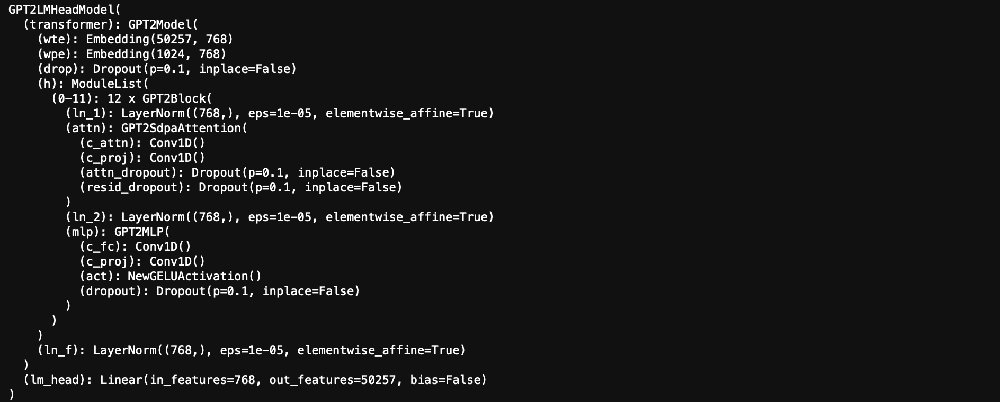

# PEFT：在大模型中快速应用 LoRA

>如果你对LoRA还没有一个直观的概念，可以回看这篇文章：[《3. 认识 LoRA：从线性层到注意力机制》](https://github.com/Hoper-J/AI-Guide-and-Demos-zh_CN/blob/master/Guide/03.%20进阶指南：自定义%20Prompt%20提升大模型解题能力.md)。
>
>我们将在这里进一步探讨**如何快速地在大型预训练模型中应用 LoRA**，并解答可能存在的问题，包括：
>
>- `peft` 和 `lora` 之间有什么关系？
>-  `get_peft_model` 怎么使用？
>- 如何知道应用 LoRA 后模型的参数变化量？
>
>[代码文件下载](https://github.com/Hoper-J/AI-Guide-and-Demos-zh_CN/blob/master/Demos/12.%20%20应用%20LoRA%20到大模型的简单示例（PEFT）.ipynb)

## 目录

- [PEFT 和 LoRA 的关系](#peft-和-lora-的关系)
- [在大模型中应用 LoRA](#在大模型中应用-lora)
  - [安装必要的库](#安装必要的库)
  - [加载预训练模型](#加载预训练模型)
  - [应用 LoRA](#应用-lora)
  - [查看当前模型架构](#查看当前模型架构)
  - [查看增加的参数量](#查看增加的参数量)
    - [理论计算](#理论计算)
    - [使用 PEFT 查看参数](#使用-peft-查看参数)
    - [自定义函数查看参数](#自定义函数查看参数)
  - [准备数据并进行微调](#准备数据并进行微调)
  - [保存和加载 LoRA 微调的模型](#保存和加载-lora-微调的模型)

## PEFT 和 LoRA 的关系

PEFT（Parameter-Efficient Fine-Tuning）是 Hugging Face 提供的专门用于参数高效微调的工具库。LoRA（Low-Rank Adaptation）是 PEFT 支持的多种微调方法之一，旨在通过减少可训练参数来提高微调大模型的效率。除此之外，PEFT 还支持其他几种常见的微调方法，包括：

- **Prefix-Tuning**：冻结原模型参数，为每一层添加可学习的前缀向量，只学习前缀参数。
- **Adapter-Tuning**：冻结原模型参数，在模型的层与层之间插入小型的 adapter 模块，仅对 adapter 模块进行训练。
- ...

## 在大模型中应用 LoRA

下面，我们以实际的例子来展示如何在大模型中快速应用 LoRA。

### 安装必要的库

首先，确保你已经安装了 `transformers` 和 `peft` 库。

```bash
pip install transformers peft
```

### 加载预训练模型

我们以 Hugging Face 的 `transformers` 库为例，加载一个预训练的 GPT-2 模型，其参数大小为 110M。

```python
from transformers import AutoTokenizer, AutoModelForCausalLM

# 加载预训练的 GPT-2 模型和分词器
tokenizer = AutoTokenizer.from_pretrained('gpt2')
model = AutoModelForCausalLM.from_pretrained('gpt2')

print(model)
```

打印 model，方便和应用 LoRA 后进行对比。



### 应用 LoRA

使用 `peft` 库，我们可以轻松地将 LoRA 集成到模型中：

```python
from peft import get_peft_model, LoraConfig, TaskType

# 配置 LoRA
lora_config = LoraConfig(
    task_type=TaskType.CAUSAL_LM,  # 任务类型：因果语言模型
    inference_mode=False,          # 推理模式关闭，以进行训练
    r=8,                           # 低秩值 r
    lora_alpha=32,                 # LoRA 的缩放因子
    lora_dropout=0.1,              # Dropout 概率
)

# 将 LoRA 应用到模型中
model = get_peft_model(model, lora_config)
```

### 查看当前模型架构

```python
print(model)
```

可以看到 LoRA 已经成功应用。


### 查看增加的参数量

应用 LoRA 后，或许你希望了解模型参数量的变化。以下是理论计算和查看方式：

#### 理论计算

对于每个应用了 LoRA 的层，增加的参数量为：

$$
\text{增加的参数量} = r \times (\text{输入维度} + \text{输出维度})
$$

- **`r`**：LoRA 的低秩值。
- **输入维度**：层的输入特征数。
- **输出维度**：层的输出特征数。

#### 使用 PEFT 查看参数

`peft` 提供了查看模型参数的便捷方法：

```python
# 查看 LoRA 模块
model.print_trainable_parameters()
```

输出：

```python
trainable params: 294,912 || all params: 124,734,720 || trainable%: 0.23643136409814364
```

#### 自定义函数查看参数

实际上直接计算所有可训练参数就行。

```python
def print_trainable_parameters(model):
    trainable_params = 0
    all_params = 0
    for _, param in model.named_parameters():
        num_params = param.numel()
        all_params += num_params
        if param.requires_grad:
            trainable_params += num_params
    print(f"可训练参数量: {trainable_params}")
    print(f"总参数量: {all_params}")
    print(f"可训练参数占比: {100 * trainable_params / all_params:.2f}%")
    
print_trainable_parameters(model)
```

输出：

```python
可训练参数量: 294912
总参数量: 124734720
可训练参数占比: 0.24%
```

### 准备数据并进行微调

假设你已经有了训练数据集 `train_dataset`，下面是一个简单的样例代码。

```python
from transformers import Trainer, TrainingArguments

# 定义训练参数
training_args = TrainingArguments(
    output_dir='./results',         # 模型保存和日志输出的目录路径
    num_train_epochs=3,             # 训练的总轮数（epochs）
    per_device_train_batch_size=16, # 每个设备（如GPU或CPU）上的训练批次大小，16表示每次输入模型的数据数量
    learning_rate=5e-5,             # 学习率
    logging_steps=10,               # 每隔多少步（steps）进行一次日志记录
    save_steps=100,                 # 每隔多少步保存模型
)

# 创建 Trainer
trainer = Trainer(
    model=model,                    # 训练的模型对象，需要事先加载好
    args=training_args,             # 上面定义的训练参数配置
    train_dataset=train_dataset,    # 需要对应替换成已经处理过的dataset
)

# 开始训练
trainer.train()
```

### 保存和加载 LoRA 微调的模型

训练完成后，你可以保存或者加载 LoRA 微调的参数，下面是个简单的示例。

```python
# 保存 LoRA 参数
model.save_pretrained('./lora_model')
```

在推理时，加载原始的预训练模型和 LoRA 参数。

```python
# 加载原始模型
base_model = AutoModelForCausalLM.from_pretrained("gpt2")

# 加载 LoRA 参数
from peft import PeftModel

model = PeftModel.from_pretrained(base_model, './lora_model')
```

