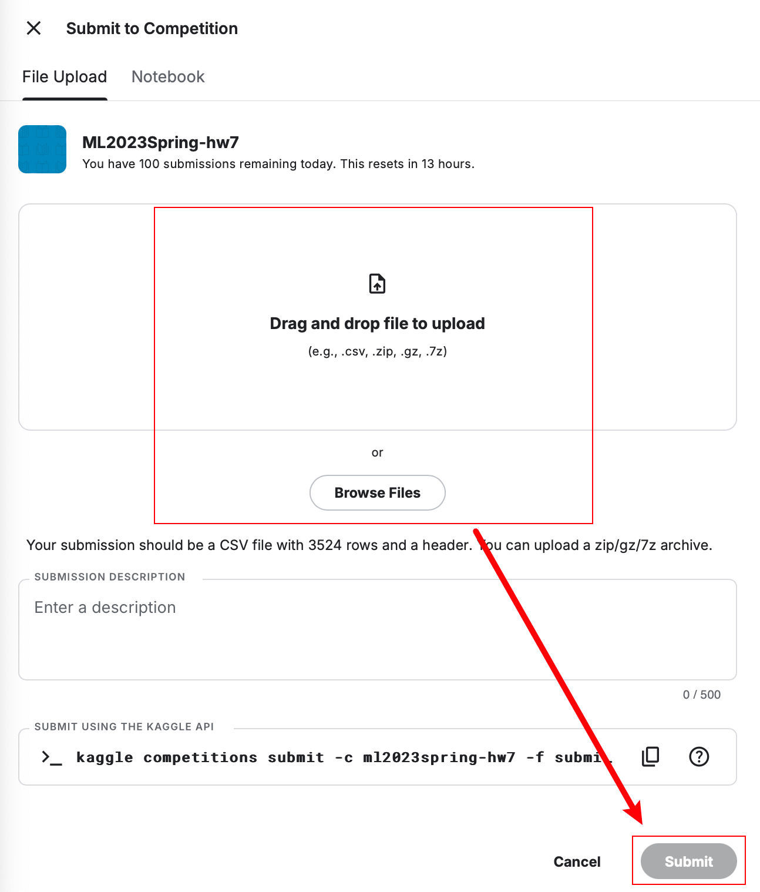
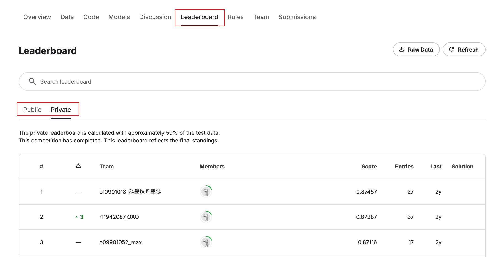
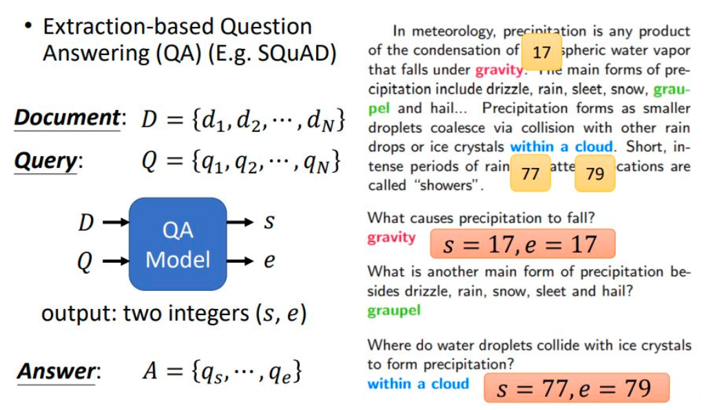

# 作业 - Bert 微调抽取式问答

> 这是一篇独立的作业文章。
>
> 本作业迁移自李宏毅老师 2023 年机器学习春的 HW07，原 Colab 链接：[ML2023_HW7_Question_Answering](https://colab.research.google.com/drive/1m0fQjJfkK9vAovxPj9Nd3-hQuxezB2w1)，课程主页：[Machine Learning 2023 Spring](https://speech.ee.ntu.edu.tw/~hylee/ml/2023-spring.php)
>
> [作业 PPT](../Demos/PDF/HW_BERT_Question_Answering.pdf) | [Kaggle 加入链接](https://www.kaggle.com/t/e001cad568dc4d77b6a5e762172f44d6)
>
> 代码文件下载：[样例代码](../Demos/21.%20Bert%20微调抽取式问答任务%20-%20作业样例代码.ipynb)
>
> 在线链接：[Kaggle](https://www.kaggle.com/code/aidemos/21-bert) | [Colab](https://colab.research.google.com/drive/1zHR2Cztmo49j3yrdT3GgkzNcAcHd7M0M?usp=sharing)
>
> 相关文章：[BERT 论文精读](../PaperNotes/BERT 论文精读.md)

请根据**提示**完成相应的代码修改，从而达到学习的目的。

作业文章不会给出答案，如果在闲暇时间进行学习，预计时间为 2-3 天。

## 目录

- [写在前面](#写在前面)
   - [提示](#提示)
   - [Kaggle 加入“比赛”](#kaggle-加入比赛)
- [任务目标：中文抽取式问答 (Extractive Question Answering)](#任务目标中文抽取式问答-extractive-question-answering)
- [性能指标（EM）](#性能指标em)
- [前置准备](#前置准备)
   - [下载数据集](#下载数据集)
      - [Kaggle](#kaggle)
   - [数据解析](#数据解析)
   - [数据集（Medium / Strong 相关）](#数据集medium--strong-相关)
      - [重点](#重点)
- [开放式问题](#开放式问题)
   - [Question 1](#question-1)
   - [Question 2 (In-context learning)](#question-2-in-context-learning)
      - [Prompt 对比（错误对比）](#prompt-对比错误对比)
      - [Prompt 对比（正确对比）](#prompt-对比正确对比)

## 写在前面

### 作业提示

> 如果理解了每个提示到底需要做什么，那么恭喜你已经完成了学习。
>
> 搜索代码文件中的 TODO 可以快速索引到需要修改的地方。

- **Simple baseline**
  - 直接运行样例代码文件
- **Medium baseline**
  - 使用学习率调度器：线性衰减，warmup 等，选择一个即可
- **Strong baseline**
  - 修改模型的预处理过程 (TODO: Preprocessing)
  - 尝试替换为其他预训练模型，在 [Hugging Face](https://huggingface.co/models?language=zh&sort=trending) 中进行选择
- **Boss baseline**
  - 修改后处理部分 (TODO: Postprocessing)
  - 尝试梯度累积

### Kaggle 加入“比赛”

访问 [Kaggle 加入链接](https://www.kaggle.com/t/e001cad568dc4d77b6a5e762172f44d6)，点击右上角的 `Late Submission`，然后点击 `I Understand and Accept` 同意：


样例代码运行后会生成文件：`result.csv`，如果想要提交查看分数，再次点击 `Late Submission`，上传后点击提交：



你可以在 `Submissions` 中看到自己的提交成绩：


> [!note]
>
> 在评估效果时最好仅参考 Public Score，Private Score 是测试集上的分数，因为比赛已经过了Deadline，所以显示了出来，比赛进行的过程中这个分数是隐藏的。

点击 `Leaderboard` 你将能够看到曾经参与者的成绩：



## 任务目标：中文抽取式问答 (Extractive Question Answering)

学习如何使用 transformers 微调预训练模型，以完成下游抽取式问答任务。

- **任务描述**: 通过 fine-tune BERT 模型，使其能够从给定的段落中抽取出问题的具体答案。
  
  - **目标**: 模型将预测答案的开始（Start）和结束（End）位置，并从文本中提取该片段作为答案。
    
    
    
  - **输入**: 段落 + 问题
  - **输出**: 答案
  
- **TODO**
  - 微调预训练的中文 BERT 模型
  - 调整超参数（如 `doc_stride`）
  - 应用线性学习率衰减策略
  - 尝试其他预训练模型
  - 改进数据的预处理（preprocessing）
  - 改进模型的后处理（postprocessing）

- **训练技巧**
  - 自动混合精度（Automatic Mixed Precision）
  - 梯度累积（Gradient Accumulation）
  - 集成方法（Ensemble）

- **预计训练时间**（在 Tesla T4 上启用自动混合精度时的运行时间）：
  - Simple baseline：8 分钟
  - Medium baseline：8 分钟
  - Strong baseline：25 分钟
  - Boss baseline：2 小时

## 性能指标（EM）

- **准确率 (Exact Match)**: 该指标用于衡量模型的预测答案与真实答案**完全一致**的比例。

## 前置准备

### 下载数据集

其实不需要手动下载，这里只是给出配置方法。

#### Kaggle

> To use the Kaggle API, sign up for a Kaggle account at [https://www.kaggle.com](https://www.kaggle.com/). Then go to the 'Account' tab of your user profile (`https://www.kaggle.com/<username>/account`) and select 'Create API Token'. This will trigger the download of `kaggle.json`, a file containing your API credentials. Place this file in the location `~/.kaggle/kaggle.json` (on Windows in the location `C:\Users\<Windows-username>\.kaggle\kaggle.json` - you can check the exact location, sans drive, with `echo %HOMEPATH%`). You can define a shell environment variable `KAGGLE_CONFIG_DIR` to change this location to `$KAGGLE_CONFIG_DIR/kaggle.json` (on Windows it will be `%KAGGLE_CONFIG_DIR%\kaggle.json`).
>
> -\- [Official Kaggle API](https://github.com/Kaggle/kaggle-api)

替换\<username\>为你自己的用户名，`https://www.kaggle.com/<username>/account`，然后点击 `Create New API Token`，将下载下来的文件放去应该放的位置：

- Mac 和 Linux 放在 `~/.kaggle`
- Windows 放在 `C:\Users\<Windows-username>\.kaggle`

```bash
pip install kaggle
# 你需要先在 Kaggle -> Account -> Create New API Token 中下载 kaggle.json
# mv kaggle.json ~/.kaggle/kaggle.json
kaggle competitions download -c ml2023spring-hw7
unzip ml2023spring-hw7.zip   
```


### 数据解析

> 两个繁体中文阅读理解资料集：[DRCD](https://github.com/DRCKnowledgeTeam/DRCD) 和 [ODSQA](https://github.com/Chia-Hsuan-Lee/ODSQA)。

- 训练（**DRCD + DRCD-backtrans**）：包含 15,329 个段落和 26,918 个问题。一个文章段落可能对应多个问题。
- 开发/用于验证（**DRCD + DRCD-backtrans**）：包含 1,255 个段落和 2,863 个问题。
- 测试（**DRCD + ODSQA**）：包含 1,606 个段落和 3,504 个问题。其中段落没有给出答案，需模型进行预测。

训练，开发和测试数据的格式都是相同的：

- id：问题序号
- paragraph_id：文章段落序号
- question_text：问题
- answer_text：答案
- answer_start：答案在文章中的起始点
- answer_end：答案在文章中的终止点


### 数据集（Medium / Strong 相关）

> 这里解释一下QA_Dataset，如果觉得太长，可以只查看重点部分。

1. **初始化（`__init__`）**：
   - `split` 决定数据集的类型（训练、验证或测试）。
   - `questions`, `tokenized_questions`, 和 `tokenized_paragraphs` 是原问题和 tokenized 后的问题和段落。
   - `max_question_len` 和 `max_paragraph_len` 分别设定了问题和段落的最大长度。
   - `self.doc_stride`：段落的窗口滑动步长（决定每个窗口之间的重叠部分）。
     - `Sample code` 中将其设置为 150，和 `max_paragraph_len` 一样，意味着窗口之间完全不重叠。
   - `self.max_seq_len`：定义了整个输入序列的最大长度（包含问题和段落）。

2. **`__getitem__`**：
   - 针对给定的索引 `idx`，获取对应问题和段落数据，返回模型需要的输入。
   - **训练集**：定位答案的起始和结束位置，将包含答案的段落部分截取为一个窗口（中心在答案位置附近）。然后将问题和段落合并为一个输入序列，并进行填充。
   - **验证/测试集**：将段落分成多个窗口，每个窗口之间的步长由 `self.doc_stride` 决定，然后将每个窗口作为模型的输入。验证和测试时不需要答案位置，因此只需生成多个窗口作为输入。

3. **填充（`padding`）**：
   - 输入序列可能比最大序列长度短，填充部分用 0 表示。对于问题部分和段落部分，`token_type_ids` 被用来区分它们（0 表示问题，1 表示段落）。`attention_mask` 用于标记有效的输入部分，防止模型对填充部分进行注意力计算。

#### 重点

- `self.doc_stride` 通过控制窗口之间的滑动步长，确保即使答案位于窗口边缘，模型也能通过多个窗口重叠的方式找到答案。
- **训练阶段**不需要使用 `doc_stride`，因为训练时我们已经知道答案的位置，可以直接截取包含答案的窗口。但在**验证和测试**阶段，由于模型并不知道答案的位置，`doc_stride` 保证每个窗口之间有足够的重叠，避免遗漏答案。
- 所以这里存在一个问题，训练过程中模型可能学习到：答案就在中间这一模式。这是我们在 Strong baseline 中需要解决的。

## 开放式问题

### Question 1

>微调（Finetune）和提示（Prompt）之间存在一些差异。上下文学习（In-context Learning）可以让预训练模型在不进行梯度下降的情况下，通过少量示例给出许多下游任务的正确预测。请回答以下问题：
>
>a. **Encoder-only 模型（如 BERT 系列）如何在抽取式问答任务中确定答案？**
>
>b. **Decoder-only 模型（如 GPT 系列）如何在抽取式问答任务中确定答案？**

### Question 2 (In-context learning)

> 尝试不同的 Prompt 并观察 fine-tuning 和 in-context learning 的区别。
>
> 代码所下载的模型是 [facebook/xglm-1.7B](https://huggingface.co/facebook/xglm-1.7B)，实际上你也可以直接去 GPT 或者其他 AI 平台提问，这里的目的是去调整自己的 prompt，从而使模型不经过微调也能获取到正确答案。
>
> 对于“老手”来说，完全可以跳过这个问题。

#### Prompt 对比（错误对比）

1. **Prompt 示例 1**: "根据文章找出问题的答案：{问题}"。
2. **Prompt 示例 2**: "请阅读文章并回答以下问题：{问题}"。
3. **Prompt 示例 3**: "请根据文章信息回答下列问题：{问题}"。

#### Prompt 对比（正确对比）

> 

- 中英对比
- 不同 prompt 对比

**样例 prompt**:

```
請從最後一篇的文章中找出最後一個問題的答案：
文章：<文章1 內容>
問題：<問題1 敘述>
答案：<答案1>
...
文章：<文章n 內容>
問題：<問題n 敘述>
答案：
```

