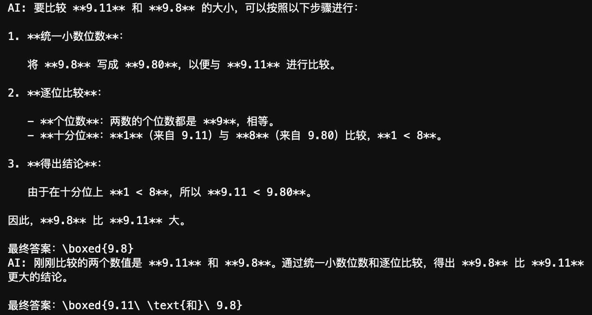
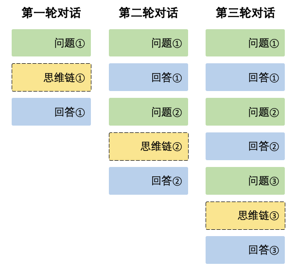

# DeepSeek API 多轮对话 - OpenAI SDK

> 以聊天模型（`DeepSeek-Chat`）为例进行单轮-多轮的演示（非流式输出），然后给出推理模型（`DeepSeek-Reasoner`）的多轮对话示例。
>
> **代码文件下载**：[Code](../Demos/deepseek-api-guide-4.ipynb)
>
> **在线链接**：[Kaggle](https://www.kaggle.com/code/aidemos/deepseek-api-guide-4) | [Colab](https://colab.research.google.com/drive/11REpPevN4bSL8yeJzQs7LAiV2cm9lUmh?usp=sharing)

## 认识多轮对话

> **“多次单轮对话就是多轮对话吗？”**

不完全是。这种说法成立的前提是模型或 API 拥有之前的“对话记忆”，而仅仅多次执行单轮对话示例，并不能实现这一点。原因在于 API 本身并不会自动维护对话上下文——每次调用都只基于当前传入的消息生成回复。因此，当我们重复执行单轮对话示例时，模型并没有“记忆”。如果希望模型能“记住”之前的对话内容，就需要手动将之前的对话（包括用户和模型的消息）传递给模型，这正是多轮对话的核心思想。

在开始之前，我们先回顾一下消息中 `role` 字段的定义：

- `system`：系统消息，用于设定整体的对话行为或背景。
- `user`：用户输入的消息。
- `assistant`：模型生成的回复。

`role` 字段标识了消息的发送者身份，帮助模型区分不同角色。

### DeepSeek-Chat

#### 单轮对话

回顾一下单轮对话的示例代码：

```python
from openai import OpenAI
import os

# 临时环境变量配置
os.environ["DEEPSEEK_API_KEY"] = "your-api-key"

client = OpenAI(
    api_key=os.getenv("DEEPSEEK_API_KEY"),
    base_url="https://api.deepseek.com",
)

# 单轮对话示例
completion = client.chat.completions.create(
    model="deepseek-chat",
    messages=[
        {'role': 'system', 'content': 'You are a helpful assistant.'}, 
        {'role': 'user', 'content': '你是谁？'}
    ]
)

# 打印模型消息
print(completion.choices[0].message.content)
```

在这个示例中，我们使用了四个参数：`api_key`、`base_url`、`model` 和 `messages`。其中前三个参数用于确定所使用的平台，`messages` 包含系统消息和当前用户输入的消息。

#### 两轮对话

单轮和多轮的一个重要区别在于是否维护对话历史，下面先以两轮对话为例：

```python
from openai import OpenAI
import os

# 临时环境变量配置
os.environ["DEEPSEEK_API_KEY"] = "your-api-key"

client = OpenAI(
    api_key=os.getenv("DEEPSEEK_API_KEY"),
    base_url="https://api.deepseek.com",
)

# 初始化对话历史，包含系统消息
messages = [{'role': 'system', 'content': 'You are a helpful assistant.'}]

# 第一轮对话
messages.append({'role': 'user', 'content': '9.11 和 9.8 哪个更大？'})
completion = client.chat.completions.create(
    model="deepseek-chat",
    messages=messages
)
content = completion.choices[0].message.content
print("AI:", content)

# 将第一轮模型回复加入历史记录
messages.append({'role': 'assistant', 'content': content})

# 第二轮对话
messages.append({'role': 'user', 'content': '刚刚针对哪两个数值进行了比较？'})
completion = client.chat.completions.create(
    model="deepseek-chat",
    messages=messages
)
content = completion.choices[0].message.content
print("AI:", content)
```

**输出**：



在这个例子中，我们对 `messages` 进行了三次 `append` 操作，其变化如下：

1. **初始状态**（仅包含系统消息）：

   ```python
   [
       {'role': 'system', 'content': 'You are a helpful assistant.'}
   ]
   ```

2. **第一轮对话前，添加当前用户消息**（第一次 `append`）：

   ```python
   [
       {'role': 'system', 'content': 'You are a helpful assistant.'},
       {'role': 'user', 'content': '9.11 和 9.8 哪个更大？'}
   ]
   ```

3. **第一轮对话后，将模型回复加入对话历史**（第二次 `append`）：

   ```python
   [
       {'role': 'system', 'content': 'You are a helpful assistant.'},
       {'role': 'user', 'content': '9.11 和 9.8 哪个更大？'},
       {'role': 'assistant', 'content': '...'}
   ]
   ```

    这样，在第二次调用 API 时，模型就能拥有第一轮对话的完整记录，从而能够基于“记忆”进行回复。

4. **第二轮对话前，添加当前用户消息**（第三次 `append`）：

   ```python
   [
       {'role': 'system', 'content': 'You are a helpful assistant.'},
       {'role': 'user', 'content': '9.11 和 9.8 哪个更大？'},
       {'role': 'assistant', 'content': '...'},
       {'role': 'user', 'content': '刚刚针对哪两个数值进行了比较？'}
   ]
   ```

抽象成表格或许更加直观：

| 步骤         | messages 结构                           | 说明             |
| ------------ | --------------------------------------- | ---------------- |
| 初始化       | `[system]`                              | 仅包含系统消息   |
| 第一轮对话前 | `[system, user_1]`                      | 添加用户消息     |
| 第一轮对话后 | `[system, user_1, assistant_1]`         | 添加模型回复     |
| 第二轮对话前 | `[system, user_1, assistant_1, user_2]` | 再次添加用户消息 |

#### 多轮对话

对于更多轮次的对话，只需反复执行以下两个步骤：

1. **记录用户输入**：在每轮对话开始时，将当前用户消息 `append` 到对话历史中。
2. **记录模型回复**：获取模型回复后，将其 `append` 到对话历史中。

下面使用 `while True` 模拟一个“无限轮”对话，输入 `exit` 或 `quit` 结束循环：

```python
from openai import OpenAI
import os

# 临时环境变量配置
os.environ["DEEPSEEK_API_KEY"] = "your-api-key"

client = OpenAI(
    api_key=os.getenv("DEEPSEEK_API_KEY"),
    base_url="https://api.deepseek.com",
)

# 初始化对话历史，包含系统消息
messages = [{'role': 'system', 'content': 'You are a helpful assistant.'}]

print("开始对话，输入 'exit' 或 'quit' 结束对话。")
while True:
    # 获取用户输入
    user_input = input("You：")
    if user_input.lower() in ['exit', 'quit']:  # 退出条件
        break
        
    # 记录用户输入
    messages.append({'role': 'user', 'content': user_input})
    
    # 调用 API 获取模型回复
    completion = client.chat.completions.create(
        model="deepseek-chat",
        messages=messages
    )
    content = completion.choices[0].message.content
    print("AI:", content)
    
    # 记录模型回复
    messages.append({'role': 'assistant', 'content': content})
```

当然，也可以通过 `for...` 循环来设置具体轮数。

> [!note]
>
> 轮数在一些 App（Cherry Studio & Chatbox）中又被称为“上下文数”，随着对话的推进，对话历史（上下文）会不断增长，这里需要注意两个限制：
>
> 1. **Token 计费问题**
>
>    用户的输入是计费的，以 DeepSeek 为例：聊天模型 2 元/百万 tokens，推理模型 4 元/百万 tokens。如果简单地无限制保留历史记录，随着对话轮次增加，token 消耗会迅速攀升。
>
> 2. **模型的最大上下文长度有限**
>
>    每个模型都有最大上下文长度的限制，`deepseek-chat` 和 `deepseek-reasoner` 最大支持 64K 上下文。
>
> 一个简单的方案是只保留最近 N 轮对话，伪代码：
>
> ```python
> N = 3
> ...
> # 保留系统消息和最近 N 轮对话
> max_length = 1 + 2 * N  # 1（系统消息） + 2*N（每轮包含用户和模型）
> if len(messages) > max_length:
>     messages = [messages[0]] + messages[-2*N:]
> ```
>

#### 封装对话逻辑

如果想让对话的逻辑更清晰，可以将其封装到一个类中。以下是一个简单的示例：

```python
from openai import OpenAI
import os

class ChatSession:
    def __init__(self, client, system_message="You are a helpful assistant."):
        """
        参数：
        - client (openai.OpenAI): OpenAI 客户端实例
        - system_message (str): 系统消息，用于设定对话背景
        """
        self.client = client
        self.messages = [{'role': 'system', 'content': system_message}]

    def append_message(self, role, content):
        """
        添加一条对话消息
        参数:
        - role (str): 消息角色，为 'user' 或 'assistant'。
        - content (str): 消息内容。
        """
        self.messages.append({'role': role, 'content': content})

    def get_response(self, user_input):
        """
        添加用户消息，调用 API 获取回复，并将回复加入历史记录
        参数：
        - user_input (str): 用户输入的消息
        返回：
        - content (str)：模型的回复内容
        """
        self.append_message('user', user_input)
        completion = self.client.chat.completions.create(
            model="deepseek-chat",
            messages=self.messages
        )
        content = completion.choices[0].message.content
        self.append_message('assistant', content)
        return content


# 临时环境变量配置
os.environ["DEEPSEEK_API_KEY"] = "your-api-key"

client = OpenAI(
    api_key=os.getenv("DEEPSEEK_API_KEY"),
    base_url="https://api.deepseek.com",
)

# 初始化对话会话，采用默认的系统消息
session = ChatSession(client)

print("开始对话，输入 'exit' 或 'quit' 结束对话。")
while True:
    user_input = input("You: ")
    if user_input.lower() in ['exit', 'quit']:
        break
    reply = session.get_response(user_input)
    print("AI:", reply)
```

### DeepSeek-Reasoner

修改代码中的 `model` 参数即可切换模型（以 DeepSeek 官方平台为例）：

```diff
- completion = client.chat.completions.create(
-     model="deepseek-chat", # 3

+ completion = client.chat.completions.create(
+     model="deepseek-reasoner", # 3
```

> 其他平台参考下表[^1]，对应 `reasoner_model_id` 列：
>
> |              | base_url                                            | chat_model_id                                                | reasoner_model_id                                            |
> | ------------ | --------------------------------------------------- | ------------------------------------------------------------ | ------------------------------------------------------------ |
> | DeepSeek     | "https://api.deepseek.com"                          | "deepseek-chat"                                              | "deepseek-reasoner"                                          |
> | 硅基流动     | "https://api.siliconflow.cn/v1"                     | "deepseek-ai/DeepSeek-V3"                                    | "deepseek-ai/DeepSeek-R1"                                    |
> | 阿里云百炼   | "https://dashscope.aliyuncs.com/compatible-mode/v1" | "deepseek-v3"                                                | "deepseek-r1"                                                |
> | 百度智能云   | "https://qianfan.baidubce.com/v2"                   | "deepseek-v3"                                                | "deepseek-r1"                                                |
> | 字节火山引擎 | https://ark.cn-beijing.volces.com/api/v3/           | 访问[推理点](https://console.volcengine.com/ark/region:ark+cn-beijing/endpoint?config=%7B%7D)获取 | 访问[推理点](https://console.volcengine.com/ark/region:ark+cn-beijing/endpoint?config=%7B%7D)获取 |
>
> [^1]: [DeepSeek API 的获取与对话示例](./Deepseek%20API%20的获取与对话示例.md).

推理模型需要先处理 `message.reasoning_content` 字段：

```python
# 获取推理思考过程（Reasoner特有字段）
reasoning_content = completion.choices[0].message.reasoning_content
# 获取模型回复内容（与之前相同）
content = completion.choices[0].message.content
```

`model` 参数和输出处理就是二者代码上的差异：

#### 单轮对话

```python
from openai import OpenAI
import os

# 临时环境变量配置
os.environ["DEEPSEEK_API_KEY"] = "your-api-key"

client = OpenAI(
    api_key=os.getenv("DEEPSEEK_API_KEY"),
    base_url="https://api.deepseek.com",
)

# 单轮对话示例
completion = client.chat.completions.create(
    model="deepseek-reasoner",
    messages=[
        {'role': 'system', 'content': 'You are a helpful assistant.'}, 
        {'role': 'user', 'content': '你是谁？'}
    ]
)

# 获取推理思考过程和模型回复
reasoning_content = completion.choices[0].message.reasoning_content
content = completion.choices[0].message.content

print(f"===== 模型推理过程 =====\n{reasoning_content}")
print(f"===== 模型回复 =====\n{content}")
```

#### 两轮对话

需要注意的是思维链（推理/思考过程）并不作为对话历史被拼接。

> 
>
> 如果在输入的 messages 序列中传入 `reasoning_content` 字段会报 400 错误[^2]。
>
> [^2]: [推理模型 (`deepseek-reasoner`) - DeepSeek API 文档](https://api-docs.deepseek.com/zh-cn/guides/reasoning_model)

**代码示例**

```python
from openai import OpenAI
import os

# 临时环境变量配置
os.environ["DEEPSEEK_API_KEY"] = "your-api-key"

client = OpenAI(
    api_key=os.getenv("DEEPSEEK_API_KEY"),
    base_url="https://api.deepseek.com",
)

# 初始化对话历史，包含系统消息
messages = [{'role': 'system', 'content': 'You are a helpful assistant.'}]

# 第一轮对话
messages.append({'role': 'user', 'content': '9.11 和 9.8 哪个更大？'})
completion = client.chat.completions.create(
    model="deepseek-reasoner",
    messages=messages
)
# 获取推理思考过程和模型回复
reasoning_content = completion.choices[0].message.reasoning_content
content = completion.choices[0].message.content

print(f"===== 第一轮推理过程 =====\n{reasoning_content}\n")
print(f"===== 模型回复 =====\nAI: {content}\n")

# 只将最终的回复（content）加入对话历史
messages.append({'role': 'assistant', 'content': content})

# 第二轮对话
messages.append({'role': 'user', 'content': '刚刚针对哪两个数值进行了比较？'})
completion = client.chat.completions.create(
    model="deepseek-reasoner",
    messages=messages
)
# 获取推理思考过程和模型回复
reasoning_content = completion.choices[0].message.reasoning_content
content = completion.choices[0].message.content

print(f"===== 第二轮推理过程 =====\n{reasoning_content}\n")
print(f"===== 模型回复 =====\nAI: {content}\n")
```

实际上相对于聊天模型的处理没有任何区别，只是多了一个打印的步骤，因为不需要维护思维链的历史。

> [!tip]
>
> 通过 `reasoning_content` 可以实现非常有意思的“嫁接”操作，即用 R1 的思维链引导其他模型输出，感兴趣可以尝试：[DeepClaude](https://deepclaude.com/chat)（需要 Claude 的 API）。

#### 多轮对话

类似地，我们也可以对 `deepseek-reasoner` 做多轮循环，只需在每轮里：

1. 先 `append` 用户输入。
2. 调用 API 并获取 `reasoning_content` 与 `content`。
3. （可选）打印或保存 `reasoning_content`，但**不**在下一轮对话传回给模型。
4. **只**把模型回复 `append` 到 `messages`。

```python
from openai import OpenAI
import os

# 临时环境变量配置
os.environ["DEEPSEEK_API_KEY"] = "your-api-key"

client = OpenAI(
    api_key=os.getenv("DEEPSEEK_API_KEY"),
    base_url="https://api.deepseek.com",
)

# 初始化对话历史，包含系统消息
messages = [{'role': 'system', 'content': 'You are a helpful assistant.'}]

print("开始对话（Reasoner），输入 'exit' 或 'quit' 结束对话。")
while True:
    user_input = input("You：")
    if user_input.lower() in ['exit', 'quit']:
        break

    # 1. 记录用户输入
    messages.append({'role': 'user', 'content': user_input})

    # 2. 调用 API
    completion = client.chat.completions.create(
        model="deepseek-reasoner",
        messages=messages
    )
    reasoning_content = completion.choices[0].message.reasoning_content
    content = completion.choices[0].message.content

    # 3. 输出推理思考过程与最终回复
    print(f"===== 推理过程 =====\n{reasoning_content}\n")
    print(f"===== 模型回复 =====\nAI: {content}\n")

    # 4. 只将模型的最终回复写入到历史消息中
    messages.append({'role': 'assistant', 'content': content})
```

#### 封装对话逻辑

```python
from openai import OpenAI
import os

class ReasonerSession:
    def __init__(self, client, system_message="You are a helpful assistant."):
        """
        参数：
        - client (openai.OpenAI): OpenAI 客户端实例
        - system_message (str): 系统消息，用于设定对话背景
        """
        self.client = client
        self.messages = [{'role': 'system', 'content': system_message}]

    def append_message(self, role, content):
        """
        添加一条对话消息
        参数:
        - role (str): 消息角色，为 'user' 或 'assistant'。
        - content (str): 消息内容。
        """
        self.messages.append({'role': role, 'content': content})

    def get_response(self, user_input):
        """
        添加用户消息，调用 API 获取思维链和回复，并将回复加入历史记录
        参数：
        - user_input (str): 用户输入的消息
        返回：
        - (reasoning_content, content) (tuple)：模型的推理过程和回复
        """
        # 1. 记录用户输入
        self.append_message('user', user_input)

        # 2. 调用 API
        completion = self.client.chat.completions.create(
            model="deepseek-reasoner",
            messages=self.messages
        )

        # 3. 获取推理思考过程和最终回复
        reasoning_content = completion.choices[0].message.reasoning_content
        content = completion.choices[0].message.content

        # 4. 只将模型的最终回复加入到历史消息
        self.append_message('assistant', content)

        return reasoning_content, content


# 临时环境变量配置
os.environ["DEEPSEEK_API_KEY"] = "your-api-key"

client = OpenAI(
    api_key=os.getenv("DEEPSEEK_API_KEY"),
    base_url="https://api.deepseek.com",
)

# 初始化推理会话，采用默认的系统消息
session = ReasonerSession(client)

print("开始对话（Reasoner），输入 'exit' 或 'quit' 结束对话。")
while True:
    user_input = input("You：")
    if user_input.lower() in ['exit', 'quit']:  # 退出条件
        break

    reasoning, reply = session.get_response(user_input)
    print(f"===== 推理过程 =====\n{reasoning}\n")
    print(f"===== 模型回复 =====\nAI: {reply}\n")
```

## 📝 作业

1. 等待输出总是煎熬的，特别是推理模型，怎么修改 `ReasonerSession` 类使其正确处理流式输出（`stream=True`）？

   > **提示**：回顾文章《[DeepSeek API 流式输出解析 - OpenAI SDK](./Guide/DeepSeek%20API%20流式输出解析%20-%20OpenAI%20SDK.md)》
