# DeepSeek 联网满血版使用指南

> **本文将基于 Chatbox 进行配置，绕开 DeepSeek 网页对话的卡顿**。
>
> 需要特别说明的是，本文不涉及本地显卡部署方案，因为本地部署完整版 DeepSeek 对于个人使用者来说是一个伪需求，671B 的模型即便是 1-Bit 量化加载也需要约 84GB 的显存（模型参数量×量化位数/8），按显卡租赁的费用来算，每小时大概需要 8 块钱，而 1-Bit 量化模型基本不可用，满血版 DeepSeek（BF16）仅加载就需要 1342GB 显存，这意味着更高的租赁费用，对于个人来说投入和回报完全不成正比，所以使用 API 将是性价比最高的方案（各平台注册时都会赠送大量的 tokens：阿里 1000 万，百度 2000 万，硅基流动 2000 万）。
>
> **注意**：当前说法不适用于需要数据隔离的场景（比如金融/医疗），仅针对日常需求。

## ▌目录

- [为什么有网页版还要配置 API？](#为什么有网页版还要配置-api)
- [配置指南（附多平台参数对照）](#配置指南附多平台参数对照)
   - [DeepSeek](#deepseek)
   - [添加自定义提供方](#添加自定义提供方)
      - [多平台参数对照表](#多平台参数对照表)
- [QA](#qa)
   - [Q1：自定义提供方如何增加模型？](#q1自定义提供方如何增加模型)
   - [Q2：如何切换平台？](#q2如何切换平台)
   - [Q3：如何导出或者分享聊天记录？](#q3如何导出或者分享聊天记录)
   - [Q4：温度（Temperature）应该怎么设置？](#q4温度temperature应该怎么设置)

## ▌为什么有网页版还要配置 API？

主要原因有五点：

1. 网页版（深度思考 - R1）由于访问过多经常服务器繁忙导致对话卡顿。
2. 使用 Chatbox 可以在多个平台间进行无缝切换（聊天记录会“同步”），这意味着当前服务瘫痪时可以直接更换平台，从而减少等待时间。
3. 注册平台所赠送的 tokens 足以覆盖个人长期使用需求。
4. 可以自定义参数温度值（Temperature）和系统消息（System message），拥有更多的定制空间。
5. 本地存储完整对话历史。

## ▌配置指南（附多平台参数对照）

根据系统下载对应版本的 APP[^1]：

- **电脑**
  - [Windows](https://chatboxai.app/?c=download-windows)
  - MacOS
    - [Intel 芯片](https://chatboxai.app/?c=download-mac-intel)
    - [M1/M2](https://chatboxai.app/?c=download-mac-aarch)
  - [Linux](https://chatboxai.app/?c=download-linux)
- **手机**
  - [苹果 / IOS](https://apps.apple.com/app/chatbox-ai/id6471368056)
  - [安卓/ Android](https://chatboxai.app/install?download=android_apk)

[^1]: [https://github.com/Bin-Huang/chatbox](https://github.com/Bin-Huang/chatbox).

下面以电脑端进行演示，打开 Chatbox，点击 `使用自己的 API Key 或本地模型`：

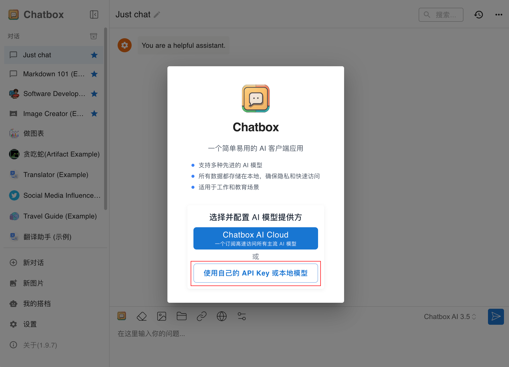

### DeepSeek

如果已经获取了 DeepSeek 的 API（[获取步骤](./Deepseek%20API%20的获取与对话示例.md#-deepseek-官方)），则从打开的界面中选择 `DeepSeeK API`，直接填充 API 密钥，然后点击 `保存`：

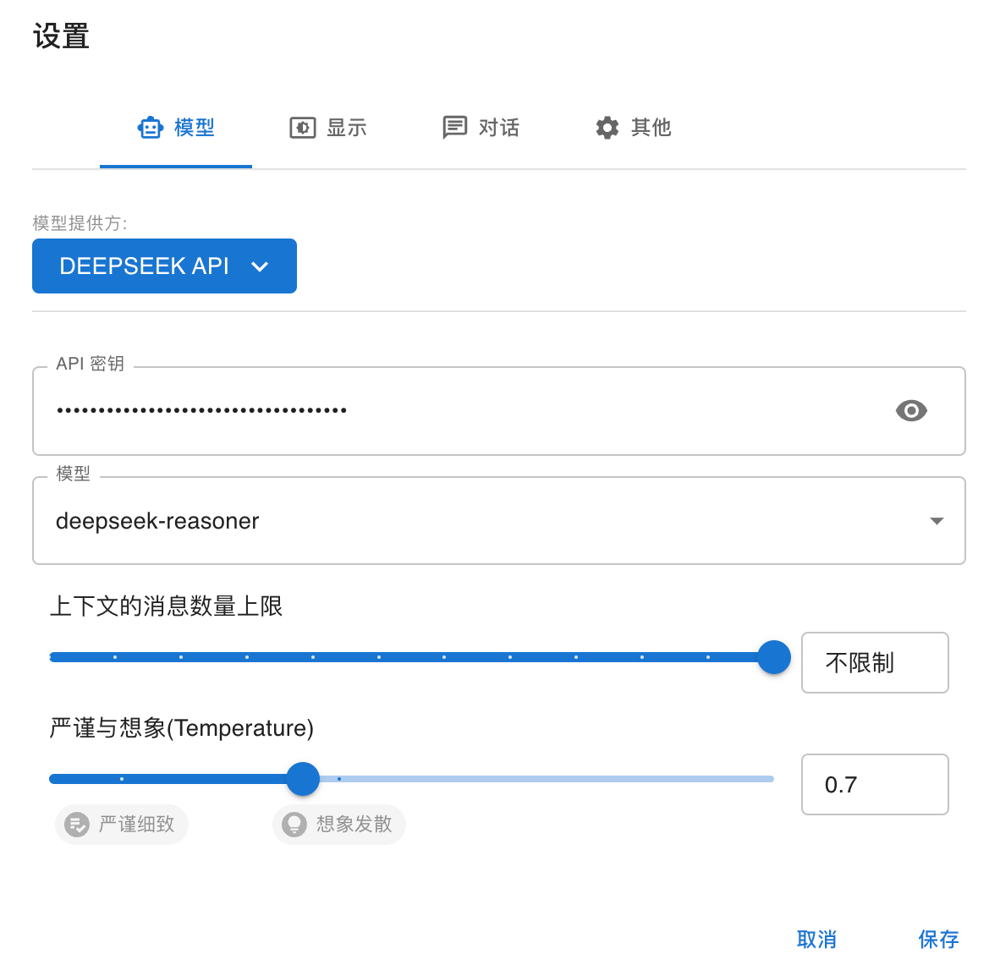

至此已经可以和 DeepSeek-R1 进行对话。

### 添加自定义提供方

通过以下任一入口添加（点击 `添加自定义提供方`）：

| 首次使用时界面                                          | 已有配置时入口                                          |
| ------------------------------------------------------- | ------------------------------------------------------- |
| 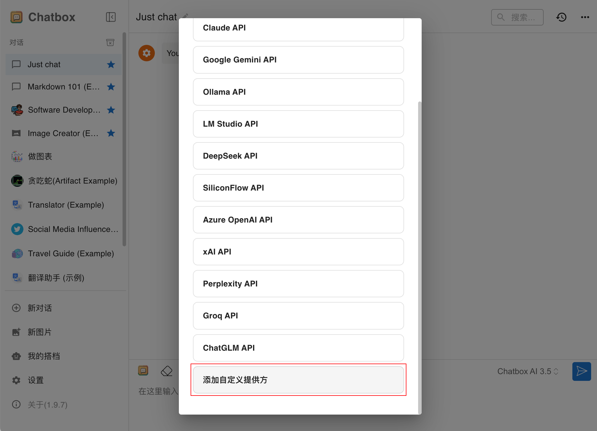 | 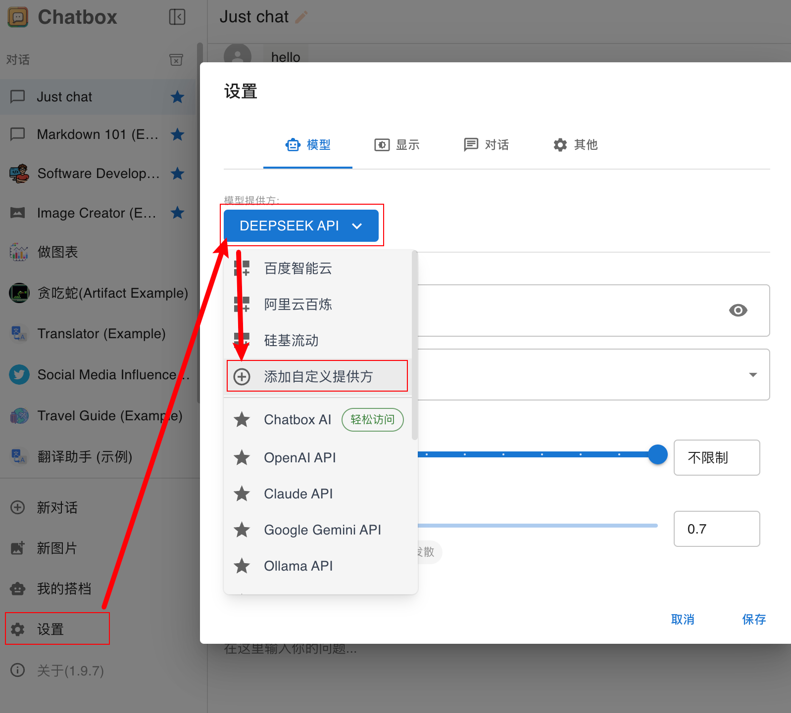 |

#### 多平台参数对照表

参照下表填写对应平台信息，完成后点击保存，最终呈现如右图：

|            | 获取步骤                                                    | API 域名                                          | 模型 - 聊天             | 模型 - 推理             | 设置 - 推理                                              |
| ---------- | ----------------------------------------------------------- | ------------------------------------------------- | ----------------------- | ----------------------- | -------------------------------------------------------- |
| 硅基流动   | [图文](./Deepseek%20API%20的获取与对话示例.md#-硅基流动-)   | https://api.siliconflow.cn/v1                     | deepseek-ai/DeepSeek-V3 | deepseek-ai/DeepSeek-R1 | 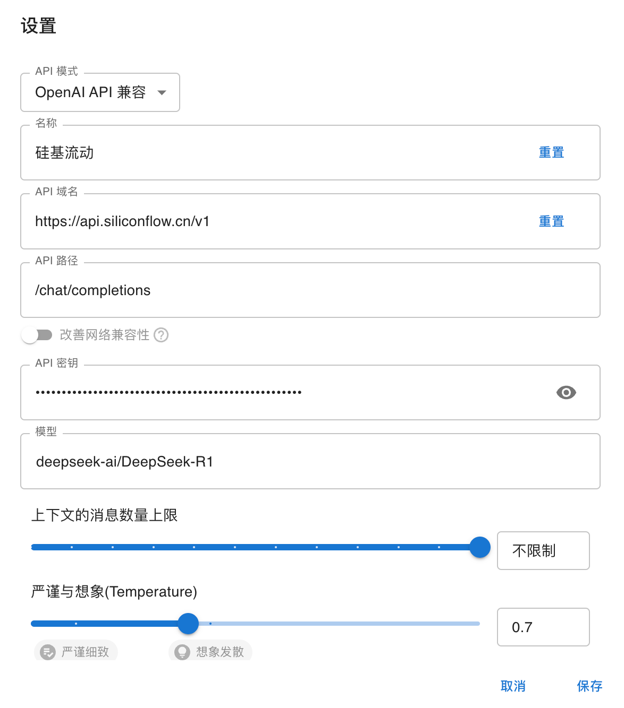 |
| 阿里云百炼 | [图文](./Deepseek%20API%20的获取与对话示例.md#-阿里云百炼-) | https://dashscope.aliyuncs.com/compatible-mode/v1 | deepseek-v3             | deepseek-r1             | 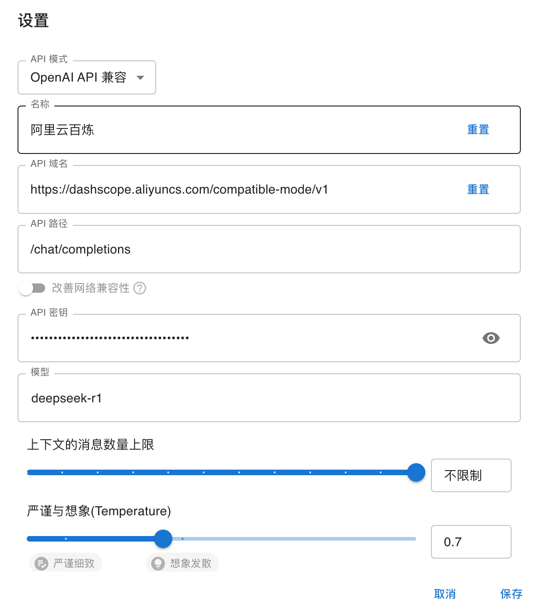   |
| 百度智能云 | [图文](./Deepseek%20API%20的获取与对话示例.md#-百度智能云-) | https://qianfan.baidubce.com/v2                   | deepseek-v3             | deepseek-r1             | 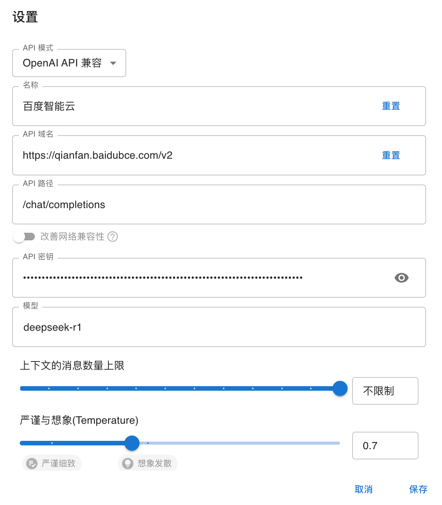     |

## ▌QA

### Q1：自定义提供方如何增加模型？

以 `硅基流动` 为例，在 `设置` 的模型中输入新的模型名称，然后点击 `+` 号并保存。

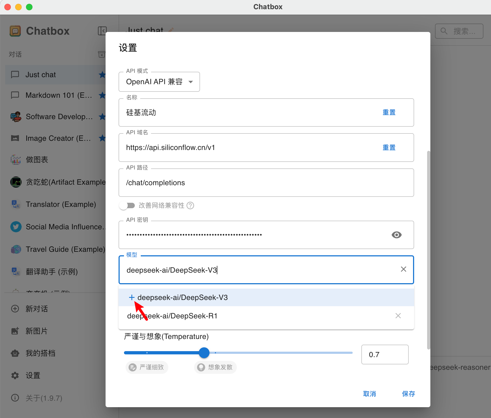

接下来可以在界面的右下角切换模型：
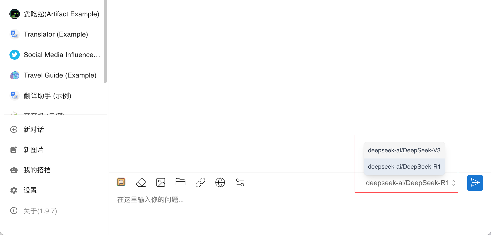

> [!note]
>
> 不同平台对于模型的标识可能不同。

### Q2：如何切换平台？

点击 `设置`，从下拉选项中选择需要切换的平台，然后**点击** `保存`。

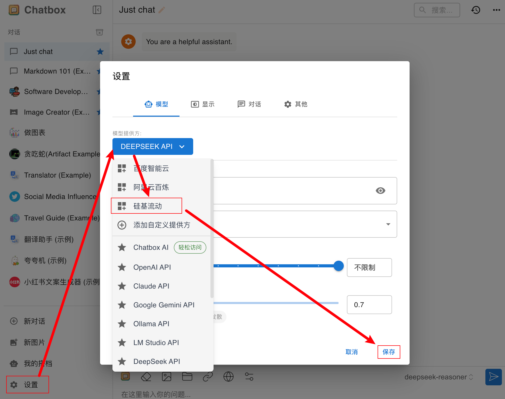

### Q3：如何导出或者分享聊天记录？

`设置` -> `其他` -> `数据备份` -> 勾选需要导出的内容 -> `导出勾选数据`：

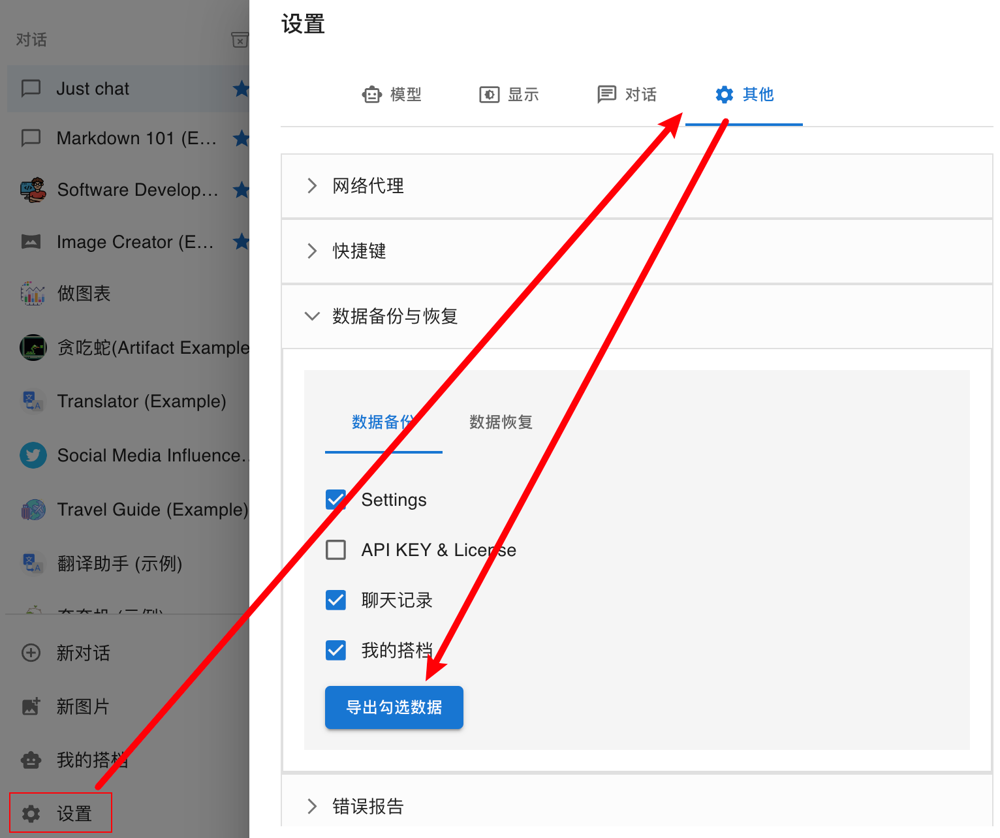

#### Q4：温度（Temperature）应该怎么设置？

默认情况为 1.0，实际使用可以遵循 [DeepSeek 官方文档](https://api-docs.deepseek.com/zh-cn/quick_start/parameter_settings)的建议，按使用场景设置：

| 场景                | 温度 |
| ------------------- | ---- |
| 代码生成/数学解题   | 0.0  |
| 数据抽取/分析       | 1.0  |
| 通用对话            | 1.3  |
| 翻译                | 1.3  |
| 创意类写作/诗歌创作 | 1.5  |
