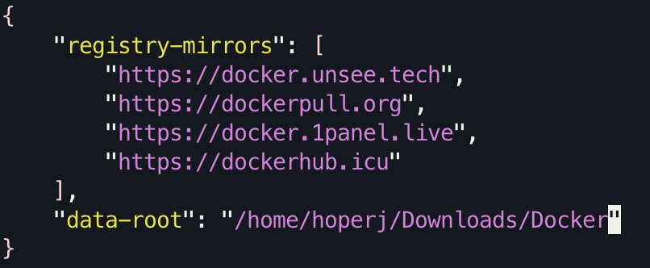

# Docker 基础命令介绍和常见报错解决

> 快速了解项目运行过程中可能用到的命令，如果运行时报错，查看文末的[常见报错](#解决常见报错)。
>
> 命令以适用于深度学习的 [dl 镜像](https://hub.docker.com/repository/docker/hoperj/quickstart/general)为例进行演示。
>
> Docker 安装见《[使用 Docker 快速配置深度学习环境（Linux）](../Guide/使用%20Docker%20快速配置深度学习环境（Linux）.md)》

## 目录

- [镜像管理](#镜像管理)
  - [查看本地镜像](#查看本地镜像)
  - [拉取镜像](#拉取镜像)
  - [删除镜像](#删除镜像)
- [创建容器](#创建容器)
  - [挂载](#挂载)
  - [在容器中启动 Jupyter Lab](#在容器中启动-jupyter-lab)
- [停止容器](#停止容器)
  - [在容器终端内](#在容器终端内)
  - [从主机停止容器](#从主机停止容器)
- [重新连接到已存在的容器](#重新连接到已存在的容器)
  - [查看所有容器](#查看所有容器)
  - [启动已停止的容器](#启动已停止的容器)
  - [重新连接到运行中的容器](#重新连接到运行中的容器)
- [命名容器](#命名容器)
  - [使用 --name 参数](#使用---name-参数)
  - [使用容器名称的命令示例](#使用容器名称的命令示例)
- [复制文件](#复制文件)
  - [从主机复制文件到容器](#从主机复制文件到容器)
  - [从容器复制文件到主机](#从容器复制文件到主机)
- [删除容器](#删除容器)
  - [删除指定的容器](#删除指定的容器)
  - [删除所有未使用的容器](#删除所有未使用的容器)

 - [解决常见报错](#解决常见报错)
   - [报错 1：权限被拒绝（Permission Denied）](#报错-1权限被拒绝permission-denied)
     - [方法 1：使用 sudo](#方法-1使用-sudo)
     - [方法 2：将用户添加到 docker 用户组](#方法-2将用户添加到-docker-用户组)
   - [报错 2：无法连接到 Docker 仓库（Timeout Exceeded）](#报错-2无法连接到-docker-仓库timeout-exceeded)
     - [方法一：配置镜像](#方法一配置镜像)
     - [方法二：设置 HTTP/HTTPS 代理](#方法二设置-httphttps-代理)
   - [报错 3: 磁盘空间不足（No Space Left on Device）](#报错-3-磁盘空间不足no-space-left-on-device)
     - [更改 Docker 的数据目录](#更改-docker-的数据目录)
 - [参考链接](#参考链接)

## 镜像管理

> **写在前面**
>
> ### 无需每次使用 `sudo` 的设置方法
>
> 默认情况下，非 root 用户执行 Docker 命令需要在前面加上 `sudo`。如果不想这样，可以将当前用户添加到 `docker` 用户组中：
>
> ```bash
> sudo groupadd docker  # 如果提示 group 已存在，可忽略
> sudo usermod -aG docker $USER
> newgrp docker
> ```

### 查看本地镜像

```bash
docker images
```

列出本地所有的 Docker 镜像，包括仓库名、标签、镜像 ID、创建时间和大小。


### 拉取镜像

```bash
docker pull <image_name>:<tag>
```

例如：

```bash
docker pull hoperj/quickstart:dl-torch2.5.1-cuda11.8-cudnn9-devel
```

> [!note]
>
> `docker pull` 可以从远程仓库更新镜像，如果镜像已存在，则只会拉取更新部分（层），不严谨地类比为 `git pull` 进行理解。

### 删除镜像

```bash
docker rmi <image_id_or_name>
```

在删除镜像前，请确保没有容器正在使用它。

## 创建容器

### 基础用法

```bash
docker run --gpus all -it [--rm] <image_name>:<tag>
```

- `--gpus all`：允许容器使用主机的所有 GPU 资源（如有）。
- `-it`：交互式终端。这是两个参数的组合，`-i` 表示“交互式”（interactive），`-t` 表示为容器分配一个伪终端（pseudo-TTY）。
- `--rm`：在容器退出后自动删除容器，避免试验产生无用容器。

以当前使用的深度学习镜像为例：

```bash
docker run --gpus all -it hoperj/quickstart:dl-torch2.5.1-cuda11.8-cudnn9-devel
```

> [!tip]
>
> 使用 `docker run --help` 可以查看更多参数的用法。
>

### 挂载

如果需要在容器内访问主机的文件，可以使用 `-v` 参数。

1. **挂载卷（Volume）**

   ```bash
   docker run --gpus all -it -v my_volume:/container/path hoperj/quickstart:dl-torch2.5.1-cuda11.8-cudnn9-devel
   ```

   - `my_volume`：Docker 卷的名称。
   - `/container/path`：容器中的路径。

   挂载卷可让数据在容器删除后仍保留。

2. **挂载主机目录到容器中**

   使用绝对路径挂载主机目录到容器中：

   ```bash
   docker run --gpus all -it -v /host/path:/container/path hoperj/quickstart:dl-torch2.5.1-cuda11.8-cudnn9-devel
   ```

   - `/host/path`：主机上的路径。
   - `/container/path`：容器中的路径。

#### 用例

以当前项目为例，假设已经在主机的 `~/Downloads` 文件夹克隆了项目并做了一些修改，那么所需要同步的目录为 `~/Downloads/AI-Guide-and-Demos-zh_CN`，想同步到容器的同名文件夹中，对应命令：

```bash
docker run --gpus all -it -v ~/Downloads/AI-Guide-and-Demos-zh_CN:/workspace/AI-Guide-and-Demos-zh_CN hoperj/quickstart:dl-torch2.5.1-cuda11.8-cudnn9-devel
```

容器中的 `/workspace/AI-Guide-and-Demos-zh_CN` 会与主机上的 `~/Downloads/AI-Guide-and-Demos-zh_CN` 目录同步，所有更改都会反映到主机的目录中。

### 在容器中启动 Jupyter Lab

如果需要在容器内启动 Jupyter Lab，并通过主机的浏览器进行访问，可以使用 `-p` 参数映射端口。Jupyter Lab 默认使用 8888 端口，使用以下命令：

```bash
docker run --gpus all -it -p 8888:8888 -v ~/Downloads/AI-Guide-and-Demos-zh_CN:/workspace/AI-Guide-and-Demos-zh_CN hoperj/quickstart:dl-torch2.5.1-cuda11.8-cudnn9-devel
```

- `-p 8888:8888` 将容器内的 8888 端口映射到主机的 8888 端口。

然后在容器内运行：

```bash
jupyter lab --ip=0.0.0.0 --port=8888 --no-browser --allow-root
```

现在可以在主机浏览器中访问 `http://localhost:8888`。

如果需要映射多个端口，比如 7860，那么命令对应如下：

```bash
docker run --gpus all -it --name ai -p 8888:8888 -p 7860:7860 ...（后续一致）
```

- `7860` 端口在这里对应于 Gradio。

你可以根据实际情况重新指定端口号。

## 停止容器

### 在容器终端内停止

- 使用 `Ctrl+D` 或输入 `exit`：退出并**停止**容器（适用于通过 `docker run` 启动的情况）。
- 使用 `Ctrl+P` 然后 `Ctrl+Q`：仅退出容器的终端（detach），让容器继续在后台运行。

> [!note]
>
> 以上的“停止”行为适用于通过 `docker run` 启动的容器。如果容器是通过 `docker start` 启动的，`Ctrl+D` 或 `exit` 只会退出终端，而不会停止容器。通过 `docker ps` 可以察觉到这一点。

### 从主机停止

如果你想从主机停止正在运行的容器，可以使用：

```bash
docker stop <container_id_or_name>
```

替换 `<container_id_or_name>` 为容器的 ID 或名称。

## 重新连接到已存在的容器

在使用一段时间后，你可能会发现每次使用 `docker run` 去“运行”容器时，之前所做的改变都没有“保存”。

**这是因为每次运行 `docker run` 创建了新的容器。**

要找回在容器中的更改，需要重新连接到之前创建的容器，参考以下步骤：

1. **查看正在运行的容器**：

   ```bash
   docker ps
   ```

   如果容器已停止，可**查看所有容器**：

   ```bash
   docker ps -a
   ```

2. **启动已停止的容器**：

   ```bash
   docker start <container_id_or_name>
   ```

3. **连接到正在运行的容器**：

   ```bash
   docker exec -it <container_id_or_name> /bin/bash
   ```

   或者使用

   ```bash
   docker attach <container_id_or_name>
   ```

   区别在于 `exec` 启动一个新进程的终端，`attach` 附着到容器主进程终端（`PID 1`）。

> [!note]
>
> 在之前的命令中，我们使用了 `/bin/zsh`，这是因为该容器中已安装了 zsh。而在大多数容器中，默认的行为通常是 `/bin/bash` 或 `/bin/sh`。

## 命名容器

有没有什么方法可以指定名称呢？每次通过 `docker ps -a` 复制 `id` 太不优雅了。

### 使用 `--name` 参数

在创建容器时，可以使用 `--name` 参数为容器指定一个名称。例如：

```bash
docker run --gpus all -it --name ai hoperj/quickstart:dl-torch2.5.1-cuda11.8-cudnn9-devel
```

容器被命名为 `ai`，以后可通过该名称管理容器，不需要记住容器的 ID。

运行 `docker ps -a`：


### 使用容器名称的命令示例

- **启动容器：**

  ```bash
  docker start ai
  ```

- **停止容器：**

  ```bash
  docker stop ai
  ```

- **重新连接到容器：**

  ```bash
  docker exec -it ai /bin/zsh
  ```

## 复制文件

### 从主机复制文件到容器

```bash
docker cp /host/path <container_id_or_name>:/container/path
```

### 从容器复制文件到主机

```bash
docker cp <container_id_or_name>:/container/path /host/path
```

## 删除容器

### 删除指定容器

如果想删除一个容器，可以使用 `docker rm` 命令：

```bash
docker rm <container_id_or_name>
```

删除前需先 `stop` 容器。

### 删除所有已退出的容器

```bash
docker container prune
```

这将删除所有已停止的容器（请谨慎使用，因为删除后无法恢复，适用于刚安装 Docker “不小心”创建了一堆容器的情况）。

## 查看和调试容器状态

### 查看容器日志

```bash
docker logs <container_id_or_name>
```

可加 `-f` 参数实时跟随日志输出。

### 查看容器详细信息

```bash
docker inspect <container_id_or_name>
```

输出容器的 JSON 配置信息（环境变量、卷挂载、网络信息等）。

### 查看容器资源使用情况

```bash
docker stats
```

显示所有容器的 CPU、内存、网络和存储 I/O 实时数据。


## 解决常见报错

> 介绍在新环境中使用 Docker 时，可能会遇到的报错。
>
> **推荐阅读，特别是报错 2**。

### 报错 1：权限被拒绝（Permission Denied）

当运行命令：

```python
docker ps
```

可能会遇到以下报错：

> permission denied while trying to connect to the Docker daemon socket at unix:///var/run/docker.sock: Get "http://%2Fvar%2Frun%2Fdocker.sock/v1.45/containers/json": dial unix /var/run/docker.sock: connect: permission denied

**解决方法**：

#### 方法 1：使用 `sudo`

在 Docker 命令前加上 `sudo`：

```bash
sudo docker ps
```

#### 方法 2：将用户添加到 `docker` 用户组

1. **创建 `docker` 用户组**

   ```bash
   sudo groupadd docker
   ```

2. **将当前用户添加到 `docker` 组**

   ```bash
   sudo usermod -aG docker $USER
   ```

3. **重新加载用户组设置**

   ```bash
   newgrp docker
   ```

4. **验证**

   运行 Docker 命令，如果不提示权限错误（permission denied），说明配置成功。

   ```bash
   docker ps	
   ```

### 报错 2：无法连接到 Docker 仓库（Timeout Exceeded）

> Error response from daemon: Get "https://registry-1.docker.io/v2/": net/http: request canceled while waiting for connection (Client.Timeout exceeded while awaiting headers)

**原因：** 由于国内网络限制，无法直接连接到 Docker Hub。

**解决方法**：

#### 方法一：配置镜像

> 镜像参考：[目前国内可用Docker镜像源汇总（截至2024年11月）](https://www.coderjia.cn/archives/dba3f94c-a021-468a-8ac6-e840f85867ea)

**临时使用**：

直接在原 `<image_name>:<tag>` 前增加网址，比如：

```bash
docker pull dockerpull.org/<image_name>:<tag>
```

快速测试可用性：

```bash
docker pull dockerpull.org/hello-world
```

**永久使用**：

运行以下命令配置文件，如果有一天突然拉（pull）不动了，说明链接挂了需要更新。

```bash
# 创建目录
sudo mkdir -p /etc/docker

# 写入配置文件
sudo tee /etc/docker/daemon.json > /dev/null <<-'EOF'
{
    "registry-mirrors": [
        "https://docker.unsee.tech",
        "https://dockerpull.org",
        "https://docker.1panel.live",
        "https://dockerhub.icu"
    ]
}
EOF

# 重启 Docker 服务
sudo systemctl daemon-reload
sudo systemctl restart docker
```

#### 方法二：设置 HTTP/HTTPS 代理

> 这一项提供给🪜科学上网的同学进行配置。对于本项目来说，**所有文件都会提供网盘链接**和对应的国内镜像命令。

1. **创建并编辑 Docker 的系统服务配置文件**

   ```bash
   sudo mkdir -p /etc/systemd/system/docker.service.d
   sudo vim /etc/systemd/system/docker.service.d/http-proxy.conf
   ```

2. **添加代理配置**

   在 `http-proxy.conf` 文件中添加以下内容（将 `http://localhost:7890/` 替换为你自己的代理地址）：

   ```ini
   [Service]
   Environment="HTTP_PROXY=http://localhost:7890/"
   Environment="HTTPS_PROXY=http://localhost:7890/"
   ```

   使用 `ESC` + `:wq` 回车保存配置。

   > 如果不熟悉 `vim` 的操作，也可以使用直接运行（将 `http://localhost:7890/` 替换为你自己的代理地址）：
   >
   > ```bash
   > sudo tee /etc/systemd/system/docker.service.d/http-proxy.conf > /dev/null <<EOF
   > [Service]
   > Environment="HTTP_PROXY=http://localhost:7890/"
   > Environment="HTTPS_PROXY=http://localhost:7890/"
   > EOF
   > ```

3. **重新加载配置并重启 Docker 服务**

   ```bash
   sudo systemctl daemon-reload
   sudo systemctl restart docker
   ```

### 报错 3：磁盘空间不足（No Space Left on Device）

> write /var/lib/docker/tmp/...: no space left on device

**原因：** Docker 默认使用 `/var/lib/docker` 作为数据存储目录，如果该分区空间不足，就会出现此错误。

**解决方法：**

#### 更改 Docker 的数据目录

1. **查看当前的磁盘空间**

   检查 `/var/lib/docker` 所在分区的剩余空间：

   ```bash
   sudo df -h /var/lib/docker
   ```

   

   2.3G 显然不够。

2. **选择具有足够空间的目录**

   假设将 Docker 的数据目录移动到 `~/Downloads` 下，先看看剩余空间：

    

   显示还有 53G，绰绰有余，接着创建文件夹：

   ```bash
   mkdir -p ~/Downloads/Docker && cd ~/Downloads/Docker && pwd
   ```

   

   复制输出。

3. **修改 Docker 的配置文件**

   编辑 `/etc/docker/daemon.json` 文件（如果不存在会自动创建）：

   ```bash
   sudo vim /etc/docker/daemon.json
   ```

   添加或修改以下内容（将 `Path/to/Docker` 替换为你的新数据目录的绝对路径，也就是刚刚复制的输出）：

   ```json
   { 
      "data-root": "Path/to/Docker"
   }
   ```

   `ESC` + `:wq`保存并退出。

   

4. **重启 Docker 服务并验证**

   ```bash
   sudo systemctl restart docker
   docker info -f '{{ .DockerRootDir}}'
   ```

   **输出**：

## 参考链接

[How to Fix Docker’s No Space Left on Device Error](https://www.baeldung.com/linux/docker-fix-no-space-error)