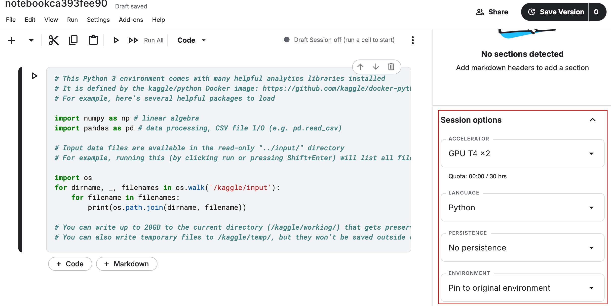

# 一些问题的解决方法

> 这里会解决一些项目运行过程中可能遇到的问题。

## 目录

- [如何拉取远程仓库覆盖本地的一切修改？](#如何拉取远程仓库覆盖本地的一切修改)
- [Hugging Face 相关](#hugging-face-相关)
  - [怎么查看 Hugging Face 下载的文件？](#怎么查看-hugging-face-下载的文件)
  - [怎么修改 Hugging Face 文件的保存路径？](#怎么修改-hugging-face-文件的保存路径)
     - [方法一：手动编辑配置文件](#方法一手动编辑配置文件)
     - [方法二：使用 echo 命令自动添加配置](#方法二使用-echo-命令自动添加配置)
     - [将 HF_HOME 添加到 .bashrc 并避免重复](#将-hf_home-添加到-bashrc-并避免重复)
  - [参考链接](#参考链接)

---

## 如何拉取远程仓库覆盖本地的一切修改？

> 这一操作将丢弃本地对于仓库代码文件的修改。

```bash
git fetch origin
git reset --hard origin/master
```

**解释**：

- `git fetch origin`：从远程仓库获取最新的提交记录，但不合并到本地分支。
- `git reset --hard origin/master`：将当前分支指向 `origin/master`，并强制将工作目录和暂存区匹配到这个提交。

**注意**：执行 `git reset --hard` 会丢失所有未提交的本地更改，请确保这些更改不再需要，或者已经备份。

## Hugging Face 相关

### 怎么查看 Hugging Face 下载的文件？

> 你一定会在未来的某个时刻有这个需求，因为实在是太占空间了，如果你热衷于试验不同的模型，或许一个星期之后你就会发现自己的磁盘开始报警。

Hugging Face 通常会将下载的模型或数据保存在目录 `~/.cache/huggingface/` 中。如果你想删除不需要的模型，先切换文件夹：

```bash
cd ~/.cache/huggingface
```

查看文件夹构成。

```bash
ls -lh
```

- **datasets**：

  - 存储通过 Hugging Face 的 `datasets` 库下载和使用的数据集。

  - 当你使用 `datasets.load_dataset()` 函数加载数据集时，数据集会被下载并缓存到此文件夹。
- **hub**：

  - 存储 Hugging Face Hub 上的仓库内容。

  - 当你使用 `from_pretrained()` 函数下载预训练模型时，模型会被保存到这个文件夹中。


切换到`hub`文件夹，查看文件大小。

```bash
cd hub
du -h --max-depth=1 . | sort -h
```

**解释**：

- `du -h`：以人类可读的格式显示磁盘使用情况。
- `--max-depth=1`：仅显示当前目录和直接子目录的总大小，不递归更深层次的目录。
- `.`：表示当前目录。
- `sort -h`：按照人类可读的格式进行升序（如 `5K`、`20M`、`1G` 等单位会正确排序），最大的文件位于最下面。

输出示例：
```bash
...
340M	./models--distilgpt2
389M	./models--DaydreamerF--chinese-macbert-base-finetuned-accelerate
393M	./models--google-bert--bert-base-chinese
526M	./models--gpt2
564M	./models--MediaTek-Research--Breeze-7B-Instruct-v0_1
581M	./models--openai--clip-vit-base-patch32
685M	./models--google-bert--bert-base-multilingual-cased
954M	./models--Qwen--Qwen2-0.5B-Instruct
2.0G	./models--stablediffusionapi--cyberrealistic-41
2.9G	./models--openai--whisper-medium
3.1G	./models--gpt2-large
13G	.
```

假设你需要删除 `gpt2-large`，使用以下命令：

```bash
rm -rf ./models--gpt2-large
```

### 怎么修改 Hugging Face 文件的保存路径？

如果你希望更改 Hugging Face 缓存文件的保存路径，可以通过设置环境变量 `HF_HOME` 来实现。你可以手动编辑配置文件，或使用 `echo` 命令自动添加配置。以下是两种方法的详细说明：

#### 方法一：手动编辑配置文件

1. **打开你的 shell 配置文件**（如 `.bashrc` 或 `.zshrc`）：

   ```bash
   vim ~/.bashrc
   # 或
   vim ~/.zshrc
   ```

2. **添加以下行**：

   ```bash
   export HF_HOME=/path/to/your/custom/cache
   ```

3. **保存并关闭文件**，然后重新加载配置：

   ```bash
   source ~/.bashrc
   # 或
   source ~/.zshrc
   ```

#### 方法二：使用 `echo` 命令自动添加配置

你可以使用 `echo` 命令将配置行追加到你的 shell 配置文件中。

1. **使用 `echo` 命令添加 `HF_HOME` 环境变量**：

   ```bash
   echo 'export HF_HOME=/path/to/your/custom/cache' >> ~/.bashrc
   # 或对于 Zsh 用户
   echo 'export HF_HOME=/path/to/your/custom/cache' >> ~/.zshrc
   ```

   **命令解释**：

   - `echo 'export HF_HOME=/path/to/your/custom/cache'`：生成要添加的配置行。
   - `>> ~/.bashrc`：将配置行追加到 `.bashrc` 文件末尾。如果文件不存在，`>>` 会创建它。

2. **重新加载配置文件**以使更改生效：

   ```bash
   source ~/.bashrc
   # 或
   source ~/.zshrc
   ```

3. **验证环境变量是否设置成功**：

   ```bash
   echo $HF_HOME
   ```

   输出应为你设置的自定义缓存路径：

   ```bash
   /path/to/your/custom/cache
   ```

**注意**：

- 使用 `>>` 会将配置行追加到文件末尾。如果你多次运行相同的 `echo` 命令，可能会导致重复的配置行。
- 确保你有写入权限到目标配置文件，否则 `echo` 命令会失败。

#### 将 `HF_HOME` 添加到 `.bashrc` 并避免重复

为了避免重复添加相同的配置行，你可以使用 `grep` 来检查配置文件中是否已经存在该行：

```bash
grep -qxF 'export HF_HOME=/path/to/your/custom/cache' ~/.bashrc || echo 'export HF_HOME=/path/to/your/custom/cache' >> ~/.bashrc
```

**命令解释**：

- `grep -qxF 'export HF_HOME=/path/to/your/custom/cache' ~/.bashrc`：检查 `.bashrc` 文件中是否已经存在完全匹配的行。
  - `grep`：用于在文件中搜索文本。
  - `-q`：表示安静模式（silent mode），不输出任何匹配的结果，命令只返回一个退出状态码，0 表示找到匹配，1 表示没有找到匹配。
  - `-x`：表示完全匹配整行。这个选项确保在文件中找寻完整匹配的行，会忽略部分匹配的情况。
  - `-F`：表示将模式视为固定字符串，而不是正则表达式。
  - `'export HF_HOME=/path/to/your/custom/cache'`：这是要搜索的字符串，表示正在寻找文件中是否有该行。
  - `~/.bashrc`：要搜索的文件路径，`.bashrc` 为 `bash` 的配置文件，如果使用的是 `zsh`，修改成 `~/.zshrc`。

- `||`：逻辑操作符，表示 "OR" 操作。用于在前一个命令失败时执行下一个命令：即如果配置不存在则添加。

## 在线平台相关

> 这是一个重复的知识，放在当前文件用于速查。

### Kaggle 怎么开启 GPU？

> [完整配置文件]()

1. **设置 GPU**：在 Notebook 界面，点击左上角的 `Settings` 按钮，以 GPU T4 为例，在下拉菜单中点击 `Accelerator`，选择 `GPU T4 x2`。

   

2. **确认启用**：系统会提示每周有 30 小时的 GPU 使用时间，点击 `Turn on GPU T4 x2` 进行确认。

   

   - 用于日常学习是足够的，不够的话就多开 :)

3. **查看使用时间**：在页面右边栏的 `Session Options` 中，可以查看剩余的 GPU 使用时间，也可以在此处修改计算资源。

4. **节省时间**：在不需要 GPU 时，可将 `Accelerator` 设置为 `None`，以节省 GPU 时间。

   

### Colab 怎么开启 GPU？


### 参考链接

[HF_HOME](https://huggingface.co/docs/huggingface_hub/main/en/package_reference/environment_variables#hfhome)