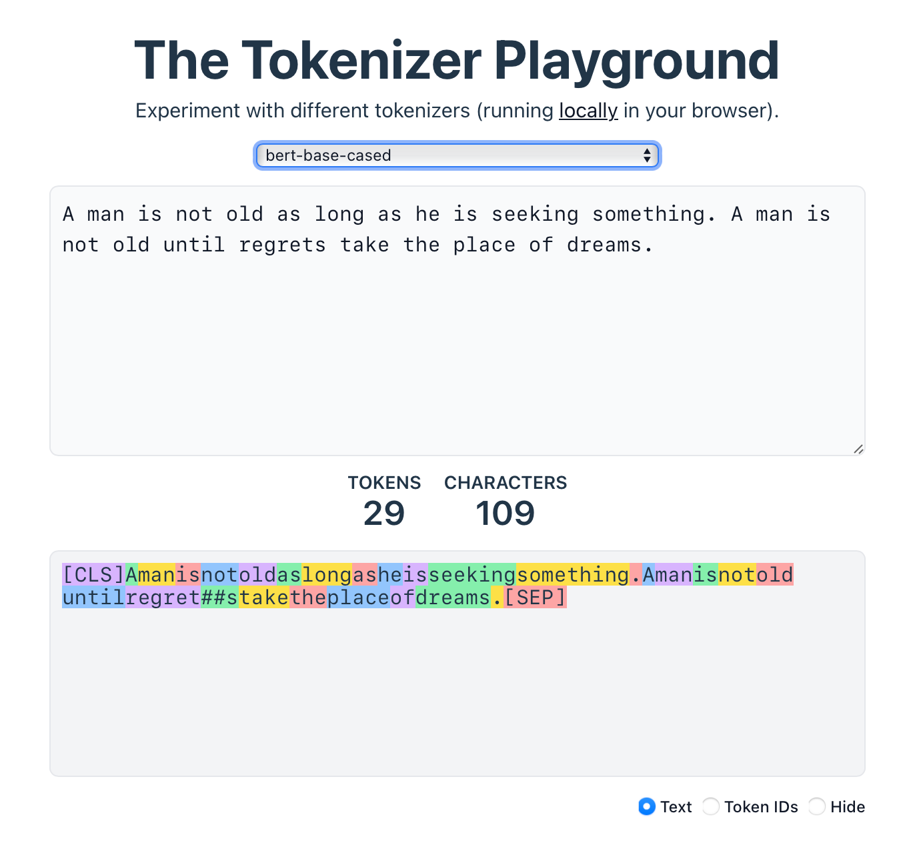
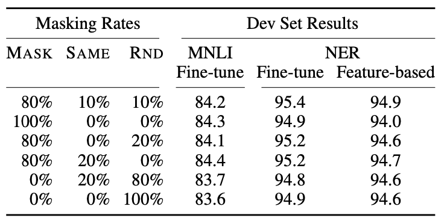
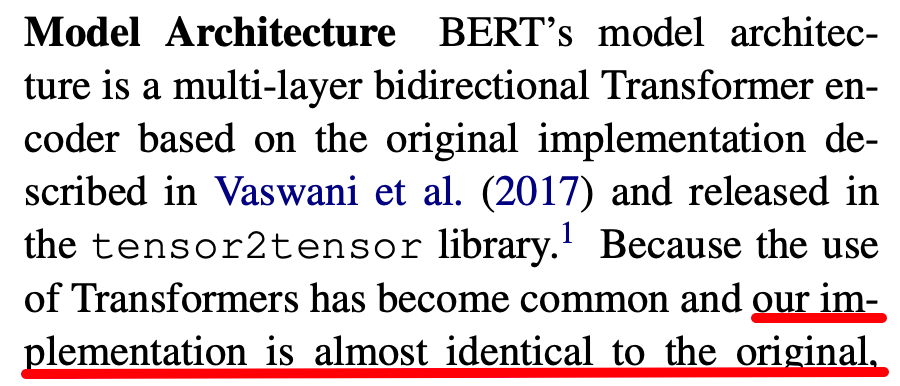
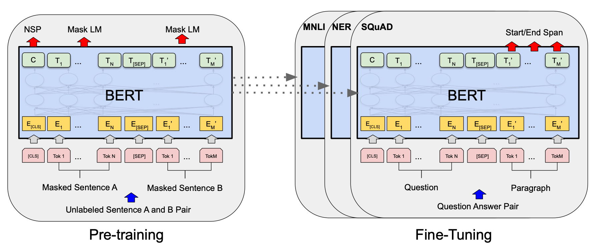
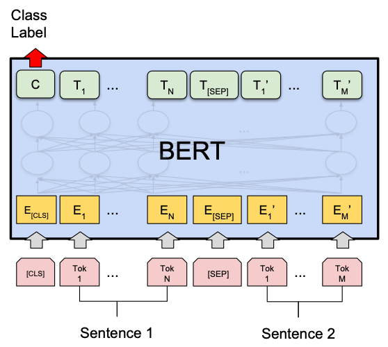
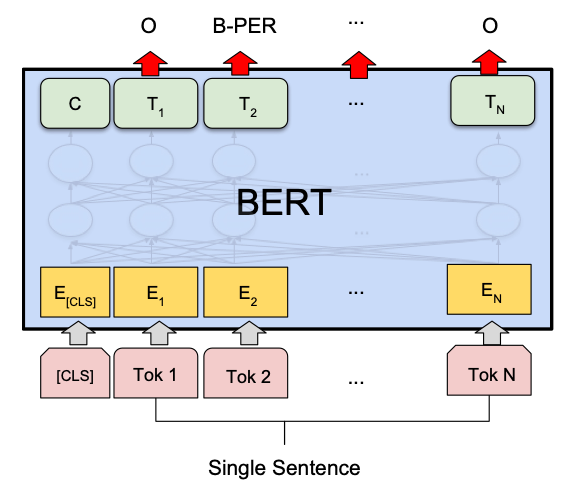
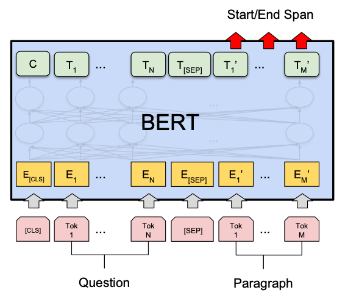

# BERT

**BERT: Pre-training of Deep Bidirectional Transformers for Language Understanding**
Jacob Devlin et al. | [arXiv 1810.04805](https://arxiv.org/pdf/1810.04805) | [Code - 官方 Tensorflow](https://github.com/google-research/bert) | NAACL 2019 | Google AI Language

> **学习 & 参考资料**
>
> - **机器学习**
>
>   —— 李宏毅老师的 B 站搬运视频
>
>   - [自监督式学习(一) - 芝麻街与进击的巨人](https://www.bilibili.com/video/BV1Wv411h7kN/?p=71&share_source=copy_web&vd_source=e46571d631061853c8f9eead71bdb390)
>   - [自监督式学习(二) - BERT简介](https://www.bilibili.com/video/BV1Wv411h7kN/?p=72&share_source=copy_web&vd_source=e46571d631061853c8f9eead71bdb390)
>   - [自监督式学习(三) - BERT的奇闻轶事](https://www.bilibili.com/video/BV1Wv411h7kN/?p=73&share_source=copy_web&vd_source=e46571d631061853c8f9eead71bdb390)
>
> - **论文逐段精读**
>
>   —— 沐神的论文精读合集
>
>   - [BERT 论文逐段精读【论文精读】](https://www.bilibili.com/video/BV1PL411M7eQ/?share_source=copy_web&vd_source=e46571d631061853c8f9eead71bdb390)
>
> - **3Blue1Brown**
>
>   —— 顶级的动画解释
>
>   - [【官方双语】GPT是什么？直观解释Transformer | 【深度学习第5章】]( https://www.bilibili.com/video/BV13z421U7cs/?share_source=copy_web&vd_source=e46571d631061853c8f9eead71bdb390)
>   - [【官方双语】直观解释注意力机制，Transformer的核心 | 【深度学习第6章】](https://www.bilibili.com/video/BV1TZ421j7Ke/?share_source=copy_web)
>
> - **可视化工具**
>
>   - [TRANSFORMER EXPLAINER](https://poloclub.github.io/transformer-explainer/)
>
>     观察 Self-Attention 的中间过程。
>
>     需要注意的是网页端演示的不是传统的 Transformer 架构，而是 GPT-2（Decoder-Only），不过 BERT 的架构中也包含 Self-Attention，通过 GPT-2 理解相同的部分是完全足够的。
>
> - **前置文章**
>
>   - [Transformer 论文精读](https://github.com/Hoper-J/AI-Guide-and-Demos-zh_CN/blob/master/PaperNotes/Transformer%20论文精读.md)

## 时间线

> 完成后删除此模块。

- ... - 2024.11.20：完成论文基本的介绍，理清架构
- 2024.11.21完成模型架构部分，给出完整的参数量计算方法，以 $\text{BERT}_\text{BASE}$ 为例进行演示，复刻论文表达。

TODO: 思考是否有必要从零开始实现 BERT，在代码上没有太多新的东西。

## 前言

在计算机视觉（Computer Vision, CV）领域，很早就可以通过卷积神经网络（Convolutional Neural Network, CNN）在大型数据集上进行预训练（Pre-training），然后迁移到其他任务中提升性能。但在自然语言处理（Natural Language Processing, NLP）领域，长期以来并没有类似的通用深度神经网络模型，这时候很多研究都是“各自为战”，为特定任务训练专属的模型，导致计算资源重复利用，研究成果难以共享，常常重复的“造轮子”。

Transformer 架构的提出为 NLP 带来了新的可能，BERT 的出现更是彻底改变了 NLP 的研究格局。BERT 将 Transformer 架构从翻译任务推广到了其他的 NLP 任务，并刷新了 11 项任务的 SOTA（State of the Art），证明了其架构的通用性和强大性能，同时开启了预训练语言模型（Pre-trained Language Models, PLMs）研究的浪潮，对 NLP 研究格局产生了深远影响。

> [!tip]
>
> BERT 的名字来源于美国经典儿童节目《芝麻街》（Sesame Street）的角色，论文中对应的全称为 **B**idirectional **E**ncoder **R**epresentations from **T**ransformer，即“基于 Transformer 架构的双向编码器表示”。是的，“硬凑名字”，类似地，BERT 的“前辈” **ELMo**（Embeddings from Language Models）[^1]也是如此。“学术严肃与幽默并存” :)

[^1]: [Deep contextualized word representations](https://arxiv.org/pdf/1802.05365).

## 贡献

BERT 的主要贡献如下：

 - **双向上下文建模（Bidirectional Contextual Representation）**

   过去的语言模型（如 GPT[^2]）大多采用单向建模，即只利用从左到右的上下文信息来预测下一个词（token），无法充分利用句子的全局信息。BERT 引入掩码语言模型（Masked Language Model，MLM），随机遮掩输入序列中的部分词，迫使模型基于上下文来预测它（类似于完形填空），实现了深度的双向表征学习。

   在此之前也有研究（如 ELMo[^1]）将从左到右和从右到左两个单向模型的表示拼接在一起，以达到双向的目的，不过 BERT 对双向信息的利用更好。

 - **预训练与微调框架（Pre-training & Fine-tuning）**

   BERT 是**第一个**使用预训练与微调范式在一系列 NLP 任务（句子层面和词元层面）都达到 **SOTA** 的模型，可以说是全面验证了该方法的有效性。
   
   尽管这种思想并非由 BERT 首次提出，但却是因为 BERT 才广为人知，毕竟谁不喜欢架构简单、模型开源、结果还 SOTA 的研究呢？截止 2024.11，BERT 的引用量已经超过 118K[^3]，大量的研究摸着 BERT 过河。
   
[^2]: [Improving Language Understanding by Generative Pre-Training](https://cdn.openai.com/research-covers/language-unsupervised/language_understanding_paper.pdf).

[^3]: 引用次数数据来源于 Google Scholar。

### Q1: 什么是预训练（Pre-training）？什么是微调（Fine-tuning）？

- **预训练**：利用大量无标注的数据，通过自监督学习（Self-supervised Learning）训练模型，使其学习通用的表示。
- **微调**：在特定的下游任务（如文本分类、问答、命名实体识别）中，使用少量标注数据，对预训练好的模型进行进一步训练，使其适应特定任务的需求。

### Q2: 什么是自监督学习？

自监督学习更像是介于无监督学习和有监督学习之间的概念，从数据上看，自监督学习的数据没有经过标注，从训练上来看，自监督学习又有着监督信号（伪标签）作为指导。它的核心思想是设计一个“代理任务”（Pretext Task），或者说人为的定义一些规则，从数据中自动生成“伪标签”来训练模型。

**举一些实际的例子**：

- **自然语言处理（NLP）**
  - **GPT 的自回归模型**：通过给定前面的词序列，预测下一个词（单向）。
  - **BERT 的 Masked Language Model（MLM）**：在输入文本中随机遮掩某个词，模型根据上下文进行预测（双向）。
- **计算机视觉（CV）**
  - **图像遮掩预测**：遮掩图像的一部分，模型根据周围的像素信息预测被遮挡的区域内容。
  - **早期的对比学习（Contrastive Learning）**：将同一图像的不同增强版本视为“正样本对”，不同图像视为“负样本对”。模型通过拉近正样本对的表示、拉远负样本对的表示进行学习。

### Q3: 论文提到将预训练表示应用到下游任务有两种策略：基于特征（feature-based）和微调（fine-tuning），二者有什么区别？

> 摘自论文 Introduction 部分：
>
> There are two existing strategies for applying pre-trained language representations to downstream tasks: ***feature-based*** and ***fine-tuning***. 
> The feature-based approach, such as ELMo (Peters et al., 2018a), uses task-specific architectures that include the pre-trained representations as additional features. 
> The fine-tuning approach, such as the Generative Pre-trained Transformer (OpenAI GPT) (Radford et al., 2018), introduces minimal task-specific parameters, and is trained on the downstream tasks by simply fine-tuning ***all*** pre-trained parameters. 
> The two approaches share the same objective function during pre-training, where they use unidirectional language models to learn general language representations.

**基于特征（feature-based）方法**：

- **预训练模型参数保持不变**，将其视为**固定的特征提取器**。
- **预训练模型的输出作为下游任务的额外输入**，可以直接与原始输入进行拼接。
- 下游任务可能设计了特定的模型。

**微调（fine-tuning）方法**：

- **预训练模型的参数在下游任务中继续更新**，对预训练模型进行**端到端的训练**，论文中提到的是全量微调，不过现在实际应用中微调也分很多种。
- 下游任务中，只需在预训练模型顶部添加少量的任务特定参数（如分类层）。

## 模型架构

前文提到，BERT 的创新之一在于其引入了**双向建模**，从单向过渡到双向这一说法似乎很自然，但更应该结合模型架构的演变时间线进行理解：

> 

Transformer 原始架构由**编码器**（Encoder）和**解码器**（Decoder）组成，GPT 在 BERT 之前发表，仅用了 Transformer 架构的解码器部分（GPT 也被称之为 “Decoder-Only” 模型），或许 BERT 正是受启发于 GPT，所以才用了 Transformer 架构的另一半，也就是编码器部分（BERT 也被称之为 “Encoder-Only” 模型）。

读到这里可能会有疑问：**这能说明什么？**

实际上，编码器和解码器在处理输入时的不同直接影响了模型是单向还是双向建模：

- **编码器（Encoder）**：
  - **自注意力机制是双向的**：输入序列不做额外处理，每个位置都可以关注到序列中所有其他位置的词（包括前面的和后面的）。
- **解码器（Decoder）**：
  - **自注意力机制是单向的**：通过对未来位置进行掩码，输入序列中的每个位置只能关注到它之前的词（从左到右）。
    - **未来掩码**：训练时，防止模型在生成当前位置的词时看到未来的信息（答案）。

因此，GPT 是**单向模型**，因为采用了解码器架构，通过从左到右的方式生成文本；而 BERT 是**双向模型**，因为采用了编码器架构，能同时利用左侧和右侧的上下文信息进行建模。值得注意的是，所谓单向和双向建模，本质上取决于是否对输入序列添加未来掩码，编码器和解码器的实现机制实际上非常相似，详见 Transformer 的[代码实现](https://www.kaggle.com/code/aidemos/transformer#子层模块)。

所以，与其说是从单向过渡到双向，不如说 BERT 选择了 Transformer 架构的编码器部分，来实现双向的表征学习。

| 模型类型        | 模型架构                      | 代表模型    | 应用场景举例 |
| --------------- | ----------------------------- | ----------- | ------------ |
| Encoder         | 双向                          | BERT        | 文本理解     |
| Decoder         | 单向（左到右）                | GPT         | 文本生成     |
| Encoder+Decoder | 双向（编码器）+单向（解码器） | Transformer | 文本翻译     |

> [!tip]
>
> 如果并不了解 Transformer/Encoder/Decoder 是什么，推荐先阅读《[Transformer 论文精读](https://github.com/Hoper-J/AI-Guide-and-Demos-zh_CN/blob/master/PaperNotes/Transformer%20论文精读.md)》。

### 输入处理

> 

BERT 的输入由三个嵌入层组成：**Token Embeddings**、**Segment Embeddings** 和 **Position Embeddings**。它们分别提供了词汇、句子区分和位置信息，和 Transformer 的不同之处在于位置嵌入可学习且多了段嵌入。

- **Token Embeddings（词嵌入）**：

  BERT 使用 WordPiece[^4] 构造词汇表，将输入文本拆分为子词单元（subword units），每个子词最终都对应一个嵌入向量。
  
  > 对 WordPiece 感兴趣的同学可以进一步阅读《[21. BPE vs WordPiece：理解 Tokenizer 的工作原理与子词分割方法](https://github.com/Hoper-J/AI-Guide-and-Demos-zh_CN/blob/master/Guide/21.%20BPE%20vs%20WordPiece：理解%20Tokenizer%20的工作原理与子词分割方法.md#wordpiece)》。
  >
  > 尝试 [The Tokenizer Playground](https://huggingface.co/spaces/Xenova/the-tokenizer-playground)，选择 `bert-base-cased` ：
  >
  > 
- **Segment Embeddings（段嵌入）**：

  为了区分输入中的不同句子，每个词都会加上一个段标识（Segment ID），标识它属于句子 A 还是句子 B。比如，句子 A 的 Segment ID 设为 0，句子 B 的 Segment ID 设为 1。

  > BERT 的[官方代码](https://github.com/google-research/bert/blob/eedf5716ce1268e56f0a50264a88cafad334ac61/modeling.py#L472)中将这一概念称为词元类型 IDs（Token Type IDs），结合下图[^5]来理解：
  >
  > 

- **Position Embeddings（位置嵌入）**：

  编码器本身无法直接感知输入序列的顺序，因此需要对输入数据进行额外的位置信息补充。BERT 通过添加可学习的位置嵌入帮助模型捕获序列的顺序关系。

**注意**，嵌入层相加后需要过一次 Layer Norm，见[官方代码](https://github.com/google-research/bert/blob/eedf5716ce1268e56f0a50264a88cafad334ac61/modeling.py#L520)。

另外，这里的嵌入层**都是可学习的**，接受的输入分别是 ：

- **Token ID**（词元标识，用于映射词嵌入）
- **Segment ID / Token Type ID**（段标识，用于区分句子）
- **Position ID**（位置信息，用于捕获序列顺序）

可以通过拓展文章《[g. 嵌入层 nn.Embedding() 详解和要点提醒（PyTorch）](https://github.com/Hoper-J/AI-Guide-and-Demos-zh_CN/blob/master/Guide/g.%20嵌入层%20nn.Embedding()%20详解和要点提醒（PyTorch）.md)》进一步了解什么是嵌入层。

[^4]: [Google’s Neural Machine Translation System: Bridging the Gap between Human and Machine Translation](https://arxiv.org/pdf/1609.08144).
[^5]: [Segment Embeddings 的图源](https://speech.ee.ntu.edu.tw/~hylee/ml/ml2023-course-data/HW07.pdf)


## 训练细节

BERT 的训练包含两个步骤：预训练和微调。

### 预训练（Pre-training）

BERT 使用了两个预训练任务：

#### 掩码语言模型（Masked Language Model，MLM）

随机遮掩输入序列中的部分词元（也称为标记, Token），让模型根据上下文预测被遮掩的词元。

> 单向模型的任务很简单，就是预测下一个词。那么，有什么任务可以同时利用上下文的信息呢？
>
> 答：完形填空。

**实现细节**：

- 在每个训练样本中，随机选择 **15%** 的词元进行遮掩处理。

- 如果直接将选中的词元全部替换为 `[MASK]`，会导致预训练和微调看到的数据会不一样，因为后续微调的时候的输入是没有遮掩的。为了缓解这个问题，BERT 对于被选中的词元采用了三种处理方式。假设句子为 `my dog is hairy`，在随机遮掩过程中选择了第 4 个词元（对应于 `hairy`），具体的遮掩处理如下：

  - **80% 的情况下**：将选中的词元替换为 `[MASK]`，例如：
     `my dog is hairy → my dog is [MASK]`

  - **10% 的情况下**：将选中的词元替换为一个随机词，例如：
     `my dog is hairy → my dog is apple`

  - **10% 的情况下**：保持选中的词元不变，但模型依旧需要预测它，例如：
     `my dog is hairy → my dog is hairy`

    此时输入和微调时看到的一样。

  > The advantage of this procedure is that the Transformer encoder does not know which words it will be asked to predict or which have been re- placed by random words, so it is forced to keep a distributional contextual representation of every input token. 
  >
  > 这个过程的优点是，Transformer 编码器不知道它将被要求预测哪些单词，或者哪些单词已经被随机单词替换了，因此它被迫保持每个输入标记的分布上下文表示。
  
  **注意**：这里指的是已经决定要被遮掩的词元，即这三种情况是在被选择遮掩的 15% 中随机分布。其他的特殊词元不进行处理（`[CLS]` 和 `SEP`)。


> 当前比例的选择依据表 8 的消融实验：
>
> 

#### 下一句预测（Next Sentence Prediction，NSP）

判断两个句子在原文中是否相邻。

**实现细节**：

- **50%** 的训练样本为相邻句子对（标签为 "IsNext"），例如：
  - `[CLS] the man went to [MASK] store [SEP] he bought a gallon [MASK] milk [SEP]`
- **50%** 的训练样本为非相邻句子对（标签为 "NotNext"），例如：
  - `[CLS] the man [MASK] to the store [SEP] penguin [MASK] are flight ##less birds [SEP]`

#### 数据集

BERT 的预训练数据集包含大量未标注文本，主要来自：

1. **书籍语料库（BooksCorpus[^6]）**：包含超过 11,000 本英文小说的全文，约 8 亿词元。
2. **英文维基百科（English Wikipedia）**：包含海量的高质量文本，约 25 亿词元。

论文指出应该用文档层面（Document-Level）的数据集而非随机打乱的句子。

[^6]: [Aligning Books and Movies: Towards Story-like Visual Explanations by Watching Movies and Reading Books](https://arxiv.org/pdf/1506.06724)
#### 超参数设置

> 

BERT 的模型架构基于 **Transformer** 的编码器结构。需要注意的是，BERT 的 **BASE** 和 **LARGE** 模型的超参数设置并不对应于 Transformer 论文中的 **base** 和 **big** 模型。

- $\text{BERT}_\text{BASE}$
  - **层数 $L=12$**：Transformer 编码器的层数。
  - **隐藏层维度 $H=768$**：每个隐藏层的维度。

  - **注意力头数 $A=12$**：每层的多头注意力机制包含 12 个注意力头，每个头的维度为 64, $12 * 64 = 768$。

  - **总参数量**：约 110M（与 GPT 参数量差不多，方便对比）。
- $\text{BERT}_\text{LARGE}$
  - **层数 $L=24$**。
  - **隐藏层维度 $H=1024$**。

  - **注意力头数 $A=16$**。

  - **总参数量**：约 340M。

#### Q: BERT 模型总参数量怎么计算？

主要来自以下几个部分：

1. **嵌入层参数**：

   - **词嵌入（Token Embeddings）**：词汇表大小 $V$ 乘以隐藏层维度 $H$, 即 $V \times H$。

     ```python
     self.embed = nn.Embedding(V, H)
     ```

   - **位置嵌入（Position Embeddings）**：最大序列长度 $L_{\text{seq}}$ 乘以隐藏层维度 $H$, 即 $L_{\text{seq}} \times H$, 注意，在 BERT 的[官方实现](https://github.com/google-research/bert/blob/eedf5716ce1268e56f0a50264a88cafad334ac61/modeling.py#L496)中该部分是可以训练的。

   - **分段嵌入（Segment Embeddings）**：两个分段（句子 A 和句子 B）对应参数量为 $2 \times H$。

   - **层归一化（LayerNorm）参数**：嵌入层的输出经过 LayerNorm 操作，其中包含**两个参数**: $\gamma$（缩放）和 $\beta$（偏移），每个大小为 $H$, 共 $2 \times H$。

     ```python
     self.gamma = nn.Parameter(torch.ones(H))  # 可学习缩放参数，初始值为 1
     self.beta = nn.Parameter(torch.zeros(H))  # 可学习偏移参数，初始值为 0
     ```
   
   **总嵌入层参数量**: $(V + L_{\text{seq}} + 2 + 2) \times H = (V + L_{\text{seq}} + 4) \times H$。
   
2. **Transformer 编码器层参数**：

   > 
   >
   > 代码修改自《[Transformer 论文精读](https://github.com/Hoper-J/AI-Guide-and-Demos-zh_CN/blob/master/PaperNotes/Transformer%20论文精读.md#代码实现-3)》。

   每个编码器层包含以下参数：

   - **多头自注意力层**：

     - **查询（Query）、键（Key）、值（Value）权重矩阵**：每个矩阵参数量为 $H \times H$, 共 $3$ 个矩阵。

     - **查询、键、值的偏置向量**：每个偏置向量大小为 $H$, 共 $3$ 个偏置。

       ```python
       # 定义线性层，用于生成查询、键和值矩阵
       self.w_q = nn.Linear(H, H)
       self.w_k = nn.Linear(H, H)
       self.w_v = nn.Linear(H, H)
       ```

     - **输出映射矩阵**：参数量为 $H \times H$。

       ```python
       # 输出线性层，将多头拼接后的输出映射回 H
       self.fc_out = nn.Linear(H, H)
       ```

     - **总计**：

       $$\text{Attention Params} = (3 \times H \times H) + (3 \times H) + (H \times H) + H = 4H^2 + 4H$$

   - **前馈神经网络（FFN）层**：

     - **第一层权重矩阵**: $H \times 4H$, 偏置为 $4H$。

     - **第二层权重矩阵**: $4H \times H$, 偏置为 $H$。

       ```python
       self.w_1 = nn.Linear(H, 4 * H)  # 第一个线性层
       self.w_2 = nn.Linear(4 * H, H)  # 第二个线性层
       ```

     - **总计**：

       $$\text{FFN Params} = (H \times 4H) + (4H) + (4H \times H) + H = 8H^2 + 5H$$

   - **层归一化（Layer Norm）参数**：

     - 每个 Layer Norm 层有**两个参数**: $\gamma$（缩放）和 $\beta$（偏移），每个大小为 $H$。

     - 每层编码器有**两个 Layer Norm 层**，参数量为 $2 \times 2H = 4H$。

   **每层总参数量**：
   
   $`\begin{align*}
   \text{Per-Layer Params} &= \text{Attention Params} + \text{FFN Params} + \text{Layer Norm Params} \\
   &= (4H^2 + 4H) + (8H^2 + 5H) + 4H \\
   &= 12H^2 + 13H
   \end{align*}`$
   
   **所有编码器层的总参数量**: $\text{Per-Layer Params} \times L$, 其中 $L$ 是层数。

3. **池化层参数**

   BERT 的池化层是一个简单的线性变换层，参数量：
   
   $$\text{Pooling Params} = H \times H + H = H^2 + H$$
   

   注意，Transformer 中没有池化层。

**以 $\text{BERT}_\text{BASE}$ 为例**：

- 词汇表大小 $V = 30,522$。（论文中写的是 30,000，这里遵循代码实现中的 30,522）
- 最大序列长度 $L_{\text{seq}} = 512$。
- 隐藏层维度 $H = 768$。
- 编码器层数 $L = 12$。

可以先手动计算一下再往下看。

**嵌入层参数量**：

$$
(V + L_{\text{seq}} + 4) \times H = (30,522 + 512 + 4) \times 768 = 31,038 \times 768 = 23,837,184
$$

**编码器层参数量**：

- 每层参数量：

  $$12H^2 + 13H = 12 \times 768^2 + 13 \times 768 = 7,077,888 + 9,984 = 7,087,872$$

- 所有层的参数量：

  $$12 \times 7,087,872 = 85,054,464$$

**池化层参数**：

$$
H^2 + H = 768^2 + 768 = 590,592
$$


**总参数量估计**：

$$
23,837,184 \text{（嵌入层）} + 85,054,464 \text{（编码器层）} + 590,592 \text{（池化层）} = 109,482,240
$$

与论文中提到的 110M 相符。

> [附录](#参数量)的表格证明了当前计算的正确性。

### 微调（Fine-tuning）

在微调阶段，模型首先使用预训练得到的参数进行初始化，然后在下游任务的标注数据上，对所有参数进行微调。不同的下游任务使用相同的预训练模型进行初始化，但每个任务都有各自的微调过程和特定的输出层。

> 通过论文中的图 1 进一步理解，图示为问答任务：
>
> 
>
> **解释**：
>
> - **模型架构统一**：预训练和微调过程中使用**相同**的模型架构，除了任务特定的输出层。虚线表示预训练模型参数被用于初始化下游任务模型。
>
> - **特殊词元/标记**：
>
>   - `[CLS]`（Classification Token）：在每个输入序列的开头添加，由于编码器的自注意力机制会计算 `[CLS]` 与序列中所有其他词的关系，因此 `[CLS]` 的输出向量可以有效地表示整个序列的上下文信息。因此，`[CLS]` 向量常作为句子级别（Sentence-Level）的 **embedding**，被应用于句子分类、情感分析、文本分类等任务。
>   - `[SEP]`（Separator Token）：用于分隔不同的句子或表示序列的结束。
>
>   举个例子，如果我们有两个句子：
>
>   - 句子 A："BERT is great."
>   - 句子 B："It works well."
>
>   它们会被处理成：`[CLS] BERT is great. [SEP] It works well. [SEP]`
>
> - **下游任务示例**：
>
>   - **MNLI（Multi-Genre Natural Language Inference）**：
>
>     
>
>     - **任务描述**：句子对分类任务，判断两个句子之间的逻辑关系（蕴含、中立、矛盾）。
>
>     - **输入形式**：`[CLS]` + 前提句子 + `[SEP]` + 假设句子 + `[SEP]`。
>
>     - **输出层**：在 `[CLS]` 标记的嵌入表示上添加一个分类层，用于预测句子对的逻辑关系。
>
>       - **代码实现**（伪代码）：
>
>        ```python
>        # 假设 encoder_output 是模型的输出，维度为 (batch_size, seq_length, hidden_size)
>        cls_embedding = encoder_output[:, 0, :]  # 获取 [CLS] 的嵌入表示，维度为 (batch_size, hidden_size)
>        classifier = nn.Linear(hidden_size, num_labels)  # 分类层
>        logits = classifier(cls_embedding)  # 预测结果，维度为 (batch_size, num_labels)
>        ```
>
>   - **NER（Named Entity Recognition）**：
>
>     
>
>     - **任务描述**：序列标注任务，在给定的文本中识别并分类命名实体（如人名、地名、组织等）。
>
>     - **输入形式**：`[CLS]` + 句子 + `[SEP]`，对每个词的表示进行标注。
>
>     - **输出层**：在每个词的嵌入表示上添加标注层，预测其对应的实体类别。
>
>       - **代码实现**（伪代码）：
>
>        ```python
>        # 假设 encoder_output 是模型的输出，维度为 (batch_size, seq_length, hidden_size)
>        token_embeddings = encoder_output[:, 1:-1, :]  # 排除 [CLS] 和 [SEP]，维度为 (batch_size, seq_length - 2, hidden_size)
>        tagger = nn.Linear(hidden_size, num_entity_labels)  # 标注层
>        logits = tagger(token_embeddings)  # 预测结果，维度为 (batch_size, seq_length - 2, num_entity_labels)
>        ```
>
>   - **SQuAD（Stanford Question Answering Dataset）**：
>
>     
>
>     - **任务描述**：问答任务，给定一个问题和相关段落，模型需要从段落中提取出能够回答该问题的文本片段。
>
>     - **输入形式**：`[CLS]` + 问题 + `[SEP]` + 段落 + `[SEP]`。
>
>     - **输出层**：预测答案起始（start）和结束（end）位置。
>
>       - **代码实现**（伪代码）：
>
>        ```python
>       # 假设 encoder_output 是模型的输出，形状为 (batch_size, seq_length, hidden_size)
>       # 定义一个线性层，将 hidden_size 映射到 2（分别用于预测 start 和 end 位置），当然，可以定义两个线性层分别进行预测，因为线性层每个位置的处理是相互独立的
>       classifier = nn.Linear(hidden_size, 2)
>                                                 
>       logits = classifier(encoder_output)  # 形状为 (batch_size, seq_length, 2)
>       start_logits, end_logits = logits.split(1, dim=-1)  # 每个的形状为 (batch_size, seq_length, 1)
>       start_logits = start_logits.squeeze(-1)  # 形状为 (batch_size, seq_length)
>       end_logits = end_logits.squeeze(-1)      # 形状为 (batch_size, seq_length)
>        ```
>


## 附录

### 参数量

> 表格来源：[How is the number of BERT model parameters calculated? ](https://github.com/google-research/bert/issues/656#issuecomment-554718760)

#### 1. bert-base-uncased, 110M parameters

| Bert-base-uncased | Key                                               | Shape        | Count      |                             |
| ----------------- | ------------------------------------------------- | ------------ | ---------- | --------------------------- |
| Embedding         | embeddings.word_embeddings.weight                 | [30522, 768] | 23,440,896 | 23,837,184                  |
|                   | embeddings.position_embeddings.weight             | [512, 768]   | 393,216    |                             |
|                   | embeddings.token_type_embeddings.weight           | [2, 768]     | 1,536      |                             |
|                   | embeddings.LayerNorm.weight                       | [768]        | 768        |                             |
|                   | embeddings.LayerNorm.bias                         | [768]        | 768        |                             |
| Transformer * 12  | encoder.layer.0.attention.self.query.weight       | [768, 768]   | 589,824    | 7,087,872 * 12 = 85,054,464 |
|                   | encoder.layer.0.attention.self.query.bias         | [768]        | 768        |                             |
|                   | encoder.layer.0.attention.self.key.weight         | [768, 768]   | 589,824    |                             |
|                   | encoder.layer.0.attention.self.key.bias           | [768]        | 768        |                             |
|                   | encoder.layer.0.attention.self.value.weight       | [768, 768]   | 589,824    |                             |
|                   | encoder.layer.0.attention.self.value.bias         | [768]        | 768        |                             |
|                   | encoder.layer.0.attention.output.dense.weight     | [768, 768]   | 589,824    |                             |
|                   | encoder.layer.0.attention.output.dense.bias       | [768]        | 768        |                             |
|                   | encoder.layer.0.attention.output.LayerNorm.weight | [768]        | 768        |                             |
|                   | encoder.layer.0.attention.output.LayerNorm.bias   | [768]        | 768        |                             |
|                   | encoder.layer.0.intermediate.dense.weight         | [3072, 768]  | 2,359,296  |                             |
|                   | encoder.layer.0.intermediate.dense.bias           | [3072]       | 3072       |                             |
|                   | encoder.layer.0.output.dense.weight               | [768, 3072]  | 2,359,296  |                             |
|                   | encoder.layer.0.output.dense.bias                 | [768]        | 768        |                             |
|                   | encoder.layer.0.output.LayerNorm.weight           | [768]        | 768        |                             |
|                   | encoder.layer.0.output.LayerNorm.bias             | [768]        | 768        |                             |
| Pooler            | pooler.dense.weight                               | [768, 768]   | 589,824    | 590,592                     |
|                   | pooler.dense.bias                                 | [768]        | 768        |                             |
|                   |                                                   |              |            | **109,482,240**             |

#### 2. bert-large-uncased, 340M parameters

| Bert-large-uncased | Key                                               | Shape         | Count      | Count All                     |
| ------------------ | ------------------------------------------------- | ------------- | ---------- | ----------------------------- |
| Embedding          | embeddings.word_embeddings.weight                 | [30522, 1024] | 31,254,528 | 31,782,912                    |
|                    | embeddings.position_embeddings.weight             | [512, 1024]   | 524,288    |                               |
|                    | embeddings.token_type_embeddings.weight           | [2, 1024]     | 2,048      |                               |
|                    | embeddings.LayerNorm.weight                       | [1024]        | 1,024      |                               |
|                    | embeddings.LayerNorm.bias                         | [1024]        | 1,024      |                               |
| Transformer * 24   | encoder.layer.0.attention.self.query.weight       | [1024, 1024]  | 1,048,576  | 12,592,128 * 24 = 302,211,072 |
|                    | encoder.layer.0.attention.self.query.bias         | [1024]        | 1,024      |                               |
|                    | encoder.layer.0.attention.self.key.weight         | [1024, 1024]  | 1,048,576  |                               |
|                    | encoder.layer.0.attention.self.key.bias           | [1024]        | 1,024      |                               |
|                    | encoder.layer.0.attention.self.value.weight       | [1024, 1024]  | 1,048,576  |                               |
|                    | encoder.layer.0.attention.self.value.bias         | [1024]        | 1,024      |                               |
|                    | encoder.layer.0.attention.output.dense.weight     | [1024, 1024]  | 1,048,576  |                               |
|                    | encoder.layer.0.attention.output.dense.bias       | [1024]        | 1,024      |                               |
|                    | encoder.layer.0.attention.output.LayerNorm.weight | [1024]        | 1,024      |                               |
|                    | encoder.layer.0.attention.output.LayerNorm.bias   | [1024]        | 1,024      |                               |
|                    | encoder.layer.0.intermediate.dense.weight         | [4096, 1024]  | 4,194,304  |                               |
|                    | encoder.layer.0.intermediate.dense.bias           | [4096]        | 4,096      |                               |
|                    | encoder.layer.0.output.dense.weight               | [1024, 4096]  | 4,194,304  |                               |
|                    | encoder.layer.0.output.dense.bias                 | [1024]        | 1,024      |                               |
|                    | encoder.layer.0.output.LayerNorm.weight           | [1024]        | 1,024      |                               |
|                    | encoder.layer.0.output.LayerNorm.bias             | [1024]        | 1,024      |                               |
| Pooler             | pooler.dense.weight                               | [1024, 1024]  | 1,048,576  | 1,049,600                     |
|                    | pooler.dense.bias                                 | [1024]        | 1,024      |                               |
|                    |                                                   |               |            | **335,043,584**               |
