【未完待续】

# GPT

**Improving Language Understanding by Generative Pre-Training**
Alec Radford et al. | [PDF](https://cdn.openai.com/research-covers/language-unsupervised/language_understanding_paper.pdf) | OpenAI | 2018.06

> **学习 & 参考资料**
>
> - **前置文章**
>   - [Transformer 论文精读](https://github.com/Hoper-J/AI-Guide-and-Demos-zh_CN/blob/master/PaperNotes/Transformer%20论文精读.md)
>
> - **机器学习**
>
>   —— 李宏毅老师的 B 站搬运视频
>
>     - [自监督式学习(四) - GPT的野望](https://www.bilibili.com/video/BV1Wv411h7kN/?p=74&share_source=copy_web&vd_source=e46571d631061853c8f9eead71bdb390)
>     - [[DLHLP 2020] 來自猎人暗黑大陆的模型 GPT-3](https://www.bilibili.com/video/BV1Wv411h7kN/?p=80&share_source=copy_web&vd_source=e46571d631061853c8f9eead71bdb390)
>
> - **论文逐段精读**
>
>   —— 沐神的论文精读合集
>
>   - [GPT，GPT-2，GPT-3 论文精读【论文精读】](https://www.bilibili.com/video/BV1AF411b7xQ/?share_source=copy_web&vd_source=e46571d631061853c8f9eead71bdb390)
>   - [GPT-4论文精读【论文精读·53】](https://www.bilibili.com/video/BV1vM4y1U7b5/?share_source=copy_web&vd_source=40b3e12ca72bba004f5dd21c08776797)
>
> - **3Blue1Brown**
>
>   —— 顶级的动画解释
>
>   - [【官方双语】GPT是什么？直观解释Transformer | 【深度学习第5章】]( https://www.bilibili.com/video/BV13z421U7cs/?share_source=copy_web&vd_source=e46571d631061853c8f9eead71bdb390)
>
>   - [【官方双语】直观解释注意力机制，Transformer的核心 | 【深度学习第6章】](https://www.bilibili.com/video/BV1TZ421j7Ke/?share_source=copy_web)
>
> - **可视化工具**
>
>   - [TRANSFORMER EXPLAINER](https://poloclub.github.io/transformer-explainer/)
>
>     观察 Self-Attention 的中间过程，并调节右上角的温度（Temperature）查看对概率的影响。
>
>     网页端演示的是 GPT-2（Decoder-Only）。

## 前言

在深入研究之前，了解相关领域重要论文的时间线[^1]是一个很好的习惯：


**Google 的 Transformer（Attention is All You Need）** 于 2017 年 6 月发表，一年后，OpenAI 的团队发表了 **GPT** ，又过了两个月，Google 的另一个团队发表了 **BERT**。

> [!tip]
>
> 缩写 **GPT** 来自论文题目的 **Generative Pre-Training**，生成式预训练，维基百科[^2]中的表述是 **Generative Pre-trained Transformer**，二者指代一致。这是一个通用概念，当前常见的具有聊天功能的 AI 或者说 LLM 其实都可以称作 GPT。

[^1]: 按照沐神论文精读的课件设计进行展示，时间跨度为 3 年。
[^2]: [Generative pre-trained transformer - Wikipedia](https://en.wikipedia.org/wiki/Generative_pre-trained_transformer).

GPT 是一种自回归（Auto-Regressive，AR）模型，在进一步了解 GPT 之前，可以先认识自回归和非自回归[^3]：

> 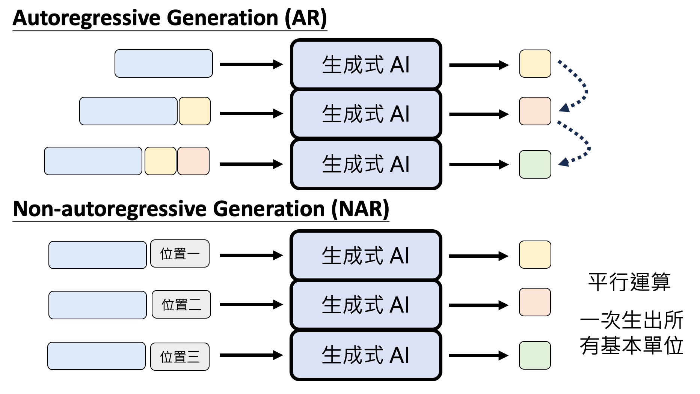

### 自回归（Auto-Regressive）

**自回归生成**是指序列生成过程中，**每个新生成的 token 依赖于之前生成的 token**。这意味着生成过程是**串行的**，每一步的输入由**前面已生成的 token 组成的上下文序列**构成。例如：

- 假设要生成一个长度为 $T$ 的句子 $y = (y_1, y_2, \dots, y_T)$，在生成句子 $y$ 的过程中，首先生成 $y_1$，然后在生成 $y_2$ 时需要考虑 $y_1$；在生成 $y_3$ 时，需要考虑 $(y_1, y_2)$，以此类推，直到生成结束符号（`<end>`）。

这种设计确保了生成过程中的连贯性和逻辑一致性。

### 非自回归（Non-Autoregressive）

**非自回归生成**是一种**并行生成**的方式，**一次性生成多个甚至全部的 token**，从而显著提高生成速度，但也会**牺牲一定的生成质量**。

> **拓展**
>
> 现在也有工作使用非自回归模型作为“预言家”来指导自回归模型并行生成，从而在生成质量不变的情况下大幅度提高生成速度，以“空间”换时间。
>
> 
>
> **相关论文**：
>
> - Fast Inference from Transformers via Speculative Decoding: [arXiv 2211.17192](https://arxiv.org/pdf/2211.17192)
> - Accelerating Large Language Model Decoding with Speculative Sampling: [arXiv 2302.01318](https://arxiv.org/pdf/2302.01318)

[^3]: 摘自《[Transformer 论文精读 QA 部分的 Q2](https://github.com/Hoper-J/AI-Guide-and-Demos-zh_CN/blob/master/PaperNotes/Transformer%20论文精读.md#q2-什么是自回归与非自回归)》。

## 贡献

> 在《[BERT 论文精读](https://github.com/Hoper-J/AI-Guide-and-Demos-zh_CN/blob/master/PaperNotes/BERT%20论文精读.md)》中有说到：“BERT 是**第一个**使用预训练与微调范式，在一系列 NLP 任务（包括句子层面和词元层面）都达到 **SOTA** 的模型。”这句话的关键在于“都”字，因为实际上，**GPT 更早地提出了预训练与微调的范式**，只不过当时并没有在 12 个任务上全都达到最佳，而是在 9 个任务上超越了当时的 SOTA。

GPT 的主要贡献如下：

- **「预训练 + 微调」范式的验证（基于 Transformer 解码器）**
  - 采用了**仅**由 Transformer 解码器堆叠的架构（使用 Masked self-attention 从左到右预测下一个词），在大规模未标注语料上进行**生成式预训练**。
  - 随后，模型在下游任务（文本蕴含、文本分类、问答等）上通过有监督**微调**来适配不同场景，最终在 9/12 的任务上取得了 SOTA，证明了 **Transformer 架构**在语言建模上的可行性。
  - 虽然在 GPT 出现之前已有基于**预训练**词向量（Word2Vec [[MCCD13]](https://arxiv.org/pdf/1301.3781)、GloVe [[PSM14]](https://nlp.stanford.edu/pubs/glove.pdf)）或 ELMo 等双向语言模型的类似思路，但 GPT-1 **首次**在一个**大规模、纯 Transformer 解码器**上系统性地验证了「预训练 + 微调」范式的有效性，为后续基于 Transformer 架构的预训练语言模型（如 BERT、T5）奠定了基础。
- **引入统一的任务输入格式**
  - 通过在输入文本中添加特殊标记以及拼接文本，将不同下游任务（文本蕴含、问答、情感分析等）的结构化输入统一转换为**连续序列**的形式。
  - 这种方法减少了为不同任务**单独设计模型结构**的需求，仅通过调整输入格式即可适应不同任务，使得同一个预训练语言模型可以在不同任务之间复用。
  

### GPT 和 BERT 的关系

Transformer 是 GPT 的“巨人肩膀”，而 GPT 对于 BERT 也是如此。在阅读过 BERT 的论文后，可以感受到许多思想与 GPT 完全同频：

1. **预训练与微调范式的使用**
2. **Transformer 架构的使用**
   - GPT 使用 **Transformer 解码器**（decoder-only）。
   - BERT 使用 **Transformer 编码器**（encoder-only）。

## 模型架构

> 论文的图 1 分别展示了**模型的架构和后续微调时不同任务的处理方式**：
>
> 

### 左半部分：Transformer 架构

> 

让我们**自顶向下**的理解这个架构，下文所说的**词**/**词元**实际上就是 Token。

#### 1. 顶部：Text Prediction 和 Task Classifier

- **Text Prediction**：用于**生成任务**，预测下一个词。
- **Task Classifier**：用于**分类任务**，如情感分析或文本蕴含任务。

#### 2. 中部：Transformer 架构

- 遵循原论文的表达将其称之为 `transformer_block`，其中每一层包含：

  - **Layer Norm (LN) + 残差连接 (`+`)**

    对应于 Transformer 架构中的 `Add & Norm`。

  - **Masked Multi-Head Self-Attention**

    掩码多头自注意力机制，在生成任务中，每次预测一个词时，当前词只能看到左侧的上下文信息，**未来的词和预测的词都会被掩盖**。

    对应于 Transformer 架构中 `Masked Multi-Head Attention`。

  - **前馈网络 (Feed-Forward Network, FFN)**

- **左侧**的 `12x` 表示堆叠了12层 `transformer_block`。

#### 3. 底部：Text & Position Embed

- **Text Embed**：将输入的词转化为**可训练的嵌入向量**。
- **Position Embed**：使用**可学习的位置信息嵌入**，这里和 Transformer 默认的**正余弦位置编码**不同，但 Transformer [论文](https://arxiv.org/pdf/1706.03762)的 **Table 3 (E)** 中有对比二者的性能差异，所以并非一个新的方法。

> [!tip]
>
> 如果对架构中的表述感到难以理解，建议先阅读《[Transformer 论文精读](https://github.com/Hoper-J/AI-Guide-and-Demos-zh_CN/blob/master/PaperNotes/Transformer%20论文精读.md)》，GPT 完全基于 Transformer 原模型的架构，所以本文没有着墨太多。
>
> 另外，可以通过拓展文章《[g. 嵌入层 nn.Embedding() 详解和要点提醒（PyTorch）](../Guide/g.%20嵌入层%20nn.Embedding()%20详解和要点提醒（PyTorch）.md)》进一步了解什么是嵌入层。

#### Q: Transformer 的 Encoder、Decoder 和 GPT 的架构有什么区别？

> 下图为 Transformer 的模型架构：
>
> 

如果不考虑子层（sublayer）之间的残差连接和 Layer Norm（`Add & Norm`），我们可以将 Transformer 的编码器和解码器层以及GPT的架构抽象为以下表述：

**Encoder**：

$$
\text{输入} 
\xrightarrow{\text{嵌入层（Embedding Layer）}} 
\xrightarrow{\text{位置编码（Positional Encoding）}} 
\xrightarrow{\text{多头自注意力（Multi-Head Self-Attention）}} 
\xrightarrow{\text{前馈网络（Feed-Forward Network, FFN）}} 
\xrightarrow{\text{输出}}
$$

**Decoder**：

$$
\text{输入} 
\xrightarrow{\text{嵌入层（Embedding Layer）}} 
\xrightarrow{\text{位置编码（Positional Encoding）}} 
\xrightarrow{\text{掩码多头自注意力（Masked Multi-Head Self-Attention）}} 
\xrightarrow{\text{多头交叉注意力（Multi-Head Cross-Attention）}} 
\xrightarrow{\text{前馈网络（Feed-Forward Network, FFN）}} 
\xrightarrow{\text{输出}}
$$

从架构上看，Decoder 相较于 Encoder 多了掩码机制和交叉注意力，实际上真正区分二者的是自注意力中的掩码机制，防止模型在生成时看到未来的词。

> 注意，交叉注意力也被称为编码器-解码器注意力（Encoder-Decoder Attention）。

**GPT**：

GPT 的架构可以被视为去除了交叉注意力的 Decoder。

$$
\text{输入} 
\xrightarrow{\text{嵌入层（Embedding Layer）}} 
\xrightarrow{\text{位置编码（Positional Encoding）}} 
\xrightarrow{\text{掩码多头自注意力（Masked Multi-Head Self-Attention）}} 
\xrightarrow{\text{前馈网络（Feed-Forward Network, FFN）}} 
\xrightarrow{\text{输出}}
$$

### 右半部分：不同任务的输入处理

> 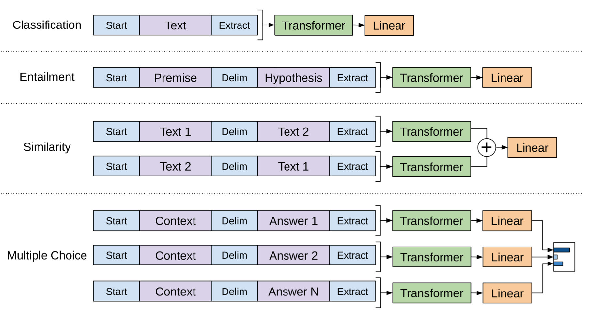

GPT 将不同的自然语言处理（NLP）任务的输入转化为统一的序列格式，使得预训练的生成模型（图中的 Transformer）可以直接接受它们进行处理，避免为每个任务设计特定的模型架构。

以下符号将遵循原论文的表述，这里将用到三种**特殊词元**（Special Token）：

- **开始词元**（Start Token）: $\langle s \rangle$，表示序列起始。
- **结束词元**（End Token）: $\langle e \rangle $，表示序列结束。
- **分隔词元**（Delimiter Token）: `$`，用于分隔子序列，例如前提句和假设句，问题和答案。

> [!note]
>
> 这些标记并不是为人类设计的，而是为模型提供明确的语义提示，以便在训练中建立序列关系。
>
> 注意，这些符号在预训练时是不存在的，微调赋予了它们意义。

#### 1. 文本分类（Classification）

**文本分类**任务的输入是**单一文本**，目标是根据文本内容预测类别（例如电影评论情感分析：积极或消极）。

**输入格式**：

$$
\langle s \rangle \ \text{文本} \ \langle e \rangle
$$

#### 2. 文本蕴含（Textual Entailment）

**文本蕴含**任务，也称自然语言推理（NLI）[^4]，目标是判断**前提**（Premise）与**假设**（Hypothesis）之间的关系：

1. **蕴含**（Entailment）：由前提可以推出假设，p $\Rightarrow$ h。
2. **矛盾**（Contradiction）：前提与假设相矛盾。
3. **无关**（Neutral）：前提和假设无直接关联。

这是一个三分类问题，举个例子：

**蕴含**（positive TE，premise entails hypothesis）：

- **前提**：“所有鸟类都有翅膀。”
- **假设**：“麻雀有翅膀。”
- **关系**：假设可以从前提推导出，因此为**蕴含**。

**矛盾**（negative TE，premise contradicts hypothesis）：

- **前提**：“所有鸟类都有翅膀。”
- **假设**：“企鹅没有翅膀。”
- **关系**：假设与前提的事实相矛盾，因此为**矛盾**（对了，企鹅是鸟）。

**无关**（non-TE，premise does not entail nor contradict）：

- **前提**：“所有鸟类都有翅膀。”
- **假设**：“所有鸟类都会飞。”
- **关系**：假设无法从前提中推导，也不矛盾，因此为**无关**。

**输入格式**：

$$
\langle s \rangle \ \text{前提} \ \$\ \text{假设} \ \langle e \rangle
$$

[^4]: [Textual entailment - Wikipedia](https://en.wikipedia.org/wiki/Textual_entailment)

#### 3. 语义相似性（Semantic Similarity）

在**语义相似性**任务中，目标是判断两个句子是否在语义上相似，例如 Quora 问题对检测（Quora Question Pairs，QQP）要求识别两个问题是否相似。

> *“Similarity For similarity tasks, there is no inherent ordering of the two sentences being compared. To reflect this, we modify the input sequence to contain both possible sentence orderings (with a delimiter in between) and process each independently to produce two sequence representations $h^m_l$ which are added element-wise before being fed into the linear output layer.”*

由于句子对没有固有的顺序，论文采用了以下方法：

1. 将句子对按照两种可能的顺序输入模型 (即 $A; B$ 和 $B; A$)。
2. 对两种输入序列分别处理，生成的最后一层激活向量 ($h^m_l$) 进行**逐元素相加**（element-wise addition）。
3. 加和后的表示被输入到线性层中，用于判断语义相似性。

**输入格式**：

$$
\begin{align}
\langle s \rangle \ \text{句子A} \ \$\ \text{句子B} \ \langle e \rangle \\
\langle s \rangle \ \text{句子B} \ \$\ \text{句子A} \ \langle e \rangle
\end{align}
$$

#### 4. 选择题（Multiple Choice）

在**选择题任务**中，模型需要从多个候选答案中选择一个最可能的正确答案，例如问答（Question Answering，QA）和常识推理（Commonsense Reasoning）。

> *“For these tasks, we are given a context document $z$, a question $q$, and a set of possible answers $\{a_k\}$. We concatenate the document context and question with each possible answer, adding a delimiter token in between to get $[z; q; \$; a_k]$. Each of these sequences are processed independently with our model and then normalized via a softmax layer to produce an output distribution over possible answers.”*

此时的输入通常包括三个部分，以问答任务为例：

1. **上下文文档** $z$ :问题的背景信息。
2. **问题** $q$ :需要解答的问题。
3. **候选答案集** $\{a_k\}$ :多个可能的答案。

**输入格式**：

$$
\begin{align}
\langle s \rangle \ \text{文档} z \ \text{问题} q \ \$\ \text{答案} a_1 \ \langle e \rangle\\
\langle s \rangle \ \text{文档} z \ \text{问题} q \ \$\ \text{答案} a_2 \ \langle e \rangle\\
\vdots \\
\langle s \rangle \ \text{文档} z \ \text{问题} q \ \$\ \text{答案} a_k \ \langle e \rangle
\end{align}
$$

这些序列会被**独立处理**，最后通过 softmax 归一化生成概率分布。

## 训练细节

### 无监督预训练（Unsupervised pre-training）

在预训练阶段，模型的目标是最大化未标注语料的语言建模函数：

$$
L_1(\mathcal{U}) = \sum_i \log P(u_i \mid u_{i-k}, \ldots, u_{i-1}; \Theta)
$$

其中：

- $\mathcal{U}$ :未标注的文本语料。
- $u_i$ :第 $i$ 个词。
- $k$ :上下文窗口的大小（即当前词基于前 $k$ 个词预测）。
- $\Theta$ :模型参数。

**具体流程**

1. **输入嵌入**

   将输入序列 $U = {u_{-k}, \ldots, u_{-1}}$ 映射到嵌入空间：
   
   $$h_0 = U W_e + W_p$$

   - $W_e$ :词嵌入矩阵。
   - $W_p$ :位置嵌入矩阵。
   - $h_0$ :初始输入的嵌入表示。

2. **多层 Transformer 编码**

   输入嵌入 $h_0$ 通过 $n$ 层 `transformer_block` 逐层处理：
   
   $`h_l = \texttt{transformer\_block}(h_{l-1}) \; \forall i \in [1, n]`$

   - $h_l$ :第 $l$ 层的输出。

3. **预测下一个词**

   最后一层的输出 $h_n$ 被映射回词汇表维度，生成下一个词的概率分布：
   
   $$P(u) = \texttt{softmax}(h_n W_e^T)$$

   - $W_e^T$ :词嵌入矩阵的转置，将隐藏状态映射回词汇表。
   - **softmax**：归一化概率分布。

> [!tip]
>
> 更准确一点应该是**自监督**（Self-supervised）而非无监督，这是一个较新（相对于 2018 年发布的 GPT）的说法，源于 2019 年 [Yann LeCun](https://www.facebook.com/yann.lecun) 在 Facebook 上发表的帖文：
>
> 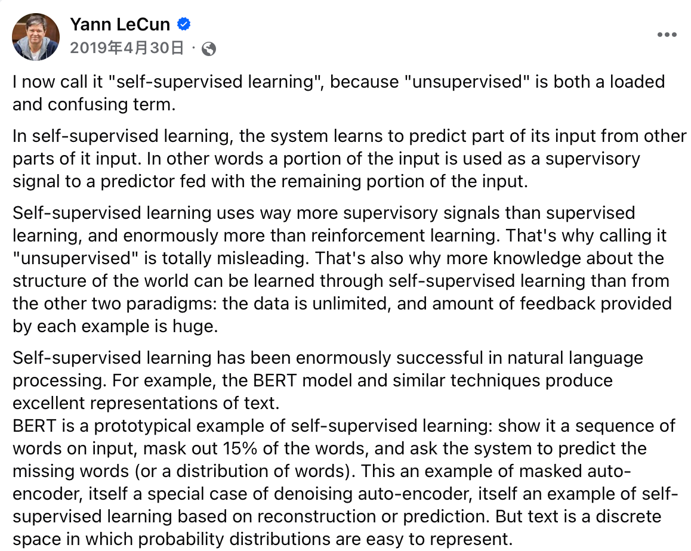

#### 相关设置

- **数据集**：
  
  - 使用 **BooksCorpus** 数据集[^5][^6]，包含大约 **7,000 本未出版的书籍**，数据主要从电子书分发平台 **Smashwords** 抓取。
  
    > [!tip]
    >
    > BERT 预训练时除了 BooksCorpus 数据集（8 亿词元）外，还使用了英文维基百科（**English Wikipedia**， 25 亿词元），所以 BERT 的训练资料大概为 GPT 的四倍。
    >
    > “... 所以它在这个数据集上训练了一个比 GPT 大三倍的模型  ($\text{BERT}_\text{LARGE}$) 也是可以理解的” - [沐神论文精读 31:32 - 32:47 部分 ](https://www.bilibili.com/video/BV1AF411b7xQ/?share_source=copy_web&vd_source=40b3e12ca72bba004f5dd21c08776797&t=1892)
  
  - 使用 **ftfy** 库清理原始文本，标准化标点符号和空白字符，然后使用 **spaCy** 分词器。
  
  - 使用 **Byte-Pair Encoding (BPE)** 进行子词分解，词汇表大小为 **40,000**。
  
- **超参数设置**

  - **Transformer 相关**：

    - **层数 $n_{layers}=12$**：Transformer 解码器的层数。

      > We trained a 12-layer **decoder-only** transformer with masked self-attention heads (768 dimensional states and 12 attention heads).
      >
      > 原论文在 4.1 Setup 的 Model specifications 中提到了 `decoder-only`。

    - **隐藏层维度 $d_{model}=768$**：每个隐藏层的维度为 768。

    - **注意力头数 $n_{heads}=12$**：每层的多头注意力机制包含 12 个注意力头，每个头的维度为 64, $12 * 64 = 768$。

      > 以上数学符号与 GPT-3 的表 2-1 一致。

    - **前向层维度**：Transformer 中 FFN 的隐藏层维度为 3072。

    - **Dropout 率**：残差连接、嵌入层和注意力中均设置为 **0.1**。

    - **总参数量**：约 117M。

  - **其他**：

    - **训练轮数**：100。

    - **批量大小**：64。

    - **最大序列长度**：512。

    - **优化器**：Adam。

    - **学习率调度**：

      - 初始学习率为 **0**，前 **2000 步**线性增加至最大值 $2.5 \times 10^{-4}$。
      - 然后采用**余弦衰减**策略逐渐减小学习率。

      同 Transformer 一样有线性增加热身的过程，但具体的衰减方式和热身步数不同。

    - **L2 正则化**：权重 $w = 0.01$。

    - **激活函数**：**GELU**（Gaussian Error Linear Unit）。

    - **位置嵌入**：采用可学习的位置嵌入矩阵，而非原始 Transformer 中的正弦嵌入。


[^5]: [Aligning books and movies: Towards story-like visual explanations by watching movies and reading books](https://arxiv.org/pdf/1506.06724).
[^6]: [BookCorpus - Wikipedia](https://en.wikipedia.org/wiki/BookCorpus)

### 有监督微调（Supervised Fine-Tuning）

在预训练阶段完成后，模型可以根据具体的下游任务进行微调。假设我们现在有一个标注数据集 $C$，其中每个样本包含一个输入序列 $x = (x^1, \dots, x^m)$ 和对应的标签 $y$。

此时的目标是最大化标签 $y$ 在输入序列 $x$ 下的条件概率：

$$
L_2(C) = \sum_{(x, y)} \log P(y \mid x^1, \ldots, x^m).
$$

**具体流程**

1. **特定任务输入处理**

   - 文本分类: $\langle s \rangle \text{文本} \langle e \rangle$
   - 文本蕴含: $`\langle s \rangle \text{前提} \, \$ \, \text{假设} \langle e \rangle`$
   - 语义相似性: $`\begin{align}
\langle s \rangle \ \text{句子A} \ \$\ \text{句子B} \ \langle e \rangle \\
\langle s \rangle \ \text{句子B} \ \$\ \text{句子A} \ \langle e \rangle
\end{align}`$
   - 选择题: $`\langle s \rangle \text{上下文} \, \$ \, \text{问题} \, \$ \, \text{答案} \langle e \rangle`$

2. **微调目标**

   微调阶段的目标是优化以下条件概率：
   
   $$P(y \mid x^1, \ldots, x^m) = \texttt{softmax}(h_l^m W_y)$$

   - $h_l^m$ :输入序列 $x = (x^1, \dots, x^m)$ 经过预训练模型的最后一层隐藏状态，注意上标 $m$ 代表了位置。
   - **$W_y$**：线性层的权重矩阵（该层接在预训练模型之后），用于将隐藏状态 $h_l^m$ 映射到标签空间。可以理解为预训练模型后接线性层，比如对于二分类任务，对应的代码是 `nn.Linear(hidden_size, 2)`。

3. **辅助目标**

   > *“We additionally found that including language modeling as an auxiliary objective to the fine-tuning helped learning by (a) improving generalization of the supervised model, and (b) accelerating convergence. This is in line with prior work [50, 43], who also observed improved performance with such an auxiliary objective. Specifically, we optimize the following objective (with weight $\lambda$):”*

   为了提高泛化能力和加速收敛，微调阶段还引入了预训练的语言建模目标函数作为辅助，最终的目标函数如下：
   
   $$L_3(C) = L_2(C) + \lambda L_1(C)$$

   - $\lambda$ :辅助目标函数的权重。

#### 相关设置

微调阶段对 12 个下游任务进行了实验，按照之前的分类：

- **数据集**

  - **文本分类**：Stanford Sentiment Treebank-2 (SST-2)、Corpus of Linguistic Acceptability (CoLA)。
  - **文本蕴含**：SNLI、MultiNLI、Question NLI、RTE、SciTail。
  - **语义相似性**：MSR Paraphrase Corpus (MRPC)、Quora Question Pairs (QQP)、STS Benchmark (STS-B)。
  - **选择题**：RACE、Story Cloze。

- **超参数设置（大多数任务）**

  除了以下超参数，其余均复用预训练阶段的参数设置。

  - **微调轮数**：3
  - **批量大小**：32
  - **学习率调度**：
    - 热身步数为训练总步数的 **0.2%**。
    - 最大学习率调整为 $6.25 \times 10^{-5}$，热身后采用**线性衰减**策略。
  - **Dropout 率**：分类器层（就是预训练模型之后的线性层）设置为 0.1。
  - **辅助目标权重**: $\lambda = 0.5$。

到目前为止，还看不到现在 ChatGPT 的影子，因为针对不同的任务还需要进行微调，不能简单的直接用对话的形式获取答案，即便论文后续有提及 Zero-shot，但实际效果一般。

## 关于 Zero-shot

其实 Zero-shot 并非 GPT-2 才引入，在 GPT-1 中（第 7 页的 Zero-shot Behaviors 部分）就已经探讨了生成式预训练模型的 Zero-shot 性能，即模型在没有针对某些特定任务进行微调的情况下，也能通过预训练过程中学习到的知识直接完成这些任务。

> *“A hypothesis is that the underlying generative model learns to perform many of the tasks we evaluate on in order to improve its language modeling capability and that the more structured attentional memory of the transformer assists in transfer compared to LSTMs. ”*
>
> - 论文假设，预训练语言模型的生成目标让模型在学习语言建模能力的过程中，掌握了大量任务相关的语言知识。
> - Transformer 架构的**结构化注意力机制**（Structured Attentional Memory）相比于 LSTM 具有更好的迁移性。
>
> *“We designed a series of heuristic solutions that use the underlying generative model to perform tasks without supervised finetuning.”*
>
> 作者设计了一系列启发式方法，通过直接使用生成预训练模型（无需监督微调）解决不同下游任务。
>
> *“For SST-2 (sentiment analysis), we append the token `very` to each example and restrict the language model’s output distribution to only the words positive and negative and guess the token it assigns higher probability to as the prediction..”*
>
> 以情感分析任务为例，对于输入：
>
> ```
> The movie was incredibly entertaining.
> ```
>
> 增加 `very`：
>
> ```
> The movie was incredibly entertaining. very
> ```
>
> 限制生成的输出仅包含“positive”和“negative”，最后根据预测的概率确定情感。
>
> 下图展示了模型在不同任务上的零样本性能随预训练迭代次数的变化趋势。性能指标归一化到随机猜测与当前 SOTA 之间：
>
> 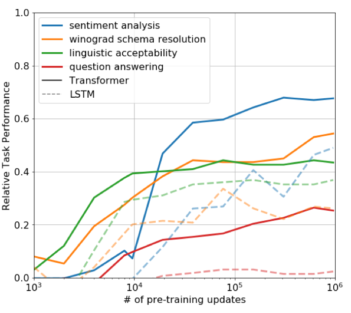
>
> 可以看到，随着训练的进行，任务性能稳定增长，但离 SOTA 还有不小的差距。

# GPT-2

**Language Models are Unsupervised Multitask Learners**
Alec Radford et al. | [PDF](https://cdn.openai.com/better-language-models/language_models_are_unsupervised_multitask_learners.pdf) | [Code - 官方 Tensorflow](https://github.com/openai/gpt-2) | OpenAI | 2019.02

> “当自己的模型被人用更大的数据集（+维基百科）和更大的模型  ($\text{BERT}_\text{LARGE}$) 打败的时候，应该怎么去回应？”
>
> [GPT，GPT-2，GPT-3 论文精读【论文精读】 33:12 - 46:05 部分](https://www.bilibili.com/video/BV1AF411b7xQ/?share_source=copy_web&vd_source=40b3e12ca72bba004f5dd21c08776797&t=1992)

GPT-2 的整体设计思想相较于 GPT-1 没有变化，但通过模型规模的扩展和数据集的优化，在**零样本学习**（Zero-Shot Learning）上迈出了一大步。此前该领域的模型或受限于架构或受限于规模，性能远不如 GPT-2。

## 关键改进

### 更大的数据集

GPT-2 使用了 **WebText** 数据集进行训练。WebText 的文本来源是 4500 万个经过 Reddit 用户过滤后的网页链接（至少有 3 karma，karma 可以当成点赞），经过去重和清理后，最终包含 800 万篇文档，总计约 40GB 的文本（GPT-1 数据集的大小约为 1GB）。为了避免评估数据的“泄漏”，数据集还特意去除了常见的数据来源（比如维基百科）。

同时，因为数据集的变化，词汇表从 40,000 扩展到了 50,257。

值得一提的是，GPT-2 采用了字节级的 BPE (Byte-level Byte Pair Encoding) 进行分词（GPT-1 使用的是 BPE）。

### 更大的模型

GPT-2 的参数规模（15 亿参数）远超其前身 GPT-1（1.1 亿参数） 以及当时的主流模型（如 $\text{BERT}_\text{LARGE}$ 的 3.4 亿参数）。但模型主体架构并没有修改，只是调整了一些超参数：

- **层数** $n_{layers}$ :12 → 48。
- **隐藏层维度** $d_{model}$ :768 → 1,600。
- **最大序列长度**：512 → 1,024。
- **批量大小**：64 → 512。

另外，还引入了一些细节优化：

- **层归一化（Layer Normalization）**：调整至每个子模块的输入端（Pre-Norm），类似于预激活残差网络，同时在最后的自注意力模块后增加额外的层归一化。
- **残差权重初始化**：采用了 $1/\sqrt{N}$ 的权重缩放因子，其中 $N$ 是残差层的深度。

> 表 2 列出了四种不同参数规模的模型配置：
>
> 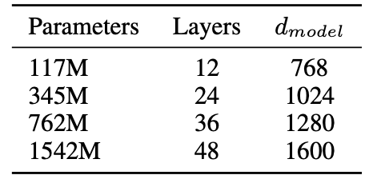
>
> 其中，最小的模型（117M）对标 GPT-1，第二个模型（345M）对标 $\text{BERT}_\text{LARGE}$，最大的模型（1152M）称为 GPT-2，它的另一个名字是 GPT2-XL。

### 零样本学习（Zero-shot Learning）

GPT-2 的**创新**在于对零样本学习的进一步探索。GPT-1 微调时引入了三种特殊符号: $\langle s \rangle$, $`\$`$, $\langle e \rangle$，这些符号在预训练时并没有见过，所以会在微调的时候学习表示。而 GPT-2 不再引入这些特殊符号，采用与 GPT-1 预训练数据格式更相似的自然输入格式（其实就是不做多余操作，单纯的预训练），这也是后续文献常提及以及我们现在耳熟能详的 `Prompt`，作者给出了两个例子：

- **翻译**：`translate to French, English text, French text`。

  > 论文的表 1 展示了 WebText 中自然出现的语言翻译例子：
  >
  > 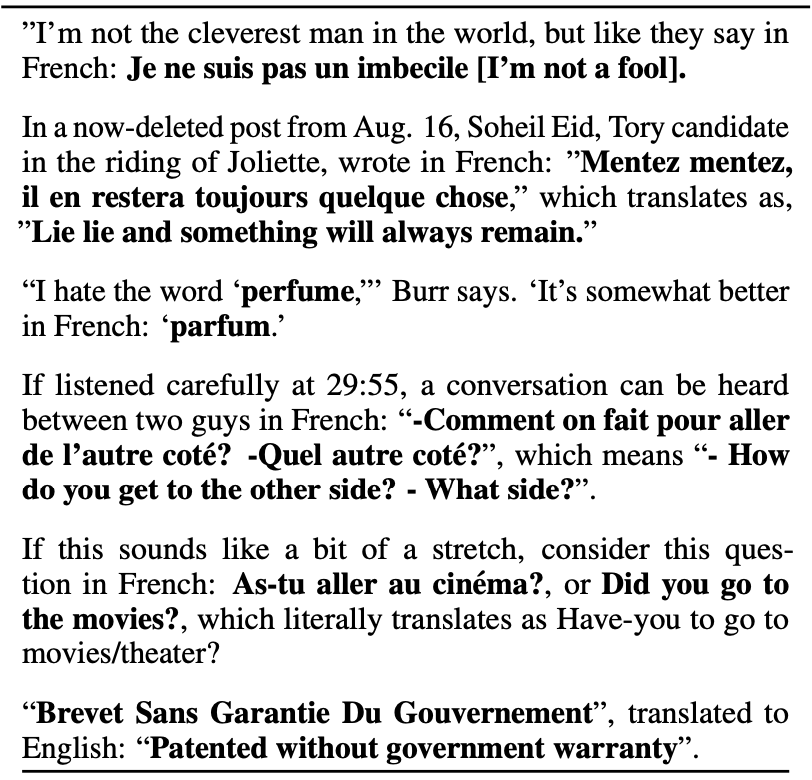

- **阅读理解**：`answer the question, document, question, answer`。

正如论文标题 *「Language Models are Unsupervised Multitask Learners」* 所暗示的，在 GPT-2 的原始论文中，模型并未针对任何下游任务进行有监督的微调（fine-tuning），而是直接在大规模文本上进行预训练，然后在各种 NLP 任务上测试性能。

所以 Zero-shot 或许可以片面地理解为**只**进行预训练。

## Q1：什么是 Pre-Norm？和 GPT-1 的区别？

> 结合图例[^7]进行理解：
>
> 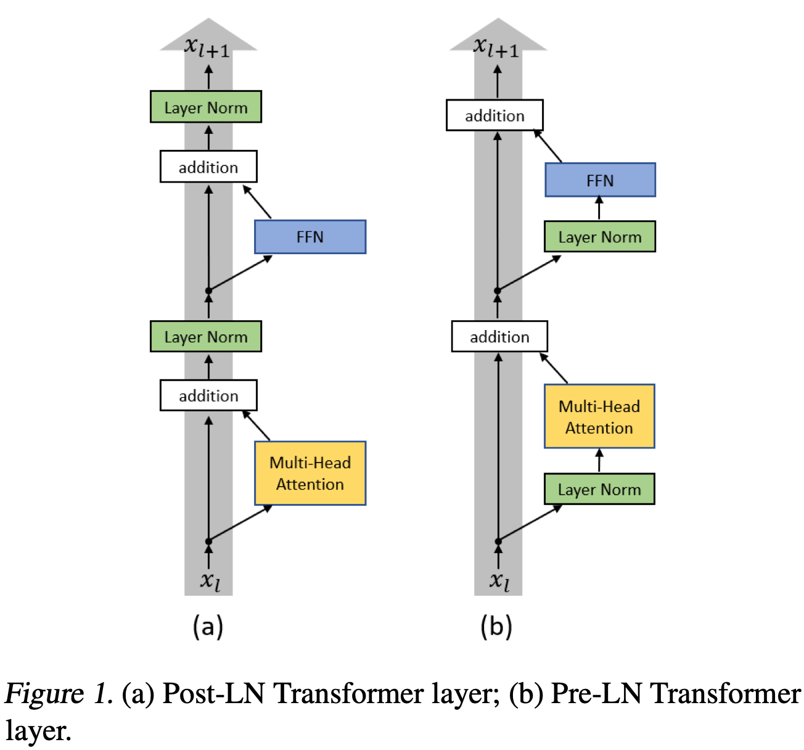

如上图 (b) 所示，Pre-Norm 就是将层归一化放在**子层（SubLayer，例如自注意力或前馈网络）**的输入端，也就是在残差连接之前。

具体公式如下：

- **Pre-Norm**：

  $$\text{Output} = x + \text{SubLayer}(\text{LayerNorm}(x))$$

- **Post-Norm**（Transformer 原始架构及 GPT-1）：

  $$\text{Output} = \text{LayerNorm}(x + \text{SubLayer}(x))$$

**GPT-1 和 GPT-2 的区别**

- **GPT-1**：**Post-Norm**，层归一化放置在残差连接之后。
- **GPT-2**：**Pre-Norm**，层归一化放置在残差连接之前。

**代码差异**

- **Post-Norm**：

  ```python
  def forward(self, x, sublayer):
      # 子层的输出 + 残差连接后，进行归一化
      return self.norm(x + sublayer(x))
  ```

- **Pre-Norm**：

  ```python
  def forward(self, x, sublayer):
      # 输入先进行归一化，再传入子层，最后进行残差连接
      return x + sublayer(self.norm(x))
  ```

> [!tip]
>
> 感兴趣的话可以访问官方代码：[gpt-2 block](https://github.com/openai/gpt-2/blob/9b63575ef42771a015060c964af2c3da4cf7c8ab/src/model.py#L123)。

[^7]: [On Layer Normalization in the Transformer Architecture](https://arxiv.org/pdf/2002.04745).

# GPT-3

**Language Models are Few-Shot Learners**
Tom B. Brown et al. | [PDF](https://arxiv.org/pdf/2005.14165) | OpenAI | 2020.05

## 关键改进

GPT-3 秉承传统：更大的数据集和更大的模型。

### 更大的数据集

> GPT-3 的训练数据集来自 **Common Crawl、WebText2、Books1、Books2** 和 **Wikipedia**，论文的表 2.2 列出了它们的规模、在训练中的权重分布以及训练 3000 亿 tokens 时经过的轮次:
>
> 

| 数据集                 | 数据量（tokens 数） | 训练混合中的权重 | 训练 3000 亿 tokens 时的轮次 |
| ---------------------- | ------------------- | ---------------- | ---------------------------- |
| Common Crawl（过滤后） | 约 4100 亿          | 60%              | 0.44                         |
| WebText2               | 约 190 亿           | 22%              | 2.9                          |
| Books1                 | 约 120 亿           | 8%               | 1.9                          |
| Books2                 | 约 550 亿           | 8%               | 0.43                         |
| Wikipedia              | 约 30 亿            | 3%               | 3.4                          |

> *“Note that during training, datasets are not sampled in proportion to their size, but rather datasets we view as higher-quality are sampled more frequently, such that CommonCrawl and Books2 datasets are sampled less than once during training, but the other datasets are sampled 2-3 times. This essentially accepts a small amount of overfitting in exchange for higher quality training data.”*

需要注意的是，尽管 **Common Crawl** 是规模最大的数据集，数据量远超其他来源（是 WebText2 的 21.58 倍），但由于质量参差不齐，其训练权重被适当降低，仅为总权重的 **60%**，而较小但质量更高的 **WebText2** 则分配了 **22%** 的训练权重。

#### 对于数据集 Common Crawl 的处理

**Common Crawl** 是一个非盈利组织，会定期抓取互联网上的网页数据并免费开放给研究者使用。为了准备更大的数据集以匹配更大的模型，OpenAI 团队从 Common Crawl 中下载了 **2016-2019 年**的 **41** 个数据分片，总量约 **45TB（压缩后）**。在经过一系列自动化过滤、重新采样和去重处理后，最终得到约 **570GB 的文本**，对应约 **4100 亿** Byte-Pair Encoding (BPE) 子词。

> 以下细节来自于论文的附录 A，可以跳过。

##### 1. 自动过滤 (Automatic Filtering)

- **训练集与分类器**
  为了从原始 Common Crawl 中挑选更高质量的文档，研究团队先将高质量语料（如 **WebText**、**Wikipedia**、以及 **web books corpus**）合并为“正例”数据集，并将**未经过滤的 Common Crawl** 用作“负例”。随后，利用 **Spark** 的标准分词器（Tokenizer）和 **HashingTF** 提取文本特征，并以此训练 **Logistic Regression**（逻辑回归）分类器，为每篇文档打“分”：

  - 得分越高，表示该文档越“接近”高质量语料；
  - 得分较低则表明该文档的质量“可能”欠佳。

- **重新采样 (Resampling) 与 Pareto 分布**
  利用所得到的“质量分数”，研究团队基于以下条件进行重新采样：
  
  $`\texttt{np.random.pareto}(\alpha) > 1 - \texttt{document\_score}`$
  
  其中 $\alpha = 9$，文档得分越高越容易保留，但低分文档也有一定概率（出于维持多样性的考虑）。

  通过代码来理解对应的概念：

  ```python
  import numpy as np
  
  def filter_rate(doc_score, alpha=9, trials=100000):
      """
      doc_score: 文档分数 (0 - 1)
      alpha: Pareto 分布的形状参数
      trials: 模拟采样次数
      """
      # 1. 生成很多个 Pareto(α=9) 随机数
      samples = np.random.pareto(alpha, size=trials)  
      # 2. 计算阈值
      threshold = 1 - doc_score
      # 3. 看看有多少随机数满足：sample > threshold
      pass_count = np.sum(samples > threshold)
      return pass_count / trials
  
  # 测试不同的 document_score
  scores = [0.0, 0.2, 0.5, 0.8, 0.9]
  for s in scores:
      rate = filter_rate(s)
      print(f"doc_score={s}, 通过过滤的模拟比例={rate:.4f}")
  ```
  
  **输出**：
  
  ```
  doc_score=0.0, 通过过滤的模拟比例=0.0021
  doc_score=0.2, 通过过滤的模拟比例=0.0051
  doc_score=0.5, 通过过滤的模拟比例=0.0268
  doc_score=0.8, 通过过滤的模拟比例=0.1950
  doc_score=0.9, 通过过滤的模拟比例=0.4243
  ```
  
  - 当 **doc_score=0**，约 0.2% 的保留率。
  - 当 **doc_score=0.9**，约 42% 的保留率。
  
  **核心思路**：
  
  ```python
  if np.random.pareto(alpha) > 1 - document_score:
      keep_doc = True
  else:
      keep_doc = False
  ```

##### 2. 模糊去重 (Fuzzy Deduplication)

为进一步提升模型质量并降低过拟合风险，研究团队还对各训练集做了**模糊去重**（使用和上面分类相同的特征）：

- 在 **Spark** 中使用 **MinHashLSH**（配置 10 个哈希），利用与上面分类相同的特征来检测文档间的相似度，对相似度较高的文档进行删除。
- 同时将 **WebText** 中出现的内容从 Common Crawl 里删除（方式同上）。

整体来看，模糊去重将减少 10% 的数据量。

> *“A major methodological concern with language models pretrained on a broad swath of internet data, particularly large models with the capacity to memorize vast amounts of content, is potential contamination of downstream tasks by having their test or development sets inadvertently seen during pre-training. To reduce such contamination, we searched for and attempted to remove any overlaps with the development and test sets of all benchmarks studied in this paper. Unfortunately, a bug in the filtering caused us to ignore some overlaps, and due to the cost of training it was not feasible to retrain the model. In Section 4 we characterize the impact of the remaining overlaps, and in future work we will more aggressively remove data contamination.”*

在文中提到尽管他们尝试去重（训练集和测试集之间，train-test overlap），但因为某些 bug，有可能存在少量测试集内容被模型“见”过，从而造成一定的数据泄漏。而由于训练成本太大，他们没法重来，论文的第 4 节评估了数据泄露的影响。

### 更大的模型

> GPT-2 训练了 4 个不同规模的模型，最大的称为 GPT-2，GPT-3 训练了 8 个，同样 :)，最大的称为 GPT-3。表 2.1 列出了 GPT-3 八种不同规模的模型的具体训练配置，参数量从 1.25 亿到 1750 亿，所有模型的训练总量为 3000 亿个 tokens。
>
> 

GPT-3 延续 GPT-2 的架构：**Decoder-only、Pre-Norm、Byte-level BPE 分词**，调整的超参数如下：

- **层数** $n_{layers}$ :48 → 96。
- **隐藏层维度** $d_{model}$ :1,600 → 12,288。
- **注意力头数** $n_{heads}$ :25 → 96。
- **最大序列长度**：1,024 → 2,048。
- **批量大小**：512 → 3,200,000。

此外，GPT-3 的变化是**交替使用**密集（Dense）和局部带状稀疏注意力（Locally Banded Sparse Attention），这一机制类似于 [Sparse Transformer](https://arxiv.org/pdf/1904.10509)。

### 少样本学习（Few-shot Learning）

> *“Few-Shot (FS) is the term we will use in this work to refer to the setting where the model is given a few demonstrations of the task at inference time as conditioning [RWC+19], but no weight updates are allowed. ”*

GPT-3 **创新**在于示例样本的引入，推理时，通过在提示（Prompt）中加入少量样本来“告诉”模型要完成的具体任务，不对模型进行任何参数更新。相较于需要额外微调（fine-tuning）的做法，极大减少了特定任务的数据量需求。

具体操作：**使用 K 样本作为条件（Conditioning）**

- 在推理时，对于评估集中（test set）的每一个测试样本，模型都会：

  1. 从对应任务的**训练集**中随机选出 K 个示例样本。
  2. 将这 K 条示例样本（上下文 + 正确答案）与**当前测试样本的上下文**拼接在一起，作为模型的输入（Prompt）。
  3. 让模型根据提示（Prompt）来生成答案。

> [!note]
>
> - 如果某个任务本身没有公开的训练集（如 LAMBADA、StoryCloze），则从对应的开发集（dev set）中选 K 条示例样本；如果只有一个数据集（如原版 Winograd），则直接在同一数据集里选。
> - **K 的取值**从 **0**（零样本）到模型上下文窗口（GPT-3 中为 2048 tokens）所能容纳的最大示例样本数（一般为 10 - 100）。K 值通常比较大，但并不是越大越好，因此在有开发集（dev set）和测试集（test set）的任务上，往往会先在开发集上尝试多个 K 值，然后选择最优 K 再跑测试。

> *“The main disadvantage is that results from this method have so far been much worse than state-of-the-art fine-tuned models.”*
>
> 对于 GPT-3 来说，Few-shot 方式在特定场景下不及 SOTA（State-of-the-Art）的微调模型。

#### 具体任务

论文中提到了两大类常见任务：**选择题（Multiple Choice）** 和 **自由生成（Free-form Completion）**，它们的核心流程都是“将示例样本与测试样本合并到 Prompt 中”。

1. **选择题（Multiple Choice）**

   > 下图为 RACE-h 数据集的示例样本：
   >
   > 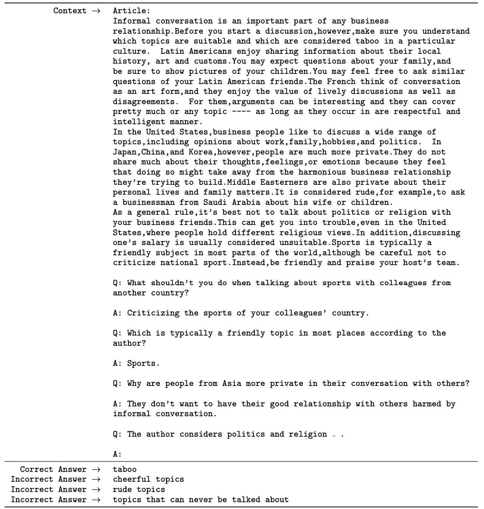

   每个示例（训练/开发集中的题目）附上该题的**正确答案**，对于真正需要预测的那道题，则只给出题目，但**不**给出答案，然后计算每个候选答案的条件概率（语言模型似然，LM likelihood）：
   
   $$P(\text{completion} \mid \text{context})$$
   
   换个写法或许更容易理解：
   
   $$P(\mathbf{y} \mid \mathbf{x}) \;=\; \prod_{t=1}^{T} P\bigl(y_t \;\bigm|\; \mathbf{x},\, y_{1:t-1}\bigr)$$
   
   其中：

   - $\mathbf{x}$ :上下文的文本（context）。
   - $\mathbf{y} = (y_1, y_2, \ldots, y_T)$ :候选答案（completion）。
   - $y_{1:t-1}$ :在第 $t$ 个 token 之前已“生成”的内容。

   > *“For most tasks we compare the per-token likelihood (to normalize for length), however on a small number of datasets (ARC, OpenBookQA, and RACE) we gain additional benefit as measured on the development set by normalizing by the unconditional probability of each completion ...”*

   对于少数数据集（例如 ARC、OpenBookQA 和 RACE），使用无条件概率归一化： 
   
   $`\frac{P(\text{completion} \mid \text{context})}{P(\text{completion} \mid \text{answer\_context})}`$
   
   其中 $answer\_context$ 是通用字符串（例如 `"Answer: "` 或 `"A: "`），用来提示模型生成答案。

   > *“On tasks that involve binary classification, we give the options more semantically meaningful names (e.g. “True” or “False” rather than 0 or 1) and then treat the task like multiple choice”*

   二分类任务可以当作选择题来处理，此时会给两个选项起更语义化的名字（例如 “True/False” 而不是 1/0）。

2. **自由生成（Free-form Completion）**

   > *“On tasks with free-form completion, we use beam search with the same parameters as [RSR+19]: a beam width of 4 and a length penalty of α = 0.6.”*

   对于生成型任务（如翻译、摘要），采用与 [[RSR+19]](https://arxiv.org/pdf/1910.10683) 相同的 **beam search** 参数来做解码：

   - **束宽（Beam width）** ：4
   - **长度惩罚（Length Penalty）**: $\alpha = 0.6$

   模型最终输出的文本，会根据相应任务所常用的指标（F1、BLEU、Exact Match 等）来打分。

#### Q1：Zero-Shot、One-Shot 和 Few-Shot 的区别是什么？和 In-Context Learning 有什么关系？与微调有什么不同？

> 图 2.1：
>
> 
>
> *“... fine-tuning is the traditional method, whereas zero-, one-, and few-shot, which we study in this work, require the model to perform the task with **only** forward passes **at test time**. We typically present the model with **a few dozen examples** in the few shot setting.”*

过去常说的“学习（Learning）”通常隐含参数更新的过程，所以 In-Context Learning 初见的确是一个容易迷惑的表述，可以直接将其理解为 Prompting，毕竟现在与 AI 对话的过程就是不更新模型参数的。

In-Context Learning 的特点是：**通过上下文提示（Prompting）完成任务，不更新模型参数（即不需要进行微调）**。有些说法认为 Few-Shot 并非 In-Context Learning，这**在 GPT 的语境**下是不准确的（论文覆盖了一些已有概念，所以容易混淆），根据 GPT-3 论文的定义，**Zero-Shot**、**One-Shot** 和 **Few-Shot** 本质上是 **In-Context Learning** 的三种不同设置（见上图左上角的叙述），其区别仅在于上下文提示中任务样本的数量：

- **Zero-Shot Learning（零样本学习）**：

  - 仅通过**自然语言**（Prompt）描述任务，不提供任何样本。

    ```
    Translate English to French:
    cheese =>
    ```

- **One-Shot Learning（单样本学习）**：

  - 除了任务描述外，提供**一个样本**。

    ```
    Translate English to French:
    sea otter => loutre de mer
    cheese =>
    ```

- **Few-Shot Learning（小样本学习）**：

  - 除了任务描述外，提供**多个样本**（按论文的叙述是几十个：*“a few dozen examples”*）。

    ```
    Translate English to French:
    sea otter => loutre de mer
    peppermint => menthe poivree
    plush girafe => girafe peluche
    cheese =>
    ```

那么 In-Context Learning 与传统的微调（Fine-Tuning）有什么不同呢？

**简单来说：In-Context Learning 是通过提示（Prompt）完成任务，而微调是通过训练更新参数来适应任务。一个不更新参数，一个更新参数。一个是 eval，一个是 train。**

## 呈现

### 图 3.1：初见 Scaling Law

> 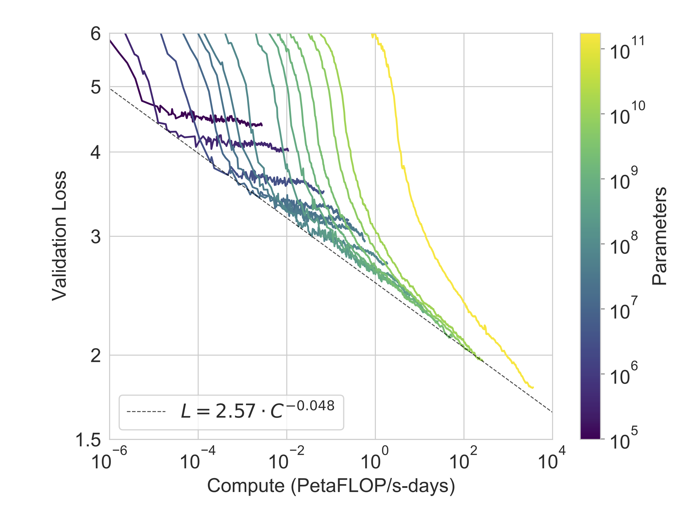
>
> **注**：线条颜色与模型参数对应（图右的 Colormap)。
>
> [GPT，GPT-2，GPT-3 论文精读【论文精读】 1:18:02 - 1:20:18 部分](https://www.bilibili.com/video/BV1AF411b7xQ/?share_source=copy_web&vd_source=40b3e12ca72bba004f5dd21c08776797&t=4682)

上图展示了 GPT-3 不同参数规模的模型在训练计算量（compute）与交叉熵验证损失（cross-entropy validation loss）之间的幂律关系（power-law）。这与 [[KMH+20]](https://arxiv.org/pdf/2001.08361) 提出的 Scaling Law 一致，增加模型的规模和计算量会显著降低语言建模损失，甚至这个趋势在扩展了两个数量级后一样成立，只有轻微的偏离。所以在之后使用了大模型和数据的研究中，会经常看到对 [KMH+20] 的引用（*“虽然我们的研究看起来是「力大砖飞」，但是确实是有效且有参考依据的！”*）。

> [!Tip]
>
> 横轴的 **PetaFLOP/s-days**（PF-days）是衡量计算量的指标，将其拆开进行理解：
>
> - **Peta-**
>   - 一个数量级的前缀，对应于 $10^{15}$。
> - **Floating point operations per second** (**FLOPS** / **flops** / **flop/s**)
>   - 每秒可以执行的浮点运算次数。
>   - 因此，1 PetaFLOPS = $10^{15}$ 浮点运算/秒。
> - **Days**
>   - 天。
>
> 1 **PetaFLOP/s-day** 可以理解为以 $10^{15}$ 次浮点运算/秒的速度运行一天（24 小时 = 86400 秒）所完成的浮点运算次数：
> 
> $$
> 1 \text{ PetaFLOP/s} \times 1 \text{ day}   = 10^{15}\ \text{flop/s} \times 86400\ \text{s}   = 8.64 \times 10^{19}\ \text{flops}
> $$

**那么，是谁这么有先见之明的提出 Scaling Law 呢？**

答：**OpenAI**。是的，[[KMH+20]](https://arxiv.org/pdf/2001.08361) 也是由 OpenAI 的团队所发表。

### 图 3.2：LAMBADA 数据集上的模型表现

> 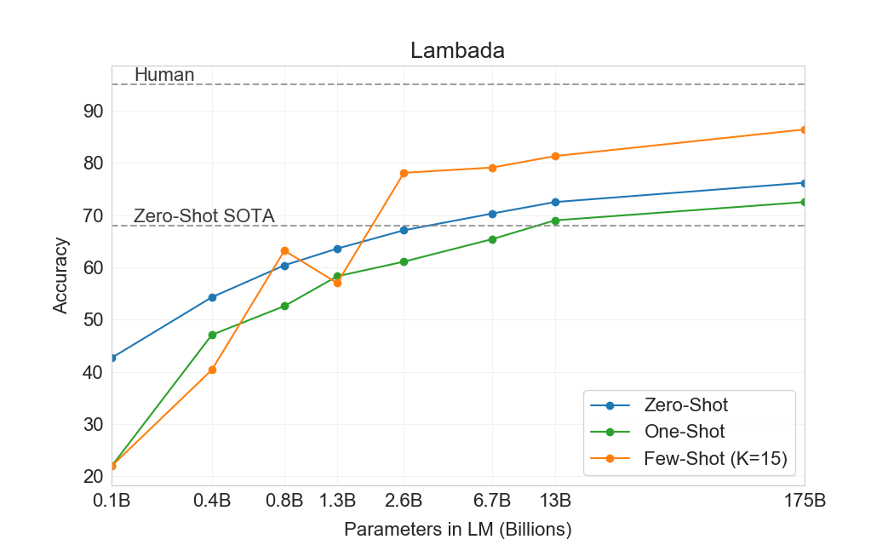

论文中有多个类似的图，这里以 3.2 为例进行解读：

- **横轴**：语言模型的参数规模，从较小的模型（138M 参数）到 GPT-3 175B 的超大规模模型。
- **纵轴**：模型在 LAMBADA 数据集上的准确率（Accuracy）。
- **虚线部分**：
  - **Human**：表示人类在该任务上的基准表现。
  - **Zero-shot SOTA**：零样本学习的当前最优的基准表现。
- **K=15**：示例样本数量为 15 个。

少样本（Few-Shot）设置下的模型表现明显优于零样本（Zero-Shot）和单样本（One-Shot），在此设置下 175B 的模型准确率达到了 **86.4%**，相比当前零样本的 SOTA 提升了 **18%**。

> *“One note of caution is that an analysis of test set contamination identified that a significant minority of the LAMBADA dataset appears to be present in our training data – however analysis performed in Section 4 suggests negligible impact on performance. ”*

虽然 LAMBADA 数据集中有一部分与训练数据存在重叠（train-test overlap），但论文第 4 节进行的分析表明，它对性能的影响可以忽略不计。

### 图 3.4：少样本设置在翻译任务上的模型表现

> 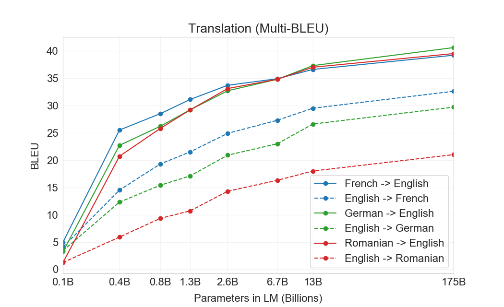

图中不同颜色代表不同的语言翻译任务，**实线**表示其他语言翻译至英语，**虚线**表示英语翻译至其他语言，可以观察到两个现象：

1. 随着模型参数规模的扩大，所有数据集的翻译性能均表现出一致的提升趋势。

2. 翻译至英语（实线）的性能显著优于从英语翻译至其他语言（虚线）。

   > 论文 3.3 节中有简单提及数据集的语言占比：
   >
   > *“Although GPT-3’s training data is still primarily English (93% by word count), it also includes 7% of text in other languages.”*
   >
   > GPT-3 的训练数据中 93% 为英语，7% 为其他语言。

> [!note]
>
> 正文部分仅展示了少样本设置下翻译任务的表现，更多细节（包括其他设置的表现）可以翻阅[论文](https://arxiv.org/pdf/2005.14165)的附录 H。

### 图 3.10：少样本设置在算术任务上的模型表现

> 
>

上图展示了不同规模模型在少样本设置下对 10 项算术任务的表现。可以观察到小模型在所有算术任务中的表现都非常差，即便是 130 亿（13B）参数的模型，做二位数加减法的时候也只有 50% 的准确率。回想一下，GPT-2 的参数规模为 15 亿（1.5B），这张图也侧面展示了 GPT-2 的算术能力。有趣的点在于当参数规模扩展到 1750 亿（175B）时，模型的算术能力变得可用：

- **二位数加法和减法：** 准确率分别达到 **100%** 和 **98.9%**。
- **三位数加法和减法：** 准确率分别达到 **80.2%** 和 **94.2%**。
- **二位数乘法：** 准确率为 **29.2%**。
- **四位数加减法**：准确率为 **25-26%**。
- **复合运算**（比如 $9*(7+5)$）： 准确率为 **21.3%**。
- **五位数加减法**：准确率下跌至 **9-10%**。

> “这么大的模型连简单的二位数加减法都不能完全算对，它真的不是靠死记硬背吗？”
>
> 其实，小时候我们知道 1+1=2 的时候，也是靠背的「毕竟谁家小学学实分析啊，大学一般也不学啊 :)」。
>
> 不过确实不是靠死记硬背：
>
> 「*To spot-check whether the model is simply memorizing specific arithmetic problems, we took the 3-digit arithmetic problems in our test set and searched for them in our training data in both the forms "<NUM1> + <NUM2> =" and "<NUM1> plus <NUM2>". Out of 2,000 addition problems we found only 17 matches (0.8%) and out of 2,000 subtraction problems we found only 2 matches (0.1%), suggesting that only a trivial fraction of the correct answers could have been memorized. In addition, inspection of incorrect answers reveals that the model often makes mistakes such as not carrying a “1”, suggesting it is actually attempting to perform the relevant computation rather than memorizing a table.*」
>
> 为了验证 GPT-3 的算术能力是否依赖于死记硬背，研究团队对训练数据进行了排查，发现：
>
> - 三位数算术任务：
>   - 加法问题中，仅 **0.8%** 的题目出现在训练数据中。
>   - 减法问题中，仅 **0.1%** 的题目出现在训练数据中。
> - 模型错误通常是由于计算过程中的具体问题（如没有带“1”）。
>
> 因此，GPT-3 的算术表现更多依赖计算能力，而非问题记忆。

## 局限性（Limitations）

论文第 5 节对 GPT-3 的不足之处做了讨论，主要包括以下几个方面：

1. 虽然整体的文本生成质量较高，但在生成长篇幅内容时，仍然会出现语义重复、失去连贯性或前后自相矛盾的情况，并且偶尔还会冒出不符合逻辑的句子或段落。
2. 模型对“常识物理”（common sense physics）存在明显不足，对于“如果把奶酪放进冰箱会不会融化？”之类的常识性问题依然容易答错。
3. 因为采用的是解码器架构，所以在部分需要双向理解的任务上表现一般，比如说完形填空，又或者两句话之间互相比较，以及阅读理解的任务。根据过去的文献，推测大型的双向模型在微调方面会比 GPT-3 更强。
4. 在训练时默认“平等地”对待所有词（token），缺乏什么词重要，什么词不重要的概念。
5. 当前预训练的语言模型缺乏多模态信息（比如视觉方面），难以获得对世界的直观“理解”。
6. 样本有效性低，预训练所需的数据量远超过人类一生中所能阅读的文本量。
7. 不清楚在少样本的设置下，模型是在“学新技能”还是在“检索已有知识”。
8. 模型参数规模太大导致推理费用昂贵。论文提到，可以将大型模型蒸馏为更小规模子模型用于特定任务，因为大型模型可能包含了大量用不到的知识。
9. 缺乏可解释性、预测校准（calibration）不佳，性能方差比人类高很多，并且带有训练数据的偏见。

# GPT-4

**GPT-4 Technical Report**
[PDF](https://arxiv.org/pdf/2303.08774) | [精简版](https://openai.com/index/gpt-4-research/) | OpenAI | 2023.03

> [GPT-4论文精读【论文精读·53】](https://www.bilibili.com/video/BV1vM4y1U7b5/?share_source=copy_web&vd_source=40b3e12ca72bba004f5dd21c08776797)
>
> “这份技术报告中没有任何的技术细节”
>
> 原论文中也很直白的指出了这一点：
>
> *“Given both the competitive landscape and the safety implications of large-scale models like GPT-4, this report **contains no further details** about the architecture (including model size), hardware, training compute, dataset construction, training method, or similar.”*
>
> “考虑到像 GPT-4 这样的大规模模型的竞争格局和安全影响，本报告**没有包含**有关架构（包括模型大小）、硬件、训练计算、数据集构造、训练方法或类似的进一步细节。”

技术报告中的正文部分其实很短，仅有 14 页，附录实验相关有 77 页。

研究团队花了 6 个月时间去对齐人类的偏好，这也说明了OpenAI 确实在 22 年 8 月就已经完成了模型的训练，接着的半年时间都是在准备 GPT-4 的发布。

## 能力测试

> *“In a casual conversation, the distinction between GPT-3.5 and GPT-4 can be subtle. The difference comes out when the complexity of the task reaches a sufficient threshold—GPT-4 is more reliable, creative, and able to handle much more nuanced instructions than GPT-3.5.”*

在日常对话中，GPT-3.5 和 GPT-4 的区别是非常小的，当任务复杂度达到一定程度的时候，才能体现出差异 — GPT-4 更可靠、更有创意，并且能够处理更细致的指令。

另外，模型并没有针对测试进行特定的训练，但考虑到模型还是可能在预训练过程中看到部分问题，研究团队做了两种测试：

1. **正常版本（包含可能在预训练中见过的题目）**
2. **去污染版本（移除已知在预训练中见过的题目）**

在最终报告时，选取二者中较低的分数。

### 专业和学术考试

> **表 1**
>
> 
>
> GPT 在各类学术和专业考试上的最终得分（根据对应官方评分方式计算），模拟了真实考试的条件和评分方式，同时给出了模型相应分数所处的考生百分位（越高越好，上限 100）。
>
> **图 4**
>
> 
>
> 跟上表基本对应，图中横坐标列出了不同考试科目，这些科目按照 GPT-3.5 的成绩从低到高进行排列，纵坐标为考生的分位数（下限）。

GPT-4 虽然在现实场景中还不如人类，但在各种专业和学术基准测试中已经有了显著提升，经常超越大多数的人类考生，比如在模拟律师资格考试（Bar Exam）中得分达到考生前 10% 的水准（GPT-3.5 仅为后 10%），从图中可以看出，在大多数的考试下，GPT-4 的表现优于 GPT-3.5。另外，上图保守地报告了百分位数范围的下限，这会使得某些考试排名看起来偏低，以  AP Biology 为例（5/5），虽然已经拿到了最高分，但报告中显示的百分位数仅为 85%，因为约有 15% 的考生能拿到 5 分。

但在一些领域的表现还是比较差：

- **AP Calculus BC（微积分）**
- **AMC 12（美国高中数学竞赛）**
- **Codeforces Rating（编程竞赛）**
- **AP English Literature（英语文学）**/ **AP English Language（英语语言）**：“GPT 系列的模型虽然能生成大段流利的文本，但写出来的东西很多时候就是翻来覆去的空话和大话，非常的冠冕堂皇，并没有真正自己的思考，没有一个深刻的洞见，所以真的让一个以英语为母语，而且是教英语课的老师去批卷子，这个分数肯定不会高到哪去。”

> [!TIP]
>
> AP（Advanced Placement）[^8]，又称为大学先修课程，主要面向对某学科有兴趣、想提前学习大学内容的高中生。所有科目的 AP 考试分数都是从 1 到 5：
>
> - **1** - 不合格（No recommendation）
> - **2** - 勉强合格（Possibly qualified）
> - **3** - 合格（Qualified）
> - **4** - 良好（Well qualified）
> - **5** - 优秀（Extremely well qualified）

[^8]: [Advanced Placement - Wikipedia](https://en.wikipedia.org/wiki/Advanced_Placement).

#### RLHF 对模型能力的影响（附录 B：Impact of RLHF on capability）

> *“The model’s capabilities on exams appear to stem primarily from the pre-training process and are not significantly affected by RLHF. On multiple choice questions, both the base GPT-4 model and the RLHF model perform equally well on average across the exams we tested (see Appendix B).”*

作者认为模型的考试能力似乎主要来自于预训练过程，与后期的人类反馈微调（RLHF）关系不大。

> **表 8**
>
> 
>
> 表中为 GPT-4 的基础（base）模型与 RLHF 后（post-RLHF）模型在考试基准的比较，最终平均正确率分别为 73.7% 与 74.0%，这表明 RLHF 并没有从根本上改变基础模型的能力。

### 基准测试

> **表 2**
>
> 

除了考试外，GPT-4 还在一些传统机器学习研究中常用的 NLP 基准（benchmark）上进行了评估，从表中可以观察到：GPT-4 全面优于过去的语言模型（如 GPT-3.5、PaLM、LLaMA 等），甚至在大部分数据集（除了 DROP）上超过了经过特定数据集微调或者其他使用其他技巧实现的绝对 SOTA 模型。

### 多语言能力

> Example of MMLU questions, translated into other languages. Note, we use consistent choice tokens (A–D):
>
> 

现有的基准测试任务大多都是由英语编写的，为了了解模型在其他语言的能力，研究团队使用 Azure Translate 将 MMLU 基准测试 (包含 57 个学科、共 14,000 道选择题) 翻译成了多种语言，并与其他主流 LLM（GPT-3.5、Chinchilla、PaLM）在原 MMLU 上的表现进行了对比。

> **图 5**
>
> 

结果显示，在测试的 26 种语言中，GPT-4 在 **24 种语言**上的成绩超过了其他 LLM 在**英语**下的表现，即便是一些训练资料稀缺的语言，如拉脱维亚语（Latvian）、威尔士语（Welsh）和斯瓦西里语（Swahili）。

> [!note]
>
> 因为是四选一，所以随机猜测（Random Guessing）的准确率为 25%。

> **“拿 GPT-4 帮你写文章或者润色文章真的靠谱吗？它真的就不需要人再去校验了吗？”**
>
> “答案至少目前来讲是否定的，肯定还是需要有一些人去做校验的，比如说在 GPT-4 它自己的这个技术文档里，附录的 65 页的图 8，在标题最后有一个 comment 忘了删除 'fixes to plot legend and title'”
>
> 
>
> 即便是最新 24 年 3 月 arXiv 上 [v6](https://arxiv.org/pdf/2303.08774v6) 版本的 PDF，这个 comment 也依旧存在，类似的现象比如「引用在句号之后」在附录部分也经常出现。

### 多模态能力

GPT-4 不再是一个单一的语言模型，而是多模态模型，能够处理**图像和文本输入**，并生成文本输出。

#### 图片理解

> **表 3**
>
> 

论文的表 3 展示了一个图像输入的示例，该示例图分三部分，描述的是 VGA 转 Lightning 接口神奇的点在于，模型分别识别了这三块区域，并 Get 到了其中的幽默点：“把一个大且过时的 VGA 接口插入一个小的现代智能手机充电端口是荒谬的”。

#### “小猿搜题”

> 
>
> 对于题目截图来说，需要先通过内在的 OCR 才能让模型知道图片中的文字，示例的题目甚至是用法语描述的物理题，但 GPT-4 处理的一样很好，用英文一步步地做出了解答。
>
> **更多的例子位于原文的 34 - 39 页**。

#### 基准测试

单纯的例子没有太大的说服力，因为有可能是挑选个例进行展示，来看看它在视觉任务上的效果[^9]：

> 
>
> 可以观察到略逊色于 NLP 基准测试的表现。
>
> *“However, these numbers do not fully represent the extent of its capabilities as we are constantly discovering new and exciting tasks that the model is able to tackle.”*

[^9]: [精简版 Visual inputs 中的表格](https://openai.com/index/gpt-4-research/).

