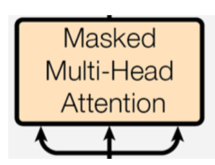
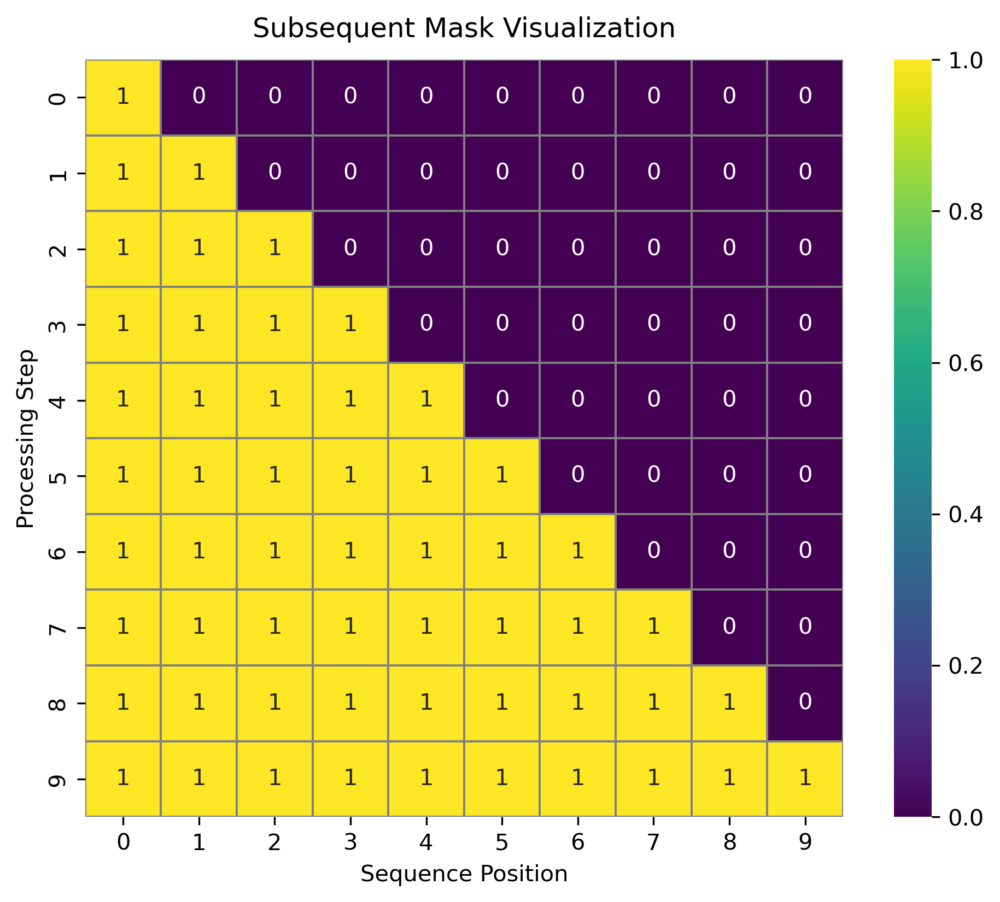
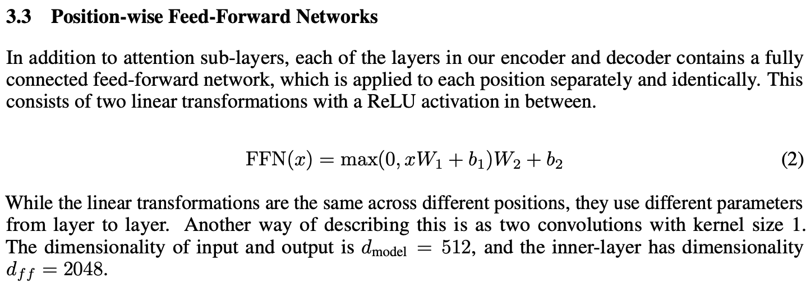
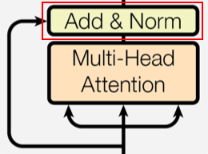
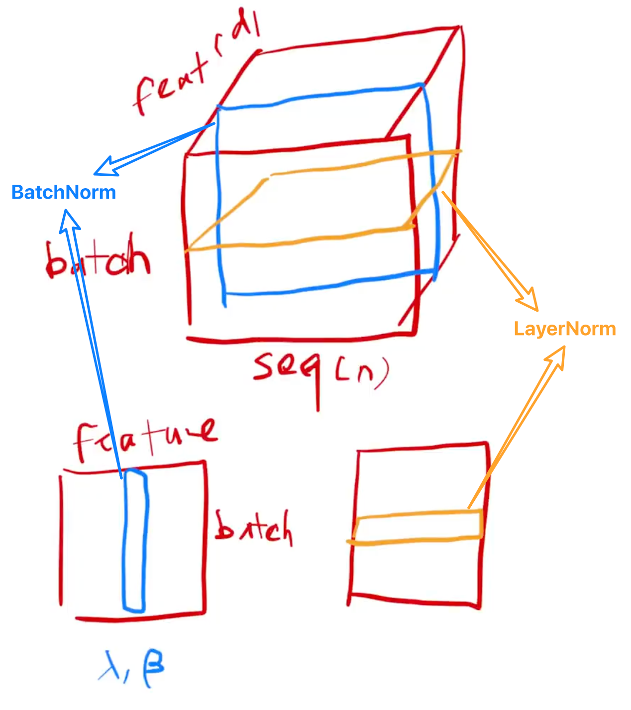
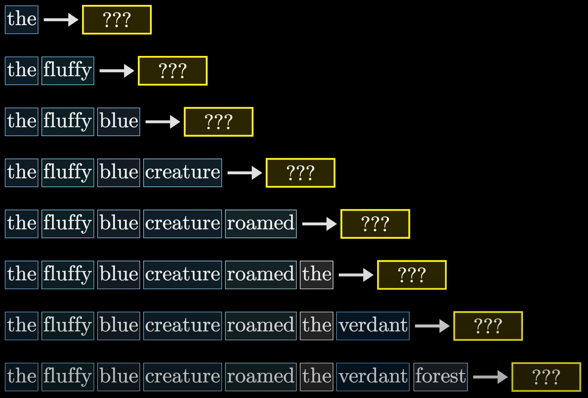

# Transformer

**Attention Is All You Need**
Ashish Vaswan et al. | [arXiv 1706.03762](https://arxiv.org/pdf/1706.03762) | [Code - 官方 Tensorflow](https://github.com/tensorflow/tensor2tensor) | NeurIPS 2017 | Google Brain

> **学习 & 参考资料**
>
> - **机器学习**
>
>   —— 李宏毅老师的 B 站搬运视频
>
>   - [自注意力机制 Self-attention（上）](https://www.bilibili.com/video/BV1Wv411h7kN?spm_id_from=333.788.videopod.episodes&vd_source=436107f586d66ab4fcf756c76eb96c35&p=38)
>
>   - [自注意力机制 Self-attention（下）]( https://www.bilibili.com/video/BV1Wv411h7kN/?p=39&share_source=copy_web&vd_source=e46571d631061853c8f9eead71bdb390)
>   - [Transformer（上）](https://www.bilibili.com/video/BV1Wv411h7kN/?p=49&share_source=copy_web&vd_source=e46571d631061853c8f9eead71bdb390)
>   - [Transformer（下）](https://www.bilibili.com/video/BV1Wv411h7kN/?p=50&share_source=copy_web&vd_source=e46571d631061853c8f9eead71bdb390)
>
> - **论文逐段精读**
>
>   —— 沐神的论文精读合集
>
>   - [Transformer论文逐段精读【论文精读】]( https://www.bilibili.com/video/BV1pu411o7BE/?share_source=copy_web&vd_source=e46571d631061853c8f9eead71bdb390)
>
> - **3Blue1Brown**
>
>   —— 顶级的动画解释
>
>   - [【官方双语】GPT是什么？直观解释Transformer | 深度学习第5章]( https://www.bilibili.com/video/BV13z421U7cs/?share_source=copy_web&vd_source=e46571d631061853c8f9eead71bdb390)
>   - [【官方双语】直观解释注意力机制，Transformer的核心 | 【深度学习第6章】](https://www.bilibili.com/video/BV1TZ421j7Ke/?share_source=copy_web)
>
> - **代码**
>
>   —— 哈佛 NLP 团队公开的 Transformer 注释版本，基于 PyTorch 实现。
>
>   - [The Annotated Transformer](https://nlp.seas.harvard.edu/annotated-transformer/)
>   
> - 可视化工具
>
>   - [TRANSFORMER EXPLAINER](https://poloclub.github.io/transformer-explainer/)
>
>     观察 Self-Attention 的中间过程，并调节右上角的温度（Temperature）查看对概率的影响。
>
>     需要注意的是网页端演示的不是传统的 Transformer 架构，而是 GPT-2（Decoder-Only），不过后续的大型语言模型（LLMs）本质都是 Transformer 的子架构，通过 GPT-2 理解相同的部分是完全足够的。
>
>

## 时间线

> ✍️ 未完待续...（完结后删除该模块）
>
> 因为 Transformer 是一篇非常重要的基础论文，所以我决定尽量复现所有模块以供学习，网络上确实有很多的资料，但都没有解决我曾经阅读时的疑惑，本文将附带曾经的困惑并指引理解，但时间过于久远，有一些地方可能在目前我觉得“显然”所以没有提及，读者可以大胆的提出 issue，我会在闲暇时补充对应叙述（Python 语言相关的函数问题就不赘述了，查文档更清晰）。

2024.10.23 文字概述

2024.10.24 注意力机制：缩放点积->单头->掩码->self->cross

2024.10.25 总结论文 Attention 之间的区别，增加 QA 中对并行的回答

2024.10.27 完成多头注意力模块

2024.10.28 完成编码器-解码器中所有子模块的代码实现

2024.10.29 Embedding 模块以及其和 Linear 的区别

TODO：输入和输出处理代码/编码器-解码器代码和论文结果展示，消除因为时间线拉长可能导致的繁杂冗余表述。

## 目录

   - [前言](#前言)
     - [RNN 的递归原理](#rnn-的递归原理)
- [贡献](#贡献)
- [模型架构](#模型架构)
   - [快速概述](#快速概述)
      - [编码器-解码器架构](#编码器-解码器架构)
      - [编码器的输入处理](#编码器的输入处理)
      - [解码器的输出处理](#解码器的输出处理)
- [注意力机制详解](#注意力机制详解)
   - [缩放点积注意力机制](#缩放点积注意力机制)
      - [公式解释](#公式解释)
      - [代码实现](#代码实现)
      - [为什么需要 Mask 机制？](#为什么需要-mask-机制)
   - [单头注意力机制（Single-Head Attention）](#单头注意力机制single-head-attention)
      - [掩码机制（Masked Attention）](#掩码机制masked-attention)
      - [自注意力机制（Self-attention）](#自注意力机制self-attention)
         - [代码实现](#代码实现-1)
      - [交叉注意力机制（Cross-Attention）](#交叉注意力机制cross-attention)
         - [代码实现](#代码实现-2)
      - [总结](#总结)
   - [多头注意力机制（Multi-Head Attention）](#多头注意力机制multi-head-attention)
      - [数学表达](#数学表达)
      - [Q：现在所说的性能“提升”真的是由多头造成的吗？](#q现在所说的性能提升真的是由多头造成的吗)
      - [优化循环](#优化循环)
      - [代码实现](#代码实现-3)
- [Position-wise Feed-Forward Networks（FFN）](#position-wise-feed-forward-networksffn)
   - [数学表达](#数学表达-1)
   - [代码实现](#代码实现-4)
- [残差连接（Residual Connection）和层归一化（Layer Normalization, LayerNorm）](#残差连接residual-connection和层归一化layer-normalization-layernorm)
   - [Add（残差连接，Residual Connection）](#add残差连接residual-connection)
      - [代码实现](#代码实现-5)
   - [Norm（层归一化，Layer Normalization）](#norm层归一化layer-normalization)
      - [BatchNorm 和 LayerNorm 的区别](#batchnorm-和-layernorm-的区别)
      - [LayerNorm 的计算过程](#layernorm-的计算过程)
      - [代码实现](#代码实现-6)
      - [澄清：LayerNorm 最后的缩放与线性层 (nn.Linear) 的区别](#澄清layernorm-最后的缩放与线性层-nnlinear-的区别)
   - [Add &amp; Norm](#add--norm)
      - [代码实现](#代码实现-7)
   - [嵌入（Embeddings）](#嵌入embeddings)
      - [为什么需要嵌入层？](#为什么需要嵌入层)
      - [代码实现](#代码实现-8)
      - [什么是 nn.Embedding()？和 nn.Linear() 的区别是什么？](#什么是-nnembedding和-nnlinear-的区别是什么)
- [QA](#qa)
   - [Q1: 什么是编码器-解码器架构？](#q1-什么是编码器-解码器架构)
   - [Q2: 什么是自回归与非自回归？](#q2-什么是自回归与非自回归)
      - [自回归（Auto-Regressive）](#自回归auto-regressive)
      - [非自回归（Non-Autoregressive）](#非自回归non-autoregressive)
   - [Q3: 既然输出 $h_t$ 同样依赖于 $h_{t-1}$, 那并行体现在哪？](#q3-既然输出-h_t-同样依赖于-h_t-1-那并行体现在哪)
      - [训练阶段的并行化](#训练阶段的并行化)

## 前言

Transformer 已成为语言模型领域的奠基之作，大幅推动了自然语言处理（**NLP**，Natural Language Processing）的发展。

Transformer 最初是为**机器翻译任务**提出的，因此其背景介绍离不开 NLP，在 Transformer 出现之前，NLP 领域的 **SOTA**（State-of-the-Art）模型以循环神经网络（**RNN**）架构为主导，包含 LSTM 和 GRU 等变体。实际在这一阶段的工作中，**注意力机制**已经在**编码器-解码器架构**中广泛应用（与 RNN 一起使用），但 RNN 本身有两个缺点： 

- **按时间步递进处理数据**：输入必须按照序列顺序依次处理，导致并行计算能力受限，训练速度慢。
- **长距离依赖问题**：在处理长序列时，信息容易随时间步 $t$ 的增加而被遗忘，尽管 LSTM 等变体在一定程度上减轻了此问题。  

> [!note]
>
> ### RNN 的递归原理
>
> 给定输入序列 $X = (x_1, x_2, ..., x_t)$, $X$ 可以理解为一个句子，RNN 的隐藏状态递归更新如下：
> 
> $$
> h_t = f(W_h h_{t-1} + W_x x_t + b)
> $$
> 
> 其中：
>
> - $W_h$ 和 $W_x$ 是权重矩阵，分别用于处理上一时间步的状态 $h_{t-1}$ 和当前时间步的输入 $x_t$。
> - $b$ 是偏置项。
>
> 从公式可以看出，每个时间步的状态 $h_t$ 依赖于**前一时间步** $h_{t-1}$, 这使得 RNN 无法并行处理序列中的数据，所以 RNN 训练得慢。

## 贡献

在 RNN 的模型基础下，研究人员使用了**注意力机制**来增强模型的性能，但 Transformer 彻底颠覆了这一架构：**它直接放弃了 RNN 的递归结构，只使用注意力机制来编码和解码序列信息**。这相当于，大家原本都端着碗（RNN）拿着筷子（Attention）吃饭，而 Transformer 直接把“碗”扔掉，表示只用筷子也能直接吃，而且吃得又快又好，还不用装饭。展示了一种全新的思路：**Attention Is All You Need**。

Transformer 的主要贡献如下：

- **取消递归结构，实现并行计算**

  通过采用**自注意力机制（Self-Attention）**，Transformer 可以同时处理多个输入序列，极大提高了计算的并行度和训练速度。

- **引入位置编码（Positional Encoding）并结合 Attention 机制巧妙地捕捉位置信息**

  在不依赖 RNN 结构的情况下，通过位置编码为序列中的每个元素嵌入位置信息，从而使模型能够感知输入的顺序。

## 模型架构


### 快速概述

#### 编码器-解码器架构

Transformer 模型基于**编码器**（左）- **解码器**（右）架构（如图中灰色透明框所示），

- **$N$** 表示编码器或解码器的**层数**，在原始 Transformer 论文中，均设为 $N=6$, 即编码器和解码器各由六层堆叠（Stack）而成。

- **编码器和解码器**均由以下组件构成：

  - **多头注意力机制（Multi-Head Attention）**
  
    通过多个注意力头提取不同子空间的上下文信息，捕捉输入序列中的全局依赖关系。
  
  - **前馈神经网络（Feed-Forward Network, FFN）**
  
    这是一个两层的全连接网络，使用非线性激活函数（ReLU）：
    
    $`\text{FFN}(x) = \max(0, xW_1 + b_1)W_2 + b_2`$
    
    FFN 在编码器和解码器中都被应用（蓝色框）。
  
  - **残差连接（Residual Connection）**
  
    残差连接形式为 $x + \text{SubLayer}(x)$, 缓解模型在训练深层网络时的梯度消失问题。
  
    **Add** 表示执行这一操作。
  
  - **层归一化（Layer Normalization, LayerNorm）**
  
    在 Transformer 中采用 LayerNorm，而不是 BatchNorm。这一步标准化每个**样本**的特征分布，在残差连接后进行：
    
    $`\text{LayerNorm}(x + \text{SubLayer}(x))`$
    
    对应于架构图中的 **Add & Norm**，即先进行残差连接再通过 LayerNorm 进行标准化。

#### 编码器的输入处理

- **嵌入层（Embedding Layer）**

  将**输入序列**（Inputs）的 Tokens 转换为固定维度的向量表示（Input embedding），使模型能够处理文本数据。

  - 关于 Token 可以阅读文章《[21. BPE vs WordPiece：理解 Tokenizer 的工作原理与子词分割方法](https://github.com/Hoper-J/AI-Guide-and-Demos-zh_CN/blob/master/Guide/21.%20BPE%20vs%20WordPiece：理解%20Tokenizer%20的工作原理与子词分割方法.md)》。

- **位置编码（Positional Encoding）**

  由于 Transformer 不像 RNN 那样具有时间序列性质，需通过**位置编码**（Positional Encoding）保留输入序列的顺序信息。

  - 使用**正弦和余弦函数**为每个位置生成唯一编码：
  - 
    $`PE_{(pos, 2i)} = \sin\left(\frac{pos}{10000^{\frac{2i}{d_{\text{model}}}}}\right)`$

    $`PE_{(pos, 2i+1)} = \cos\left(\frac{pos}{10000^{\frac{2i}{d_{\text{model}}}}}\right)`$

    其中 $pos$ 是位置索引, $i$ 是维度索引, $d_{\text{model}}$ 是嵌入向量的维度。

#### 解码器的输出处理

- **线性层（Linear Layer）**

  将解码器的最后一层输出映射到词汇表大小的向量，得到每个词的**未归一化概率（Logits）**。

  ```python
  self.proj = nn.Linear(d_model, vocab)
  ```

- **Softmax 层**

  对线性层的输出进行 **Softmax** 转换，生成在目标词汇表上的**概率分布**。

  二者结合（**Linear + Softmax**）：
  
  $`P(y_t \mid y_{<t}, X) = \text{Softmax}(W \cdot h_t + b)`$

  其中 $W$ 和 $b$ 为线性变换的参数, $h_t$ 是解码器在时间步 $t$ 的输出。

- **生成目标词**

  - 从 Softmax 输出的概率分布中选择当前时间步的词，常用的生成策略包括：

    - **贪心搜索（Greedy Search）**：每次选择概率最高的词。

    - **束搜索（Beam Search）**：保留多个可能的候选路径，以优化最终结果。

      阅读文章《[09. 深入理解 Beam Search：原理, 示例与代码实现](https://github.com/Hoper-J/AI-Guide-and-Demos-zh_CN/blob/master/Guide/09.%20深入理解%20Beam%20Search：原理%2C%20示例与代码实现.md)》。

    - **Top-K 和 Top-P 采样**：从概率分布中随机采样，以增加生成的多样性。

      阅读文章《[10. 什么是 Top-K 和 Top-P 采样？Temperature 如何影响生成结果？](https://github.com/Hoper-J/AI-Guide-and-Demos-zh_CN/blob/master/Guide/10.%20Top-K%20vs%20Top-P：生成式模型中的采样策略与%20Temperature%20的影响.md)》。

## 注意力机制详解

Transformer 的核心是**多头注意力机制（Multi-Head Attention）**，它能够捕捉输入序列中不同位置之间的依赖关系，并从多个角度对信息进行建模。模块将自底向上的进行讲解：在深入理解注意力机制前，首先需要理解论文使用的**缩放点积注意力机制（Scaled Dot-Product Attention）**。

### 缩放点积注意力机制


给定查询矩阵 $Q$、键矩阵 $K$ 和值矩阵 $V$, 其注意力输出的数学表达式如下：

$$
\text{Attention}(Q, K, V) = \text{Softmax}\left(\frac{Q K^\top}{\sqrt{d_k}}\right) V
$$

- **$Q$（Query）**: 用于查询的向量矩阵。
- **$K$（Key）**: 表示键的向量矩阵，用于与查询匹配。
- **$V$（Value）**: 值矩阵，注意力权重最终会作用在该矩阵上。
- **$d_k$**: 键或查询向量的维度。

> 理解 Q、K、V 的关键在于代码，它们实际上是通过线性变换从输入序列生成的，“故事”的延伸更多是锦上添花。

#### 公式解释

1. **点积计算（Dot Produce）**
   
   将查询矩阵 $Q$ 与键矩阵的转置 $K^\top$ 做点积，计算每个查询向量与所有键向量之间的相似度：
   
   $`\text{Scores} = Q K^\top`$
   
   - **每一行**表示某个查询与所有键之间的相似度（匹配分数）。
   - **每一列**表示某个键与所有查询之间的相似度（匹配分数）。
   
2. **缩放（Scaling）**
   
   > We suspect that for large values of $d_k$, the dot products grow large in magnitude, pushing the softmax function into regions where it has extremely small gradients 4. To counteract this effect, we scale the dot products by $\sqrt{d_k}$ .
   
   当 $d_k$ 较大时，点积的数值可能会过大，导致 Softmax 过后的梯度变得极小，因此除以 $\sqrt{d_k}$ 缩放点积结果的数值范围：
   $`\text{Scaled Scores} = \frac{Q K^\top}{\sqrt{d_k}}`$
   缩放后（Scaled Dot-Product）也称为注意力分数（**attention scores**）。
   
3. **Softmax 归一化**
   
   使用 Softmax 函数将缩放后的分数转换为概率分布：
   
   $`\text{Attention Weights} = \text{Softmax}\left(\frac{Q K^\top}{\sqrt{d_k}}\right)`$
   
   > **注意**：Softmax 是在每一行上进行的，这意味着每个查询的匹配分数将归一化为概率，总和为 1。
   
4. **加权求和（Weighted Sum）**
   
   最后，使用归一化后的注意力权重对值矩阵 $V$ 进行加权求和，得到每个查询位置的最终输出：
   $`\text{Output} = \text{Attention Weights} \times V`$

#### 代码实现

```python
import torch
import torch.nn.functional as F

def scaled_dot_product_attention(Q, K, V, mask=None):
    """
    计算缩放点积注意力。
    参数:
        Q: 查询矩阵 (batch_size, seq_len_q, embed_size)
        K: 键矩阵 (batch_size, seq_len_k, embed_size)
        V: 值矩阵 (batch_size, seq_len_v, embed_size)
        mask: 掩码矩阵，用于屏蔽不应该关注的位置 (可选)

    返回:
        output: 注意力加权后的输出矩阵
        attention_weights: 注意力权重矩阵
    """
    embed_size = Q.size(-1)  # embed_size
    
    # 计算点积并进行缩放
    scores = torch.matmul(Q, K.transpose(-2, -1)) / torch.sqrt(torch.tensor(embed_size, dtype=torch.float32))

    # 如果提供了掩码矩阵，则将掩码对应位置的分数设为 -inf
    if mask is not None:
        scores = scores.masked_fill(mask == 0, float('-inf'))

    # 对缩放后的分数应用 Softmax 函数，得到注意力权重
    attention_weights = F.softmax(scores, dim=-1)

    # 加权求和，计算输出
    output = torch.matmul(attention_weights, V)
    
    return output, attention_weights
```

**解释**

1. **缩放点积计算**

   使用 `torch.matmul(Q, K.transpose(-2, -1))` 计算查询与键之间的点积相似度，然后结果除以 $\sqrt{d_k}$ 进行缩放。

2. **掩码处理（Masked Attention）**

   如果提供了掩码矩阵（`mask`），则将掩码为 0 的位置的分数设为 $-\infty$（-inf）。这样在 Softmax 归一化时，这些位置的概率会变为 0，不参与输出计算：

   ```python
   if mask is not None:
       scores = scores.masked_fill(mask == 0, float('-inf'))
   ```

   > Softmax 函数的数学定义为：
   > 
   > $`\text{Softmax}(x_i) = \frac{e^{x_i}}{\sum_j e^{x_j}}`$
   > 
   > 当某个分数为 $-\infty$ 时, $e^{-\infty} = 0$, 因此该位置的权重为 0。
   
3. **Softmax 归一化**

   Softmax 将缩放后的分数转换为概率分布（对行），表示每个查询向量与键向量之间的匹配程度：

   ```python
   attention_weights = F.softmax(scores, dim=-1)
   ```

4. **加权求和（Weighted Sum）**

   使用注意力权重对值矩阵 $V$ 进行加权求和，生成最终的输出：

   ```python
   output = torch.matmul(attention_weights, V)
   ```

#### 为什么需要 Mask 机制？

- **填充掩码（Padding Mask）**

  在处理不等长的输入序列时，需要使用填充符（padding）补齐短序列。在计算注意力时，填充部分不应对结果产生影响（q 与填充部分的 k 匹配程度应该为 0），因此需要使用填充掩码忽略这些位置。

- **未来掩码（Look-ahead Mask）**

  > 
  
  在训练自回归模型（如 Transformer 中的解码器）时，为了防止模型“偷看”未来的词，需要用掩码屏蔽未来的位置，确保模型只能利用已知的上下文进行预测。

> [!note]
>
> 常见注意力机制除了缩放点积注意力，还有**加性注意力**（Additive Attention）注意力机制。

“那么 Q、K、V 到底是怎么来的？论文架构图中的三种 Attention 是完全不同的架构吗？”

让我们**带着疑惑往下阅读**，先不谈多头，理清楚Masked，self和cross 注意力到底是什么。

### 单头注意力机制（Single-Head Attention）

将输入序列（Inputs）通过线性变换生成**查询矩阵**（Query, $Q$）、**键矩阵**（Key, $K$）和**值矩阵**（Value, $V$），随后执行**缩放点积注意力**（Scaled Dot-Product Attention）。

是的，实际就这么简单，让我们直接查看处理的代码：

```python
class Attention(nn.Module):
    def __init__(self, embed_size):
        """
        单头注意力机制。
        参数:
            embed_size: 输入序列（Inputs）的嵌入（Input Embedding）维度，也是论文中所提到的d_model。
        """
        super(Attention, self).__init__()
        self.embed_size = embed_size

        # 定义线性层，用于生成查询、键和值矩阵
        self.w_q = nn.Linear(embed_size, embed_size)
        self.w_k = nn.Linear(embed_size, embed_size)
        self.w_v = nn.Linear(embed_size, embed_size)

    def forward(self, q, k, v, mask=None):
        """
        前向传播函数。
        参数:
            q: 查询矩阵 (batch_size, seq_len_q, embed_size)
            k: 键矩阵 (batch_size, seq_len_k, embed_size)
            v: 值矩阵 (batch_size, seq_len_v, embed_size)
            mask: 掩码矩阵，用于屏蔽不应关注的位置 (batch_size, seq_len_q, seq_len_k)

        返回:
            out: 注意力加权后的输出
            attention_weights: 注意力权重矩阵
        """
        # 将输入序列通过线性变换生成 Q, K, V
        Q = self.w_q(q)  # (batch_size, seq_len_q, embed_size)
        K = self.w_k(k)  # (batch_size, seq_len_k, embed_size)
        V = self.w_v(v)  # (batch_size, seq_len_v, embed_size)

        # 使用缩放点积注意力函数计算输出和权重
        out, attention_weights = scaled_dot_product_attention(Q, K, V, mask)

        return out, attention_weights
```

#### 掩码机制（Masked Attention）

> 

如果使用 mask 掩盖将要预测的词汇，那么 Attention 就延伸为 Masked Attention，这里的实现非常简洁，追溯 scaled_dot_product_attention() 的代码：

```python
# 计算分数
scores = torch.matmul(Q, K.transpose(-2, -1)) / torch.sqrt(torch.tensor(d_k, dtype=torch.float32))
    
# 如果提供了掩码矩阵，则将掩码对应位置的分数设为 -inf
if mask is not None:
    scores = scores.masked_fill(mask == 0, float('-inf'))

# 对缩放后的分数应用 Softmax 函数，得到注意力权重
attention_weights = F.softmax(scores, dim=-1)
```

在这段代码中，`mask` 矩阵用于指定哪些位置应该被遮蔽（即填充为 -∞），从而保证这些位置的注意力权重在 softmax 输出中接近于零。注意，掩码机制并不是直接在截断输入序列，也不是在算分数的时候就排除不应该看到的位置，因为看到也没有关系，不会影响与其他位置的分数，所以在传入 Softmax（计算注意力权重）之前排除就可以了。

下图展示了掩码机制的工作原理。对于**自回归生成任务**（训练时的解码器），掩码会覆盖未来的时间步，确保模型只能基于已有的部分生成当前的 token，掩码矩阵：



> [TRANSFORMER EXPLAINER](https://poloclub.github.io/transformer-explainer/) 可视化


另外，根据输入数据的来源，还可以将注意力分为**自注意力（Self-Attention）**和**交叉注意力（Cross-Attention)**。

#### 自注意力机制（Self-attention）


Transformer 模型架构使用到了三个看起来不同的注意力机制，我们继续忽视共有的 Multi-Head。观察输入，线条一分为三传入 Attention 模块，这意味着查询（query）、键（key）和值（value）实际上都来自**同一输入序列 $\mathbf{X}$**，数学表达如下：

$$
Q = XW^Q, \quad K = XW^K, \quad V = XW^V
$$

- **$W^Q, W^K, W^V$**：可训练的线性变换权重，实际上就是简单的线性层，对应的代码：

  ```python
  # 定义线性层，用于生成查询、键和值矩阵
  self.w_q = nn.Linear(embed_size, embed_size)
  self.w_k = nn.Linear(embed_size, embed_size)
  self.w_v = nn.Linear(embed_size, embed_size)
  ```

这就是**自**注意力机制。

##### 代码实现

```python
import torch
import torch.nn as nn
import torch.nn.functional as F

class SelfAttention(nn.Module):
    def __init__(self, embed_size):
        """
        自注意力（Self-Attention）机制。
        参数:
            embed_size: 输入序列的嵌入维度（每个向量的特征维度）。
        """
        super(SelfAttention, self).__init__()
        self.attention = Attention(embed_size)  # 使用通用Attention模块

    def forward(self, x, mask=None):
        """
        自注意力的前向传播。
        参数:
            x: 输入序列 (batch_size, seq_len, embed_size)
            mask: 掩码矩阵 (batch_size, seq_len, seq_len)

        返回:
            out: 自注意力加权后的输出 (batch_size, seq_len, embed_size)
            attention_weights: 注意力权重矩阵 (batch_size, seq_len, seq_len)
        """
        # 在自注意力机制中，q, k, v 都来自同一输入序列
        # q = k = v = x
        out, attention_weights = self.attention(x, x, x, mask)

        return out, attention_weights

```

那交叉注意力呢？

#### 交叉注意力机制（Cross-Attention）


在 Transformer 解码器中，除了自注意力外，还使用了 **交叉注意力（Cross-Attention）**。

如下图所示，解码器（右）在自底向上的处理过程中，先执行自注意力机制，然后通过交叉注意力从编码器的输出中获取上下文信息。


数学表达如下：

$$
Q = X_{\text{decoder}} W^Q, \quad K = X_{\text{encoder}} W^K, \quad V = X_{\text{encoder}} W^V
$$


##### 代码实现

```python
import torch
import torch.nn as nn

class CrossAttention(nn.Module):
    def __init__(self, embed_size):
        """
        交叉注意力（Cross-Attention）机制。
        参数:
            embed_size: 输入序列的嵌入维度。
        """
        super(CrossAttention, self).__init__()
        self.attention = Attention(embed_size)  # 使用通用 Attention 模块

    def forward(self, q, kv, mask=None):
        """
        交叉注意力的前向传播。
        参数:
            query: 查询矩阵的输入 (batch_size, seq_len_q, embed_size)
            kv: 键和值矩阵的输入 (batch_size, seq_len_kv, embed_size)
            mask: 掩码矩阵 (batch_size, seq_len_q, seq_len_kv)

        返回:
            out: 注意力加权后的输出 (batch_size, seq_len_q, embed_size)
            attention_weights: 注意力权重矩阵 (batch_size, seq_len_kv, seq_len_kv)
        """
        # 在交叉注意力机制中，q 和 k, v 不同
        # q 来自解码器，k 和 v 来自编码器（观察模型架构图）
        out, attention_weights = self.attention(q, kv, kv, mask)

        return out, attention_weights
```

与自注意力不同的是，这里的**查询（q）和键值（k, v）来自不同的源**，即 $q \neq k = v$。

#### 总结

> 

**Masked Attention**、**Self-Attention** 和 **Cross-Attention** 的本质是一致的，这一点从代码调用可以看出来，三者的区别在于未来掩码的使用和输入数据的来源：

- **Masked Attention**：用于解码过程，通过掩码屏蔽未来的时间步，确保模型只能基于已生成的部分进行预测，论文中解码器部分的第一个 Attention 使用的是 Masked Self-Attention。

- **Self-Attention**：查询、键和值矩阵来自同一输入序列，模型通过自注意力机制学习输入序列的全局依赖关系。

- **Cross-Attention**：查询矩阵来自解码器的输入，而键和值矩阵来自编码器的输出，解码器的第二个 Attention 模块就是 Cross-Attention，用于从编码器输出中获取相关的上下文信息。

  - 以**机器翻译**中的**中译英任务**为例：对于中文句子“**中国的首都是北京**”，假设模型已经生成了部分译文“The capital of China is”，此时需要预测下一个单词。

    在这一阶段，**解码器中的交叉注意力机制**会使用**当前已生成的译文“The capital of China is”**的编码表示作为**查询**，并将**编码器对输入句子“中国的首都是北京”编码表示**作为**键**和**值**，通过计算**查询与键之间的匹配程度**，生成相应的注意力权重，以此从值中提取上下文信息，基于这些信息生成下一个可能的单词（token），比如：“Beijing”。

### 多头注意力机制（Multi-Head Attention）

多头注意力机制在 Transformer 中发挥着与卷积神经网络（CNN）中的**卷积核**（Kernel）类似的作用。CNN 使用多个不同的卷积核在空间域上捕捉不同的局部特征，而 Transformer 的多头注意力通过**多个头**（Head）并行地关注输入数据在不同维度上的依赖关系。

#### 数学表达

假设我们有 $h$ 个头，每个头拥有独立的线性变换矩阵 $W_i^Q, W_i^K, W_i^V$（分别作用于查询、键和值的映射），每个头的计算如下：

$$
\text{head}_i = \text{Attention}(Q W_i^Q, K W_i^K, V W_i^V)
$$

这些头的输出将沿最后一维拼接（**Concat**），并通过线性变换矩阵 $W^O$ 映射回原始嵌入维度（`embed_size`）：

$$
\text{MultiHead}(Q, K, V) = \text{Concat}(\text{head}_1, \dots, \text{head}_h) W^O
$$

- **$h$**：注意力头的数量。
- **$W^O$**：拼接后所通过的线性变换矩阵，用于将多头的输出映射回原始维度。  

> [!note]
>
> 
>
> 映射回原始维度的主要目的是为了实现残差连接（Residual Connection），即：
>
> $x + \text{SubLayer}(x)$
>
> 你将发现其他模块（如自注意力模块、多头注意力机制和前馈网络）的输出层大多都是一样的维度，这是因为只有当输入 $x$ 的形状与经过层变换后的输出 $\text{SubLayer}(x)$ 的形状一致时，才能按预期的进行逐元素相加（element-wise addition），否则会导致张量维度不匹配，需要额外的变换操作。
>
> 演示代码暂时保持 embed_size 的使用，知晓是一致的即可。

先从符合直觉的角度构造多头。

```python
import torch
import torch.nn as nn
import torch.nn.functional as F

class MultiHeadAttention(nn.Module):
    def __init__(self, embed_size, num_heads):
        """
        多头注意力机制。（暂时使用更复杂的变量名来减少理解难度，在最后将统一映射到论文的表达）
        参数:
            embed_size: 输入序列的嵌入维度。
            num_heads: 注意力头的数量，对应于数学公式中的 h。
        """
        super(MultiHeadAttention, self).__init__()
        self.embed_size = embed_size
        self.num_heads = num_heads

        # 为每个头单独定义 Q, K, V 的线性层，输出维度同为 embed_size
        self.w_q = nn.ModuleList([nn.Linear(embed_size, embed_size) for _ in range(num_heads)])
        self.w_k = nn.ModuleList([nn.Linear(embed_size, embed_size) for _ in range(num_heads)])
        self.w_v = nn.ModuleList([nn.Linear(embed_size, embed_size) for _ in range(num_heads)])

        # 输出线性层，用于将多头拼接后的输出映射回 embed_size
        self.fc_out = nn.Linear(num_heads * embed_size, embed_size)

    def forward(self, q, k, v, mask=None):
        """
        前向传播函数。
        参数:
            q: 查询矩阵 (batch_size, seq_len_q, embed_size)
            k: 键矩阵 (batch_size, seq_len_k, embed_size)
            v: 值矩阵 (batch_size, seq_len_v, embed_size)
            mask: 掩码矩阵 (batch_size, seq_len_q, seq_len_k)

        返回:
            out: 注意力加权后的输出
            attention_weights: 注意力权重矩阵
        """
        batch_size = q.shape[0]
        multi_head_outputs = []

        # 对每个头分别计算 Q, K, V，并执行缩放点积注意力
        for i in range(self.num_heads):
            Q = self.w_q[i](q)  # (batch_size, seq_len_q, embed_size)
            K = self.w_k[i](k)  # (batch_size, seq_len_k, embed_size)
            V = self.w_v[i](v)  # (batch_size, seq_len_v, embed_size)

            # 缩放点积注意力
            scaled_attention, _ = scaled_dot_product_attention(Q, K, V, mask)
            multi_head_outputs.append(scaled_attention)

        # 将所有头的输出拼接起来
        concat_out = torch.cat(multi_head_outputs, dim=-1)  # (batch_size, seq_len_q, num_heads * embed_size)

        # 通过输出线性层
        out = self.fc_out(concat_out)  # (batch_size, seq_len_q, embed_size)

        return out
    

def scaled_dot_product_attention(Q, K, V, mask=None):
    """
    计算缩放点积注意力。
    参数:
        Q: 查询矩阵 (batch_size, seq_len_q, embed_size)
        K: 键矩阵 (batch_size, seq_len_k, embed_size)
        V: 值矩阵 (batch_size, seq_len_v, embed_size)
        mask: 掩码矩阵，用于屏蔽不应该关注的位置 (可选)

    返回:
        output: 注意力加权后的输出矩阵
        attention_weights: 注意力权重矩阵
    """
    ...（使用之前的缩放点积注意力函数）
    
    return output, attention_weights
```

**解释**：

- 每个头的 $W_i^Q, W_i^K, W_i^V$ 是独立的线性变换矩阵，不同头捕捉不同的关系。
- 所有头的输出在最后一维拼接，再通过线性层 $W^O$ 将其映射回原始维度。

我们成功实现了一个多头注意力机制，多头相比于单头通常能带来性能上的提升，但停下来思考一下：

#### Q：现在所说的性能“提升”真的是由多头造成的吗？

不一定。如果**每个头都独立使用线性层且维度等于 `embed_size`**，模型的参数量会比单头模型大很多，此时性能提升可能是因为**参数量的增加**。为了更准确地评估多头机制的实际贡献，我们可以使用以下两种方法进行公平的对比：

1. **方法 1：单头模型增加参数量（与多头模型参数量一致）**

   使用**一个头**，但将其参数矩阵 $W^Q, W^K, W^V$ 扩展为：

   $`
   W \in \mathbb{R}^{d_{\text{model}} \times (d_{\text{model}} \cdot h)}
   `$

   在这种情况下，虽然还是单头模型，但增加了参数量，参数规模将与多头模型保持一致，可以评估性能提升是否真的来自于多头机制本身。

2. **方法 2：降低每个头的维度（与单头模型参数量一致）**

   降低**每**个头的维度，使得：

   $`
   h \times \text{head\_dim} = \text{embed\_size}
   `$

   也就是说，每个头的线性变换矩阵 $W_i^Q, W_i^K, W_i^V$ 的尺寸应为：

   $`
   W_i \in \mathbb{R}^{d_{\text{model}} \times \text{head\_dim}}
   `$

   其中：

   $`
   \text{head\_dim} = \frac{\text{embed\_size}}{h}
   `$

   在这种情况下，多头模型的参数规模与单头模型保持一致。

接下来使用方法 2 修改（方便之后过渡到 Transformer 的真正实现）：

```python
import torch
import torch.nn as nn
import torch.nn.functional as F

class MultiHeadAttention(nn.Module):
    def __init__(self, embed_size, num_heads):
        """
        多头注意力机制：每个头单独定义线性层。
        参数:
            embed_size: 输入序列的嵌入维度。
            num_heads: 注意力头的数量。
        """
        super(MultiHeadAttention, self).__init__()
        assert embed_size % num_heads == 0, "embed_size 必须能被 num_heads 整除。"

        self.embed_size = embed_size
        self.num_heads = num_heads
        self.head_dim = embed_size // num_heads  # 每个头的维度

        # 为每个头单独定义 Q, K, V 的线性层
        self.w_q = nn.ModuleList([nn.Linear(embed_size, self.head_dim) for _ in range(num_heads)])
        self.w_k = nn.ModuleList([nn.Linear(embed_size, self.head_dim) for _ in range(num_heads)])
        self.w_v = nn.ModuleList([nn.Linear(embed_size, self.head_dim) for _ in range(num_heads)])

        # 输出线性层，将多头拼接后的输出映射回 embed_size
        self.fc_out = nn.Linear(embed_size, embed_size)

    def forward(self, q, k, v, mask=None):
        """
        前向传播函数。
        参数:
            q: 查询矩阵 (batch_size, seq_len_q, embed_size)
            k: 键矩阵 (batch_size, seq_len_k, embed_size)
            v: 值矩阵 (batch_size, seq_len_v, embed_size)
            mask: 掩码矩阵 (batch_size, seq_len_q, seq_len_k)

        返回:
            out: 注意力加权后的输出
            attention_weights: 注意力权重矩阵
        """
        batch_size = q.shape[0]
        multi_head_outputs = []

        # 针对每个头独立计算 Q, K, V，并执行缩放点积注意力
        for i in range(self.num_heads):
            Q = self.w_q[i](q)  # (batch_size, seq_len_q, head_dim)
            K = self.w_k[i](k)  # (batch_size, seq_len_k, head_dim)
            V = self.w_v[i](v)  # (batch_size, seq_len_v, head_dim)

            # 执行缩放点积注意力
            scaled_attention, _ = scaled_dot_product_attention(Q, K, V, mask)
            multi_head_outputs.append(scaled_attention)

        # 将所有头的输出拼接起来
        concat_out = torch.cat(multi_head_outputs, dim=-1)  # (batch_size, seq_len_q, embed_size)

        # 通过输出线性层
        out = self.fc_out(concat_out)  # (batch_size, seq_len_q, embed_size)

        return out

def scaled_dot_product_attention(Q, K, V, mask=None):
    """
    缩放点积注意力计算。
    参数:
        Q: 查询矩阵 (batch_size, seq_len_q, head_dim)
        K: 键矩阵 (batch_size, seq_len_k, head_dim)
        V: 值矩阵 (batch_size, seq_len_v, head_dim)
        mask: 掩码矩阵 (batch_size, seq_len_q, seq_len_k)

    返回:
        output: 注意力加权后的输出矩阵
        attention_weights: 注意力权重矩阵
    """
    ...（使用之前的缩放点积注意力函数，区别在于修改了注释里面的 shape）

    return output, attention_weights
```

至此就已经真正实现了多头注意力机制，但需要注意到当前代码使用了 **`for` 循环**逐一计算每个头的查询、键和值，虽然逻辑上更直观，但计算起来极慢，只适合去理解而非使用。接下来，我们将优化这些循环，将代码转换为经典的 **Transformer** 源码形式。

#### 优化循环

- **\_\_init\_\_()部分**

  我们不再为每个头单独创建线性层，而是定义一个看起来“共享”（\_\_init\_\_() 中），实际上却“泾渭分明”（forward() 中）的线性层。

  **原代码：**

  ```python
  self.w_q = nn.ModuleList([nn.Linear(embed_size, self.head_dim) for _ in range(num_heads)])
  self.w_k = nn.ModuleList([nn.Linear(embed_size, self.head_dim) for _ in range(num_heads)])
  self.w_v = nn.ModuleList([nn.Linear(embed_size, self.head_dim) for _ in range(num_heads)])
  ```

  **优化后：**

  ```python
  # “共享”的 Q, K, V 线性层
  self.w_q = nn.Linear(embed_size, embed_size)
  self.w_k = nn.Linear(embed_size, embed_size)
  self.w_v = nn.Linear(embed_size, embed_size)
  ```


- **forward()**

  不再循环遍历每个头来单独计算查询、键和值，而是**一次性计算 Q、K 和 V**，然后使用**重塑**（`reshape`）和**转置**（`transpose`）将这些矩阵拆分为多头的格式，有些代码实现将这些操作统一称为**拆分**（`split`）。

  我们还可以选择使用 `view()` 替代 `reshape()`，因为它们在功能上类似，但 `view()` 需要保证张量在内存中是连续的。

  本质上，这些操作都是为了确保计算后的形状与多头机制的需求一致。

  **原代码：**

  ```python
  multi_head_outputs = []
  for i in range(self.num_heads):
      Q = self.w_q[i](q)  # (batch_size, seq_len_q, head_dim)
      K = self.w_k[i](k)  # (batch_size, seq_len_k, head_dim)
      V = self.w_v[i](v)  # (batch_size, seq_len_v, head_dim)
  
      # 执行缩放点积注意力
      scaled_attention, _ = scaled_dot_product_attention(Q, K, V, mask)
      multi_head_outputs.append(scaled_attention)
  
  # 将所有头的输出拼接起来
  concat_out = torch.cat(multi_head_outputs, dim=-1)  # (batch_size, seq_len_q, embed_size)
  ```

  **优化后：**

  ```python
  # 通过“共享”线性层计算 Q, K, V
  Q = self.w_q(q)  # (batch_size, seq_len, embed_size)
  K = self.w_k(k)  # (batch_size, seq_len, embed_size)
  V = self.w_v(v)  # (batch_size, seq_len, embed_size)
  
  # 拆分为多头，调整维度为 (batch_size, num_heads, seq_len, head_dim)
  Q = Q.reshape(batch_size, seq_len, self.num_heads, self.head_dim).transpose(1, 2)  # transpose(1, 2) 操作之前的 shape 为 (batch_size, seq_len, num_heads, head_dim)
  K = K.reshape(batch_size, seq_len, self.num_heads, self.head_dim).transpose(1, 2)
  V = V.reshape(batch_size, seq_len, self.num_heads, self.head_dim).transpose(1, 2)
  
  # 执行缩放点积注意力
  scaled_attention, _ = scaled_dot_product_attention(Q, K, V, mask)
  
  # 拼接多头输出并恢复原始维度
  concat_out = scaled_attention.transpose(1, 2).reshape(batch_size, -1, self.embed_size)
  ```

  **详细说明：多头拆分与维度转换**

  **1. `reshape` 操作：**

  ```python
  Q = Q.reshape(batch_size, seq_len, self.num_heads, self.head_dim)
  ```

  - 该操作将原始的 `embed_size` 拆分为 `num_heads` 个 `head_dim`。
    - 如果 `embed_size=512` 且 `num_heads=8`，则每个头的 `head_dim=64`。

  **2. `transpose` 操作：**

  ```python
  Q = Q.transpose(1, 2)  # 和 Q.transpose(2, 1) 一样
  ```

  - `transpose` 就是转置，不过这里指定第 1 维和第 2 维互换，即将形状（shape）从 `(batch_size, seq_len, num_heads, head_dim)` 转换为 `(batch_size, num_heads, seq_len, head_dim)`。
  - 这种变换确保了每个头的数据在后续的注意力计算中是相互独立的。

  **替代实现：`view` 方法的使用**

  我们也可以使用 `view` 方法实现相同的效果，为了简洁，这里将线性变换的代码结合进行展示：

  ```python
  # 将线性变换后的“共享”矩阵拆分为多头，调整维度为 (batch_size, num_heads, seq_len, head_dim)
  Q = self.w_q(q).view(batch_size, seq_len, self.num_heads, -1).transpose(1, 2)
  K = self.w_k(k).view(batch_size, seq_len, self.num_heads, -1).transpose(1, 2)
  V = self.w_v(v).view(batch_size, seq_len, self.num_heads, -1).transpose(1, 2)
  
  # 执行缩放点积注意力
  scaled_attention, _ = scaled_dot_product_attention(Q, K, V, mask)
  
  # 合并多头并还原为 (batch_size, seq_len_q, d_model)
  concat_out = scaled_attention.transpose(1, 2).contiguous().view(batch_size, -1, self.embed_size)
  ```

  - `-1` 会自动推断头的维度（`head_dim`），与显式使用 `self.head_dim` 等效（reshape 一样可以这么写，结果一样，此处的不同是刻意造成的）。
  - `view` 要求输入张量在内存上连续，所以在“拼接”的时候先使用 `contiguous()`。

  

**scaled_dot_product_attention()**

缩放点积注意力函数也需要稍做修改。

**原代码：**

```python
def scaled_dot_product_attention(Q, K, V, mask=None):
    """
    缩放点积注意力计算。
    参数:
        Q: 查询矩阵 (batch_size, seq_len_q, head_dim)
        K: 键矩阵 (batch_size, seq_len_k, head_dim)
        V: 值矩阵 (batch_size, seq_len_v, head_dim)
        mask: 掩码矩阵 (batch_size, seq_len_q, seq_len_k)

    返回:
        output: 注意力加权后的输出矩阵
        attention_weights: 注意力权重矩阵
    """
    ...
    return output, attention_weights    
```

**修改**：

```python
def scaled_dot_product_attention(Q, K, V, mask=None):
	"""
    缩放点积注意力计算。
    参数:
        Q: 查询矩阵 (batch_size, num_heads, seq_len_q, head_dim)
        K: 键矩阵 (batch_size, num_heads, seq_len_k, head_dim)
        V: 值矩阵 (batch_size, num_heads, seq_len_v, head_dim)
        mask: 掩码矩阵 (1, 1, seq_len_q, seq_len_k) 或 (batch_size, 1, seq_len_q, seq_len_k) 或 (batch_size, num_heads, seq_len_q, seq_len_k)

    返回:
        output: 注意力加权后的输出矩阵
        attention_weights: 注意力权重矩阵
    """
    ...（操作依旧不变，只需要改注释）
    return output, attention_weights    
```

scaled_dot_product_attention() 唯一的改动是注释，因为一直是对最后的两个维度进行操作，而我们之前已经正确处理了维度的顺序。

这里值得一提的是，因为广播机制 mask 矩阵的 shape 甚至可以是 (1, 1, seq_len_q, seq_len_k)  或 (batch_size, 1, seq_len_q, seq_len_k) ，下面用一个简单的代码示例进行演示：

```python
import torch
import torch.nn.functional as F

def scaled_dot_product_attention(Q, K, V, mask=None):
    """
    缩放点积注意力计算。
    参数:
        Q: 查询矩阵 (batch_size, num_heads, seq_len_q, head_dim)
        K: 键矩阵 (batch_size, num_heads, seq_len_k, head_dim)
        V: 值矩阵 (batch_size, num_heads, seq_len_v, head_dim)
        mask: 掩码矩阵 (1, 1, seq_len_q, seq_len_k) 或 (batch_size, 1, seq_len_q, seq_len_k) 或 (batch_size, num_heads, seq_len_q, seq_len_k)

    返回:
        output: 注意力加权后的输出矩阵
        attention_weights: 注意力权重矩阵
    """
    head_dim = Q.size(-1)  # head_dim
    
    # 计算点积并进行缩放
    scores = torch.matmul(Q, K.transpose(-2, -1)) / torch.sqrt(torch.tensor(head_dim, dtype=torch.float32))

    # 如果提供了掩码矩阵，则将掩码对应位置的分数设为 -inf
    if mask is not None:
        scores = scores.masked_fill(mask == 0, float('-inf'))

    # 对缩放后的分数应用 Softmax 函数，得到注意力权重
    attention_weights = F.softmax(scores, dim=-1)

    # 加权求和，计算输出
    output = torch.matmul(attention_weights, V)
    
    return output, attention_weights


# 示例参数
batch_size = 2
num_heads = 2
seq_len_q = 3  # 查询序列长度
seq_len_k = 3  # 键序列长度
head_dim = 4

# 模拟查询矩阵 Q 和键值矩阵 K, V
Q = torch.randn(batch_size, num_heads, seq_len_q, head_dim)
K = torch.randn(batch_size, num_heads, seq_len_k, head_dim)
V = torch.randn(batch_size, num_heads, seq_len_k, head_dim)

# 生成下三角掩码矩阵 (1, 1, seq_len_q, seq_len_k)，通过广播应用到所有头
mask = torch.tril(torch.ones(seq_len_q, seq_len_k)).unsqueeze(0).unsqueeze(0)  # mask.shape (seq_len_q, seq_len_k) -> (1, 1, seq_len_q, seq_len_k)

# 执行缩放点积注意力，并应用下三角掩码
output, attn_weights = scaled_dot_product_attention(Q, K, V, mask)

# 打印结果
print("掩码矩阵 (下三角):")
print(mask[0, 0])

print("\n注意力权重矩阵:")
print(attn_weights)

```

**输出**：

```sql
掩码矩阵 (下三角):
tensor([[1., 0., 0.],
        [1., 1., 0.],
        [1., 1., 1.]])

注意力权重矩阵:
tensor([[[[1.0000, 0.0000, 0.0000],
          [0.1560, 0.8440, 0.0000],
          [0.1730, 0.8085, 0.0185]],

         [[1.0000, 0.0000, 0.0000],
          [0.6482, 0.3518, 0.0000],
          [0.2068, 0.2115, 0.5817]]],


        [[[1.0000, 0.0000, 0.0000],
          [0.3249, 0.6751, 0.0000],
          [0.0279, 0.0680, 0.9041]],

         [[1.0000, 0.0000, 0.0000],
          [0.4522, 0.5478, 0.0000],
          [0.4550, 0.2689, 0.2761]]]])
```

#### 代码实现

让我们将变量名称映射为符合论文中的符号表述，以便于与论文对应：

>

- **`embed_size` → $d_{\text{model}}$**：输入序列的嵌入维度，即 Transformer 中每个位置的特征向量维度。
- **`num_heads` → $h$**：注意力头的数量，即将输入序列拆分为多少个并行的注意力头。
- **`head_dim` → $d_k$**：每个注意力头的维度，由 $d_k = \frac{d_{\text{model}}}{h}$ 计算得到，确保所有头的总维度与嵌入维度一致。

```python
import torch
import torch.nn as nn
import torch.nn.functional as F

class MultiHeadAttention(nn.Module):
    def __init__(self, d_model, h):
        """
        多头注意力机制：每个头单独定义线性层。
        参数:
            d_model: 输入序列的嵌入维度。
            h: 注意力头的数量。
        """
        super(MultiHeadAttention, self).__init__()
        assert d_model % h == 0, "d_model 必须能被 h 整除。"

        self.d_model = d_model
        self.h = h

        # “共享”的 Q, K, V 线性层
        self.w_q = nn.Linear(d_model, d_model)
        self.w_k = nn.Linear(d_model, d_model)
        self.w_v = nn.Linear(d_model, d_model)

        # 输出线性层，将多头拼接后的输出映射回 d_model
        self.fc_out = nn.Linear(d_model, d_model)

    def forward(self, q, k, v, mask=None):
        """
        前向传播函数。
        参数:
            q: 查询矩阵 (batch_size, seq_len_q, d_model)
            k: 键矩阵 (batch_size, seq_len_k, d_model)
            v: 值矩阵 (batch_size, seq_len_v, d_model)
            mask: 掩码矩阵 (batch_size, 1, seq_len_q, seq_len_k)

        返回:
            out: 注意力加权后的输出
            attention_weights: 注意力权重矩阵
        """
        batch_size, seq_len, _ = q.shape 

        # 将线性变换后的“共享”矩阵拆分为多头，调整维度为 (batch_size, h, seq_len, d_k)
        # d_k 就是每个注意力头的维度
        Q = self.w_q(q).view(batch_size, seq_len, self.h, -1).transpose(1, 2)
        K = self.w_k(k).view(batch_size, seq_len, self.h, -1).transpose(1, 2)
        V = self.w_v(v).view(batch_size, seq_len, self.h, -1).transpose(1, 2)

        # 执行缩放点积注意力
        scaled_attention, _ = scaled_dot_product_attention(Q, K, V, mask)

        # 合并多头并还原为 (batch_size, seq_len_q, d_model)
        concat_out = scaled_attention.transpose(1, 2).contiguous().view(batch_size, -1, self.d_model)

        # 通过输出线性层
        out = self.fc_out(concat_out)  # (batch_size, seq_len_q, d_model)

        return out

def scaled_dot_product_attention(Q, K, V, mask=None):
    """
    缩放点积注意力计算。
    参数:
        Q: 查询矩阵 (batch_size, num_heads, seq_len_q, d_k)
        K: 键矩阵 (batch_size, num_heads, seq_len_k, d_k)
        V: 值矩阵 (batch_size, num_heads, seq_len_v, d_v)
        mask: 掩码矩阵 (batch_size, 1, seq_len_q, seq_len_k) 或 (1, 1, seq_len_q, seq_len_k) 或 (batch_size, h, seq_len_q, seq_len_k)

    返回:
        output: 注意力加权后的输出矩阵
        attention_weights: 注意力权重矩阵
    """
    d_k = Q.size(-1)  # d_k
    
    # 计算点积并进行缩放
    scores = torch.matmul(Q, K.transpose(-2, -1)) / torch.sqrt(torch.tensor(d_k, dtype=torch.float32))

    # 如果提供了掩码矩阵，则将掩码对应位置的分数设为 -inf
    if mask is not None:
        scores = scores.masked_fill(mask == 0, float('-inf'))

    # 对缩放后的分数应用 Softmax 函数，得到注意力权重
    attention_weights = F.softmax(scores, dim=-1)

    # 加权求和，计算输出
    output = torch.matmul(attention_weights, V)
    
    return output, attention_weights
```

## Position-wise Feed-Forward Networks（FFN）

> 

### 数学表达

> 

在编码器-解码器架构中，另一个看起来“大一点”的模块就是 Feed Forward，它在每个位置 $i$ 上的计算可以表示为：

$$
\text{FFN}(x_i) = \text{max}(0, x_i W_1 + b_1) W_2 + b_2
$$

其中：

- $x_i \in \mathbb{R}^{d_{\text{model}}}$ 表示第 $i$ 个位置的输入向量。 
- $W_1 \in \mathbb{R}^{d_{\text{model}} \times d_{\text{ff}}}$ 和 $W_2 \in \mathbb{R}^{d_{\text{ff}} \times d_{\text{model}}}$ 是两个线性变换的权重矩阵。
- $b_1 \in \mathbb{R}^{d_{\text{ff}}}$ 和 $b_2 \in \mathbb{R}^{d_{\text{model}}}$ 是对应的偏置向量。
- $\text{max}(0, \cdot)$ 是 **ReLU 激活函数**，用于引入非线性。

Position-wise 实际是线性层本身的一个特性，在线性层中，每个输入向量（对应于序列中的一个位置，比如一个词向量）都会通过相同的权重矩阵进行线性变换，这意味着每个位置的处理是相互独立的，逐元素这一点可以看成 kernal_size=1 的卷积核扫过一遍序列，毕竟绝大多数的可视化对于线性层都是并行处理的。

> 更进一步地了解概念 Position-wise 推荐观看：[Transformer论文逐段精读【论文精读】 56:53 - 58:50 部分](https://www.bilibili.com/video/BV1pu411o7BE/?share_source=copy_web&vd_source=e46571d631061853c8f9eead71bdb390&t=3413)。

### 代码实现

```python
import torch
import torch.nn as nn

class PositionwiseFeedForward(nn.Module):
    def __init__(self, d_model, d_ff, dropout=0.1):
        """
        d_model: 输入和输出向量的维度
        d_ff: FFN 隐藏层的维度，或者说中间层
        dropout: 随机失活率（Dropout），即随机屏蔽部分神经元的输出，用于防止过拟合
        
        （可以暂时忽略 dropout，这里只是提前放进来，论文之后会提到）
        """
        super(PositionwiseFeedForward, self).__init__()
        self.w_1 = nn.Linear(d_model, d_ff)  # 第一个线性层
        self.w_2 = nn.Linear(d_ff, d_model)  # 第二个线性层
        self.dropout = nn.Dropout(dropout)   # Dropout 层

    def forward(self, x):
        # 先经过第一个线性层和 ReLU，再进行 Dropout，最后经过第二个线性层
        return self.w_2(self.dropout(self.w_1(x).relu()))

```

所以 FFN 本质就是两个线性变换之间嵌入了一个 **ReLU** 激活函数，实现起来非常简单。

## 残差连接（Residual Connection）和层归一化（Layer Normalization, LayerNorm）

> 

在 Transformer 架构中，**残差连接**（Residual Connection）与**层归一化**（LayerNorm）结合使用，统称为 **Add & Norm** 操作。

### Add（残差连接，Residual Connection）

> **ResNet**
> Deep Residual Learning for Image Recognition | [arXiv 1512.03385](https://arxiv.org/pdf/1512.03385)
>
> **简单，但有效。**

残差连接是一种跳跃连接（Skip Connection），它将层的输入直接加到输出上（观察架构图中的箭头），对应的公式如下：

$$
\text{Output} = \text{SubLayer}(x) + x
$$

这种连接方式有效缓解了**深层神经网络的梯度消失**问题。

> TODO: 解释缓解原因

#### 代码实现

```python
import torch
import torch.nn as nn

class ResidualConnection(nn.Module):
    def __init__(self, sublayer):
        super(ResidualConnection, self).__init__()
        self.sublayer = sublayer

    def forward(self, x):
        return x + self.sublayer(x)  # 输入和子层输出相加
```

### Norm（层归一化，Layer Normalization）

> Layer Normalization | [arXiv 1607.06450](https://arxiv.org/pdf/1607.06450)

**层归一化**（LayerNorm）是一种归一化技术，用于提升训练的稳定性和模型的泛化能力。

#### BatchNorm 和 LayerNorm 的区别

如果你听说过 **Batch Normalization (BatchNorm)**，或许会疑惑于二者的区别。

假设输入张量的形状为 **(batch_size, feature_size)**，其中 `batch_size=32`，`feature_size=512`。

- **batch_size**：表示批次中的样本数量。  
- **feature_size**：表示每个样本的特征维度，即每个样本包含 512 个特征。

这里的一行对应于一个样本，一列对应于一种特征属性。

- BatchNorm 基于一个**批次**（batch）内的所有样本，针对**特征维度**（列）进行归一化，即在每一列（相同特征或嵌入维度上的 batch_size 个样本）上计算均值和方差。

  - 对第 $j$ 列（特征）计算均值和方差：

    $`
    \mu_j = \frac{1}{\text{batch\_size}} \sum_{i=1}^{\text{batch\_size}} x_{i,j}, \quad 
    \sigma^2_j = \frac{1}{\text{batch\_size}} \sum_{i=1}^{\text{batch\_size}} (x_{i,j} - \mu_j)^2
    `$

- LayerNorm 基于**每个样本的所有特征**，针对**样本自身**（行内所有特征）进行归一化，即在每一行（一个样本的 embed_size 个特征）上计算均值和方差。

  - 对第 $i$ 行（样本）计算均值和方差：

    $`
    \mu_i = \frac{1}{\text{feature\_size}} \sum_{j=1}^{\text{feature\_size}} x_{i,j}, \quad 
    \sigma^2_i = \frac{1}{\text{feature\_size}} \sum_{j=1}^{\text{feature\_size}} (x_{i,j} - \mu_i)^2
    `$

用表格说明：

| 操作          | 处理维度                       | 解释                         |
| ------------- | ------------------------------ | ---------------------------- |
| **BatchNorm** | 对列（特征维度）归一化         | 每个特征在所有样本中的归一化 |
| **LayerNorm** | 对行（样本内的特征维度）归一化 | 每个样本的所有特征一起归一化 |

> BatchNorm 和 LayerNorm 在视频中也有讲解：[Transformer论文逐段精读【论文精读】25:40 - 32:04 部分](https://www.bilibili.com/video/BV1pu411o7BE/?share_source=copy_web&vd_source=e46571d631061853c8f9eead71bdb390&t=1540)，不过需要注意的是在 26:25 处应该除以的是标准差而非方差。
>
> 
>
> 对于三维张量，比如图示的 (batch_size, seq_len, feature_size)，可以从立方体的左侧(batch_size, feature_size) 去看成二维张量进行切片。

#### LayerNorm 的计算过程

假设输入向量为 $x = (x_1, x_2, \dots, x_d)$, LayerNorm 的计算步骤如下：

1. **计算均值和方差**：
   对输入的所有特征求均值 $\mu$ 和方差 $\sigma^2$：
   
   $`
   \mu = \frac{1}{d} \sum_{j=1}^{d} x_j, \quad 
   \sigma^2 = \frac{1}{d} \sum_{j=1}^{d} (x_j - \mu)^2
   `$

2. **归一化公式**：
   将输入特征 $\hat{x}_i$ 进行归一化：
   
   $`
   \hat{x}_i = \frac{x_i - \mu}{\sqrt{\sigma^2 + \epsilon}}
   `$
   
   其中, $\epsilon$ 是一个很小的常数（比如 1e-9），用于防止除以零的情况。

3. **引入可学习参数**：
   归一化后的输出乘以 $\gamma$ 并加上 $\beta$, 公式如下：
   
   $`
   \text{Output} = \gamma \hat{x} + \beta
   `$
   
   其中 $\gamma$ 和 $\beta$ 是可学习的参数，用于进一步调整归一化后的输出。

#### 代码实现

```python
class LayerNormalization(nn.Module):
    def __init__(self, feature_size, epsilon=1e-9):
        super(LayerNormalization, self).__init__()
        self.gamma = nn.Parameter(torch.ones(feature_size))  # 可学习缩放参数
        self.beta = nn.Parameter(torch.zeros(feature_size))  # 可学习偏移参数
        self.epsilon = epsilon

    def forward(self, x):
        mean = x.mean(dim=-1, keepdim=True)
        std = x.std(dim=-1, keepdim=True)
        return self.gamma * (x - mean) / (std + self.epsilon) + self.beta
```

> [!note]
>
> #### 澄清：LayerNorm 最后的缩放与线性层 (nn.Linear) 的区别
>
> 见过线性层源码但不熟悉乘法运算符的同学可能会有一个错误的困惑：
>
> **最后不就是线性层的实现吗，为什么不直接用 `nn.Linear((x - mean) / (std + self.epsilon))` 实现呢？**
>
> 乍一看，LayerNorm 的计算过程确实与 `nn.Linear` 有些相似：LayerNorm 对归一化后的输出进行了缩放（乘以 $\gamma$）和偏移（加上 $\beta$），但这两者的核心作用和参数运算方式存在**本质的不同**，接下来逐一澄清：
>
> 1. `self.gamma * x` 实际上是逐元素缩放操作而非对输入做线性组合。
>
> 2. self.gamma 的 shape 为 `(feature_size,)` 而非 `(feature_size, feature_size)`。
>
> 3. 线性层的公式为: $\text{Output} = x W^T + b$, 代码实现为：
>
>    ```python
>    # 初始化的 shape 是二维的
>    self.weight = nn.Parameter(torch.randn(out_features, in_features))  # 权重矩阵
>    self.bias = nn.Parameter(torch.zeros(out_features))  # 偏置向量
>                                     
>    # 计算
>    def forward(self, x):
>    	return torch.matmul(x, self.weight.T) + self.bias
>    ```
>
> LayerNorm 是 `* `逐元素乘积，nn.Linear 是 `torch.matmul()` 矩阵乘法，运行代码：
>
> ```python
> import torch
> 
> # 创建两个张量 A 和 B
> A = torch.tensor([[1, 2], [3, 4]])  # 形状 (2, 2)
> B = torch.tensor([[5, 6], [7, 8]])  # 形状 (2, 2)
> 
> ### 1. 逐元素乘法
> elementwise_product = A * B  # 对应位置元素相乘
> print("逐元素乘法 (A * B) 的结果：\n", elementwise_product)
> 
> ### 2. 矩阵乘法
> matrix_product = torch.matmul(A, B)  # 矩阵乘法
> print("矩阵乘法 (torch.matmul(A, B)) 的结果：\n", matrix_product)
> 
> ```
>
> **输出**：
>
> ```sql
> 逐元素乘法 (A * B) 的结果：
>  tensor([[ 5, 12],
>         [21, 32]])
> 矩阵乘法 (torch.matmul(A, B)) 的结果：
>  tensor([[19, 22],
>         [43, 50]])
> ```
>
> 可以看到二者并不是一个操作。

### Add & Norm

**操作步骤**：

1. **残差连接**：将输入直接与输出相加。
2. **层归一化**：对相加后的结果进行归一化。

公式如下：

$$
\text{Output} = \text{LayerNorm}(x + \text{SubLayer}(x))
$$

其中, $\text{SubLayer}(x)$ 表示 Transformer 中的某个子层（如自注意力层或前馈网络层）的输出。

#### 代码实现

```python
 class AddNorm(nn.Module):
    def __init__(self, sublayer, feature_size, epsilon=1e-9):
        super(AddNorm, self).__init__()
        self.residual = ResidualConnection(sublayer)  # 使用 ResidualConnection 进行残差连接
        self.norm = LayerNormalization(feature_size, epsilon)  # 层归一化

    def forward(self, x):
        return self.norm(self.residual(x))  # 残差连接后的结果传递给 LayerNorm
    
# 或者直接在 AddNorm 里面实现残差连接
class AddNorm(nn.Module):
    def __init__(self, sublayer, feature_size, epsilon=1e-9):
        super(AddNorm, self).__init__()
        self.sublayer = sublayer
        self.norm = LayerNormalization(feature_size, epsilon)

    def forward(self, x):
        return self.norm(x + self.sublayer(x))  # 残差连接后归一化
```

## 嵌入（Embeddings）

> 

在 Transformer 模型中，**嵌入层**（Embedding Layer） 是处理输入和输出数据的关键步骤，因为模型实际操作的是**张量**（tensor），而非**字符串**（string）。在将输入文本传递给模型之前，首先需要进行**分词**（tokenization），即将文本拆解为多个 **token**，随后这些 token 会被映射为对应的 **token ID**，从而转换为模型可理解的数值形式。此时，数据的形状为 `(seq_len,)`，其中 `seq_len` 表示输入序列的长度。

### 为什么需要嵌入层？

因为 token ID 只是整数标识符，彼此之间没有内在联系。如果直接使用这些整数，模型可能在训练过程中学习到一些模式，但无法充分捕捉词汇之间的语义关系，这显然不足以支撑起现在的大模型。

举个简单的例子来理解“语义”关系：像“猫”和“狗”在向量空间中的表示应该非常接近，因为它们都是宠物；“男人”和“女人”之间的向量差异可能代表性别的区别。此外，不同语言的词汇，如“男人”（中文）和“man”（英文），如果在相同的嵌入空间中，它们的向量也会非常接近，反映出跨语言的语义相似性。同时，【“女人”和“woman”（中文-英文）】与【“男人”和“man”（中文-英文）】之间的差异也可能非常相似。

对于模型而言，没有语义信息就像我们小时候第一次读英语阅读报：“这些字母拼起来是什么？不知道。这些单词在说什么？不知道。”囫囵吞枣看完后去做题：“嗯，昨天对答案的时候，A 好像多一点，其他的差不多，那多选一点 A，其他平均分 :)。”

所以，为了让模型捕捉到 token 背后复杂的语义（Semantic meaning）关系，我们需要将离散的 token ID 映射到一个高维的连续向量空间（Continuous, dense）。这意味着每个 token ID 会被转换为一个**嵌入向量**（embedding vector），期望通过这种方式让语义相近的词汇在向量空间中距离更近，使模型能更好地捕捉词汇之间的关系。当然，简单的映射无法做到这一点，因此需要“炼丹”——是的，嵌入层是可以训练的。

### 代码实现

```python
import torch
import torch.nn as nn

class Embeddings(nn.Module):
    def __init__(self, vocab_size, d_model):
        super(Embeddings, self).__init__()
        self.embed = nn.Embedding(vocab_size, d_model)

    def forward(self, x):
        return self.embed(x) * torch.sqrt(torch.tensor(d_model, dtype=torch.float32))
```

**解释**：

- **`nn.Embedding`**：创建嵌入层，将词汇表中的每个 token ID 映射为对应的嵌入向量。

- **`vocab_size`**：词汇表的大小。

- **`d_model`**：嵌入向量的维度大小。

**特殊设计**

> 

- **缩放嵌入（Scaled Embedding）**：将嵌入层的输出（参数）乘以 $\sqrt{d_{\text{model}}}$。

> [!note]
>
> Tokenization 的操作其实就是常用的 tokenizer，感兴趣可以进一步阅读这篇文章：《[21. BPE vs WordPiece：理解 Tokenizer 的工作原理与子词分割方法](https://github.com/Hoper-J/AI-Guide-and-Demos-zh_CN/blob/master/Guide/21.%20BPE%20vs%20WordPiece：理解%20Tokenizer%20的工作原理与子词分割方法.md)》。
>
> ### 什么是 nn.Embedding()？和 nn.Linear() 的区别是什么？
>
> 其实非常简单，`nn.Embedding()` 就是从权重矩阵中查找与输入索引对应的行，类似于查找表操作，而 `nn.Linear()` 进行线性变换。直接对比二者的 forward()：
>
> ```python
> # Embedding
> def forward(self, input):
> 	return self.weight[input]  # 没错，就是返回对应的行
> 
> # Linear
> def forward(self, input):
> 	torch.matmul(input, self.weight.T) + self.bias
> ```
> 运行下面的代码来验证：
>
> ```python
> import torch
> import torch.nn as nn
> 
> # 设置随机种子
> torch.manual_seed(42)
> 
> # nn.Embedding() 权重矩阵形状为 (num_embeddings, embedding_dim)
> num_embeddings = 5  # 假设有 5 个 token
> embedding_dim = 3   # 每个 token 对应 3 维嵌入
> 
> # 初始化嵌入层
> embedding = nn.Embedding(5, 3)
> 
> # 整数索引
> input_indices = torch.tensor([0, 2, 4])
> 
> # 查找嵌入
> output = embedding(input_indices)
> 
> # 打印结果
> print("权重矩阵：")
> print(embedding.weight.data)
> print("\nEmbedding 输出：")
> print(output)
> ```
>
> **输出**：
>
> ```sql
> 权重矩阵：
> tensor([[ 0.3367,  0.1288,  0.2345],
>         [ 0.2303, -1.1229, -0.1863],
>         [ 2.2082, -0.6380,  0.4617],
>         [ 0.2674,  0.5349,  0.8094],
>         [ 1.1103, -1.6898, -0.9890]])
> 
> Embedding 输出：
> tensor([[ 0.3367,  0.1288,  0.2345],
>         [ 2.2082, -0.6380,  0.4617],
>         [ 1.1103, -1.6898, -0.9890]], grad_fn=<EmbeddingBackward0>)
> ```


## QA

### Q1: 什么是编码器-解码器架构？

将**输入序列**编码为高维特征表示，再将这些表示解码为**输出序列**，具体数学表述如下：

- **编码器**将输入序列 $X = (x_1, ..., x_n)$ 映射为特征表示 $Z = (z_1, ..., z_n)$, 这些表示实际上代表了输入的高维语义信息。

- **解码器**基于编码器生成的表示 $Z$, 逐步生成输出序列 $Y = (y_1, ..., y_m)$。在每一步解码时，解码器是**自回归**（auto-regressive）的，即依赖于先前生成的符号作为输入，以生成当前符号。
  
  - 在第 $t$ 步时，解码器会将上一步生成的 $y_{t-1}$ 作为额外输入，以预测当前时间步的 $y_t$。 
  
  > 结合下面的 GIF 进行理解：
  >
  > 
  >
  > —— [Illustrated Guide to Transformers- Step by Step Explanation](https://towardsdatascience.com/illustrated-guide-to-transformers-step-by-step-explanation-f74876522bc0) 中解码器部分的配图。

### Q2: 什么是自回归与非自回归？

> 图源自[生成式人工智能导论第 15 讲的PDF](https://speech.ee.ntu.edu.tw/~hylee/genai/2024-spring-course-data/0517/0517_strategy.pdf)。


#### 自回归（Auto-Regressive）

自回归是一种序列生成方式，位于解码操作，**每一步都依赖于之前生成的符号**。这种设计确保了生成过程中的连贯性和逻辑一致性。当前大多数语言模型（如 GPT 系列）都采用自回归生成。例如：

- 当生成句子的第一个词 $y_1$ 后，模型会使用 $y_1$ 作为输入来生成下一个词 $y_2$。
- 这种过程会一直重复，直到生成结束符号（`<end>`）。

#### 非自回归（Non-Autoregressive）

非自回归可以一次性生成多个甚至全部的输出符号，会牺牲一定的生成质量。

> **拓展**
>
> 现在也有工作使用非自回归模型作为“预言家”来指导自回归模型并行生成，从而在生成质量不变的情况下大幅度提高生成速度，以“空间”换时间。
>
> 
>
> **相关论文**：
>
> - Fast Inference from Transformers via Speculative Decoding: [arXiv 2211.17192](https://arxiv.org/pdf/2211.17192)
> - Accelerating Large Language Model Decoding with Speculative Sampling: [arXiv 2302.01318](https://arxiv.org/pdf/2302.01318)

### Q3: 既然输出 $h_t$ 同样依赖于 $h_{t-1}$, 那并行体现在哪？

虽然在**推理阶段（inference）**，生成过程看起来必须是顺序的（实际也是如此），因为每一步的输出都依赖于前一步的结果（即 $h_t$ 依赖于 $h_{t-1}$）。但在**训练阶段**，模型可以实现并行处理（稍微停顿一会，猜猜是如何去做的）：

#### 训练阶段的并行化

在**训练阶段**，我们无需像推理时那样依赖解码器的先前输出来预测当前时间步的结果，而是使用**已知的目标序列**（Teacher Forcing）作为解码器**每个**时间步的输入，这意味着解码器的所有时间步（所有 token）可以**同时**进行预测：

- **Teacher Forcing** 是指在训练过程中，使用真实的目标输出（ground truth）作为解码器每一步的输入，而不是依赖模型自己生成的预测结果，对于 Transformer 来说，这个目标输出就是对应的翻译文本。

  > 跟先前提到的“预言家”异曲同工（或者说预言家的 IDEA 在诞生之初极有可能是受到了 Teacher Forcing 的启发，为了在推理阶段也可以并行），只是在这里模型不需要“预言”，直接对着答案“抄”就好了。

- 这样一来，模型可以在所有时间步上**同时计算损失函数**。

> 结合之前的 Mask 矩阵，非自回归中的预言家以及下图进行理解。
>
> 


最后的最后，Transformer 不是圣经，在之后还有着一系列文章进一步消除其中的限制，所以大胆的拆解它并使用你的想法。
