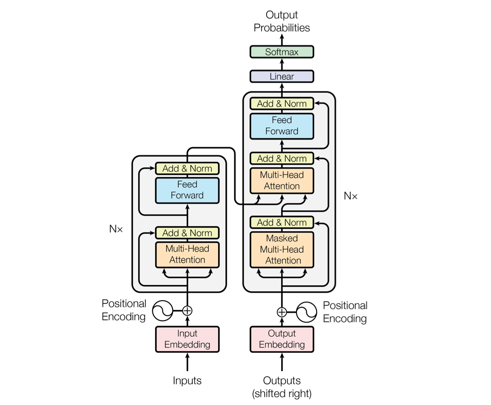

# Transformer

**Attention Is All You Need**
Ashish Vaswan et al. | [arXiv 1706.03762](https://arxiv.org/pdf/1706.03762) | [Code - 官方 Tensorflow](https://github.com/tensorflow/tensor2tensor) | NeurIPS 2017 | Google Brain

> **学习 & 参考资料**
>
> - **机器学习**
>
>   —— 李宏毅老师的 B 站搬运视频
>
>   - [自注意力机制 Self-attention（上）](https://www.bilibili.com/video/BV1Wv411h7kN?spm_id_from=333.788.videopod.episodes&vd_source=436107f586d66ab4fcf756c76eb96c35&p=38)
>
>   - [自注意力机制 Self-attention（下）]( https://www.bilibili.com/video/BV1Wv411h7kN/?p=39&share_source=copy_web&vd_source=e46571d631061853c8f9eead71bdb390)
>   - [Transformer（上）](https://www.bilibili.com/video/BV1Wv411h7kN/?p=49&share_source=copy_web&vd_source=e46571d631061853c8f9eead71bdb390)
>   - [Transformer（下）](https://www.bilibili.com/video/BV1Wv411h7kN/?p=50&share_source=copy_web&vd_source=e46571d631061853c8f9eead71bdb390)
>
> - **论文逐段精读**
>   - [Transformer论文逐段精读【论文精读】]( https://www.bilibili.com/video/BV1pu411o7BE/?share_source=copy_web&vd_source=e46571d631061853c8f9eead71bdb390)
>
>     —— 沐神的论文精读合集
>
> - **3Blue1Brown**
>
>   —— 最顶级的动画解释
>
>   - [【官方双语】GPT是什么？直观解释Transformer | 深度学习第5章]( https://www.bilibili.com/video/BV13z421U7cs/?share_source=copy_web&vd_source=e46571d631061853c8f9eead71bdb390)
>   - [【官方双语】直观解释注意力机制，Transformer的核心 | 【深度学习第6章】](https://www.bilibili.com/video/BV1TZ421j7Ke/?share_source=copy_web)
>
> - **代码**
>
>   - [The Annotated Transformer](https://nlp.seas.harvard.edu/annotated-transformer/)
>
>     —— 哈佛 NLP 团队公开的 Transformer 注释版本，基于 PyTorch 实现。
>

## 时间线

> ✍️ 未完待续...（完结后删除该模块）
>
> TODO：各模块代码部分和论文结果展示。

2024.10.23 文字概述

## 目录

   - [前言](#前言)
     - [RNN 的递归原理](#rnn-的递归原理)
   - [贡献](#贡献)
   - [模型架构](#模型架构)
     - [快速概述](#快速概述)
       - [编码器的输入处理](#编码器的输入处理)
       - [解码器的输出处理](#解码器的输出处理)
   - [QA](#qa)
     - [什么是编码器-解码器架构？](#什么是编码器-解码器架构)
     - [什么是自回归与非自回归？](#什么是自回归与非自回归)
       - [自回归（Auto-Regressive）](#自回归auto-regressive)
       - [非自回归（Non-Autoregressive）](#非自回归non-autoregressive)

## 前言

Transformer 已成为语言模型领域的奠基之作，大幅推动了自然语言处理（**NLP**，Natural Language Processing）的发展。

Transformer 最初是为**机器翻译任务**提出的，因此其背景介绍离不开 NLP，在 Transformer 出现之前，NLP 领域的 **SOTA**（State-of-the-Art）模型以循环神经网络（**RNN**）架构为主导，包含 LSTM 和 GRU 等变体。实际在这一阶段的工作中，**注意力机制**已经在**编码器-解码器架构**中广泛应用（与 RNN 一起使用），但 RNN 本身有两个缺点： 

- **按时间步递进处理数据**：输入必须按照序列顺序依次处理，导致并行计算能力受限，训练速度慢。
- **长距离依赖问题**：在处理长序列时，信息容易随时间步 $t$ 的增加而被遗忘，尽管 LSTM 等变体在一定程度上减轻了此问题。  

> [!note]
>
> ### RNN 的递归原理
>
> 给定输入序列 $X = (x_1, x_2, ..., x_t)$, $X$ 可以理解为一个句子，RNN 的隐藏状态递归更新如下：
> 
> $$
> h_t = f(W_h h_{t-1} + W_x x_t + b)
> $$
> 
> 其中：
>
> - $W_h$ 和 $W_x$ 是权重矩阵，分别用于处理上一时间步的状态 $h_{t-1}$ 和当前时间步的输入 $x_t$。
> - $b$ 是偏置项。
>
> 从公式可以看出，每个时间步的状态 $h_t$ 依赖于**前一时间步** $h_{t-1}$, 这使得 RNN 无法并行处理序列中的数据，所以 RNN 训练得慢。

## 贡献

在 RNN 的模型基础下，研究人员使用了**注意力机制**来增强模型的性能，但 Transformer 彻底颠覆了这一架构：**它直接放弃了 RNN 的递归结构，只使用注意力机制来编码和解码序列信息**。这相当于，大家原本都端着碗（RNN）拿着筷子（Attention）吃饭，而 Transformer 直接把“碗”扔掉，表示只用筷子也能直接吃，而且吃得又快又好，还不用装饭。展示了一种全新的思路：**Attention Is All You Need**。

Transformer 的主要贡献如下：

- **取消递归结构，实现并行计算**

  通过采用**自注意力机制（Self-Attention）**，Transformer 可以同时处理多个输入序列，极大提高了计算的并行度和训练速度。

- **引入位置编码（Positional Encoding）并结合 Attention 机制巧妙地捕捉位置信息**

  在不依赖 RNN 结构的情况下，通过位置编码为序列中的每个元素嵌入位置信息，从而使模型能够感知输入的顺序。

## 模型架构



### 快速概述

Transformer 模型基于**编码器**（左）- **解码器**（右）架构（如图中灰色透明框所示），

- **$N$** 表示编码器或解码器的**层数**，在原始 Transformer 论文中，均设为 $N=6$, 即编码器和解码器各由六层堆叠（Stack）而成。

- **编码器和解码器**均由以下组件构成：

  - **多头注意力机制（Multi-Head Attention）**
  
    通过多个注意力头提取不同子空间的上下文信息，捕捉输入序列中的全局依赖关系。
  
  - **前馈神经网络（Feed-Forward Network, FFN）**
  
    这是一个两层的全连接网络，使用非线性激活函数（ReLU）：
    
    $`\text{FFN}(x) = \max(0, xW_1 + b_1)W_2 + b_2`$
    
    FFN 在编码器和解码器中都被应用（蓝色框）。
  
  - **残差连接（Residual Connection）**
  
    残差连接形式为 $x + \text{Layer}(x)$, 缓解模型在训练深层网络时的梯度消失问题。
  
    **Add** 表示执行这一操作。
  
  - **层归一化（Layer Normalization, LayerNorm）**
  
    在 Transformer 中采用 LayerNorm，而不是 BatchNorm。这一步标准化每个**样本**的特征分布，在残差连接后进行：
    
    $`\text{LayerNorm}(x + \text{Layer}(x))`$
    
    对应于架构图中的 **Add & Norm**，即先进行残差连接再通过 LayerNorm 进行标准化。

#### 编码器的输入处理

- **嵌入层（Embedding Layer）**

  将**输入序列**（Inputs）的 Tokens 转换为固定维度的向量表示（Input embedding），使模型能够处理文本数据。

  - 关于 Token 可以阅读文章《[BPE vs WordPiece：理解 Tokenizer 的工作原理与子词分割方法](https://github.com/Hoper-J/AI-Guide-and-Demos-zh_CN/blob/master/Guide/21.%20BPE%20vs%20WordPiece：理解%20Tokenizer%20的工作原理与子词分割方法.md)》。

- **位置编码（Positional Encoding）**

  由于 Transformer 不像 RNN 那样具有时间序列性质，需通过**位置编码**（Positional Encoding）保留输入序列的顺序信息。

  - 使用**正弦和余弦函数**为每个位置生成唯一编码：
  - 
    $`PE_{(pos, 2i)} = \sin\left(\frac{pos}{10000^{\frac{2i}{d_{\text{model}}}}}\right)`$

    $`PE_{(pos, 2i+1)} = \cos\left(\frac{pos}{10000^{\frac{2i}{d_{\text{model}}}}}\right)`$

    其中 $pos$ 是位置索引, $i$ 是维度索引, $d_{\text{model}}$ 是嵌入向量的维度。

#### 解码器的输出处理

- **线性层（Linear Layer）**

  将解码器的最后一层输出映射到词汇表大小的向量，得到每个词的**未归一化概率（Logits）**。

  ```python
  self.proj = nn.Linear(d_model, vocab)
  ```

- **Softmax 层**

  对线性层的输出进行 **Softmax** 转换，生成在目标词汇表上的**概率分布**。

  二者结合（**Linear + Softmax**）：
  
  $`P(y_t \mid y_{<t}, X) = \text{Softmax}(W \cdot h_t + b)`$

  其中 $W$ 和 $b$ 为线性变换的参数, $h_t$ 是解码器在时间步 $t$ 的输出。

- **生成目标词**

  - 从 Softmax 输出的概率分布中选择当前时间步的词，常用的生成策略包括：

    - **贪心搜索（Greedy Search）**：每次选择概率最高的词。

    - **束搜索（Beam Search）**：保留多个可能的候选路径，以优化最终结果。

      阅读文章《[09. 深入理解 Beam Search：原理, 示例与代码实现](https://github.com/Hoper-J/AI-Guide-and-Demos-zh_CN/blob/master/Guide/09.%20深入理解%20Beam%20Search：原理%2C%20示例与代码实现.md)》。

    - **Top-K 和 Top-P 采样**：从概率分布中随机采样，以增加生成的多样性。

      阅读文章《[10. 什么是 Top-K 和 Top-P 采样？Temperature 如何影响生成结果？](https://github.com/Hoper-J/AI-Guide-and-Demos-zh_CN/blob/master/Guide/10.%20Top-K%20vs%20Top-P：生成式模型中的采样策略与%20Temperature%20的影响.md)》。

## QA

### 什么是编码器-解码器架构？

将**输入序列**编码为高维特征表示，再将这些表示解码为**输出序列**，具体数学表述如下：

- **编码器**将输入序列 $X = (x_1, ..., x_n)$ 映射为特征表示 $Z = (z_1, ..., z_n)$, 这些表示实际上代表了输入的高维语义信息。
- **解码器**基于编码器生成的表示 $Z$, 逐步生成输出序列 $Y = (y_1, ..., y_m)$。在每一步解码时，解码器是**自回归**（auto-regressive）的，即依赖于先前生成的符号作为输入，以生成当前符号。
  - 在第 $t$ 步时，解码器会将上一步生成的 $y_{t-1}$ 作为额外输入，以预测当前时间步的 $y_t$。 

### 什么是自回归与非自回归？

> 图源自[生成式人工智能导论第 15 讲的PDF](https://speech.ee.ntu.edu.tw/~hylee/genai/2024-spring-course-data/0517/0517_strategy.pdf)。


#### 自回归（Auto-Regressive）

自回归是一种序列生成方式，位于解码操作，**每一步都依赖于之前生成的符号**。这种设计确保了生成过程中的连贯性和逻辑一致性。当前大多数语言模型（如 GPT 系列）都采用自回归生成。例如：

- 当生成句子的第一个词 $y_1$ 后，模型会使用 $y_1$ 作为输入来生成下一个词 $y_2$。
- 这种过程会一直重复，直到生成结束符号（`<end>`）。

#### 非自回归（Non-Autoregressive）

非自回归可以一次性生成多个甚至全部的输出符号，会牺牲一定的生成质量。

> **拓展**
>
> 现在也有工作使用非自回归模型作为“预言家”来指导自回归模型并行生成，从而在生成质量不变的情况下大幅度提高生成速度，以“空间”换时间。
>
> 
>
> **相关论文**：
>
> - Fast Inference from Transformers via Speculative Decoding: [arXiv 2211.17192](https://arxiv.org/pdf/2211.17192)
> - Accelerating Large Language Model Decoding with Speculative Sampling: [arXiv 2302.01318](https://arxiv.org/pdf/2302.01318)

**思考: 既然输出 $h_t$ 同样依赖于 $h_{t-1}$, 那和 RNN 有什么区别？**
