# 对比学习论文随笔 1：正负样本

> 为了阅读的流畅，当前针对相同的代理任务**按时间顺序**进行梳理，涉及仅使用**正负样本思想**且**优化目标一致**的「基础」论文（2018-2020），编码器均采用 ResNet。

## 目录

- [前言](#前言)
   - [对比学习和代理任务（Pretext task）](#对比学习和代理任务pretext-task)
   - [数据增强](#数据增强)
   - [交叉熵损失函数](#交叉熵损失函数)
- [Inst Disc](#inst-disc)
   - [IDEA](#idea)
   - [Pipeline](#pipeline)
   - [训练部分](#训练部分)
   - [拓展](#拓展)
      - [Q1: index 是什么？](#q1-index-是什么)
      - [Q2: lemniscate 是什么？](#q2-lemniscate-是什么)
      - [Q3: 正负样本索引（NCEAverage）怎么处理？](#q3-正负样本索引nceaverage怎么处理)
      - [Q4: 动量更新的对象是编码器吗？](#q4-动量更新的对象是编码器吗)
- [InvaSpread](#invaspread)
   - [模型架构](#模型架构)
   - [损失函数](#损失函数)
   - [源码与论文的差异](#源码与论文的差异)
- [MoCo](#moco)
   - [解决痛点](#解决痛点)
   - [Loss计算](#loss计算)
   - [伪代码](#伪代码)
      - [拓展: bmm vs mm](#拓展-bmm-vs-mm)
   - [forward() 源码](#forward-源码)
   - [训练部分](#训练部分-1)
   - [训练效果](#训练效果)
- [SimCLR](#simclr)
   
   - [创新点和贡献](#创新点和贡献)
   - [损失函数: NT-Xent](#损失函数-nt-xent)
   - [拓展: 指示函数](#拓展-指示函数)
   - [伪代码](#伪代码-1)
- [MoCo v2](#moco-v2)

## 前言

### 对比学习和代理任务（Pretext task）

> [MoCo 论文逐段精读【论文精读】00:02:00 - 00:07:33 部分](https://www.bilibili.com/video/BV1C3411s7t9/?share_source=copy_web&vd_source=e46571d631061853c8f9eead71bdb390&t=120)，如果想快速了解什么是对比学习的话，观看这五分钟就够了。

对于本文: 

“代理任务就是人为的定义一些规则，决定哪些图片是相似的，哪些图片是不相似的。”

“从而提供一个监督信号（伪标签）进行训练，而这就是所谓的自监督训练。”

我绘制了一张图，或许能辅助你理解对比学习的优化目标: 


「最大化（Maximize）正样本对的相似度，最小化（Minimize）负样本对的相似度，排除（Exclude）自身的相似度」

注意，以下论文中的损失函数只要弄懂一个就够了，本质是一样的。

### 数据增强

> [《e. 数据增强：torchvision.transforms 常用方法解析》](https://github.com/Hoper-J/AI-Guide-and-Demos-zh_CN/blob/master/Guide/e.%20数据增强：torchvision.transforms%20常用方法解析.md)

### 交叉熵损失函数

> 预计 20 号上传拓展阅读。

## Inst Disc

**Unsupervised Feature Learning via Non-Parametric Instance Discrimination**
Zhirong Wu et al. | [arXiv 1805.01978](https://arxiv.org/pdf/1805.01978) | [Code](https://github.com/zhirongw/lemniscate.pytorch) | CVPR 2018

> [对比学习论文综述【论文精读】- 00:01:49 - 00:07:02 部分](https://www.bilibili.com/video/BV19S4y1M7hm/?share_source=copy_web&vd_source=e46571d631061853c8f9eead71bdb390&t=108)
>
> **MoCo 中反复提到的文献 [61] 和 Memory Bank，巨人的肩膀。**

### IDEA

受启发于有监督学习的分类预测: 靠前（红色）的概率都是豹子。
作者认为这不是因为 Label 的语义信息使得它们接近，而是因为同类图片之间的视觉相似性，所以才促使同类 Label 的概率靠前: 

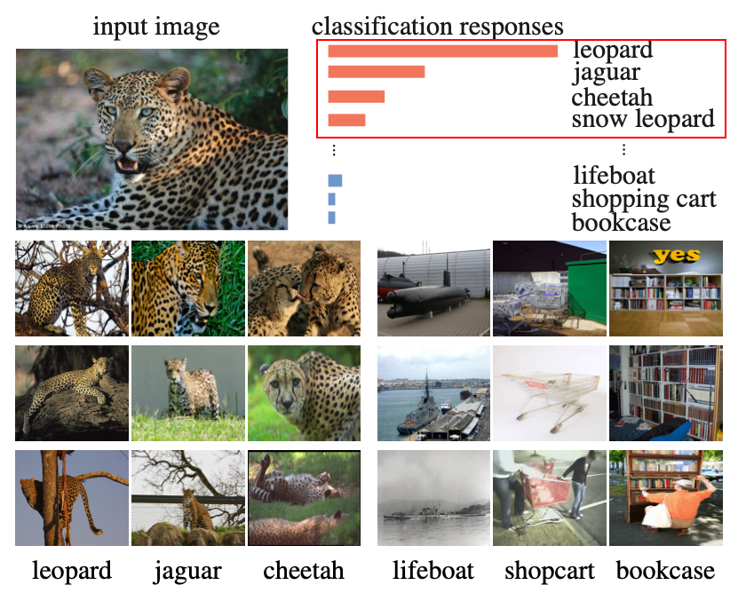

既然类间视觉相似性会促使 Label 的语义信息靠近（特征聚类），作者便将其推到了极致: **将每张图片看作一个类，模型需学习区分每张图片的特征表示**，这就是 **Instance Discrimination（实例判别）** 的核心思想。

### Pipeline


- 每张图片经过数据增强后，通过 ResNet 提取 **128 维**的特征表示。  

- 然后，与从 **Memory Bank** 中采样的负样本进行对比，并计算 **NCE Loss**。

  （可以在后续了解到更精简和常用的 Loss 写法，这里不复现论文符号来增加理解难度，对于这篇论文理解 Pipeline 的思想就够了）

### 训练部分

- **超参数**: 

  - SGD 优化器: weight_dacay=0.0001，momentum=0.9
  - batchsize=256，epochs=200
  - 温度参数 0.07
  - 学习率（lr）初始化为 0.03，在 epoch=120 和 160 时乘以 0.1。

- **训练代码**: 

  ```python
  def train(train_loader, model, lemniscate, criterion, optimizer, epoch):
      model.train()
  
      for i, (input, target, index) in enumerate(train_loader):
          # input: 当前批次的图像
          # target: 对应的标签
          # index: 每个图像在数据集中的唯一索引
  
          # 1. 通过模型提取特征
          feature = model(input)  # (batch_size, feature_dim)
  
          # 2. 使用索引从 Memory Bank 检索正样本和负样本特征
          output = lemniscate(feature, index)
  
          # 3. 计算损失
          loss = criterion(output, index)
  
          # 4. 反向传播和参数更新
          optimizer.zero_grad()
          loss.backward()
          optimizer.step()
  
  ```

### 拓展

> **如果你不准备复现当前源码，完全可以跳过 Q2 和 Q3，这也是建议的行为**

#### Q1: `index` 是什么？

```python
# train_loader 返回的 index 由来
class ImageFolderInstance(datasets.ImageFolder):
    def __getitem__(self, index):
    path, target = self.imgs[index]  # 根据索引获取图像路径和标签
    img = self.loader(path)  # 加载图像

    if self.transform is not None:
        img = self.transform(img)  # 数据增强
    if self.target_transform is not None:
        target = self.target_transform(target)

    return img, target, index  # 返回图像、标签和索引
```

当使用 `DataLoader` 遍历数据集时，`DataLoader` 会为每个样本传入一个唯一的 `index`，并调用 `__getitem__` 方法，这里自定义的数据集将其返回。

#### Q2: `lemniscate` 是什么？

- `lemniscate` 是 `NCEAverage` 或 `LinearAverage` 的实例，用于从 Memory Bank 中检索负样本并计算相似度。  
- 默认使用 `NCEAverage`，`nce_k` 为负样本数量，`nce_t` 为温度参数，`nce_m` 为动量系数。

```python
ndata = train_dataset.__len__()  # 数据集样本总量
if args.nce_k > 0:
    # 使用 NCEAverage 来实现负样本的采样和计算
    lemniscate = NCEAverage(args.low_dim, ndata, args.nce_k, args.nce_t, args.nce_m).cuda()
    criterion = NCECriterion(ndata).cuda()
else:
    # 使用 LinearAverage 进行全局内积计算
    lemniscate = LinearAverage(args.low_dim, ndata, args.nce_t, args.nce_m).cuda()
    criterion = nn.CrossEntropyLoss().cuda()
```

1. **NCEAverage**

```python
import torch
from torch.autograd import Function
from torch import nn
from .alias_multinomial import AliasMethod  # Alias Method 用于负采样
import math

class NCEFunction(Function):
    @staticmethod
    def forward(self, x, y, memory, idx, params):
        """
        - x: 当前批次样本特征 (N, C)
        - y: 当前批次样本索引 (N,)
        - memory: Memory Bank，用于存储样本特征 (M, C)
        - idx: 从 Memory Bank 中采样出的正负样本索引 (N, K+1)
        - params: 包含 K、温度 T、归一化常数 Z、动量 momentum 的参数
        """
        K = int(params[0].item())  # 负样本数量 K
        T = params[1].item()  # 温度参数
        Z = params[2].item()  # 归一化常数 Z
        momentum = params[3].item()  # 动量系数

        batchSize = x.size(0)  # 批次大小
        outputSize = memory.size(0)  # Memory Bank 的样本数量 M
        inputSize = memory.size(1)  # 特征维度 C

        # 将正样本索引放置在 idx 的第一个位置
        idx.select(1, 0).copy_(y.data)

        # 从 Memory Bank 中提取对应索引的特征 (N, K+1, C)
        weight = torch.index_select(memory, 0, idx.view(-1))
        weight.resize_(batchSize, K + 1, inputSize)

        # 计算当前批次样本与选取特征的内积 (N, K+1, 1)
        out = torch.bmm(weight, x.data.resize_(batchSize, inputSize, 1))
        out.div_(T).exp_()  # 进行温度缩放并计算指数

        x.data.resize_(batchSize, inputSize)  # 恢复原始形状

        # 如果归一化常数 Z 未设置，则初始化为当前输出的均值
        if Z < 0:
            params[2] = out.mean() * outputSize
            Z = params[2].item()
            print("normalization constant Z is set to {:.1f}".format(Z))

        # 输出结果归一化 (N, K+1)
        out.div_(Z).resize_(batchSize, K + 1)

        # 保存反向传播需要的变量
        self.save_for_backward(x, memory, y, weight, out, params)
        return out

    @staticmethod
    def backward(self, gradOutput):
        """
        反向传播: 
        - gradOutput: 损失对输出的梯度 (N, K+1)
        """
        x, memory, y, weight, out, params = self.saved_tensors
        K = int(params[0].item())  # 负样本数量
        T = params[1].item()  # 温度参数
        momentum = params[3].item()  # 动量系数
        batchSize = gradOutput.size(0)

        # 计算梯度并应用温度缩放
        gradOutput.data.mul_(out.data).div_(T)  # (N, K+1)
        gradOutput.data.resize_(batchSize, 1, K + 1)

        # 计算输入特征的梯度
        gradInput = torch.bmm(gradOutput.data, weight)
        gradInput.resize_as_(x)

        # 更新 Memory Bank 中的正样本特征
        weight_pos = weight.select(1, 0).resize_as_(x)  # 选择正样本特征
        weight_pos.mul_(momentum).add_(x.data * (1 - momentum))  # 动量更新
        w_norm = weight_pos.pow(2).sum(1, keepdim=True).pow(0.5)  # 归一化
        updated_weight = weight_pos.div(w_norm)  # 更新后的特征
        memory.index_copy_(0, y, updated_weight)  # 写回 Memory Bank

        return gradInput, None, None, None, None

class NCEAverage(nn.Module):
    def __init__(self, inputSize, outputSize, K, T=0.07, momentum=0.5, Z=None):
        """
        - inputSize: 特征维度 C
        - outputSize: Memory Bank 的大小 M
        - K: 负样本数量
        - T: 温度参数
        - momentum: 动量系数
        """
        super(NCEAverage, self).__init__()
        self.nLem = outputSize  # Memory Bank 大小
        self.unigrams = torch.ones(self.nLem)  # 初始化
        self.multinomial = AliasMethod(self.unigrams)  # Alias Method 用于采样
        self.multinomial.cuda()  # 使用 GPU

        self.K = K  # 负样本数量

        # 注册参数和 Memory Bank
        self.register_buffer('params', torch.tensor([K, T, -1, momentum]))
        stdv = 1. / math.sqrt(inputSize / 3)  # 初始化范围
        self.register_buffer('memory', torch.rand(outputSize, inputSize).mul_(2 * stdv).add_(-stdv))

    def forward(self, x, y):
        """
        - x: 当前批次样本的特征 (N, C)
        - y: 当前批次样本的索引 (N,)
        """
        batchSize = x.size(0)

        # 采样负样本索引 (N, K+1)
        idx = self.multinomial.draw(batchSize * (self.K + 1)).view(batchSize, -1)

        # 调用 NCEFunction 进行计算
        out = NCEFunction.apply(x, y, self.memory, idx, self.params)
        return out

```

2. **LinearAverage**

```python
import torch
from torch.autograd import Function
from torch import nn
import math

class LinearAverageOp(Function):
    @staticmethod
    def forward(self, x, y, memory, params):
        """
        - x: 当前批次样本特征 (N, C)
        - y: 当前批次样本索引 (N,)
        - memory: Memory Bank (M, C)
        - params: 温度参数和动量参数
        """
        T = params[0].item()  # 温度参数

        # 计算当前批次与 Memory Bank 的内积 (N, M)
        out = torch.mm(x.data, memory.t())
        out.div_(T)  # 温度缩放
        self.save_for_backward(x, memory, y, params)  # 保存变量

        return out

    @staticmethod
    def backward(self, gradOutput):
        """
        - gradOutput: 损失对输出的梯度
        """
        x, memory, y, params = self.saved_tensors
        batchSize = gradOutput.size(0)
        T = params[0].item()
        momentum = params[1].item()

        # 应用温度缩放
        gradOutput.data.div_(T)

        # 计算输入特征的梯度
        gradInput = torch.mm(gradOutput.data, memory)
        gradInput.resize_as_(x)

        # 更新 Memory Bank 中的正样本特征
        weight_pos = memory.index_select(0, y.data.view(-1)).resize_as_(x)
        weight_pos.mul_(momentum).add_(x.data * (1 - momentum))  # 动量更新
        w_norm = weight_pos.pow(2).sum(1, keepdim=True).pow(0.5)  # 归一化
        updated_weight = weight_pos.div(w_norm)  # 更新特征
        memory.index_copy_(0, y, updated_weight)  # 写回 Memory Bank

        return gradInput, None, None, None

class LinearAverage(nn.Module):
    def __init__(self, inputSize, outputSize, T=0.07, momentum=0.5):
        """
        - inputSize: 特征维度
        - outputSize: Memory Bank 大小
        - T: 温度参数
        - momentum: 动量系数
        """
        super(LinearAverage, self).__init__()
        self.nLem = outputSize  # Memory Bank 大小

        # 注册参数和 Memory Bank
        self.register_buffer('params', torch.tensor([T, momentum]))
        stdv = 1. / math.sqrt(inputSize / 3)  # 初始化范围
        self.register_buffer('memory', torch.rand(outputSize, inputSize).mul_(2 * stdv).add_(-stdv))

    def forward(self, x, y):
        """
        - x: 当前批次样本的特征 (N, C)
        - y: 当前批次样本的索引
        """
        out = LinearAverageOp.apply(x, y, self.memory, self.params)
        return out

```

#### Q3: 正负样本索引（NCEAverage）怎么处理？

```python
import torch
import numpy as np

class AliasMethod(object):
    '''
        From: https://hips.seas.harvard.edu/blog/2013/03/03/the-alias-method-efficient-sampling-with-many-discrete-outcomes/
    '''
    def __init__(self, probs):

        if probs.sum() > 1:
            probs.div_(probs.sum())
        K = len(probs)
        self.prob = torch.zeros(K)
        self.alias = torch.LongTensor([0]*K)

        # Sort the data into the outcomes with probabilities
        # that are larger and smaller than 1/K.
        smaller = []
        larger = []
        for kk, prob in enumerate(probs):
            self.prob[kk] = K*prob
            if self.prob[kk] < 1.0:
                smaller.append(kk)
            else:
                larger.append(kk)

        # Loop though and create little binary mixtures that
        # appropriately allocate the larger outcomes over the
        # overall uniform mixture.
        while len(smaller) > 0 and len(larger) > 0:
            small = smaller.pop()
            large = larger.pop()

            self.alias[small] = large
            self.prob[large] = (self.prob[large] - 1.0) + self.prob[small]

            if self.prob[large] < 1.0:
                smaller.append(large)
            else:
                larger.append(large)

        for last_one in smaller+larger:
            self.prob[last_one] = 1

    def cuda(self): 
        self.prob = self.prob.cuda()
        self.alias = self.alias.cuda()

    def draw(self, N):
        '''
            Draw N samples from multinomial
        '''
        K = self.alias.size(0)

        kk = torch.zeros(N, dtype=torch.long, device=self.prob.device).random_(0, K)
        prob = self.prob.index_select(0, kk)
        alias = self.alias.index_select(0, kk)
        # b is whether a random number is greater than q
        b = torch.bernoulli(prob)
        oq = kk.mul(b.long())
        oj = alias.mul((1-b).long())

        return oq + oj

self.nLem = outputSize  # Memory Bank 大小
self.unigrams = torch.ones(self.nLem)  # 初始化
self.multinomial = AliasMethod(self.unigrams)
idx = self.multinomial.draw(batchSize * (self.K + 1)).view(batchSize, -1)

idx.select(1, 0).copy_(y.data)
```

用一个简洁的示例代码展示一下最终效果: 

```python
# 示例参数
batchSize = 3  # 批次大小
K = 6  # 负样本数量
nLem = 20  # Memory Bank 大小

# 初始化 Alias Method
unigrams = torch.ones(nLem)
multinomial = AliasMethod(unigrams)
multinomial.cuda()

# 采样索引 (3, 7)，每行包含1个正样本 + 6个负样本
idx = multinomial.draw(batchSize * (K + 1)).view(batchSize, -1)
print("采样前的索引: ", idx)

# 将每行的第一个元素替换为当前批次的样本索引
y = torch.tensor([5, 10, 15])  # 假设当前批次的正样本索引为 [5, 10, 15]
idx.select(1, 0).copy_(y)
print("采样后的索引（第一个位置为正样本）: ", idx)
```

**输出**: 

```sql
采样前的索引:  tensor([[ 2,  4, 17,  0, 15, 18,  1],
        [15,  5, 18,  2, 17, 12, 14],
        [11, 13, 18, 19, 17,  7,  3]], device='cuda:0')
采样后的索引（第一个位置为正样本）:  tensor([[ 5,  4, 17,  0, 15, 18,  1],
        [10,  5, 18,  2, 17, 12, 14],
        [15, 13, 18, 19, 17,  7,  3]], device='cuda:0')
```

#### Q4: 动量更新的对象是编码器吗？

不是，是 **Memory Bank** 中的特征。

```python
weight_pos = weight[:, 0, :].mul_(momentum).add_(x.mul(1 - momentum))
memory.index_copy_(0, y, weight_pos / weight_pos.norm(dim=1, keepdim=True))
```

> 你可以在后续的论文中感受到基于 Inst Disc 的延伸。

## InvaSpread

**Unsupervised Embedding Learning via Invariant and Spreading Instance Feature**
Mang Ye et al. | [CVPR 2019](https://openaccess.thecvf.com/content_CVPR_2019/papers/Ye_Unsupervised_Embedding_Learning_via_Invariant_and_Spreading_Instance_Feature_CVPR_2019_paper.pdf) | [Code](https://github.com/mangye16/Unsupervised_Embedding_Learning)

> [对比学习论文综述【论文精读】00:07:01 - 00:10:30 部分](https://www.bilibili.com/video/BV19S4y1M7hm/?share_source=copy_web&vd_source=e46571d631061853c8f9eead71bdb390&t=421)
>
> **MoCo中的文献 [63] end-to-end，可以理解为 SimCLR 的前身。**

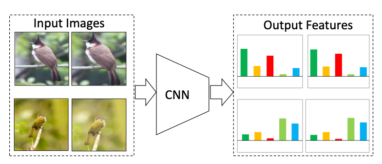

作者提出，经过不同数据增强处理的**同一张图片**的特征向量应该保持一致或相似，这种不变性称为**Invariant**。上图可以捕捉到正样本对的概念。

论文题目中所说的 **Spreading Instance Feature** 实际上就是**不同图片（负样本对）之间的特征尽可能不同**。

这两点都和 **Inst Disc** 的理念一致，也就是说「最小化相同图片不同数据增强后的特征相似度」和「最大化不同图片之间的特征相似度」。

### 模型架构


与 **Inst Disc** 不同，InvaSpread 并未使用 **Memory Bank** 来存储负样本，而是依赖**批次（batch）中的其他样本**作为负样本。

### 损失函数

> 实际上你仍然可以概览这一节而不去细究，现在只是初具雏形，

1. **正样本匹配概率** $P(i|\hat{x}_i)$:   

   - 对于给定的实例（instance） $x_i$ 及其数据增强版本 $\hat{x}_i$，它们的特征分别为 $f_i$ 和 $\hat{f}_i$。  

   - 利用 softmax 计算增强样本 $\hat{x}_i$ 被识别为实例 $i$ 的概率: 

     $`P(i|\hat{x}_i) = \frac{\exp(f_i^T \hat{f}_i / \tau)}{\sum_{k=1}^{m} \exp(f_k^T \hat{f}_i / \tau)}`$
     
     这里, $\tau$ 是温度参数（这基本是一个必然存在的参数）。

2. **负样本分离概率** $1 - P(i|x_j)$:   

   - 对于其他实例 $x_j (j \neq i)$，计算它们不被识别为实例 $i$ 的概率: 

     $`P(i|x_j) = \frac{\exp(f_i^T f_j / \tau)}{\sum_{k=1}^{m} \exp(f_k^T f_j / \tau)} = \frac{\exp(f_i^T f_j / \tau)}{\exp(f_j^T f_j / \tau) + \sum_{k \neq j} \exp(f_k^T f_j / \tau)}`$

     由于特征向量 $f$ 已 $L_2$-归一化（l2-norm），因此内积 $f_j^T f_j = 1$。

1. **负对数似然损失函数**:   

   - 损失函数通过最大化每个实例的正样本匹配概率和负样本分离概率来实现: 
   
     $`J_i = - \log P(i|\hat{x}_i) - \sum_{j \neq i} \log (1 - P(i|x_j))`$
   
   - 最终的损失是 batch 中所有实例的损失之和: 
   
      $`J = - \sum_i \log P(i|\hat{x}_i) - \sum_i \sum_{j \neq i} \log (1 - P(i|x_j))`$
   

### 源码与论文的差异

1. **双视图数据增强: **  

   - 需要注意到的是，InstSpread 也是对每个图片样本 $x$ 进行两次不同的数据增强，生成 $x_1$ 和 $x_2$ 作为正样本对，而非仅做一次，这一点在[数据集代码](https://github.com/mangye16/Unsupervised_Embedding_Learning/blob/29de3988e12b57ffdd55b315e8a12702e9f23448/datasets/cifar.py#L22)中可以看出: 

     ```python
     if self.transform is not None:
         img1 = self.transform(img)
         if self.train:
             img2 = self.transform(img)
     ```
     

2. **负样本数量的计算: **  

   - 另外，它的负样本数量并非 $m-1$ 而是 $2(m-1)$，论文的 $m$ 指的是 batchsize，也就是说除了 batch “本身”其他的图片以外，经过数据增强的其他图片也当作负样本，这一点可以通过[训练](https://github.com/mangye16/Unsupervised_Embedding_Learning/blob/29de3988e12b57ffdd55b315e8a12702e9f23448/demo_unseen.py#L230)代码察觉: 
   
     ```python
     inputs = torch.cat((inputs1,inputs2), 0)  
     features = net(inputs)
     loss = criterion(features, indexes)
     ```
   

尽管论文的公式中并没有体现这两点（可能是为了简洁），但这无伤大雅，代码才是本质，而且对于当前架构来说，就算仅做一次数据增强，模型的特征提取效果也不会受到显著影响（源于曾经的消融实验）。

## MoCo

**Momentum Contrast for Unsupervised Visual Representation Learning**
Kaiming He et al. | [arXiv 1911.05722](https://arxiv.org/pdf/1911.05722) | [Code](https://github.com/facebookresearch/moco) | CVPR 2020 | Facebook AI Research (FAIR)

> [MoCo 论文逐段精读【论文精读】](https://www.bilibili.com/video/BV1C3411s7t9?spm_id_from=333.788.videopod.sections&vd_source=436107f586d66ab4fcf756c76eb96c35)
>
> [对比学习论文综述【论文精读】00:18:28 - 00:23:00 部分](https://www.bilibili.com/video/BV19S4y1M7hm/?share_source=copy_web&vd_source=e46571d631061853c8f9eead71bdb390&t=1108)

### 解决痛点

- **端到端的学习受限于 batch size 大小**，因为 batch 内样本数量有限，难以提供丰富的负样本。

- **传统 memory bank** 中的特征来自不同阶段的编码器，特征不一致。MoCo 提出了**动量编码器** 解决这个问题: 

$$
\theta_k \leftarrow m \theta_k + (1 - m) \theta_q
$$

其中: 

- $\theta_k$ 是 key encoder 的参数。

- $\theta_q$ 是 query encoder 的参数。

- $m$ 是动量系数，论文中的消融实验（Section 4.1）显示: 取一个接近于1的值（如0.999）效果才好，或者说才有效果，见下表: 

  | momentum $m$ | 0      | 0.9  | 0.99 | 0.999 | 0.9999 |
  | ------------ | ------ | ---- | ---- | ----- | ------ |
  | accuracy (%) | $fail$ | 55.2 | 57.8 | 59.0  | 58.9   |


### Loss计算

- MoCo 使用了 **InfoNCE Loss** 来计算损失: 

$`\mathcal{L}_{NCE} = - \log \frac{\exp(q \cdot k^{+} / \tau)}{\exp(q \cdot k^{+} / \tau) + \sum_{i=1}^{K} \exp(q \cdot k_i^{-} / \tau)}`$

  其中: 

  - $q$ 是查询向量。
  - $k^{+}$ 是与查询对应的正样本向量。
  - $k_i^{-}$ 是从队列中抽取的负样本向量。
  - $\tau$ 是温度参数，用于控制对比损失的平滑程度。
  - $K$ 是负样本的数量。

### 伪代码

```python
# f_q, f_k: 编码器网络 (query 和 key)
# queue: 负样本队列，大小为 CxK
# m: 动量系数
# t: 温度参数

f_k.params = f_q.params  # 初始化，key encoder 等于 query encoder

for x in loader:  # 加载一个批次的数据
    x_q = aug(x)  # 对样本进行数据增强 (query)
    x_k = aug(x)  # 对样本进行相同的数据增强 (key)

    q = f_q(x_q)  # 提取查询特征 (N, C)
    k = f_k(x_k).detach()  # 提取键特征 (N, C)，并阻止反向传播

    # 正样本对的 logits: (N, 1)
    l_pos = torch.bmm(q.view(N, 1, C), k.view(N, C, 1))

    # 负样本对的 logits: (N, K)
    l_neg = torch.mm(q.view(N, C), queue.view(C, K))

    # 合并 logits: (N, 1 + K)
    logits = torch.cat([l_pos, l_neg], dim=1)
    labels = torch.zeros(N, dtype=torch.long).cuda()

    # 损失计算（注意这里用的是交叉熵损失函数，你应该停下来理解它）和模型更新
    loss = CrossEntropyLoss(logits / t, labels)
    loss.backward()
    update(f_q.params)  # 更新 query encoder的参数

    # 更新 key encoder 的参数 (动量更新)
    f_k.params = m * f_k.params + (1 - m) * f_q.params

    # 更新队列: 入队和出队
    enqueue(queue, k)
    dequeue(queue)

```

MoCo 中存在正负两种 key: 

1. 最开始图像 `x` 经过两次数据增强，一次作为 query，一次作为正样本的 key（下图只是示意图而非 MoCo 实际使用的数据增强形式）。

   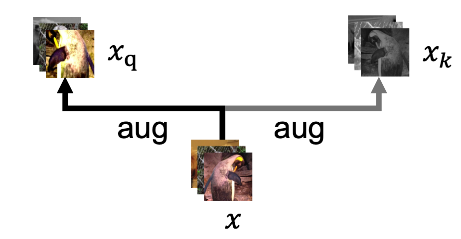

   正样本对通过`bmm(q.view(N,1,C), k.view(N,C,1))`计算。

2. `quene.view(C, K)` 对应的是负样本的 key。

   负样本对通过`mm(q.view(N,C), queue.view(C,K))`计算。

注意到伪代码很巧妙的在 loss 的计算上将正样本放在了第一列上: 

```python
logits = cat([l_pos, l_neg], dim=1)
labels = zeros(N)
loss = CrossEntropyLoss(logits/t, labels)
```


如果读过其他的对比学习论文，也可以将 query 和 key 直接理解为样本对，本质是一致的。

队列的思想是增设拓展负样本（memory bank）进行 loss 的计算，相对于 SimCLR 来说还是不一样的，这里 batch 之间的图片不互作为负样本，负样本完全从 memory bank 中获取。

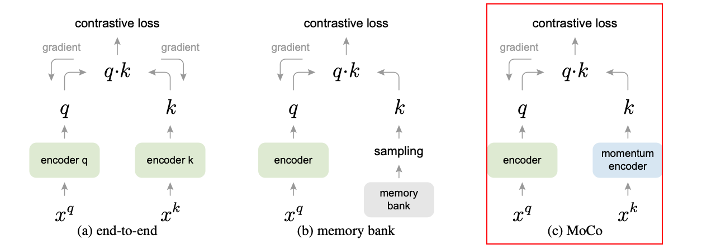


> #### 拓展: bmm vs mm
>
> **`bmm`: Batch Matrix Multiplication (批次矩阵乘法)**
>
> - **函数**: `torch.bmm(input, mat2)`  
> - **输入维度**: `[B, N, M] @ [B, M, K] -> [B, N, K]`  
> - **用途**: 用于 **多组矩阵**（批次）的乘法。通常用于对一个批次内的多组矩阵执行矩阵乘法。
>
> **示例: **
>
> ```python
> import torch
> 
> a = torch.randn(10, 3, 4)  # 批次矩阵 A (10x3x4)
> b = torch.randn(10, 4, 5)  # 批次矩阵 B (10x4x5)
> result = torch.bmm(a, b)  # result: (10x3x5)
> print(result.shape)  # 输出: torch.Size([10, 3, 5])
> ```
>
> **`mm`: Matrix Multiplication (矩阵乘法)**
>
> - **函数**: `torch.mm(input, mat2)`  
> - **输入维度**: `[N, M] @ [M, K] -> [N, K]`  
> - **用途**: 用于两个 **2D 矩阵** 的乘法。
>
> **示例: **
>
> ```python
> import torch
> 
> a = torch.randn(3, 4)  # 矩阵 A (3x4)
> b = torch.randn(4, 5)  # 矩阵 B (4x5)
> result = torch.mm(a, b)  # result: (3x5)
> print(result.shape)  # 输出: torch.Size([3, 5])
> ```
>
> **`torch.matmul`**
>
> `torch.matmul` 根据输入的维度会自动选择合适的矩阵乘法操作: 
>
> - **2D 矩阵乘法**: 与 `torch.mm` 相同。
> - **批次矩阵乘法**: 与 `torch.bmm` 相同。
> - **高维张量乘法**: 会将前面的维度看作批次维度，并对最后两维执行矩阵乘法。
>
> **示例: **
>
> ```python
> import torch
> 
> # 1. 2D 矩阵乘法 (等价于 mm)
> a = torch.randn(3, 4)
> b = torch.randn(4, 5)
> result = torch.matmul(a, b)  # 等同于 torch.mm(a, b)
> print(result.shape)  # 输出: torch.Size([3, 5])
> 
> # 2. 批次矩阵乘法 (等价于 bmm)
> a = torch.randn(10, 3, 4)
> b = torch.randn(10, 4, 5)
> result = torch.matmul(a, b)  # 等同于 torch.bmm(a, b)
> print(result.shape)  # 输出: torch.Size([10, 3, 5])
> 
> # 3. 高维张量乘法
> a = torch.randn(2, 10, 3, 4)
> b = torch.randn(2, 10, 4, 5)
> result = torch.matmul(a, b)  # 在前两维作为批次维度上进行矩阵乘法
> print(result.shape)  # 输出: torch.Size([2, 10, 3, 5])
> ```
>
> 所以实际上伪代码部分可以统一变换为: 
>
> ```python
> l_pos = matmul(q.view(N, 1, C), k.view(N, C, 1)).squeeze(-1)  # (N, 1)，使用torch.bmm实际上也需要squeeze，不过源代码并没有使用bmm，这里的bmm应该是一种概念上的传达而非函数的实际使用
> l_neg = matmul(q.view(N, C), queue.view(C, K))  # (N, K)
> ```

### forward() 源码

```python
def forward(self, im_q, im_k):
    """
    输入: 
        im_q: 查询图像（query images）的一批样本
        im_k: 键图像（key images）的一批样本，经过不同增强的数据
    输出: 
        logits: 查询与正/负样本之间的对比得分矩阵（N x (1 + K)）
        labels: 标签（标识正样本的位置，用于计算损失）
    """

    # 1. 计算查询特征（Query Features）
    q = self.encoder_q(im_q)  # 通过 query encoder 提取特征，形状为 (N, C)
    q = nn.functional.normalize(q, dim=1)  # 对每个特征向量进行归一化

    # 2. 计算键特征（Key Features）并更新 key encoder（Key Encoder）
    with torch.no_grad():  # key encoder 不需要反向传播梯度
        self._momentum_update_key_encoder()  # 使用 query encoder 更新key encoder

        # 进行批次扰乱，使分布式批归一化（BatchNorm）更有效
        im_k, idx_unshuffle = self._batch_shuffle_ddp(im_k)

        # 提取键特征并归一化，形状为 (N, C)
        k = self.encoder_k(im_k)
        k = nn.functional.normalize(k, dim=1)

        # 还原批次顺序
        k = self._batch_unshuffle_ddp(k, idx_unshuffle)

    # 3. 计算正负样本对的对比得分
    # 计算正样本对的得分，q 和 k 的余弦相似度，输出形状为 (N, 1)
    # 能直接计算内积得到是因为在之前做了归一化，范数为 1，此时做内积等价于计算余弦相似度
    l_pos = torch.einsum("nc,nc->n", [q, k]).unsqueeze(-1)

    # 计算负样本对的得分，q 和队列中的负样本特征计算内积，输出形状为 (N, K)
    l_neg = torch.einsum("nc,ck->nk", [q, self.queue.clone().detach()])

    # 合并正负样本对的得分，得到形状为 (N, 1 + K)
    logits = torch.cat([l_pos, l_neg], dim=1)

    # 4. 应用温度缩放，对 logits 进行平滑处理
    logits /= self.T

    # 5. 创建标签，标签为 0 表示第一个位置是正样本（即对应的键特征）
    labels = torch.zeros(logits.shape[0], dtype=torch.long).cuda()

    # 6. 更新负样本队列，将当前批次的键特征加入队列
    self._dequeue_and_enqueue(k)

    # 7. 返回 logits 和 labels，用于后续的损失计算
    return logits, labels

```

### 训练部分

- **超参数**: 基本遵循 Inst Disc（文献 [61]）的设置。
- **数据集**: 
  - **ImageNet 1M**: 跟 Imagenet 1000 是一个东西，但是为了表示这里使用的是个体判别任务而不是分类任务，所以叫 1M（即包含 100 万张图片）。
  - **Instagram 1B**: 包含 10 亿张图片。

### 训练效果

- 效果对比图（K-1 是端到端方法的负样本数量，K 是 memory bank）（8 卡 v100 中端到端的 K 受显存限制止步于 1024）

  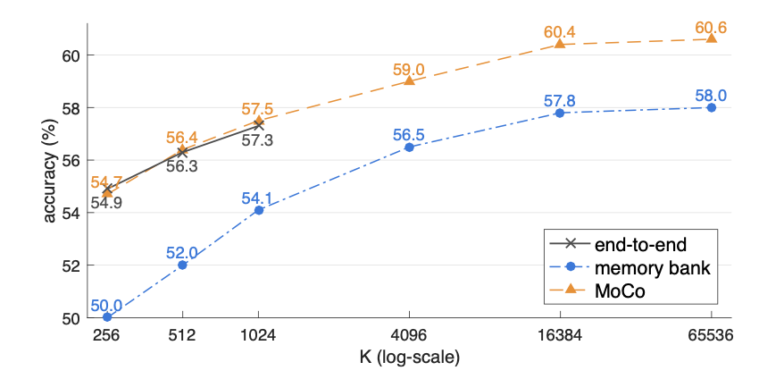

- MoCo 在 Imagenet 上的「无监督预训练+微调」超越了「有监督初始化+微调」，在它之前的工作没有超越只是接近。

- 实际上在真正使用时，更多的工作会沿用 MoCo 的框架，因为更 “cheap”。

## SimCLR

**A Simple Framework for Contrastive Learning of Visual Representations**
Ting Chen et al. | [arXiv 2002.05709](https://arxiv.org/pdf/2002.05709) | [Code](https://github.com/google-research/simclr?tab=readme-ov-file) | ICML 2020

> [对比学习论文综述【论文精读】00:23:03 - 00:31:02 部分](https://www.bilibili.com/video/BV19S4y1M7hm/?share_source=copy_web&vd_source=e46571d631061853c8f9eead71bdb390&t=1383)

### 创新点和贡献

SimCLR 的核心思想和 InstSpread 基本一致，创新点: 训练时在编码器之后增加线性层（MLP），使用线性层的输出来做对比学习而非编码器的输出，论文的简单架构图如下: 

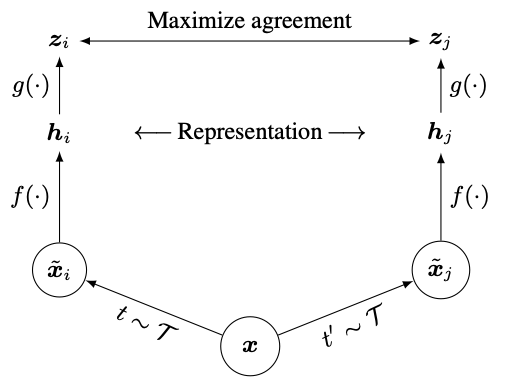

$f(·)$ 就是编码器（ResNet）, $g(·)$ 是 MLP，伪代码如下: 

```python
self.mlp = nn.Sequential(
    nn.Linear(self.backbone.fc.in_features, hidden_dim),  # 第一层线性变换
    nn.ReLU(),  # 激活函数
    nn.Linear(hidden_dim, output_dim),  # 输出层
)
```

研究表明，添加一个 **MLP 头** 能带来显著提升。在下图中，`Linear` 表示只使用线性变换，`Non-linear` 表示使用 **ReLU 激活**，而 `None` 表示不添加 MLP（与 InvaSpread 的设计相同）。结果表明，**非线性激活的 MLP** 头带来了更好的性能: 

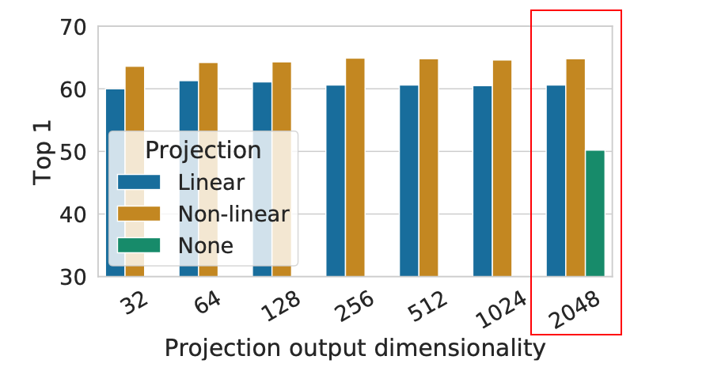

不要因为一个 IDEA 看起来“简单”就否定它的创新，SimCLR 所增加的 MLP 头使其在 ImageNet 上提升了**至少 10 个点**，这一点对后续工作的网络设计都产生了影响，比如 MoCo v2，BYOL 等。

另外，SimCLR 还对**两两一组的数据增强**做了消融实验，给读者提供了直观的见解，下图展示了 **ImageNet top-1 准确度** 的结果: 

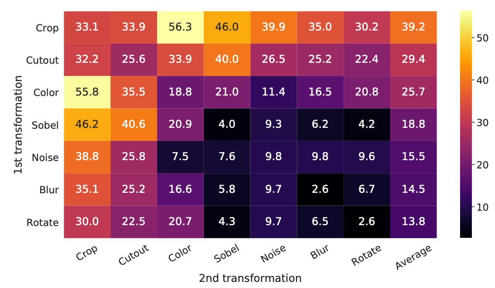

- **对角线**: 单独应用一种数据增强的结果。  
- **非对角线**: 依次组合两种数据增强的结果。  
- **最后一列**: 每行结果的均值。

从实验结果中可以观察到，**Crop（裁剪）和 Color（颜色变换）** 是必需的。

SimCLR实际采用的[数据增强](https://github.com/sthalles/SimCLR/blob/1848fc934ad844ae630e6c452300433fe99acfd9/data_aug/contrastive_learning_dataset.py#L13)方式为: 

```python
color_jitter = transforms.ColorJitter(0.8 * s, 0.8 * s, 0.8 * s, 0.2 * s)
# 将一系列数据增强操作组合成一个 transform 管道
data_transforms = transforms.Compose([
    # 随机裁剪并调整尺寸
    transforms.RandomResizedCrop(size=size),
    
    # 50% 的概率进行水平翻转
    transforms.RandomHorizontalFlip(),
    
    # 80% 的概率应用颜色抖动
    transforms.RandomApply([color_jitter], p=0.8),
    
    # 20% 的概率转换为灰度图像
    transforms.RandomGrayscale(p=0.2),
    
    # 应用高斯模糊
    GaussianBlur(kernel_size=int(0.1 * size)),
    
    # 将图片转换为张量形式
    transforms.ToTensor()
])
```

> [!tip]
>
> 如果对图像数据增强感兴趣，可以进一步阅读拓展文章：[《e. 数据增强：torchvision.transforms 常用方法解析》](https://github.com/Hoper-J/AI-Guide-and-Demos-zh_CN/blob/master/Guide/e.%20数据增强：torchvision.transforms%20常用方法解析.md)

### 损失函数: NT-Xent

> This loss has been used in previous work (Sohn, 2016; Wu et al., 2018; Oord et al., 2018); for convenience, we term it *NT-Xent* (the normalized temperature-scaled cross entropy loss).
>
> 注意 NT-Xent（the normalized temperature-scaled cross entropy loss）并不是一个全新的损失函数。

SimCLR 的损失函数与代码实现一致: 

$`\ell_{i,j} = -\log \frac{\exp(\text{sim}(\mathbf{z}_i, \mathbf{z}_j) / \tau)}{\sum_{k=1}^{2N} \mathbb{1}_{[k \neq i]} \exp(\text{sim}(\mathbf{z}_i, \mathbf{z}_k) / \tau)}`$

其中: 

- $\tau$ 为温度参数。
- $\text{sim}(·,·)$ 表示向量之间的余弦相似度。
- $\mathbb{1}_{[k \neq i]}$ 表示一个指示函数，返回 1 或 0。
  - 如果 $k \neq i$，则 $\mathbb{1}_{[k \neq i]} = 1$。
  - 如果 $k = i$，则 $\mathbb{1}_{[k \neq i]} = 0$。

目标就是「最小化相同图片不同数据增强后的特征相似度」和「最大化不同图片之间的特征相似度」。

> [!note]
>
> ### 拓展: 指示函数
>
> 确保**图片自身的相似度被排除**，注意，这里指的不是正样本对，而是图片自身。  
>
> 假设批次中有 4 个样本 $z_1, z_2, z_3, z_4$，其中 $z_1$ 和 $z_3$ 是一个正样本对。计算 $z_1$ 的损失时: 
>
> $`\ell_{1, 2} = -\log \frac{\exp(\text{sim}(z_1, z_2) / \tau)}{\exp(\text{sim}(z_1, z_2) / \tau) + \exp(\text{sim}(z_1, z_3) / \tau) + \exp(\text{sim}(z_1, z_4) / \tau)}`$
> 
> 由于 $\mathbb{1}_{[k \neq 1]}$ 的存在，样本 $z_1$ 自己不会参与分母的求和。

### 伪代码

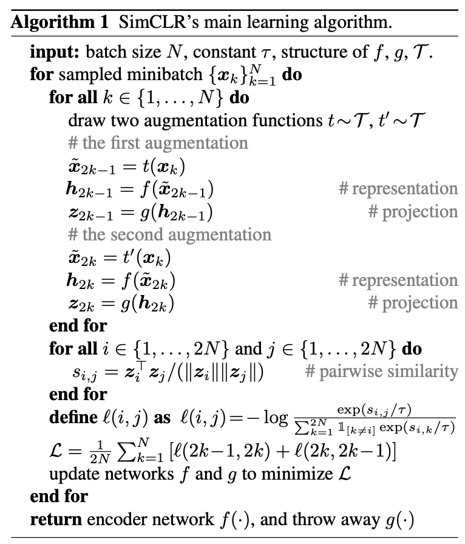

其实就是对 MLP 头的输出 $z = g(h)$ 做对比学习，而非直接使用编码器的输出 $h$（InstSpread 的对象），也可以和 MoCo 一样使用交叉熵损失函数，并优雅的将正样本的 logits 放在第一列: 

```python
# 可以类似 MoCo 进行处理（SimCLR 源码初看比较复杂，本质一样，理解一个即可）
logits = cat([l_pos, l_neg], dim=1)
labels = zeros(N)
loss = CrossEntropyLoss(logits/t, labels)
```

## MoCo v2

**Improved Baselines with Momentum Contrastive Learning**
Xinlei Chen et al. | [arXiv 2003.0429](https://arxiv.org/pdf/2003.04297v1) | [Code](https://github.com/facebookresearch/moco) | Facebook AI Research (FAIR)

> **Abstract**
>
> *Contrastive unsupervised learning has recently shown encouraging progress,* e.g*., in Momentum Contrast (MoCo) and SimCLR. In this note, we verify the effectiveness of two of SimCLR’s design improvements by implementing them in the MoCo framework. With simple modifications to MoCo— namely, using an MLP projection head and more data augmentation—we establish stronger baselines that outper- form SimCLR and do not require large training batches. We hope this will make state-of-the-art unsupervised learning research more accessible. Code will be made public.*

MoCo v2 是一个技术报告，直接借鉴了 **SimCLR 的创新点**（MLP 头和数据增强），并将其应用在原有的 **MoCo 框架**上。 

同样论文也做了详尽的消融实验来验证这些新增模块的有效性，在以下两个任务上进行评估: 

**(i)** ImageNet 线性分类

**(ii)** 微调 VOC 目标检测（5 次试验的均值）

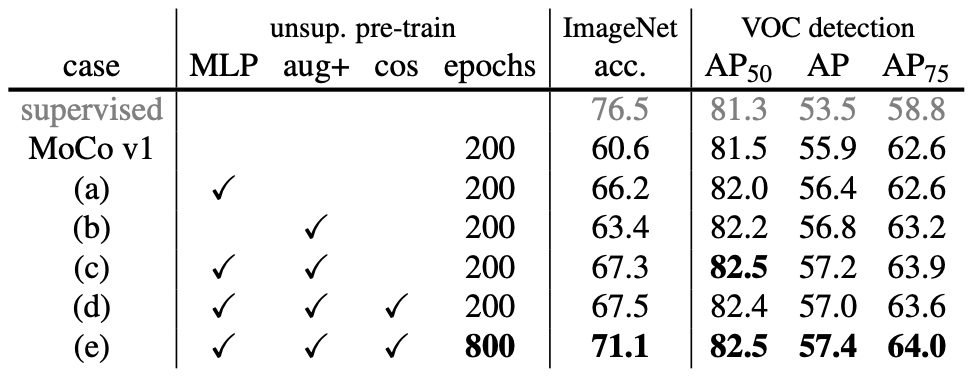

- **MLP**: 使用 **MLP 投影头**。
- **aug+**: 表示额外加入了 **模糊（blur）增强**。
- **cos**: 使用 **余弦学习率调度**。

最终结果是全方面比之前的工作要好: 

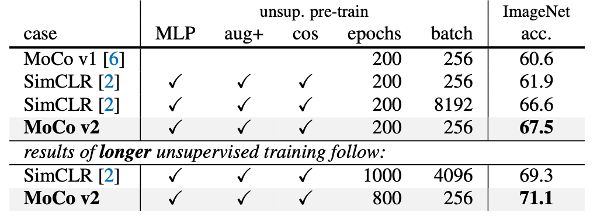

作者在最后还强调了 MoCo 比端到端的方法更“省”，下图展示了 **8 张 V100 16G GPU** 下的显存使用和训练时间: 


> [!note]
>
> 端到端指的是**负样本直接从 batch 中选取**，不使用 Memory Bank。

---

