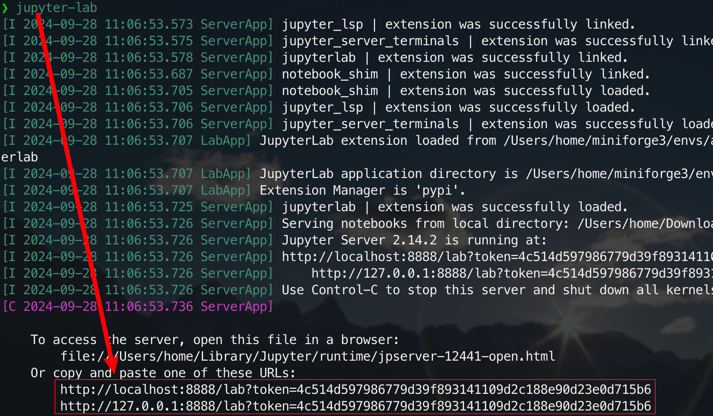

# 这是一个中文的 AI/LLM 大模型入门项目

> 回顾过去的学习历程，吴恩达和李宏毅老师的视频为我的深度学习之路提供了极大的帮助。他们幽默风趣的讲解方式和简单直观的阐述，让枯燥的理论学习变得生动有趣。
>
> 然而，在实践的时候，许多学弟学妹们最初会烦恼于怎么去获取国外大模型的 API ，尽管最终都能找到解决方法，但第一次的畏难情绪总是会拖延学习进度，逐渐转变为“看视频就够了”的状态。我时常在评论区看到类似的讨论，于是决定利用闲暇时间帮学子们跨过这道门槛，这也是项目的初衷。
>
> 本项目不会提供🪜科学上网的教程，也不会依赖平台自定义的接口，而是使用更兼容的 OpenAI SDK，帮助大家学习更通用的知识。
>
> 项目将从简单的 API 调用入手，带你逐步深入大模型的世界。在此过程中，你将掌握 **AI 视频摘要**、**LLM 微调**和 **AI 图像生成**等技能。
>
> 强烈建议观看李宏毅老师的课程「生成式人工智能导论」同步学习：[课程相关链接快速访问](https://github.com/Hoper-J/LLM-Guide-and-Demos-zh_CN?tab=readme-ov-file#快速访问)
>
> 现在，项目还开设了[🎡CodePlayground](https://github.com/Hoper-J/AI-Guide-and-Demos-zh_CN/tree/master/CodePlayground)，你可以按照文档配置好环境，使用一行代码运行脚本，体验 AI 的魅力。
>
> 📑论文随笔位于 [PaperNotes](https://github.com/Hoper-J/AI-Guide-and-Demos-zh_CN/tree/master/PaperNotes)，将逐步上传大模型相关的基础论文。
>
> 祝你旅途愉快！
>

## 目录

- **Tag 说明**:
  - `---`: 基础知识，根据需要进行观看，也可以暂时跳过，其中的代码文件结果都会在文章中示出，但建议你依旧下载运行，可能会有显存要求。
  - `API`: 文章仅使用大模型的 API，不受设备限制，无 GPU 也可运行。
  - `LLM`: 大型语言模型相关的实践，代码文件可能有显存要求。
  - `SD`: Stable Diffusion，文生图相关的实践，代码文件有显存要求。

| Guide                                                        | Tag       | Describe                                                     | File                                                         |
| ------------------------------------------------------------ | --------- | ------------------------------------------------------------ | ------------------------------------------------------------ |
| [00. 阿里大模型API获取步骤](https://github.com/Hoper-J/LLM-Guide-and-Demos/blob/master/Guide/00.%20阿里大模型API获取步骤.md) | API       | 将带你一步步的获取 API，如果是第一次注册，你需要进行一次身份验证（人脸识别）。 |                                                              |
| [01. 初识LLM API：环境配置与多轮对话演示](https://github.com/Hoper-J/LLM-Guide-and-Demos/blob/master/Guide/01.%20初识LLM%20API：环境配置与多轮对话演示.md) | API       | 这是一段入门的配置和演示，对话代码修改自阿里开发文档。       | [Code](https://github.com/Hoper-J/LLM-Guide-and-Demos/blob/master/Demos/01.%20LLM%20API%20使用演示——从环境配置到多轮对话.ipynb) |
| [02. 简单入门：通过API与Gradio构建AI应用](https://github.com/Hoper-J/LLM-Guide-and-Demos/blob/master/Guide/02.%20简单入门：通过API与Gradio构建AI应用.md) | API       | 指导如何去使用 Gradio 搭建一个简单的 AI 应用。               | [Code](https://github.com/Hoper-J/LLM-Guide-and-Demos-zh_CN/blob/master/Demos/01.%20LLM%20API%20使用演示——从环境配置到多轮对话.ipynb) |
| [03. 进阶指南：自定义 Prompt 提升大模型解题能力](https://github.com/Hoper-J/LLM-Guide-and-Demos/blob/master/Guide/03.%20进阶指南：自定义%20Prompt%20提升大模型解题能力.md) | API       | 你将学习自定义一个 Prompt 来提升大模型解数学题的能力，其中一样会提供 Gradio 和非 Gradio 两个版本，并展示代码细节。 | [Code](https://github.com/Hoper-J/LLM-Guide-and-Demos-zh_CN/blob/master/Demos/03.%20自定义%20Prompt%20提升大模型解题能力——Gradio%20与%20ipywidgets版.ipynb) |
| [04. 认识 LoRA：从线性层到注意力机制](https://github.com/Hoper-J/LLM-Guide-and-Demos-zh_CN/blob/master/Guide/04.%20认识%20LoRA：从线性层到注意力机制.md) | ---       | 在正式进入实践之前，你需要知道LoRA的基础概念，这篇文章会带你从线性层的LoRA实现到注意力机制。 |                                                              |
| [05. 理解 Hugging Face 的 `AutoModel` 系列：不同任务的自动模型加载类](https://github.com/Hoper-J/LLM-Guide-and-Demos-zh_CN/blob/master/Guide/05.%20理解%20Hugging%20Face%20的%20%60AutoModel%60%20系列：不同任务的自动模型加载类.md) | ---       | 我们即将用到的模块是 Hugging Face 中的 AutoModel，这篇文章一样是一个前置知识（当然你可以跳过，等后续产生疑惑时再看）。 | [Code](https://github.com/Hoper-J/LLM-Guide-and-Demos-zh_CN/blob/master/Demos/04.%20Hugging%20Face%20AutoModel%20示例合集.ipynb) |
| [06. 开始实践：部署你的第一个语言模型](https://github.com/Hoper-J/LLM-Guide-and-Demos-zh_CN/blob/master/Guide/06.%20开始实践：部署你的第一个语言模型.md) | LLM       | 实现非常入门的语言模型部署，项目到现在为止都不会有 GPU 的硬性要求，你可以继续学习。 | [Code](https://github.com/Hoper-J/LLM-Guide-and-Demos-zh_CN/blob/master/Demos/05.%20尝试部署你的第一个LLM大语言模型.ipynb)<br />[app_fastapi.py](https://github.com/Hoper-J/LLM-Guide-and-Demos-zh_CN/blob/master/Demos/app_fastapi.py)<br /> [app_flask.py](https://github.com/Hoper-J/LLM-Guide-and-Demos-zh_CN/blob/master/Demos/app_flask.py) |
| [07. 探究模型参数与显存的关系以及不同精度造成的影响](https://github.com/Hoper-J/LLM-Guide-and-Demos-zh_CN/blob/master/Guide/07.%20探究模型参数与显存的关系以及不同精度造成的影响.md) | ---       | 了解模型参数和显存的对应关系并掌握不同精度的导入方式会使得你对模型的选择更加称手。 |                                                              |
| [08. 尝试微调LLM：让它会写唐诗](https://github.com/Hoper-J/LLM-Guide-and-Demos-zh_CN/blob/master/Guide/08.%20尝试微调LLM：让它会写唐诗.md) | LLM       | 这篇文章与[03. 进阶指南：自定义 Prompt 提升大模型解题能力](https://github.com/Hoper-J/LLM-Guide-and-Demos-zh_CN/blob/master/Guide/03.%20进阶指南：自定义%20Prompt%20提升大模型解题能力.md)一样，本质上是专注于“用”而非“写”，你可以像之前一样，对整体的流程有了一个了解，尝试调整超参数部分来查看对微调的影响。 | [Code](https://github.com/Hoper-J/LLM-Guide-and-Demos-zh_CN/blob/master/Demos/06.%20尝试微调LLM：让它会写唐诗.ipynb) |
| [09. 深入理解 Beam Search：原理, 示例与代码实现](https://github.com/Hoper-J/LLM-Guide-and-Demos-zh_CN/blob/master/Guide/09.%20深入理解%20Beam%20Search：原理%2C%20示例与代码实现.md) | ---       | 将从示例到代码演示，并讲解 Beam Search 的数学原理，这应该能解决一些之前阅读的困惑，最终提供一个简单的使用 Hugging Face Transformers 库的示例（如果跳过了之前的文章的话可以尝试这个示例）。 | [Code](https://github.com/Hoper-J/LLM-Guide-and-Demos-zh_CN/blob/master/Demos/07.%20Beam%20Search%20示例代码.ipynb) |
| [10. Top-K vs Top-P：生成式模型中的采样策略与 Temperature 的影响 ](https://github.com/Hoper-J/LLM-Guide-and-Demos-zh_CN/blob/master/Guide/10.%20Top-K%20vs%20Top-P：生成式模型中的采样策略与%20Temperature%20的影响.md) | ---       | 进一步向你展示其他的生成策略。                               | [Code](https://github.com/Hoper-J/LLM-Guide-and-Demos-zh_CN/blob/master/Demos/08.%20Top-K%20vs%20Top-P%20采样与%20Temperature%20示例代码.ipynb) |
| [11. DPO 微调示例：根据人类偏好优化LLM大语言模型](https://github.com/Hoper-J/LLM-Guide-and-Demos-zh_CN/blob/master/Guide/11.%20DPO%20微调示例：根据人类偏好优化LLM大语言模型.md) | LLM       | 一个使用 DPO 微调的示例。                                    | [Code](https://github.com/Hoper-J/LLM-Guide-and-Demos-zh_CN/blob/master/Demos/9.%20DPO%20微调：根据偏好引导LLM的输出.ipynb) |
| [12. Inseq 特征归因：可视化解释 LLM 的输出](https://github.com/Hoper-J/LLM-Guide-and-Demos-zh_CN/blob/master/Guide/12.%20Inseq%20特征归因：可视化解释%20LLM%20的输出.md) | LLM       | 翻译和文本生成（填空）任务的可视化示例。                     | [Code](https://github.com/Hoper-J/LLM-Guide-and-Demos-zh_CN/blob/master/Demos/10.%20Inseq：可视化解释LLM的输出.ipynb) |
| [13. 了解人工智能可能存在的偏见](https://github.com/Hoper-J/LLM-Guide-and-Demos-zh_CN/blob/master/Guide/13.%20了解人工智能可能存在的偏见.md) | LLM       | 不需要理解代码，可以当作休闲时的一次有趣探索。               | [Code](https://github.com/Hoper-J/LLM-Guide-and-Demos-zh_CN/blob/master/Demos/11.%20了解人工智能可能存在的偏见.ipynb) |
| [14. PEFT：在大模型中快速应用 LoRA](https://github.com/Hoper-J/AI-Guide-and-Demos-zh_CN/blob/master/Guide/14.%20PEFT：在大模型中快速应用%20LoRA.md) | ---       | 学习如何在导入大模型后增加 LoRA 层。                         | [Code](https://github.com/Hoper-J/AI-Guide-and-Demos-zh_CN/blob/master/Demos/12.%20应用%20LoRA%20到大模型的简单示例（PEFT）.ipynb) |
| [15. 用 API 实现 AI 视频摘要：动手制作属于你的 AI 视频助手](https://github.com/Hoper-J/AI-Guide-and-Demos-zh_CN/blob/master/Guide/15.%20用%20API%20实现%20AI%20视频摘要：动手制作属于你的%20AI%20视频助手.md) | API & LLM | 你将了解到常见的 AI 视频总结小助手背后的原理，并开始实现你的第一次 AI 视频摘要。 | [Code - 完整版](https://github.com/Hoper-J/AI-Guide-and-Demos-zh_CN/blob/master/Demos/13a.%20轻松开始你的第一次%20AI%20视频总结（API%20版）%20-%20完整版.ipynb)<br />[Code - 精简版](https://github.com/Hoper-J/AI-Guide-and-Demos-zh_CN/blob/master/Demos/13b.%20轻松开始你的第一次%20AI%20视频总结（API%20版）-%20精简版.ipynb)<br />[🎡脚本]( https://github.com/Hoper-J/AI-Guide-and-Demos-zh_CN/blob/master/CodePlayground/summarizer.py) |
| [16. 用 LoRA 微调 Stable Diffusion：拆开炼丹炉，动手实现你的第一次 AI 绘画](https://github.com/Hoper-J/AI-Guide-and-Demos-zh_CN/blob/master/Guide/16.%20用%20LoRA%20微调%20Stable%20Diffusion：拆开炼丹炉，动手实现你的第一次%20AI%20绘画.md) | SD        | 使用 LoRA 进行文生图模型的微调，现在你也能够为别人提供属于你的 LoRA 文件。 | [Code](https://github.com/Hoper-J/AI-Guide-and-Demos-zh_CN/blob/master/Demos/14a.%20尝试使用%20LoRA%20微调%20Stable%20Diffusion%20模型.ipynb)<br />[Code - 精简版](https://github.com/Hoper-J/AI-Guide-and-Demos-zh_CN/blob/master/Demos/14b.%20尝试使用%20LoRA%20微调%20Stable%20Diffusion%20模型%20-%20精简版.ipynb) |
| [17. 浅谈 RTN 模型量化：非对称 vs 对称.md](https://github.com/Hoper-J/AI-Guide-and-Demos-zh_CN/blob/master/Guide/17.%20浅谈%20RTN%20模型量化：非对称%20vs%20对称.md) | ---       | 更进一步地了解 RTN 模型量化的行为，文章以 INT8 为例进行讲解。 | [Code](https://github.com/Hoper-J/AI-Guide-and-Demos-zh_CN/blob/master/Demos/15.%20探究非对称量化和对称量化%20-%20INT8.ipynb) |
| [18. 模型量化技术概述及 GGUF/GGML 文件格式解析](https://github.com/Hoper-J/AI-Guide-and-Demos-zh_CN/blob/master/Guide/18.%20模型量化技术概述及%20GGUF%3AGGML%20文件格式解析.md) | ---       | 这是一个概述文章，或许可以解决一些你在使用 GGUF/GGML 时的疑惑。 |                                                              |
| [19a. 从加载到对话：使用 Transformers 本地运行量化 LLM 大模型（GPTQ & AWQ）](https://github.com/Hoper-J/AI-Guide-and-Demos-zh_CN/blob/master/Guide/19a.%20从加载到对话：使用%20Transformers%20本地运行量化%20LLM%20大模型（GPTQ%20%26%20AWQ）.md)<br />[19b. 从加载到对话：使用 Llama-cpp-python 本地运行量化 LLM 大模型（GGUF）](https://github.com/Hoper-J/AI-Guide-and-Demos-zh_CN/blob/master/Guide/19b.%20从加载到对话：使用%20Llama-cpp-python%20本地运行量化%20LLM%20大模型（GGUF）.md) | LLM       | 你将在自己的电脑上部署一个拥有 70亿（7B）参数的量化模型，注意，这篇文章没有显卡要求。<br />[19 a](https://github.com/Hoper-J/AI-Guide-and-Demos-zh_CN/blob/master/Guide/19a.%20从加载到对话：使用%20Transformers%20本地运行量化%20LLM%20大模型（GPTQ%20%26%20AWQ）.md) 使用 Transformers，涉及 GPTQ 和 AWQ 格式的模型加载。<br />[19 b](https://github.com/Hoper-J/AI-Guide-and-Demos-zh_CN/blob/master/Guide/19b.%20从加载到对话：使用%20Llama-cpp-python%20本地运行量化%20LLM%20大模型（GGUF）.md) 使用 Llama-cpp-python，涉及 GGUF 格式的模型加载。<br />另外，你还将完成本地的大模型对话交互功能。 | [Code - Transformers](https://github.com/Hoper-J/AI-Guide-and-Demos-zh_CN/blob/master/Demos/16a.%20使用%20Transformers%20加载量化后的%20LLM%20大模型（GPTQ%20%26%20AWQ）.ipynb)<br />[Code - Llama-cpp-python](https://github.com/Hoper-J/AI-Guide-and-Demos-zh_CN/blob/master/Demos/16b.%20使用%20Llama-cpp-python%20加载量化后的%20LLM%20大模型（GGUF）.ipynb)<br />[🎡脚本]( https://github.com/Hoper-J/AI-Guide-and-Demos-zh_CN/blob/master/CodePlayground/chat.py) |
| [20. RAG 入门实践：从文档拆分到向量数据库与问答构建](https://github.com/Hoper-J/AI-Guide-and-Demos-zh_CN/blob/master/Guide/20.%20RAG%20入门实践：从文档拆分到向量数据库与问答构建.md) | LLM       | RAG 的相关实践。<br />了解文本分块的递归工作原理。           | [Code](https://github.com/Hoper-J/AI-Guide-and-Demos-zh_CN/blob/master/Demos/17.%20使用%20LangChain%20实现%20RAG.ipynb) |
| [21. BPE vs WordPiece：理解 Tokenizer 的工作原理与子词分割方法](https://github.com/Hoper-J/AI-Guide-and-Demos-zh_CN/blob/master/Guide/21.%20BPE%20vs%20WordPiece：理解%20Tokenizer%20的工作原理与子词分割方法.md) | ---       | Tokenizer 的基本操作。<br />了解常见的子词分割方法：BPE 和 WordPiece。<br />了解注意力掩码（Attention Mask）和词元类型 ID （Token Type IDs）。 | [Code](https://github.com/Hoper-J/AI-Guide-and-Demos-zh_CN/blob/master/Demos/19.%20BPE%20vs%20WordPiece：理解%20Tokenizer%20的工作原理与子词分割方法.ipynb) |

> [!TIP]
>
> 如果你更喜欢拉取仓库到本地进行阅读 `.md`，那么在出现公式报错的时候，请使用 `Ctrl+F` 或者 `Command+F`，搜索`\\_`并全部替换为`\_`。

**拓展阅读：**

| Guide                                                        | Describe                                                     |
| ------------------------------------------------------------ | ------------------------------------------------------------ |
| [a. 使用 HFD 加快 Hugging Face 模型和数据集的下载](https://github.com/Hoper-J/LLM-Guide-and-Demos-zh_CN/blob/master/Guide/a.%20使用%20HFD%20加快%20Hugging%20Face%20模型和数据集的下载.md) | 如果你觉得模型下载实在是太慢了，可以参考这篇文章进行配置。<br />遇到代理相关的 443 错误，也可以试着查看这篇文章。 |
| [b. 命令行基础指令速查（Linux/Mac适用）](https://github.com/Hoper-J/AI-Guide-and-Demos-zh_CN/blob/master/Guide/b.%20命令行基础指令速查（Linux%3AMac适用）.md) | 一份命令行的指令速查，基本包含当前仓库的涉及的所有指令，在感到疑惑时去查看它。 |
| [c. 一些问题的解决方法](https://github.com/Hoper-J/AI-Guide-and-Demos-zh_CN/blob/master/Guide/c.%20一些问题的解决方法.md) | 这里会解决一些项目运行过程中可能遇到的问题。<br />- 如何拉取远程仓库覆盖本地的一切修改？<br />- 怎么查看和删除 Hugging Face 下载的文件，怎么修改保存路径？ |
| [d. 如何加载 GGUF 模型（分片/Shared/Split/00001-of-0000...的解决方法）](https://github.com/Hoper-J/AI-Guide-and-Demos-zh_CN/blob/master/Guide/d.%20如何加载%20GGUF%20模型（分片%3AShared%3ASplit%3A00001-of-0000...的解决方法）.md) | - 了解 Transformers 关于 GGUF 的新特性。<br />- 使用 Transformers/Llama-cpp-python/Ollama 加载 GGUF 格式的模型文件。<br />- 学会合并分片的 GGUF 文件。<br />- 解决 LLama-cpp-python 无法 offload 的问题。 |
| [e. 数据增强：torchvision.transforms 常用方法解析](https://github.com/Hoper-J/AI-Guide-and-Demos-zh_CN/blob/master/Guide/e.%20数据增强：torchvision.transforms%20常用方法解析.md) | - 了解常用的图像数据增强方法。<br />[Code](https://github.com/Hoper-J/AI-Guide-and-Demos-zh_CN/blob/master/Demos/18.%20数据增强：torchvision.transforms%20常用方法演示.ipynb) |
| [f. 交叉熵损失函数 nn.CrossEntropyLoss() 详解和要点提醒（PyTorch）](https://github.com/Hoper-J/AI-Guide-and-Demos-zh_CN/blob/master/Guide/f.%20交叉熵损失函数%20nn.CrossEntropyLoss()%20详解和要点提醒（PyTorch）.md) | - 了解交叉熵损失的数学原理及 PyTorch 实现。<br />- 了解初次使用时需要注意的地方。 |

**文件夹解释：**

- **Demos**

  所有的代码文件都将存放在其中。

  - **data**

    存放代码中可能用到的小型数据，不需要关注这个文件夹。

- **GenAI_PDF**

  这里是【生成式人工智能导论】课程的作业PDF文件，我上传了它们，因为其最初保存在 Google Drive 中。

- **Guide**

  所有的指导文件都将存放在其中。

  - **assets**

    这里是 .md 文件用到的图片，不需要关注这个文件夹。
  
- **PaperNotes**

  论文随笔。

  - [**README.md**](https://github.com/Hoper-J/AI-Guide-and-Demos-zh_CN/tree/master/PaperNotes)
    - 目录索引。
  - [对比学习论文随笔 1：正负样本](https://github.com/Hoper-J/AI-Guide-and-Demos-zh_CN/blob/master/PaperNotes/对比学习论文随笔%201：正负样本.md)
    - 涉及使用正负样本思想且优化目标一致的基础论文
  - [Transformer 论文精读](https://github.com/Hoper-J/AI-Guide-and-Demos-zh_CN/blob/master/PaperNotes/Transformer%20论文精读.md)
    - 包含完整代码复现。

- [**CodePlayground**](https://github.com/Hoper-J/AI-Guide-and-Demos-zh_CN/tree/master/CodePlayground)

  - 一些有趣的代码脚本示例（Toy 版）。

    - **README.md**

      - 你需要先阅读这份说明。
    
    - **summarizer.py** [🎡脚本](https://github.com/Hoper-J/AI-Guide-and-Demos-zh_CN/blob/master/CodePlayground/summarizer.py)
    
      AI 视频/音频/字幕摘要。
      
    - **chat.py** [🎡脚本]( https://github.com/Hoper-J/AI-Guide-and-Demos-zh_CN/blob/master/CodePlayground/chat.py)
    
      AI 对话。

## 快速访问

如果你是为了加深【生成式人工智能导论】这门课的理解，可以从下面的链接快速访问：

[生成式人工智能导论 - 课程主页](https://speech.ee.ntu.edu.tw/~hylee/genai/2024-spring.php)

官方 | 授权视频: [YouTube](https://www.youtube.com/playlist?list=PLJV_el3uVTsPz6CTopeRp2L2t4aL_KgiI) | [Bilibili](https://www.bilibili.com/video/BV1BJ4m1e7g8/?p=1)

中文镜像版的制作与分享已经获得李宏毅老师的授权，感谢老师对于知识的无私分享！

- HW1，2不涉及代码相关知识，你可以通过访问对应的作业PDF来了解其中的内容：[HW1](https://github.com/Hoper-J/LLM-Guide-and-Demos-zh_CN/blob/master/GenAI_PDF/HW1.pdf) | [HW2](https://github.com/Hoper-J/LLM-Guide-and-Demos-zh_CN/blob/master/GenAI_PDF/HW2.pdf)。
- HW3: [引导文章](https://github.com/Hoper-J/LLM-Guide-and-Demos/blob/master/Guide/02.%20简单入门：通过API与Gradio构建AI应用.md) | [代码中文镜像](https://github.com/Hoper-J/LLM-Guide-and-Demos-zh_CN/blob/master/Demos/01.%20LLM%20API%20使用演示——从环境配置到多轮对话.ipynb) | [Colab](https://colab.research.google.com/drive/15jh4v_TBPsTyIBhi0Fz46gEkjvhzGaBR?usp=sharing) | [作业PDF](https://github.com/Hoper-J/LLM-Guide-and-Demos-zh_CN/blob/master/GenAI_PDF/HW3.pdf)
- HW4: [引导文章](https://github.com/Hoper-J/LLM-Guide-and-Demos/blob/master/Guide/03.%20进阶指南：自定义%20Prompt%20提升大模型解题能力.md) | [代码中文镜像](https://github.com/Hoper-J/LLM-Guide-and-Demos-zh_CN/blob/master/Demos/03.%20自定义%20Prompt%20提升大模型解题能力——Gradio%20与%20ipywidgets版.ipynb) | [Colab](https://colab.research.google.com/drive/16JzVN_Mu4mJfyHQpQEuDx1q6jI-cAnEl?hl=zh-tw#scrollTo=RI0hC7SFT3Sr&uniqifier=1) | [作业PDF](https://github.com/Hoper-J/LLM-Guide-and-Demos-zh_CN/blob/master/GenAI_PDF/HW4.pdf)
- HW5: [引导文章](https://github.com/Hoper-J/LLM-Guide-and-Demos-zh_CN/blob/master/Guide/08.%20尝试微调LLM：让它会写唐诗.md) | [代码中文镜像](https://github.com/Hoper-J/LLM-Guide-and-Demos-zh_CN/blob/master/Demos/06.%20尝试微调LLM：让它会写唐诗.ipynb) | [Colab](https://colab.research.google.com/drive/1nB3jwRJVKXSDDNO-pbURrao0N2MpqHl8?usp=sharing#scrollTo=uh5rwbr4q5Nw) | [作业PDF](https://github.com/Hoper-J/LLM-Guide-and-Demos-zh_CN/blob/master/GenAI_PDF/HW5.pdf)
- HW6: [引导文章](https://github.com/Hoper-J/LLM-Guide-and-Demos-zh_CN/blob/master/Guide/11.%20DPO%20微调示例：根据人类偏好优化LLM大语言模型.md) | [代码中文镜像 ](https://github.com/Hoper-J/LLM-Guide-and-Demos-zh_CN/blob/master/Demos/09.%20DPO%20微调：根据偏好引导LLM的输出.ipynb) | [Colab](https://colab.research.google.com/drive/1d3zmkqo-ZmxrIOYWSe3vDD0za8tUPguu?usp=sharing#scrollTo=owGIuqdnRI8I)  | [作业PDF](https://github.com/Hoper-J/LLM-Guide-and-Demos-zh_CN/blob/master/GenAI_PDF/HW6.pdf)
- HW7: [引导文章](https://github.com/Hoper-J/LLM-Guide-and-Demos-zh_CN/blob/master/Guide/12.%20Inseq%20特征归因：可视化解释%20LLM%20的输出.md) | [代码中文镜像 ](https://github.com/Hoper-J/LLM-Guide-and-Demos-zh_CN/blob/master/Demos/10.%20Inseq：可视化解释LLM的输出.ipynb) | [Colab](https://colab.research.google.com/drive/1Xnz0GHC0yWO2Do0aAYBCq9zL45lbiRjM?usp=sharing#scrollTo=UFOUfh2k1jFNI)  | [作业PDF](https://github.com/Hoper-J/LLM-Guide-and-Demos-zh_CN/blob/master/GenAI_PDF/HW7.pdf)  
- HW8: [引导文章](https://github.com/Hoper-J/LLM-Guide-and-Demos-zh_CN/blob/master/Guide/13.%20了解人工智能可能存在的偏见.md) | [代码中文镜像 ](https://github.com/Hoper-J/LLM-Guide-and-Demos-zh_CN/blob/master/Demos/11.%20了解人工智能可能存在的偏见.ipynb) | [Colab](https://colab.research.google.com/drive/1DkK2Mb0cuEtdEN5QnhmjGE3Xe7xeMuKN?usp=sharing#scrollTo=LP3tSLGGZ-TG)  | [作业PDF](https://github.com/Hoper-J/LLM-Guide-and-Demos-zh_CN/blob/master/GenAI_PDF/HW8.pdf)  
- HW9: [引导文章](https://github.com/Hoper-J/AI-Guide-and-Demos-zh_CN/blob/master/Guide/15.%20用%20API%20实现%20AI%20视频摘要：动手制作属于你的%20AI%20视频助手.md) | [代码中文镜像 ](https://github.com/Hoper-J/AI-Guide-and-Demos-zh_CN/blob/master/Demos/13a.%20轻松开始你的第一次%20AI%20视频总结（API%20版）%20-%20完整版.ipynb) | [Colab](https://colab.research.google.com/drive/1Ysr25kz6lP7gR8DNTkJMAqOuMp2bhXes?usp=sharing#scrollTo=YCara20SW8AN)  | [作业PDF](https://github.com/Hoper-J/LLM-Guide-and-Demos-zh_CN/blob/master/GenAI_PDF/HW9.pdf)  
- HW10: [引导文章](https://github.com/Hoper-J/AI-Guide-and-Demos-zh_CN/blob/master/Guide/16.%20用%20LoRA%20微调%20Stable%20Diffusion：拆开炼丹炉，动手实现你的第一次%20AI%20绘画.md) | [代码中文镜像 ](https://github.com/Hoper-J/AI-Guide-and-Demos-zh_CN/blob/master/Demos/14a.%20尝试使用%20LoRA%20微调%20Stable%20Diffusion%20模型.ipynb) | [Colab](https://colab.research.google.com/drive/1dI_-HVggxyIwDVoreymviwg6ZOvEHiLS?usp=sharing#scrollTo=CnJtiRaRuTFX)  | [作业PDF](https://github.com/Hoper-J/LLM-Guide-and-Demos-zh_CN/blob/master/GenAI_PDF/HW10.pdf)  

**P.S. 中文镜像将完全实现作业代码的所有功能，Colab 链接对应于原作业，选择其中一个完成学习即可。**

## 环境准备

### 克隆仓库项目

通过以下命令拉取项目:

```bash
git clone https://github.com/Hoper-J/AI-Guide-and-Demos-zh_CN.git
cd AI-Guide-and-Demos-zh_CN
```

### 虚拟环境（可选，推荐）

版本不限制:

```bash
conda create -n aigc python=3.9
```

按`y`回车以继续，等创建完成后，激活虚拟环境:

```bash
conda activate aigc
```

### 基础配置

先安装 `jupyter-lab`，这比 `jupyter notebook` 好用很多。

```bash
pip install jupyterlab
```

安装完成后，执行下面的命令：

```bash
jupyter-lab
```



现在你将可以通过弹出的链接进行访问，一般位于8888端口。对于图形化界面，Windows/Linux 摁住 `Ctrl`，mac 按住 `Command`，然后点击链接可以直接跳转。至此，你将获得项目的全貌：


### 依赖安装

接下来需要进行基础的依赖安装，参考[PyTorch官网](https://pytorch.org/get-started/locally/)，以 CUDA 11.8 为例（如果显卡不支持11.8，需要更换命令），二选一进行安装：

```bash
# pip
pip3 install torch torchvision torchaudio --index-url https://download.pytorch.org/whl/cu118

# conda
conda install pytorch torchvision torchaudio pytorch-cuda=11.8 -c pytorch -c nvidia
```

现在，你已经成功配置好了所有需要的环境，准备开始学习 :) 其余依赖在每个文章中会单独列出。

## 当前规划

- [x] 完全复现「生成式人工智能导论」的代码以供学习
  - [x] 将其中的行为使用 OpenAI 库进行替换
  - [x] 使用 ipywidgets 模拟 Colab 的交互
  - [x] 以中文进行作业引导

### 11月更新计划

- [x] 大模型基础论文（Transformer）
  - [ ]  -> GPT -> Bert

- [x] nn.Embedding vs nn.Linear 的区别
  - [ ] 在 [Transformer 论文精读](https://github.com/Hoper-J/AI-Guide-and-Demos-zh_CN/blob/master/PaperNotes/Transformer%20论文精读.md#q-什么是-nnembedding和-nnlinear-的区别是什么)中有简单提到，考虑拆分出来供拓展阅读

- [ ] 【Doing】Bert 微调抽取式问答任务迁移（在 Bert 论文随笔上传前会提供一个中文作业版本的基础微调代码以供学习，Bert 完成后会给出答案）
- [ ] LoRA 文生图的 🎡 命令行脚本制作上传
- [ ] 更多有趣的实践项目与理论...


---

**感谢你的STAR🌟，希望这一切对你有所帮助。**